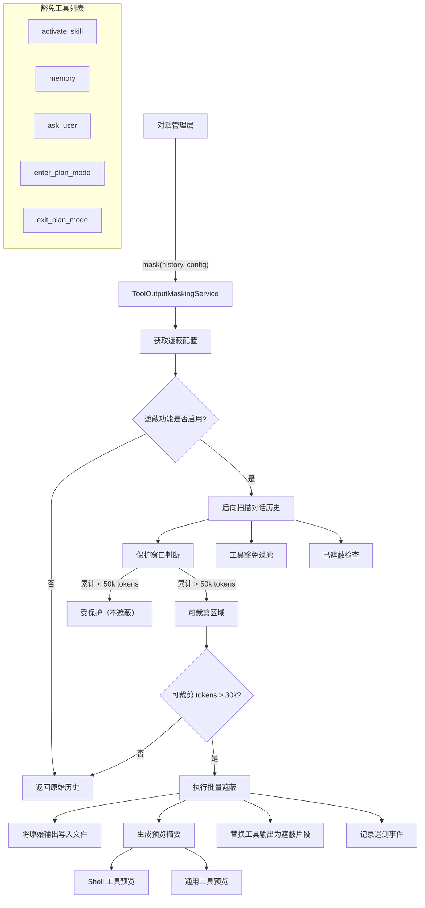

# toolOutputMaskingService.ts

## 概述

`ToolOutputMaskingService` 是 Gemini CLI 核心模块中的 **工具输出遮蔽服务**，负责管理上下文窗口效率。当对话历史中的工具输出（如 Shell 日志、文件内容等）积累到一定 token 数量后，该服务会自动将较旧的大体积工具输出替换为精简的摘要信息（包含预览和原始输出的文件路径），从而有效控制上下文窗口的 token 消耗，避免超出模型的上下文限制。

该服务实现了一种 **"混合后向扫描 FIFO"（Hybrid Backward Scanned FIFO）** 算法，在上下文相关性与 token 节省之间取得平衡。

## 架构图（Mermaid）



## 核心组件

### 1. ToolOutputMaskingService 类

#### 主方法 `mask()`

```typescript
async mask(
  history: readonly Content[],
  config: Config,
): Promise<MaskingResult>
```

核心算法流程：

**阶段一：后向扫描**
1. 可选择跳过最新一轮对话（`protectLatestTurn`，默认开启）
2. 从对话末尾向前扫描所有 `functionResponse` 类型的 Part
3. 跳过豁免工具和已遮蔽的输出
4. 累计 token 数，直到超过保护阈值（默认 50,000 tokens）
5. 超过保护阈值后的工具输出被标记为"可裁剪"

**阶段二：批量触发判定**
- 仅当可裁剪 token 总量超过最小裁剪阈值（默认 30,000 tokens）时才执行遮蔽
- 这意味着实际遮蔽只在工具输出达到约 80,000 tokens（50k 保护 + 30k 裁剪缓冲）时才开始

**阶段三：执行遮蔽**
1. 为每个可裁剪的工具输出生成唯一文件名
2. 将原始输出内容写入项目临时目录下的文件
3. 根据工具类型生成预览摘要
4. 将原始 `functionResponse` 替换为包含预览和文件路径的遮蔽片段
5. 仅在实际节省 token 时才应用遮蔽

#### 辅助方法

##### `getToolOutputContent(part)`

从 `functionResponse` 中提取工具输出内容，将整个 response 对象 JSON 序列化。

##### `isAlreadyMasked(content)`

检查内容是否已包含 `<tool_output_masked` 标签，避免重复遮蔽。

##### `formatShellPreview(response)`

为 Shell 工具输出生成专门的预览：
- 解析 Shell 输出的结构化格式（Output、Error、Exit Code、Signal 等区段）
- Output 区段使用 Head/Tail 预览（各 10 行）
- 其他区段（Error、Exit Code 等）完整保留（因为通常很短且信号值高）
- 额外检查 response 根级别的 `exitCode` 和 `error` 字段

##### `formatSimplePreview(content)`

通用的 Head/Tail 预览格式：
- 内容不超过 20 行时完整保留
- 超过 20 行时取前 10 行 + 后 10 行，中间标注省略行数

##### `formatMaskedSnippet(params)`

生成最终的遮蔽片段，使用 XML 标签格式：

```
<tool_output_masked>
[预览内容]

Output too large. Full output available at: [文件路径]
</tool_output_masked>
```

### 2. 类型定义

#### `MaskingResult`

```typescript
interface MaskingResult {
  newHistory: readonly Content[];  // 遮蔽处理后的对话历史
  maskedCount: number;             // 被遮蔽的工具输出数量
  tokensSaved: number;             // 节省的 token 数量
}
```

#### `MaskedSnippetParams`

```typescript
interface MaskedSnippetParams {
  toolName: string;    // 工具名称
  filePath: string;    // 原始输出保存的文件路径
  fileSizeMB: string;  // 文件大小（MB）
  totalLines: number;  // 总行数
  tokens: number;      // 原始 token 数
  preview: string;     // 预览内容
}
```

### 3. 导出常量

| 常量 | 值 | 说明 |
|---|---|---|
| `DEFAULT_TOOL_PROTECTION_THRESHOLD` | `50000` | 保护窗口的 token 阈值（最新的 50k 工具 token 不会被遮蔽） |
| `DEFAULT_MIN_PRUNABLE_TOKENS_THRESHOLD` | `30000` | 最小可裁剪 token 阈值（低于此值不触发遮蔽） |
| `DEFAULT_PROTECT_LATEST_TURN` | `true` | 是否保护最新一轮对话 |
| `MASKING_INDICATOR_TAG` | `'tool_output_masked'` | 遮蔽标记 XML 标签名 |
| `TOOL_OUTPUTS_DIR` | `'tool-outputs'` | 原始输出文件存储的子目录名 |

### 4. 豁免工具列表

以下工具的输出永远不会被遮蔽，因为它们通常具有高信号值且体积不大：

| 工具名 | 说明 |
|---|---|
| `activate_skill` | 技能激活工具 |
| `memory` | 记忆/上下文工具 |
| `ask_user` | 用户交互工具 |
| `enter_plan_mode` | 进入计划模式 |
| `exit_plan_mode` | 退出计划模式 |

## 依赖关系

### 内部依赖

| 模块 | 用途 |
|---|---|
| `../utils/tokenCalculation.js` | Token 数量估算（`estimateTokenCountSync()`） |
| `../utils/debugLogger.js` | 调试日志（`debugLogger`） |
| `../utils/fileUtils.js` | 文件名安全化（`sanitizeFilenamePart()`） |
| `../config/config.js` | 配置类型（`Config`） |
| `../telemetry/loggers.js` | 遥测日志记录（`logToolOutputMasking()`） |
| `../telemetry/types.js` | 遥测事件类型（`ToolOutputMaskingEvent`） |
| `../tools/tool-names.js` | 工具名称常量（`SHELL_TOOL_NAME`、`ACTIVATE_SKILL_TOOL_NAME` 等） |

### 外部依赖

| 包 | 用途 |
|---|---|
| `@google/genai` | Gemini API 类型（`Content`、`Part`） |
| `node:path` | 路径拼接 |
| `node:fs/promises` | 异步文件操作（创建目录、写入文件） |

## 关键实现细节

### 1. 混合后向扫描 FIFO 算法

该算法的核心思想是：**最新的工具输出比较旧的更重要**。

- **后向扫描**：从对话末尾开始扫描，首先统计最新工具输出的 token 数
- **保护窗口**：最新的 50,000 tokens 的工具输出被保护，不会被遮蔽
- **批量触发**：只有当保护窗口之外的可裁剪 token 超过 30,000 时才触发遮蔽
- **实际阈值**：这意味着遮蔽大约在 80,000 tokens 的工具输出累积时才开始生效

### 2. 最新轮次保护

当 `protectLatestTurn` 为 `true`（默认值）时，扫描从 `history.length - 2` 开始，完全跳过最新的一条消息。这确保模型在生成下一个回复时能看到最近一次工具调用的完整输出。

### 3. 原始输出持久化

被遮蔽的工具输出不会丢失，而是保存到文件系统：
- 存储路径：`<projectTempDir>/tool-outputs/session-<sessionId>/<toolName>_<callId>_<random>.txt`
- 遮蔽片段中包含文件路径引用，模型可以在需要时提示用户或请求读取

### 4. Shell 工具特殊处理

Shell 工具的输出格式是结构化的（包含 Output、Error、Exit Code 等区段），服务对此有专门的预览生成逻辑：
- 使用正则表达式 `^(Output|Error|Exit Code|Signal|Background PIDs|Process Group PGID): /m` 解析区段
- Output 区段使用 Head/Tail 预览
- Error、Exit Code 等区段完整保留（高信号、低体积）

### 5. 不可变历史

`mask()` 方法不修改传入的 `history` 数组，而是创建浅拷贝（`[...history]`），并在需要修改的位置创建新对象。这确保了调用方的原始数据不受影响。

### 6. 遥测集成

每次成功遮蔽后，通过 `logToolOutputMasking()` 记录遥测事件，包含：
- `tokens_before`：遮蔽前的可裁剪 token 总数
- `tokens_after`：遮蔽后的剩余 token 数
- `masked_count`：被遮蔽的工具输出数量
- `total_prunable_tokens`：总可裁剪 token 数

### 7. 安全保障

- 仅在实际节省 token（`savings > 0`）时才应用遮蔽
- 通过 `isAlreadyMasked()` 防止重复遮蔽
- 豁免工具机制保护关键工具的输出不被误裁
- 文件名通过 `sanitizeFilenamePart()` 安全化处理
