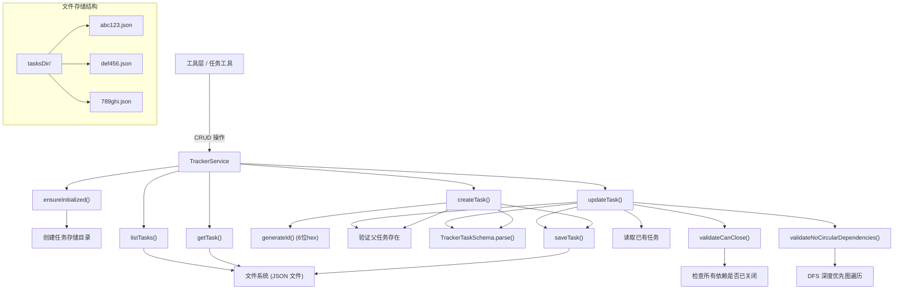

# trackerService.ts

## 概述

`TrackerService` 是 Gemini CLI 核心模块中的 **任务跟踪服务**，提供了一个基于文件系统的轻量级任务管理系统。每个任务以独立的 JSON 文件持久化存储在磁盘上，支持任务的创建、读取、更新、列表，以及任务间的依赖关系管理（包括父子关系和依赖关系验证）。

该服务是 Gemini CLI 任务追踪功能的底层数据存储引擎，为 AI 代理在执行复杂多步骤任务时提供结构化的进度跟踪能力。

## 架构图（Mermaid）



## 核心组件

### 1. TrackerService 类

#### 构造函数

```typescript
constructor(readonly trackerDir: string)
```

接收任务文件存储目录路径，内部将 `tasksDir` 设置为同一路径。

#### 私有属性

| 属性 | 类型 | 说明 |
|---|---|---|
| `tasksDir` | `string` | 任务 JSON 文件的存储目录 |
| `initialized` | `boolean` | 是否已完成初始化（目录创建） |

### 2. 公共方法

#### `createTask(taskData)` - 创建任务

```typescript
async createTask(taskData: Omit<TrackerTask, 'id'>): Promise<TrackerTask>
```

流程：
1. 确保存储目录已初始化
2. 生成 6 位十六进制随机 ID（3 字节 `randomBytes`）
3. 合并任务数据与生成的 ID
4. 如果指定了 `parentId`，验证父任务存在
5. 通过 `TrackerTaskSchema.parse()` 进行 Zod Schema 验证
6. 将任务保存为 `<id>.json` 文件
7. 返回完整的任务对象

#### `getTask(id)` - 获取单个任务

```typescript
async getTask(id: string): Promise<TrackerTask | null>
```

通过 ID 从文件系统读取任务 JSON 文件，使用 `TrackerTaskSchema` 进行反序列化验证。文件不存在返回 `null`。

#### `listTasks()` - 列出所有任务

```typescript
async listTasks(): Promise<TrackerTask[]>
```

读取任务目录下所有 `.json` 文件，并行解析和验证，过滤掉无效/损坏的文件，返回有效任务数组。目录不存在时返回空数组。

#### `updateTask(id, updates)` - 更新任务

```typescript
async updateTask(id: string, updates: Partial<TrackerTask>): Promise<TrackerTask>
```

流程：
1. 读取现有任务，不存在则抛出错误
2. 合并更新字段（保护 `id` 不被覆盖）
3. 如果更新了 `parentId`，验证新父任务存在
4. 如果状态变更为 `CLOSED`，执行关闭验证（`validateCanClose`）
5. 如果更新了依赖列表，执行循环依赖检测（`validateNoCircularDependencies`）
6. Schema 验证
7. 保存更新后的任务

### 3. 私有方法

#### `ensureInitialized()`

延迟初始化模式：首次调用时使用 `fs.mkdir({ recursive: true })` 创建任务存储目录，后续调用跳过。

#### `generateId()`

使用 `crypto.randomBytes(3)` 生成 3 个随机字节，转换为 6 位十六进制字符串（如 `"a1b2c3"`）。

#### `readJsonFile<T>(filePath, schema)`

通用的 JSON 文件读取和验证方法：
- 读取文件内容并 JSON 解析
- 使用传入的 Zod Schema 进行类型验证
- `ENOENT`（文件不存在）返回 `null`
- 其他错误通过 `coreEvents.emitFeedback()` 发出警告并抛出异常

#### `saveTask(task)`

将任务对象序列化为格式化的 JSON（2 空格缩进）并写入文件 `<id>.json`。

#### `validateCanClose(task)`

关闭任务的前置验证：
- 遍历任务的所有依赖 ID
- 验证每个依赖任务存在
- 验证每个依赖任务的状态为 `CLOSED`
- 任何依赖未关闭则抛出错误，阻止当前任务关闭

#### `validateNoCircularDependencies(task)`

循环依赖检测，使用 **带缓存的深度优先搜索（DFS）** 算法：
- `visited` Set：记录已完全检查过的节点
- `stack` Set：记录当前递归路径上的节点（用于检测环）
- `cache` Map：缓存已读取的任务对象，避免重复 I/O
- 如果在递归路径中再次遇到同一节点，说明存在环，抛出错误
- 已完全检查过的节点直接跳过

## 依赖关系

### 内部依赖

| 模块 | 用途 |
|---|---|
| `../utils/debugLogger.js` | 调试日志（`debugLogger`） |
| `../utils/events.js` | 核心事件总线（`coreEvents.emitFeedback()`） |
| `./trackerTypes.js` | 任务数据类型和验证 Schema（`TrackerTask`、`TrackerTaskSchema`、`TaskStatus`） |

### 外部依赖

| 包 | 用途 |
|---|---|
| `node:fs/promises` | 异步文件系统操作（目录创建、文件读写、目录列表） |
| `node:path` | 路径拼接 |
| `node:crypto` | 随机 ID 生成（`randomBytes()`） |
| `zod` | 数据验证 Schema 类型（`z.ZodSchema`） |

## 关键实现细节

### 1. 基于文件系统的持久化

每个任务存储为独立的 JSON 文件（`<6位hex-id>.json`），而非使用数据库。这种设计：
- **简单性**：无需额外的数据库依赖
- **可读性**：任务文件直接可被人类阅读和编辑
- **并发安全性有限**：文件系统级别没有锁机制，但在 CLI 单用户场景下通常够用
- **原子性**：每次保存覆盖整个文件，没有部分写入风险

### 2. 延迟初始化

使用 `initialized` 标志实现延迟初始化，仅在首次实际使用时创建目录。这避免了在服务实例化时进行不必要的文件系统操作。

### 3. Zod Schema 验证

所有任务数据在读取和写入时都通过 `TrackerTaskSchema`（Zod Schema）进行验证：
- **创建时**：验证输入数据符合 Schema
- **读取时**：验证磁盘上的 JSON 文件未被损坏
- **更新时**：验证合并后的任务数据有效

这提供了运行时的类型安全保障。

### 4. 依赖关系完整性

服务在多个层面保障依赖关系的完整性：

- **父任务存在性**：创建或更新任务时验证 `parentId` 对应的任务存在
- **关闭前置条件**：任务关闭前验证所有依赖任务已关闭
- **环检测**：依赖变更时使用 DFS 算法检测循环依赖

### 5. 错误处理策略

- **文件不存在（ENOENT）**：作为正常情况处理，返回 `null` 或空数组
- **JSON 解析/Schema 验证失败**：记录警告日志，通过事件总线发出反馈，然后抛出异常
- **业务逻辑错误**（如找不到任务、依赖未关闭、循环依赖）：直接抛出带有描述性消息的 `Error`

### 6. ID 生成策略

使用 `crypto.randomBytes(3)` 生成 6 位十六进制 ID，提供 16^6 = 16,777,216 种可能值。在单个项目的任务跟踪场景下，碰撞概率极低。ID 格式简短，便于人类在对话中引用。
