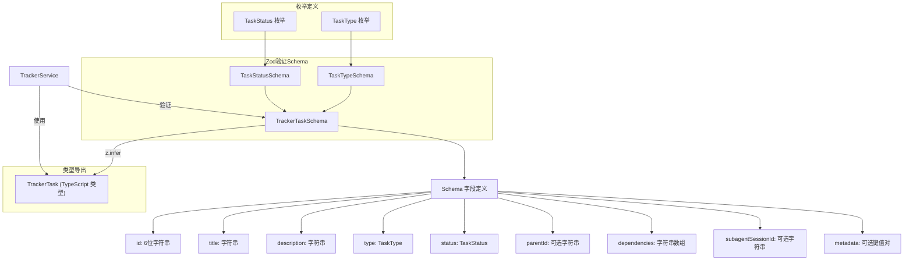

# trackerTypes.ts

## 概述

`trackerTypes.ts` 是 Gemini CLI 核心模块中 **任务跟踪系统的类型定义文件**，定义了任务跟踪器所需的所有数据类型、枚举和 Zod 验证 Schema。该文件是 `trackerService.ts` 的数据模型基础，为整个任务跟踪功能提供类型安全和运行时验证保障。

## 架构图（Mermaid）



## 核心组件

### 1. TaskType 枚举 - 任务类型

```typescript
export enum TaskType {
  EPIC = 'epic',         // 史诗/大型任务
  TASK = 'task',         // 普通任务
  BUG = 'bug',           // Bug 修复
}
```

定义了三种任务类型，对应不同的工作粒度：

| 枚举值 | 字符串值 | 说明 |
|---|---|---|
| `EPIC` | `'epic'` | 史诗：大型任务，通常包含多个子任务 |
| `TASK` | `'task'` | 任务：标准工作单元 |
| `BUG` | `'bug'` | Bug：缺陷修复 |

#### TaskTypeSchema

```typescript
export const TaskTypeSchema = z.nativeEnum(TaskType);
```

使用 `z.nativeEnum()` 从 TypeScript 原生枚举创建 Zod 验证 Schema，确保运行时值必须是有效的 TaskType 枚举成员。

#### TASK_TYPE_LABELS - 任务类型显示标签

```typescript
export const TASK_TYPE_LABELS: Record<TaskType, string> = {
  [TaskType.EPIC]: '[EPIC]',
  [TaskType.TASK]: '[TASK]',
  [TaskType.BUG]: '[BUG]',
};
```

提供每种任务类型的格式化显示标签，用于在用户界面中以 `[EPIC]`、`[TASK]`、`[BUG]` 形式展示。

### 2. TaskStatus 枚举 - 任务状态

```typescript
export enum TaskStatus {
  OPEN = 'open',                 // 开放/待处理
  IN_PROGRESS = 'in_progress',   // 进行中
  BLOCKED = 'blocked',           // 被阻塞
  CLOSED = 'closed',             // 已关闭/完成
}
```

定义了四种任务状态：

| 枚举值 | 字符串值 | 说明 |
|---|---|---|
| `OPEN` | `'open'` | 开放状态，等待被处理 |
| `IN_PROGRESS` | `'in_progress'` | 正在进行中 |
| `BLOCKED` | `'blocked'` | 被依赖项阻塞 |
| `CLOSED` | `'closed'` | 已关闭/已完成 |

#### TaskStatusSchema

```typescript
export const TaskStatusSchema = z.nativeEnum(TaskStatus);
```

使用 `z.nativeEnum()` 创建状态枚举的 Zod 验证 Schema。

### 3. TrackerTaskSchema - 任务数据 Schema

```typescript
export const TrackerTaskSchema = z.object({
  id: z.string().length(6),                    // 6位十六进制 ID
  title: z.string(),                           // 任务标题
  description: z.string(),                     // 任务描述
  type: TaskTypeSchema,                        // 任务类型
  status: TaskStatusSchema,                    // 任务状态
  parentId: z.string().optional(),             // 父任务 ID（可选）
  dependencies: z.array(z.string()),           // 依赖任务 ID 列表
  subagentSessionId: z.string().optional(),    // 子代理会话 ID（可选）
  metadata: z.record(z.unknown()).optional(),   // 扩展元数据（可选）
});
```

这是核心的任务数据验证 Schema，使用 Zod 库定义了任务对象的完整结构：

| 字段 | Zod 类型 | 必填 | 说明 |
|---|---|---|---|
| `id` | `z.string().length(6)` | 是 | 6 位字符的唯一标识符（由 `TrackerService.generateId()` 生成的十六进制字符串） |
| `title` | `z.string()` | 是 | 任务标题 |
| `description` | `z.string()` | 是 | 任务详细描述 |
| `type` | `TaskTypeSchema` | 是 | 任务类型（epic/task/bug） |
| `status` | `TaskStatusSchema` | 是 | 任务当前状态（open/in_progress/blocked/closed） |
| `parentId` | `z.string().optional()` | 否 | 父任务 ID，用于建立任务层级关系 |
| `dependencies` | `z.array(z.string())` | 是 | 依赖的其他任务 ID 数组（可为空数组） |
| `subagentSessionId` | `z.string().optional()` | 否 | 关联的子代理（subagent）会话 ID |
| `metadata` | `z.record(z.unknown()).optional()` | 否 | 灵活的键值对扩展字段，值可以是任意类型 |

### 4. TrackerTask 类型 - TypeScript 类型

```typescript
export type TrackerTask = z.infer<typeof TrackerTaskSchema>;
```

使用 Zod 的 `z.infer` 从 Schema 自动推导出 TypeScript 类型，确保类型定义和运行时验证始终保持一致。推导出的类型等价于：

```typescript
type TrackerTask = {
  id: string;
  title: string;
  description: string;
  type: TaskType;
  status: TaskStatus;
  parentId?: string;
  dependencies: string[];
  subagentSessionId?: string;
  metadata?: Record<string, unknown>;
};
```

## 依赖关系

### 内部依赖

无。该文件是纯类型定义文件，不依赖项目内其他模块。

### 外部依赖

| 包 | 用途 |
|---|---|
| `zod` | 数据验证 Schema 定义和类型推导 |

## 关键实现细节

### 1. Schema-First 设计模式

该文件采用 **"Schema 优先"** 的设计模式：先定义 Zod Schema（`TrackerTaskSchema`），再通过 `z.infer` 推导出 TypeScript 类型（`TrackerTask`）。这种模式的优势是：
- **单一数据源**：Schema 同时定义了类型和验证规则，避免两者不同步
- **运行时安全**：Schema 可在运行时验证数据（如从 JSON 文件反序列化时）
- **自动推导**：TypeScript 类型由 Schema 自动生成，无需手动维护

### 2. ID 长度约束

`id` 字段使用 `z.string().length(6)` 强制要求恰好 6 个字符。这与 `TrackerService` 中 `randomBytes(3).toString('hex')` 生成的 6 位十六进制字符串匹配。

### 3. 依赖数组设计

`dependencies` 字段是必填的字符串数组（而非可选），即使没有依赖也需要提供空数组 `[]`。这简化了下游代码的处理逻辑，无需检查 `undefined`。

### 4. 灵活的元数据字段

`metadata` 字段使用 `z.record(z.unknown())`，允许存储任意键值对。这为未来扩展提供了灵活性，可以在不修改 Schema 的情况下添加自定义数据。

### 5. 子代理会话关联

`subagentSessionId` 字段用于将任务与子代理（subagent）的执行会话关联。这表明任务跟踪系统与 Gemini CLI 的子代理架构紧密集成，支持在子代理中执行特定任务并追踪其进度。

### 6. 任务层级与依赖的区别

- **`parentId`**：表示组织结构上的层级关系（如 Epic 包含多个 Task）
- **`dependencies`**：表示执行顺序上的依赖关系（如 Task B 依赖 Task A 完成后才能开始）

两者是正交的概念，一个任务可以有父任务的同时依赖其他不相关的任务。
