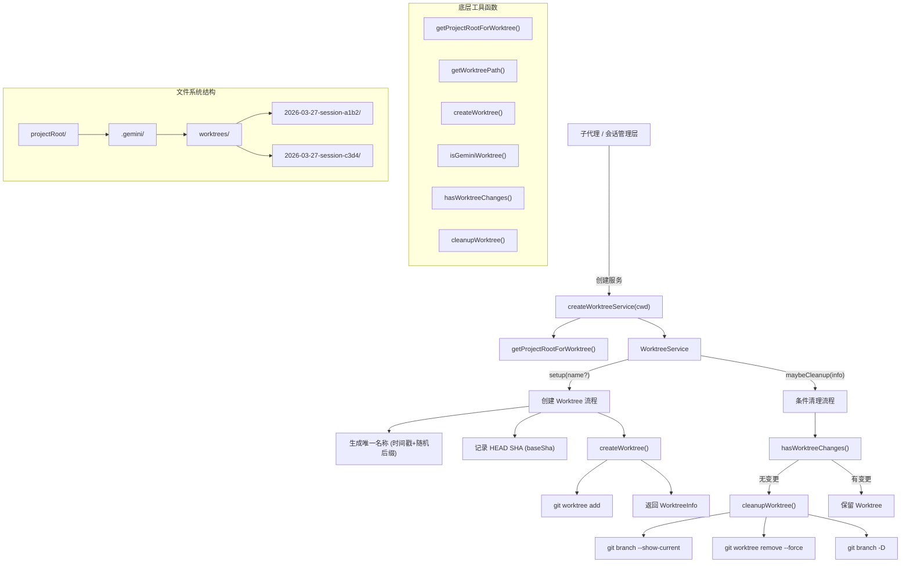

# worktreeService.ts

## 概述

`WorktreeService` 是 Gemini CLI 核心模块中的 **Git Worktree 管理服务**，负责为 Gemini CLI 的隔离会话（isolated sessions）创建、检测和清理 Git Worktree。Git Worktree 是 Git 的一项功能，允许在同一个仓库中同时检出多个工作目录，每个工作目录可以在不同的分支上独立工作。

该服务使 Gemini CLI 的子代理（subagent）能够在隔离的工作目录中执行文件修改操作，而不影响用户的主工作目录。所有 Worktree 统一存放在项目根目录的 `.gemini/worktrees/` 下。

## 架构图（Mermaid）



## 核心组件

### 1. WorktreeService 类

#### 构造函数

```typescript
constructor(private readonly projectRoot: string)
```

接收 Git 项目的根目录路径。建议通过工厂函数 `createWorktreeService()` 创建实例，以确保正确解析项目根目录。

#### `setup(name?)` - 创建 Worktree

```typescript
async setup(name?: string): Promise<WorktreeInfo>
```

流程：
1. **名称生成**：如果未提供名称，自动生成格式为 `<ISO时间戳>-<4位随机后缀>` 的唯一名称（例如 `2026-03-27-14-30-00-000-a1b2`）
2. **基线记录**：通过 `git rev-parse HEAD` 获取当前 HEAD 的 SHA，作为基线提交
3. **创建 Worktree**：调用 `createWorktree()` 在 `.gemini/worktrees/<name>` 路径下创建 Worktree，同时创建 `worktree-<name>` 分支
4. **返回信息**：返回包含名称、路径和基线 SHA 的 `WorktreeInfo` 对象

#### `maybeCleanup(info)` - 条件清理

```typescript
async maybeCleanup(info: WorktreeInfo): Promise<boolean>
```

流程：
1. 调用 `hasWorktreeChanges()` 检查 Worktree 是否有变更
2. **无变更**：调用 `cleanupWorktree()` 清理 Worktree 和关联分支，返回 `true`
3. **有变更**：保留 Worktree，返回 `false`
4. 清理失败时记录错误日志但不抛出异常

### 2. WorktreeInfo 接口

```typescript
export interface WorktreeInfo {
  name: string;       // Worktree 名称
  path: string;       // Worktree 在文件系统中的完整路径
  baseSha: string;    // 创建时的基线 HEAD SHA
}
```

### 3. 工厂函数

#### `createWorktreeService(cwd)`

```typescript
export async function createWorktreeService(cwd: string): Promise<WorktreeService>
```

安全地创建 `WorktreeService` 实例：
1. 通过 `getProjectRootForWorktree()` 解析当前工作目录所属的 Git 项目根目录
2. 使用项目根目录初始化 `WorktreeService`

### 4. 底层工具函数

#### `getProjectRootForWorktree(cwd)`

```typescript
export async function getProjectRootForWorktree(cwd: string): Promise<string>
```

通过 `git rev-parse --git-common-dir` 获取 Git 仓库的公共 `.git` 目录路径，然后取其父目录作为项目根目录。即使当前目录已经是一个 Worktree，该函数也能正确返回原始仓库的根目录（因为 `--git-common-dir` 总是指向主仓库的 `.git` 目录）。

失败时降级返回传入的 `cwd`。

#### `getWorktreePath(projectRoot, name)`

```typescript
export function getWorktreePath(projectRoot: string, name: string): string
```

计算 Worktree 的文件系统路径：`<projectRoot>/.gemini/worktrees/<name>`。

#### `createWorktree(projectRoot, name)`

```typescript
export async function createWorktree(projectRoot: string, name: string): Promise<string>
```

执行 `git worktree add <path> -b worktree-<name>` 创建新的 Worktree 和对应分支。

#### `isGeminiWorktree(dirPath, projectRoot)`

```typescript
export function isGeminiWorktree(dirPath: string, projectRoot: string): boolean
```

判断给定的目录是否是 Gemini CLI 管理的 Worktree：
1. 解析两个路径的真实路径（`realpathSync`），处理符号链接
2. 计算 `dirPath` 相对于 `<projectRoot>/.gemini/worktrees/` 的相对路径
3. 如果相对路径不以 `..` 开头且不是绝对路径，则说明 `dirPath` 在 Worktree 目录下

#### `hasWorktreeChanges(dirPath, baseSha?)`

```typescript
export async function hasWorktreeChanges(dirPath: string, baseSha?: string): Promise<boolean>
```

两级变更检测：
1. **未提交的变更**：通过 `git status --porcelain` 检查索引和工作树中的变更
2. **已提交的新提交**：如果提供了 `baseSha`，通过 `git rev-parse HEAD` 比较当前 HEAD 与基线 SHA

任一检测通过或 Git 命令执行失败时，都返回 `true`（安全策略：失败时假设有变更，避免误删）。

#### `cleanupWorktree(dirPath, projectRoot)`

```typescript
export async function cleanupWorktree(dirPath: string, projectRoot: string): Promise<void>
```

完整的 Worktree 清理流程：
1. **检查存在性**：通过 `fs.access()` 确认目录存在
2. **获取分支名**：通过 `git -C <dirPath> branch --show-current` 获取关联的分支名
3. **移除 Worktree**：通过 `git worktree remove <dirPath> --force` 强制移除
4. **删除分支**：通过 `git branch -D <branchName>` 删除关联分支

步骤 3 和步骤 4 的错误都被捕获并记录为调试日志，不会导致函数抛出异常。步骤 4 放在 `finally` 块中确保即使 Worktree 移除失败也会尝试清理分支。

## 依赖关系

### 内部依赖

| 模块 | 用途 |
|---|---|
| `../utils/debugLogger.js` | 调试日志（`debugLogger`） |

### 外部依赖

| 包 | 用途 |
|---|---|
| `node:path` | 路径拼接和解析 |
| `node:fs/promises` | 异步文件系统操作（`fs.access()`） |
| `node:fs` | 同步路径解析（`realpathSync()`） |
| `execa` | Git 命令执行（替代 `child_process`，提供更好的 Promise API 和输出捕获） |

## 关键实现细节

### 1. Worktree 命名策略

自动生成的名称格式为 `<ISO时间戳>-<4位随机后缀>`，例如 `2026-03-27-14-30-00-000-a1b2`：
- 时间戳部分确保基本唯一性和按创建时间排序
- 随机后缀防止同一毫秒内的碰撞
- ISO 时间戳中的 `:`、`.` 被替换为 `-`，`T` 和 `Z` 也被处理，确保文件系统兼容性

### 2. 基线 SHA 追踪

创建 Worktree 时记录当前 HEAD 的 SHA 作为基线（`baseSha`）。这用于在清理时判断 Worktree 中是否有新的提交。仅检查 `git status --porcelain` 是不够的，因为子代理可能已经提交了修改（工作目录干净，但有新提交）。

### 3. Worktree 存储位置

所有 Gemini CLI 管理的 Worktree 统一存放在 `<projectRoot>/.gemini/worktrees/` 下，而非 Git 默认的位置。这使得：
- 所有 Gemini 创建的 Worktree 集中管理
- 通过 `.gitignore` 可以忽略整个 `.gemini/` 目录
- `isGeminiWorktree()` 可以简单地通过路径前缀判断

### 4. 安全优先的清理策略

`maybeCleanup()` 采用保守策略：
- 只在 Worktree 完全没有变更（既无未提交修改，也无新提交）时才清理
- Git 命令执行失败时假设有变更（不清理），避免数据丢失
- 清理过程中的错误被捕获并记录，不向上传播
- 使用 `--force` 标志确保 Worktree 移除成功（即使有锁文件等问题）

### 5. 正确处理嵌套 Worktree

`getProjectRootForWorktree()` 使用 `git rev-parse --git-common-dir` 而非 `--show-toplevel`，这确保了即使当前目录本身就是一个 Worktree，也能正确返回主仓库的根目录。`--git-common-dir` 在 Worktree 中会返回主仓库的 `.git` 目录，而不是 Worktree 自己的 `.git` 文件。

### 6. 分支命名约定

每个 Worktree 关联一个名为 `worktree-<name>` 的分支。清理时会同时删除 Worktree 和关联分支，保持 Git 仓库的整洁。

### 7. 路径解析的健壮性

`isGeminiWorktree()` 使用 `realpathSync()` 解析真实路径后再进行比较，正确处理了符号链接的情况。这避免了路径字符串比较可能导致的误判。
