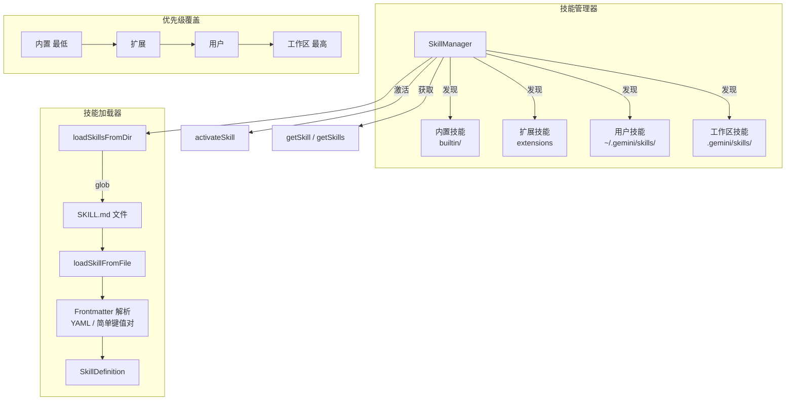

# skills (技能管理模块)

## 概述

`skills/` 目录实现了 Gemini CLI 的 Agent 技能系统。技能（Skill）是一种可扩展机制，允许通过 `SKILL.md` 文件定义专门化的指令和工作流，供 Agent 在执行特定任务时激活使用。该模块负责技能的发现、加载、优先级管理和生命周期控制。

## 目录结构

```
skills/
├── skillLoader.ts              # 技能加载器（文件发现与 Frontmatter 解析）
├── skillManager.ts             # 技能管理器（发现、注册、优先级、激活）
├── skillLoader.test.ts         # 加载器单元测试
├── skillManager.test.ts        # 管理器单元测试
└── skillManagerAlias.test.ts   # 管理器别名测试
```

## 架构图



## 核心组件

### SkillDefinition (skillLoader.ts)
技能的数据结构定义：
- `name` - 技能唯一名称
- `description` - 技能功能描述
- `location` - SKILL.md 文件的绝对路径
- `body` - 技能的核心指令内容
- `disabled` - 是否已禁用
- `isBuiltin` - 是否为内置技能
- `extensionName` - 所属扩展名称

### skillLoader (skillLoader.ts)
- **职责**: 从目录中发现和加载 `SKILL.md` 文件
- **关键函数**:
  - `loadSkillsFromDir(dir)` - 扫描目录下的 `SKILL.md` 和 `*/SKILL.md`
  - `loadSkillFromFile(filePath)` - 解析单个技能文件
- **Frontmatter 解析**: 优先使用 YAML 解析，失败时回退到简单键值对解析（处理冒号等特殊字符）
- **过滤**: 自动排除 `node_modules` 和 `.git` 目录

### SkillManager (skillManager.ts)
- **职责**: 技能的生命周期管理，包括发现、注册、优先级、激活和查询
- **关键方法**:
  - `discoverSkills(storage, extensions, isTrusted)` - 按优先级发现所有技能来源
  - `addSkills(skills)` - 程序化添加技能
  - `getSkill(name)` - 按名称查找技能（不区分大小写）
  - `activateSkill(name)` - 激活指定技能
  - `setDisabledSkills(names)` - 设置禁用技能列表
  - `getDisplayableSkills()` - 获取可展示的技能（排除内置技能）
- **优先级机制**: 高优先级来源的同名技能会覆盖低优先级来源，覆盖时发出警告
- **安全控制**: 工作区技能仅在项目文件夹被信任时加载

## 依赖关系

### 内部依赖
- `config/storage.ts` - 用户/工作区技能目录路径
- `config/config.ts` - GeminiCLIExtension 类型
- `utils/debugLogger.ts` - 调试日志
- `utils/events.ts` - 核心事件总线

### 外部依赖
- `glob` - 文件模式匹配
- `js-yaml` - YAML Frontmatter 解析

## 数据流

### 技能发现流程
1. `SkillManager.discoverSkills()` 按以下顺序发现技能：
   - 内置技能（`builtin/` 目录）
   - 扩展提供的技能
   - 用户全局技能（`~/.gemini/skills/` 和 `~/.agents/skills/`）
   - 工作区技能（`.gemini/skills/` 和 `.agents/skills/`，需信任）
2. 每一层新发现的同名技能覆盖前一层
3. 技能通过 `SKILL.md` 文件的 Frontmatter（name + description）标识
4. 技能的 body 部分作为激活后的专业指令注入到 Agent 上下文中

### 技能激活流程
1. 用户或 Agent 通过 `activate_skill` 工具激活技能
2. `SkillManager.activateSkill(name)` 将技能标记为活跃
3. 技能的 body 内容被包装在 `<activated_skill>` 标签中返回给 Agent
4. Agent 将技能指令作为高优先级的专业指导执行
