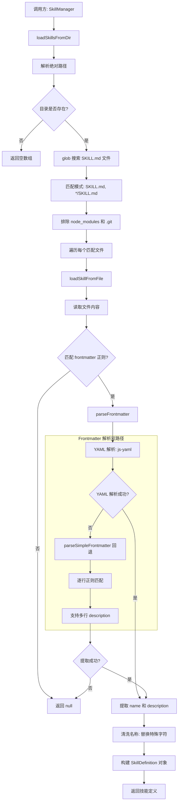

# skillLoader.ts

## 概述

`skillLoader.ts` 是技能（Skill）系统的底层加载模块，负责从文件系统中发现和解析技能定义文件（`SKILL.md`）。每个技能是一个以 Markdown 格式编写的文件，包含 YAML frontmatter 元数据（名称和描述）和 Markdown 正文（技能的核心逻辑/指令）。

该模块提供了两个层次的加载功能：
- **目录级发现**：扫描指定目录下的所有 `SKILL.md` 文件
- **文件级解析**：解析单个 `SKILL.md` 文件的 frontmatter 和正文

## 架构图（Mermaid）



## 核心组件

### 1. SkillDefinition 接口

技能的完整定义数据结构：

```typescript
export interface SkillDefinition {
  name: string;          // 技能的唯一名称
  description: string;   // 技能的简要描述
  location: string;      // 技能源文件的绝对路径
  body: string;          // 技能的核心逻辑/指令（Markdown 正文）
  disabled?: boolean;    // 是否已禁用
  isBuiltin?: boolean;   // 是否为内置技能
  extensionName?: string; // 提供该技能的扩展名称（如有）
}
```

### 2. FRONTMATTER_REGEX

用于匹配 Markdown frontmatter 的正则表达式：

```typescript
export const FRONTMATTER_REGEX = /^---\r?\n([\s\S]*?)\r?\n---(?:\r?\n([\s\S]*))?/;
```

匹配格式：
```
---
name: 技能名称
description: 技能描述
---
正文内容...
```

- 捕获组 1：frontmatter 内容（两个 `---` 之间的内容）
- 捕获组 2：正文内容（第二个 `---` 之后的内容，可选）
- 支持 `\r\n` 和 `\n` 两种换行格式

### 3. parseFrontmatter 函数

**私有函数**，两阶段 frontmatter 解析：

1. **首选路径**：使用 `js-yaml` 的 `load()` 进行标准 YAML 解析
   - 验证解析结果为对象且包含 `name`（string）和 `description`（string）
2. **回退路径**：如果 YAML 解析失败（如描述中包含冒号导致 YAML 语法错误），调用 `parseSimpleFrontmatter`

### 4. parseSimpleFrontmatter 函数

**私有函数**，简单的键值对解析器，用于处理标准 YAML 无法解析的情况：

- 逐行扫描，使用正则匹配 `name:` 和 `description:` 前缀
- **支持多行 description**：如果后续行以空白字符开头（缩进），则视为描述的延续行
- 多行描述用空格连接

### 5. loadSkillsFromDir 函数

**导出的异步函数**，从指定目录发现并加载所有技能：

1. 将目录路径解析为绝对路径
2. 检查目录是否存在，不存在则返回空数组
3. 使用 `glob` 搜索匹配的文件：
   - 模式：`['SKILL.md', '*/SKILL.md']`（当前目录和一级子目录）
   - 排除：`node_modules` 和 `.git`
4. 遍历匹配文件，调用 `loadSkillFromFile` 加载
5. 如果目录非空但未发现有效技能，输出调试日志提示
6. 错误时通过 `coreEvents.emitFeedback` 发出警告

### 6. loadSkillFromFile 函数

**导出的异步函数**，加载单个技能文件：

1. 读取文件内容（UTF-8）
2. 用 `FRONTMATTER_REGEX` 匹配 frontmatter
3. 用 `parseFrontmatter` 解析元数据
4. **名称清洗**：将 `name` 中的特殊字符（`: \ / < > * ? " |`）替换为 `-`，确保可用作文件名/目录名
5. 构建并返回 `SkillDefinition` 对象

## 依赖关系

### 内部依赖

| 模块 | 导入项 | 用途 |
|------|--------|------|
| `../utils/debugLogger.js` | `debugLogger` | 调试日志输出 |
| `../utils/events.js` | `coreEvents` | 核心事件系统，用于发出警告反馈 |

### 外部依赖

| 包名 | 导入项 | 用途 |
|------|--------|------|
| `node:fs/promises` | `fs` (全量) | 异步文件系统操作（读取文件、检查目录） |
| `node:path` | `path` (全量) | 路径操作（解析绝对路径） |
| `glob` | `glob` | 文件 glob 模式匹配，发现 SKILL.md 文件 |
| `js-yaml` | `load` | YAML 解析，用于解析 frontmatter |

## 关键实现细节

1. **双层 Frontmatter 解析**：设计了两层解析策略——先尝试标准 YAML 解析，失败后回退到自定义的简单解析器。这是因为技能描述中可能包含冒号（`:`），而冒号在 YAML 中是特殊字符，会导致解析失败。简单解析器通过逐行正则匹配避免了此问题。

2. **浅层目录搜索**：glob 模式 `['SKILL.md', '*/SKILL.md']` 仅搜索当前目录和一级子目录，不进行递归搜索。这是有意设计的——每个技能应该在一个独立的子目录中，或直接放在技能目录根下。

3. **名称清洗**：技能名称中的特殊字符被替换为 `-`，确保名称可以安全地用于文件系统操作。清洗的字符集包括：`: \ / < > * ? " |`。

4. **优雅的错误处理**：
   - `loadSkillFromFile` 中任何错误都被捕获并记录，返回 `null`
   - `loadSkillsFromDir` 中的错误通过事件系统发出警告，但不中断执行
   - 目录不存在时静默返回空数组，不抛出异常

5. **多行描述支持**：`parseSimpleFrontmatter` 支持缩进续行的多行描述格式，这对于较长的技能描述非常有用：
   ```yaml
   description: 这是一个较长的描述，
     可以跨多行书写，
     只要后续行有缩进
   ```

6. **正文提取**：技能的正文（`body`）是 frontmatter 之后的所有内容，经过 `trim()` 处理去除首尾空白。这部分内容是技能的核心指令，会在技能激活时提供给 LLM。

7. **导出设计**：`FRONTMATTER_REGEX`、`loadSkillsFromDir` 和 `loadSkillFromFile` 都被导出，使得它们可以在测试中独立使用，也允许其他模块直接加载单个技能文件。
