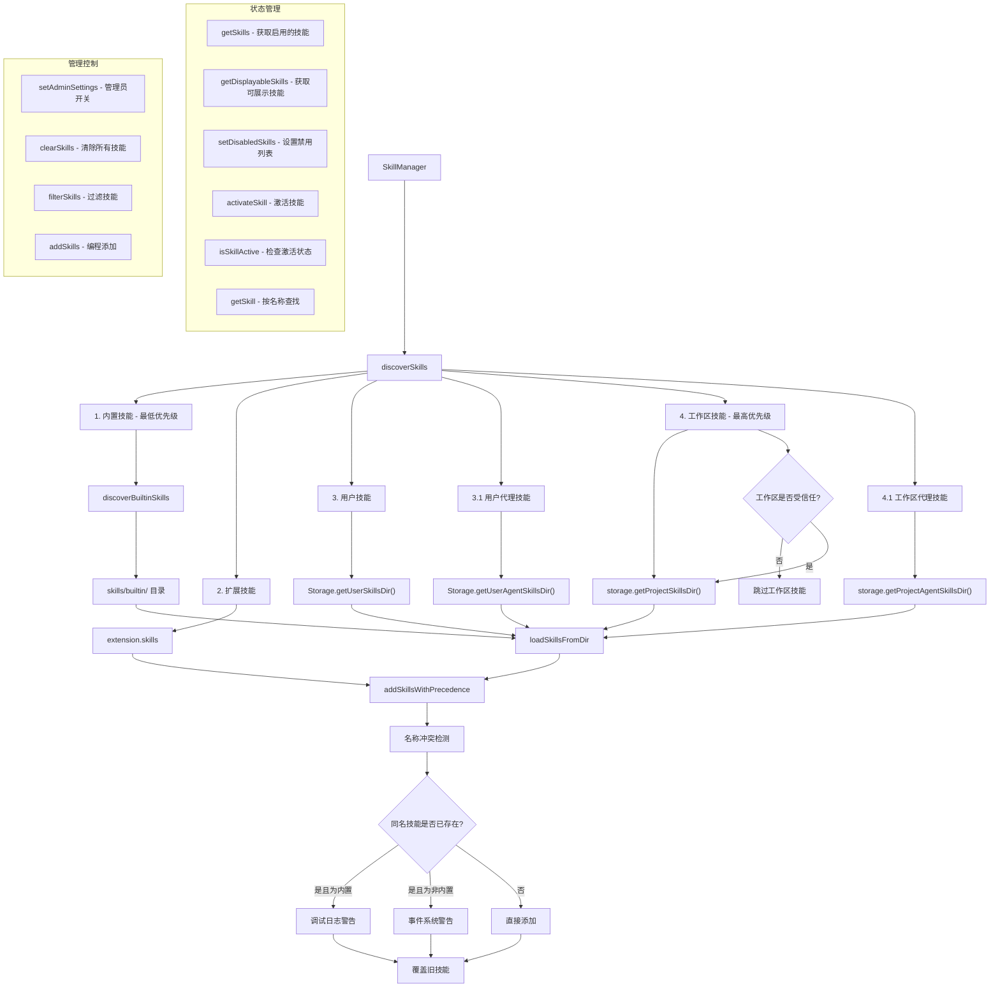

# skillManager.ts

## 概述

`SkillManager` 是技能（Skill）系统的核心管理器，负责技能的发现、注册、优先级管理、启用/禁用控制和激活状态追踪。它协调多个来源的技能加载——内置技能、扩展技能、用户级技能和工作区级技能——并处理它们之间的优先级和冲突。

该模块是技能系统的唯一入口，上层模块通过 `SkillManager` 获取可用技能列表、查找特定技能、管理技能状态。

## 架构图（Mermaid）

## 核心组件

### SkillManager 类

#### 私有属性

| 属性名 | 类型 | 初始值 | 说明 |
|--------|------|--------|------|
| `skills` | `SkillDefinition[]` | `[]` | 所有已发现的技能列表 |
| `activeSkillNames` | `Set<string>` | `new Set()` | 当前已激活的技能名称集合 |
| `adminSkillsEnabled` | `boolean` | `true` | 管理员级别的技能启用开关 |

#### 公开方法

##### `clearSkills(): void`
清除所有已发现的技能，将 `skills` 重置为空数组。

##### `setAdminSettings(enabled: boolean): void`
设置管理员级别的技能启用/禁用状态。

##### `isAdminEnabled(): boolean`
返回管理员技能开关的当前状态。

##### `discoverSkills(storage, extensions, isTrusted): Promise<void>`
**核心方法**——按优先级从低到高发现并加载所有来源的技能：

1. **清除现有技能**
2. **内置技能**（最低优先级）：从 `skills/builtin/` 目录加载
3. **扩展技能**：遍历活跃扩展（`extension.isActive && extension.skills`）
4. **用户技能**：从 `Storage.getUserSkillsDir()` 加载
5. **用户代理技能**：从 `Storage.getUserAgentSkillsDir()`（`.agents/skills`）加载
6. **工作区技能**（最高优先级）：仅在 `isTrusted` 为 `true` 时加载
   - 从 `storage.getProjectSkillsDir()` 加载
7. **工作区代理技能**：从 `storage.getProjectAgentSkillsDir()`（`.agents/skills`）加载

每个来源加载后通过 `addSkillsWithPrecedence` 合并，后加载的同名技能会覆盖先加载的。

##### `addSkills(skills: SkillDefinition[]): void`
编程方式添加技能，封装了 `addSkillsWithPrecedence`。

##### `getSkills(): SkillDefinition[]`
返回所有启用（未禁用）的技能列表。

##### `getDisplayableSkills(): SkillDefinition[]`
返回应在 UI 中显示的技能列表——排除禁用和内置技能。内置技能被排除是因为它们对用户来说是隐式的。

##### `getAllSkills(): SkillDefinition[]`
返回所有已发现的技能，包括已禁用的。

##### `filterSkills(predicate): void`
按谓词函数过滤技能列表，就地修改。

##### `setDisabledSkills(disabledNames: string[]): void`
根据名称列表设置技能的禁用状态。比较时使用小写，实现大小写不敏感匹配。

##### `getSkill(name: string): SkillDefinition | null`
按名称查找单个技能。大小写不敏感。

##### `activateSkill(name: string): void`
将技能标记为"已激活"状态（加入 `activeSkillNames` 集合）。

##### `isSkillActive(name: string): boolean`
检查指定技能是否处于激活状态。

#### 私有方法

##### `discoverBuiltinSkills(): Promise<void>`
发现内置技能：
1. 使用 `import.meta.url` 获取当前模块路径
2. 拼接 `builtin` 子目录路径
3. 调用 `loadSkillsFromDir` 加载
4. 为每个技能设置 `isBuiltin = true`

##### `addSkillsWithPrecedence(newSkills: SkillDefinition[]): void`
基于名称的优先级合并逻辑：
1. 将现有技能转为 `Map<name, SkillDefinition>`
2. 遍历新技能，检查同名冲突：
   - **覆盖内置技能**：输出调试级别警告（`debugLogger.warn`）
   - **覆盖非内置技能**：通过事件系统发出用户可见的冲突警告（`coreEvents.emitFeedback`）
3. 新技能总是覆盖同名旧技能（后加载优先）
4. 将 Map 转回数组

## 依赖关系

### 内部依赖

| 模块 | 导入项 | 用途 |
|------|--------|------|
| `../config/storage.js` | `Storage` | 存储路径管理，获取技能目录路径 |
| `./skillLoader.js` | `SkillDefinition` (类型), `loadSkillsFromDir` | 技能定义接口和目录加载函数 |
| `../config/config.js` | `GeminiCLIExtension` (类型) | 扩展配置类型 |
| `../utils/debugLogger.js` | `debugLogger` | 调试日志输出 |
| `../utils/events.js` | `coreEvents` | 核心事件系统，发出冲突警告 |

### 外部依赖

| 包名 | 导入项 | 用途 |
|------|--------|------|
| `node:path` | `path` | 路径操作 |
| `node:url` | `fileURLToPath` | 将 `import.meta.url` 转为文件路径 |

## 关键实现细节

1. **五层优先级体系**：技能按来源分为五层优先级（从低到高）：
   - 内置技能 < 扩展技能 < 用户技能 / 用户代理技能 < 工作区技能 / 工作区代理技能
   - 后加载的同名技能会覆盖先加载的，实现了"越本地越优先"的语义

2. **信任机制**：工作区技能（优先级最高）仅在文件夹被标记为"受信任"时才会加载。这是安全考虑——防止恶意仓库通过工作区技能注入有害指令。不受信任时，仅有内置、扩展和用户级技能可用。

3. **冲突检测与报告**：当同名技能被覆盖时：
   - 覆盖内置技能：仅输出 `debugLogger.warn`（调试级别），因为这是常见且预期的行为
   - 覆盖非内置技能：通过 `coreEvents.emitFeedback('warning', ...)` 发出用户可见的警告，因为这可能意味着无意的冲突

4. **大小写不敏感**：`getSkill` 和 `setDisabledSkills` 都使用小写比较，避免因大小写差异导致查找/禁用失败。

5. **双重技能目录**：每个级别（用户和工作区）都有两个目录——标准技能目录和代理技能目录（`.agents/skills`），提供了灵活的组织方式。

6. **激活 vs 启用**：
   - **启用/禁用**（`disabled`）：控制技能是否可被使用
   - **激活**（`activeSkillNames`）：标记技能是否在当前会话中被实际调用
   - 两者是独立的维度——一个技能必须先启用才能被激活

7. **SkillDefinition 的再导出**：`export { type SkillDefinition }` 将从 `skillLoader.js` 导入的类型再导出，使得上层模块可以从 `skillManager.js` 统一导入所有技能相关类型，无需知道底层的 `skillLoader` 模块。

8. **ESM 模块路径解析**：使用 `import.meta.url` + `fileURLToPath` + `path.dirname` 的组合获取当前模块目录，这是 ES Module 环境下的标准做法（替代 CommonJS 中的 `__dirname`）。
