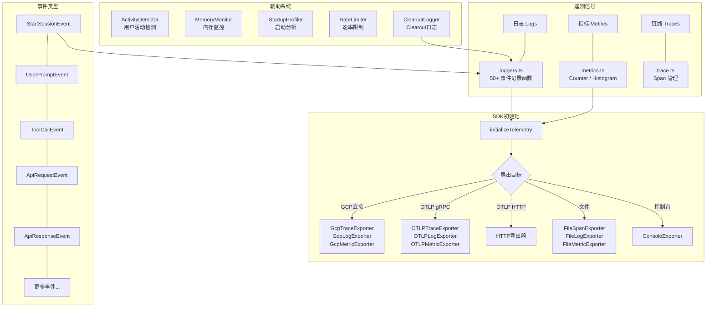

# telemetry (遥测模块)

## 概述

`telemetry/` 目录实现了 Gemini CLI 的可观测性系统，基于 OpenTelemetry 标准提供日志（Logs）、指标（Metrics）和链路追踪（Traces）三大遥测信号。该模块支持多种导出目标（GCP / OTLP / 文件 / 控制台），同时集成了 Clearcut 日志器、活动检测、内存监控、速率限制等能力。

## 目录结构

```
telemetry/
├── index.ts                         # 模块导出入口（汇总所有公开 API）
├── types.ts                         # 遥测事件类型定义（50+ 事件类）
├── sdk.ts                           # OpenTelemetry SDK 初始化与生命周期
├── config.ts                        # 遥测配置解析（环境变量 / 设置文件）
├── loggers.ts                       # 日志记录函数（各事件的 OTel 日志发射）
├── metrics.ts                       # 指标定义与记录（Counter / Histogram）
├── semantic.ts                      # OpenTelemetry GenAI 语义约定转换
├── constants.ts                     # 常量定义（SERVICE_NAME 等）
├── telemetryAttributes.ts           # 通用遥测属性
├── trace.ts                         # 链路追踪工具
├── sanitize.ts                      # 敏感信息清理
├── llmRole.ts                       # LLM 角色枚举
├── tool-call-decision.ts            # 工具调用决策类型
├── billingEvents.ts                 # 计费相关遥测事件
├── uiTelemetry.ts                   # UI 遥测服务
├── activity-detector.ts             # 用户活动检测器
├── activity-monitor.ts              # 活动监控器
├── activity-types.ts                # 活动类型定义
├── memory-monitor.ts                # 内存监控器
├── high-water-mark-tracker.ts       # 高水位追踪器
├── rate-limiter.ts                  # 速率限制器
├── startupProfiler.ts               # 启动性能分析器
├── telemetry-utils.ts               # 遥测工具函数
├── conseca-logger.ts                # Conseca 安全检查日志
├── file-exporters.ts                # 文件导出器
├── gcp-exporters.ts                 # GCP 导出器
├── clearcut-logger/                 # Clearcut 日志子模块
│   ├── clearcut-logger.ts
│   └── event-metadata-key.ts
└── *.test.ts                        # 对应的单元测试文件
```

## 架构图



## 核心组件

### SDK 管理 (sdk.ts)
- **职责**: OpenTelemetry SDK 的初始化、刷新和关闭
- **关键函数**:
  - `initializeTelemetry(config, credentials)` - 初始化 SDK，配置导出器
  - `shutdownTelemetry(config)` - 关闭 SDK，释放资源
  - `flushTelemetry(config)` - 强制刷新待发送的遥测数据
- **特性**: 支持延迟初始化（CLI 认证完成后）、缓冲事件队列、凭据变更检测

### 配置 (config.ts)
- **职责**: 从命令行参数、环境变量和设置文件中解析遥测配置
- **优先级**: 命令行参数 > 环境变量 > 设置文件
- **配置项**: enabled, target (gcp/local), otlpEndpoint, otlpProtocol (grpc/http), logPrompts, outfile, useCollector, useCliAuth

### 事件类型 (types.ts)
- **职责**: 定义 50+ 种遥测事件类
- **核心事件**: StartSessionEvent, UserPromptEvent, ToolCallEvent, ApiRequestEvent, ApiResponseEvent, ApiErrorEvent
- **功能事件**: FlashFallbackEvent, LoopDetectedEvent, ChatCompressionEvent, ModelRoutingEvent
- **Agent 事件**: AgentStartEvent, AgentFinishEvent, RecoveryAttemptEvent
- **扩展事件**: ExtensionInstallEvent, ExtensionUpdateEvent, ExtensionEnableEvent
- **每个事件实现**: `toOpenTelemetryAttributes()` 和 `toLogBody()` 方法

### 日志记录 (loggers.ts)
- **职责**: 为每种遥测事件提供记录函数
- **模式**: 事件 -> Clearcut 日志 -> OpenTelemetry 日志 -> 指标记录
- **缓冲**: 通过 `bufferTelemetryEvent()` 确保 SDK 未初始化时事件不丢失

### 指标系统 (metrics.ts)
- **职责**: 定义和记录各类 OpenTelemetry 指标
- **Counter 指标**: tool_call_count, api_request_count, token_usage, session_count, file_operation_count 等 20+ 计数器
- **Histogram 指标**: tool_call_latency, api_request_latency, agent_duration, gen_ai_client_token_usage 等 15+ 直方图
- **性能监控**: startup_time, memory_usage, cpu_usage, performance_score 等
- **GenAI 语义约定**: gen_ai.client.token.usage, gen_ai.client.operation.duration

### 语义约定 (semantic.ts)
- **职责**: 将 Gemini API 格式转换为 OpenTelemetry GenAI 语义约定
- **功能**: 输入/输出消息转换、完成原因映射、系统指令提取、文本截断（160KB 限制）

## 依赖关系

### 内部依赖
- `config/config.ts` - Config 配置接口
- `utils/events.ts` - 核心事件总线
- `utils/debugLogger.ts` - 调试日志
- `utils/errors.ts` - 错误处理
- `utils/safeJsonStringify.ts` - 安全 JSON 序列化
- `utils/fileDiffUtils.ts` - 文件差异工具
- `scheduler/types.ts` - 工具调用类型
- `tools/mcp-tool.ts` - MCP 工具类型
- `core/contentGenerator.ts` - AuthType 类型
- `code_assist/oauth2.ts` - 认证事件

### 外部依赖
- `@opentelemetry/api` - OpenTelemetry API
- `@opentelemetry/sdk-node` - OpenTelemetry Node.js SDK
- `@opentelemetry/sdk-trace-node` - 链路追踪 SDK
- `@opentelemetry/sdk-logs` - 日志 SDK
- `@opentelemetry/sdk-metrics` - 指标 SDK
- `@opentelemetry/exporter-trace-otlp-grpc` - gRPC 追踪导出
- `@opentelemetry/exporter-logs-otlp-grpc` - gRPC 日志导出
- `@opentelemetry/exporter-metrics-otlp-grpc` - gRPC 指标导出
- `@opentelemetry/semantic-conventions` - 语义约定
- `@opentelemetry/resources` - 资源描述
- `@opentelemetry/instrumentation-http` - HTTP 自动插桩
- `@google/genai` - Gemini API 类型
- `google-auth-library` - Google 认证
- `systeminformation` - 系统信息采集

## 数据流

### 遥测事件生命周期
1. 业务代码创建事件实例（如 `new ToolCallEvent(call)`）
2. 调用对应的日志函数（如 `logToolCall(config, event)`）
3. 事件发送到 Clearcut 日志器
4. 事件转换为 OpenTelemetry LogRecord 并发射
5. 同时记录相关指标（Counter / Histogram）
6. BatchLogRecordProcessor 批量导出到目标
7. SDK 关闭时刷新所有待发送数据
