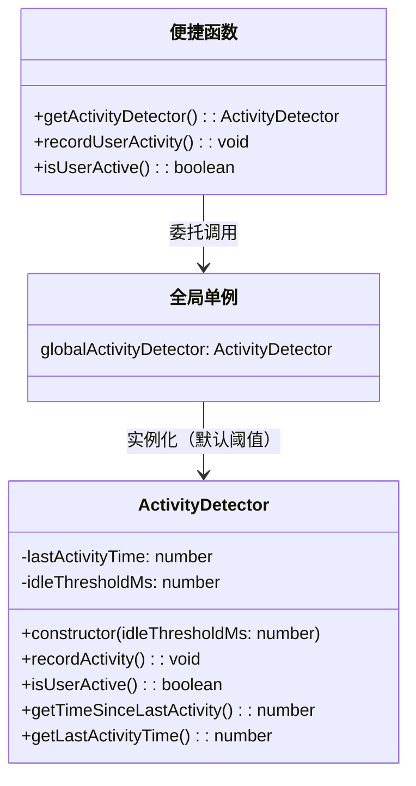
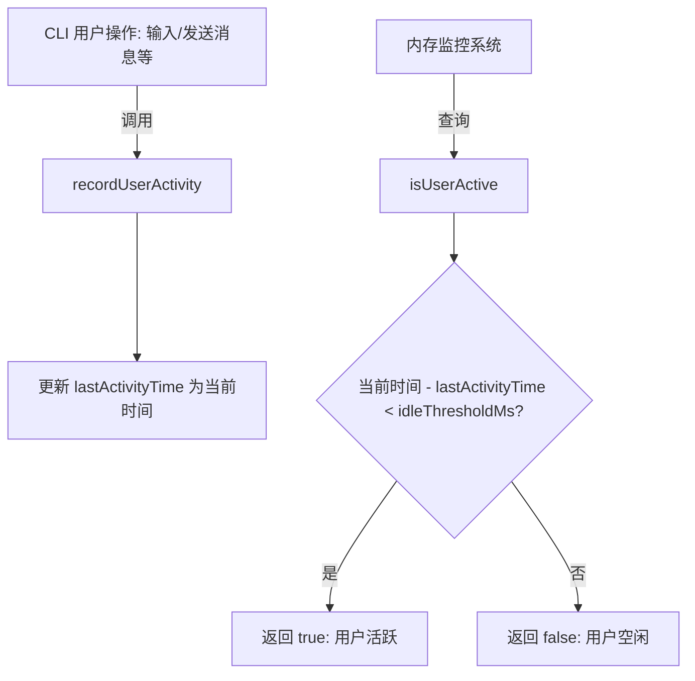

# activity-detector.ts

## 概述

`activity-detector.ts` 是一个用户活动检测模块，负责追踪用户的活动状态，以确定内存监控（memory monitoring）何时应处于激活状态。该模块通过记录用户最后一次活动的时间戳，并与预设的空闲阈值进行比较，来判断用户当前是否处于活跃状态。

该模块采用**单例模式**（通过模块级全局变量实现），提供了类实例和便捷函数两种使用方式，方便 CLI 层直接调用。

## 架构图（Mermaid）





## 核心组件

### `ActivityDetector` 类

这是模块的核心类，封装了用户活动检测的全部逻辑。

| 成员 | 类型 | 可见性 | 说明 |
|------|------|--------|------|
| `lastActivityTime` | `number` | `private` | 上次活动的时间戳（毫秒），初始值为实例创建时的 `Date.now()` |
| `idleThresholdMs` | `number` | `private readonly` | 空闲阈值（毫秒），超过此时间未活动则视为空闲 |

#### 构造函数

```typescript
constructor(idleThresholdMs: number = 30000)
```

- **参数**: `idleThresholdMs` -- 空闲判定阈值，默认值为 **30000 毫秒（30秒）**
- **行为**: 将 `lastActivityTime` 初始化为当前时间，意味着实例刚创建时用户被视为活跃状态

#### `recordActivity(): void`

记录用户活动。将 `lastActivityTime` 更新为当前时间戳。此方法在用户执行操作时（如打字、发送消息等）被 CLI 层调用。

#### `isUserActive(): boolean`

判断用户当前是否活跃。计算当前时间与上次活动时间的差值，若小于 `idleThresholdMs` 则返回 `true`，否则返回 `false`。

#### `getTimeSinceLastActivity(): number`

返回自上次活动以来经过的毫秒数。

#### `getLastActivityTime(): number`

返回上次活动的原始时间戳。

### 全局单例实例

```typescript
const globalActivityDetector: ActivityDetector = new ActivityDetector();
```

模块级别创建的全局 `ActivityDetector` 实例，使用默认的 30 秒空闲阈值。这是一个**饿汉式单例**，在模块被导入时就立即创建。

### 便捷函数

| 函数 | 说明 |
|------|------|
| `getActivityDetector()` | 获取全局 `ActivityDetector` 实例的引用 |
| `recordUserActivity()` | 便捷函数，直接调用全局实例的 `recordActivity()` |
| `isUserActive()` | 便捷函数，直接调用全局实例的 `isUserActive()` |

## 依赖关系

### 内部依赖

无。该模块是一个完全独立的叶子模块，不依赖项目中的任何其他模块。

### 外部依赖

无。该模块仅使用了 JavaScript 内置的 `Date.now()` API。

## 关键实现细节

1. **饿汉式单例**: `globalActivityDetector` 在模块加载时立即创建，而非延迟初始化。这确保了从第一次调用开始就有可用的检测器实例，且 `lastActivityTime` 从模块加载时刻开始计算。

2. **默认空闲阈值为 30 秒**: 这意味着如果用户超过 30 秒没有任何操作，就会被判定为空闲状态。这个阈值在构造函数中可以自定义，但全局单例使用的是默认值。

3. **时间精度**: 使用 `Date.now()` 获取时间戳，精度为毫秒级。由于空闲检测的阈值是秒级别的（30秒），毫秒精度完全足够。

4. **线程安全性**: 由于 JavaScript 是单线程执行模型（事件循环），该实现不需要额外的线程安全措施。

5. **无定时器设计**: 该模块采用被动查询模式，不主动使用 `setInterval` 或 `setTimeout` 进行定时检测。活跃状态的判断完全依赖于调用方主动查询 `isUserActive()`，这种设计避免了不必要的定时器开销。

6. **初始状态为活跃**: 实例创建时 `lastActivityTime` 设置为 `Date.now()`，因此刚创建的检测器会将用户视为活跃状态，这在应用启动时是合理的假设。
