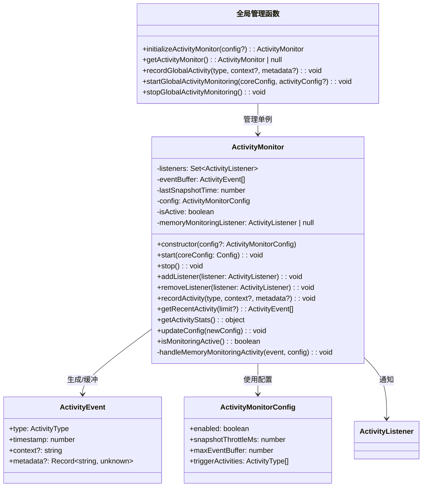
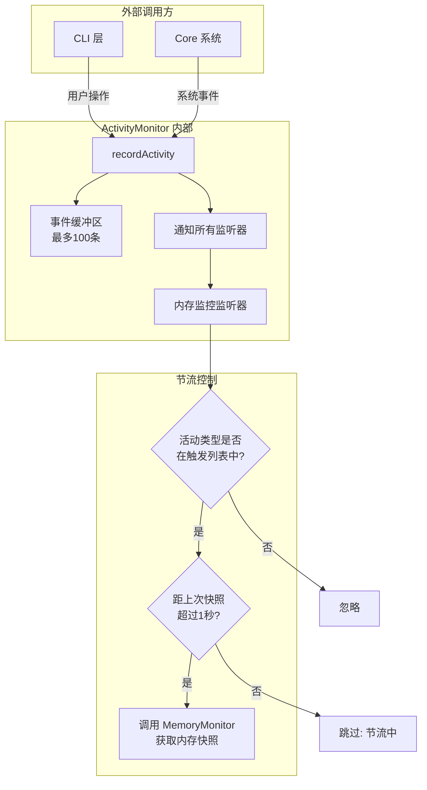
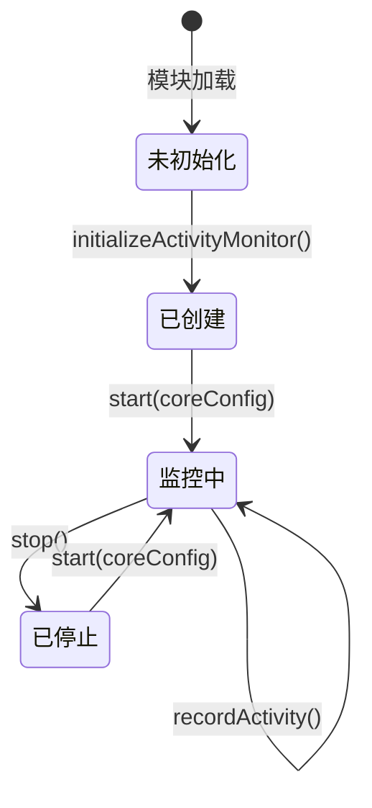

# activity-monitor.ts

## 概述

`activity-monitor.ts` 是活动监控模块，负责追踪用户活动事件并在特定活动发生时触发内存快照（memory snapshot）。该模块实现了一个完整的**事件驱动**活动监控系统，包括事件缓冲、监听器管理、节流控制以及与内存监控系统的集成。

与简单的 `activity-detector.ts`（仅判断用户是否活跃）不同，`activity-monitor.ts` 是一个功能更丰富的监控框架，它：
- 记录带有类型、上下文和元数据的结构化活动事件
- 支持注册多个监听器响应活动事件
- 维护一个有界事件缓冲区
- 在特定活动类型触发时自动获取内存快照（带节流控制）
- 提供活动统计分析功能

## 架构图（Mermaid）







## 核心组件

### `ActivityEvent` 接口

活动事件的数据结构定义。

| 字段 | 类型 | 必填 | 说明 |
|------|------|------|------|
| `type` | `ActivityType` | 是 | 活动类型枚举值 |
| `timestamp` | `number` | 是 | 事件发生的时间戳（毫秒） |
| `context` | `string` | 否 | 事件的上下文描述字符串 |
| `metadata` | `Record<string, unknown>` | 否 | 事件附加的任意键值对元数据 |

### `ActivityMonitorConfig` 接口

活动监控的配置结构。

| 字段 | 类型 | 默认值 | 说明 |
|------|------|--------|------|
| `enabled` | `boolean` | `true` | 是否启用活动监控 |
| `snapshotThrottleMs` | `number` | `1000`（1秒） | 内存快照之间的最小间隔时间（毫秒） |
| `maxEventBuffer` | `number` | `100` | 事件缓冲区的最大容量 |
| `triggerActivities` | `ActivityType[]` | 见下方 | 应触发立即内存快照的活动类型列表 |

**默认触发活动类型**:
- `ActivityType.USER_INPUT_START` -- 用户输入开始
- `ActivityType.MESSAGE_ADDED` -- 消息被添加
- `ActivityType.TOOL_CALL_SCHEDULED` -- 工具调用被调度
- `ActivityType.STREAM_START` -- 流式传输开始

### `ActivityListener` 类型

```typescript
type ActivityListener = (event: ActivityEvent) => void;
```

活动监听器回调函数类型，接收一个 `ActivityEvent` 参数。

### `ActivityMonitor` 类

活动监控的核心类。

#### 私有成员

| 成员 | 类型 | 说明 |
|------|------|------|
| `listeners` | `Set<ActivityListener>` | 注册的监听器集合 |
| `eventBuffer` | `ActivityEvent[]` | 有界事件缓冲区 |
| `lastSnapshotTime` | `number` | 上次内存快照的时间戳，用于节流 |
| `config` | `ActivityMonitorConfig` | 当前配置（深拷贝） |
| `isActive` | `boolean` | 监控是否正在运行 |
| `memoryMonitoringListener` | `ActivityListener \| null` | 内置的内存监控监听器引用 |

#### `start(coreConfig: Config): void`

启动活动监控。

- **前置条件**: `isPerformanceMonitoringActive()` 返回 `true` 且监控未处于活跃状态
- **行为**:
  1. 设置 `isActive = true`
  2. 创建并注册内存监控监听器（`memoryMonitoringListener`）
  3. 记录一条 `MANUAL_TRIGGER` 类型的启动事件

#### `stop(): void`

停止活动监控。

- **行为**:
  1. 设置 `isActive = false`
  2. 移除并清空内存监控监听器
  3. 清空事件缓冲区

#### `recordActivity(type, context?, metadata?): void`

记录一个活动事件。

- **前置条件**: `isActive` 为 `true` 且 `config.enabled` 为 `true`
- **行为**:
  1. 创建 `ActivityEvent` 对象（时间戳为当前时间）
  2. 将事件推入缓冲区，若超出 `maxEventBuffer` 则移除最旧事件（FIFO）
  3. 遍历所有监听器并逐个通知，**监听器异常会被静默捕获**并通过 `debugLogger` 记录

#### `getRecentActivity(limit?): ActivityEvent[]`

获取最近的活动事件。返回缓冲区的浅拷贝。若指定 `limit`，则返回最新的 `limit` 条事件。

#### `getActivityStats()`

获取活动统计信息，返回：
- `totalEvents`: 缓冲区中的事件总数
- `eventTypes`: 按活动类型分组的事件计数
- `timeRange`: 事件时间范围（最早和最晚时间戳），缓冲区为空时返回 `null`

#### `updateConfig(newConfig: Partial<ActivityMonitorConfig>): void`

动态更新配置。使用对象展开运算符合并现有配置和新配置。

#### `handleMemoryMonitoringActivity(event, config): void` (私有)

内存监控的核心逻辑：
1. 检查事件类型是否在 `triggerActivities` 列表中
2. 检查是否通过节流控制（距上次快照是否超过 `snapshotThrottleMs`）
3. 调用 `MemoryMonitor.takeSnapshot()` 获取内存快照

#### `isMonitoringActive(): boolean`

返回监控是否处于活跃且启用状态（`isActive && config.enabled`）。

### 全局管理函数

模块提供了一组全局便捷函数来管理单例 `ActivityMonitor`。

| 函数 | 说明 |
|------|------|
| `initializeActivityMonitor(config?)` | 初始化全局监控实例（懒汉式单例），若已存在则直接返回 |
| `getActivityMonitor()` | 获取全局监控实例，未初始化时返回 `null` |
| `recordGlobalActivity(type, context?, metadata?)` | 在全局监控实例上记录活动 |
| `startGlobalActivityMonitoring(coreConfig, activityConfig?)` | 初始化并启动全局监控 |
| `stopGlobalActivityMonitoring()` | 停止全局监控 |

## 依赖关系

### 内部依赖

| 模块 | 导入内容 | 用途 |
|------|----------|------|
| `../config/config.js` | `Config` 类型 | `start()` 方法需要核心配置，传递给内存监控 |
| `./metrics.js` | `isPerformanceMonitoringActive` | 启动前检查性能监控是否激活 |
| `./memory-monitor.js` | `getMemoryMonitor` | 获取内存监控实例以执行快照 |
| `./activity-types.js` | `ActivityType` | 活动类型枚举 |
| `../utils/debugLogger.js` | `debugLogger` | 调试日志记录（监听器错误处理） |

### 外部依赖

无直接外部依赖。仅使用 JavaScript 内置的 `Date.now()` 和 `Set`。

## 关键实现细节

1. **懒汉式单例 vs 饿汉式单例**: 与 `activity-detector.ts` 的饿汉式单例不同，`globalActivityMonitor` 使用**懒汉式单例**（初始为 `null`，首次调用 `initializeActivityMonitor` 时才创建）。这是因为 `ActivityMonitor` 有更重的初始化成本和依赖。

2. **事件缓冲区管理**: 使用数组作为 FIFO 队列，当超过 `maxEventBuffer`（默认 100）时通过 `shift()` 移除最旧事件。需要注意 `Array.shift()` 的时间复杂度为 O(n)，但在缓冲区大小为 100 的场景下性能影响可以忽略。

3. **内存快照节流**: 通过 `lastSnapshotTime` 和 `snapshotThrottleMs`（默认 1 秒）实现简单的时间节流，防止高频活动导致过多的内存快照操作。

4. **监听器错误隔离**: `recordActivity` 中遍历监听器时，每个监听器调用都被 `try-catch` 包裹，确保单个监听器的异常不会影响其他监听器或主流程。错误通过 `debugLogger.debug` 静默记录。

5. **性能监控前置检查**: `start()` 方法首先检查 `isPerformanceMonitoringActive()`，若性能监控未激活则直接返回，不启动活动监控。这意味着活动监控是性能监控体系的一部分。

6. **配置深拷贝**: 构造函数中使用 `{ ...config }` 对配置进行浅拷贝，避免外部修改配置对象影响监控器行为。但注意 `triggerActivities` 数组仅是浅拷贝，引用仍共享。

7. **启动事件记录**: `start()` 在完成初始化后会自动记录一条 `MANUAL_TRIGGER` 类型的事件（上下文为 `'activity_monitoring_start'`），用于标记监控开始的时间点。

8. **内存快照上下文命名**: 内存快照的上下文字符串格式为 `activity_{type}_{context}` 或 `activity_{type}`（当没有上下文时），这为后续分析提供了可追溯的标签。
