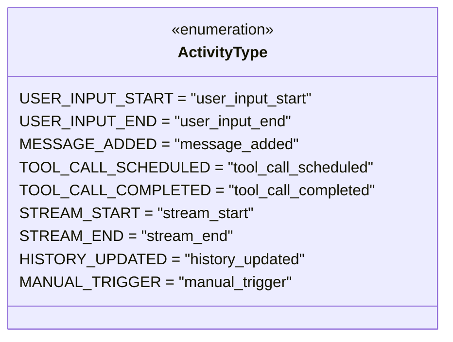
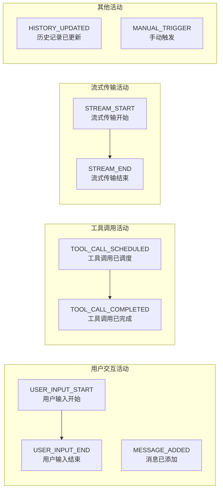

# activity-types.ts

## 概述

`activity-types.ts` 是活动类型定义模块，定义了一个 `ActivityType` 枚举，列举了遥测系统中可追踪的所有用户活动类型。该模块是整个活动监控体系的基础类型定义，被 `activity-monitor.ts` 等多个模块引用。

该枚举使用**字符串枚举**（string enum），每个枚举值都是一个语义化的小写蛇形命名字符串（snake_case），便于在日志、序列化和调试时直接阅读。

## 架构图（Mermaid）

## 核心组件

### `ActivityType` 枚举

该枚举共定义了 **9 种**活动类型，可以按功能分为以下几组：

#### 用户交互相关

| 枚举值 | 字符串值 | 说明 |
|--------|----------|------|
| `USER_INPUT_START` | `"user_input_start"` | 用户开始输入。标记用户与 CLI 交互的起始时刻 |
| `USER_INPUT_END` | `"user_input_end"` | 用户输入结束。标记用户完成一次输入操作 |
| `MESSAGE_ADDED` | `"message_added"` | 消息被添加到对话中。可能是用户消息，也可能是系统/AI 消息 |

#### 工具调用相关

| 枚举值 | 字符串值 | 说明 |
|--------|----------|------|
| `TOOL_CALL_SCHEDULED` | `"tool_call_scheduled"` | 工具调用被调度/计划执行。AI 决定调用某个工具时触发 |
| `TOOL_CALL_COMPLETED` | `"tool_call_completed"` | 工具调用执行完成。工具返回结果时触发 |

#### 流式传输相关

| 枚举值 | 字符串值 | 说明 |
|--------|----------|------|
| `STREAM_START` | `"stream_start"` | 流式传输开始。AI 开始生成流式响应时触发 |
| `STREAM_END` | `"stream_end"` | 流式传输结束。AI 完成流式响应时触发 |

#### 其他

| 枚举值 | 字符串值 | 说明 |
|--------|----------|------|
| `HISTORY_UPDATED` | `"history_updated"` | 对话历史记录被更新 |
| `MANUAL_TRIGGER` | `"manual_trigger"` | 手动触发的活动事件。用于由代码逻辑主动发起的非用户驱动事件，例如活动监控启动时的自我标记 |

### 活动类型与内存快照的关系

在 `activity-monitor.ts` 的默认配置中，以下 4 种活动类型被配置为**触发内存快照**的活动：
- `USER_INPUT_START`
- `MESSAGE_ADDED`
- `TOOL_CALL_SCHEDULED`
- `STREAM_START`

这些类型代表了系统中可能引发显著内存变化的关键时刻。

## 依赖关系

### 内部依赖

无。该模块是一个纯类型定义模块，不依赖任何其他模块。

### 外部依赖

无。仅使用 TypeScript 原生的 `enum` 语法。

## 关键实现细节

1. **字符串枚举**: 使用 `= 'value'` 显式指定字符串值而非默认的数字枚举。这使得枚举值在 JSON 序列化、日志输出和调试时可直接阅读，无需反向映射。

2. **命名约定**: 枚举成员使用大写蛇形命名（`USER_INPUT_START`），对应的字符串值使用小写蛇形命名（`"user_input_start"`），这是一种常见的 TypeScript 枚举命名约定。

3. **成对活动类型**: 多数活动类型以"开始/结束"成对出现（`USER_INPUT_START`/`USER_INPUT_END`、`TOOL_CALL_SCHEDULED`/`TOOL_CALL_COMPLETED`、`STREAM_START`/`STREAM_END`），这使得可以计算各阶段的持续时间。

4. **叶子模块**: 该模块位于依赖关系链的最底层，被 `activity-monitor.ts` 等上层模块导入使用，但本身不导入任何模块。这种设计避免了循环依赖。

5. **可扩展性**: 新增活动类型只需在此枚举中添加新成员即可，调用方通过类型系统自动获得编译时检查。
