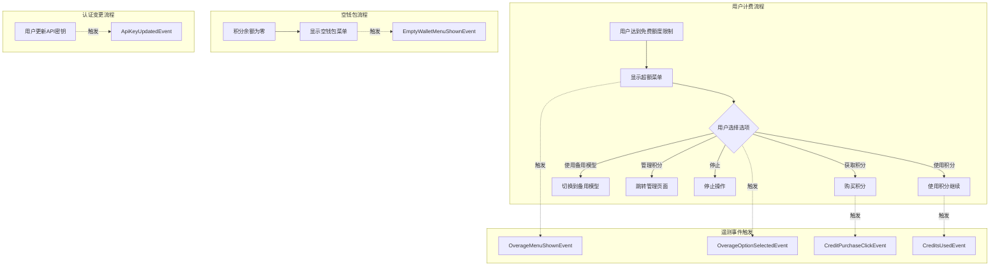
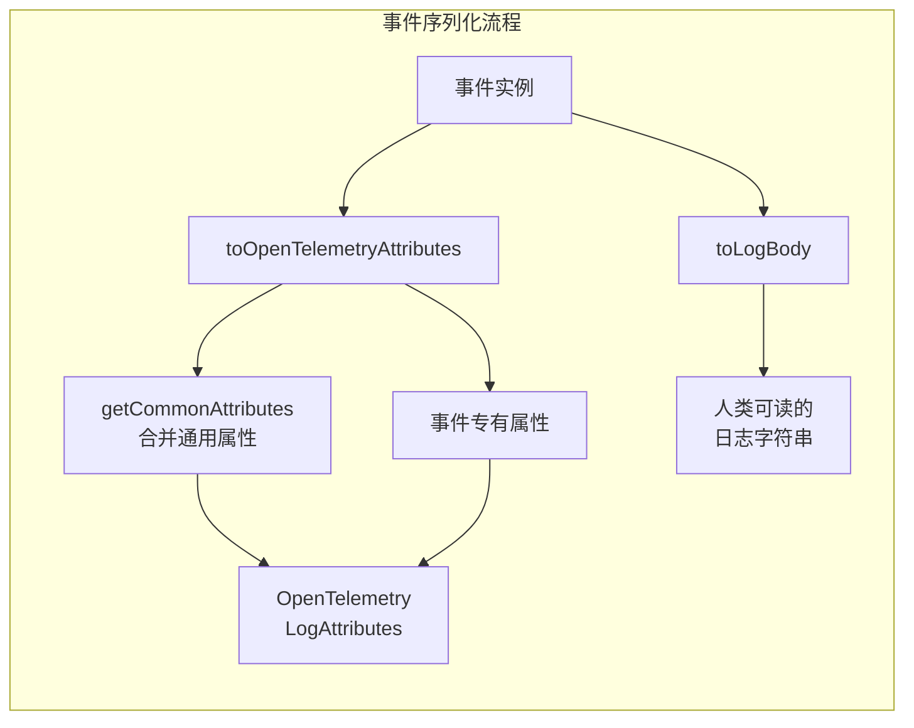

# billingEvents.ts

## 概述

`billingEvents.ts` 是计费相关遥测事件的定义模块，定义了与用户计费流程相关的所有遥测事件类。这些事件用于追踪用户在计费场景下的交互行为，包括超额（overage）菜单的展示、用户选项选择、空钱包提示、积分购买点击以及积分消耗情况。

该模块共定义了 **6 种计费遥测事件类**，每个事件类都实现了 `BaseTelemetryEvent` 接口，提供了统一的 `toOpenTelemetryAttributes()` 和 `toLogBody()` 方法，用于将事件转换为 OpenTelemetry 日志属性和人类可读的日志文本。

## 架构图（Mermaid）

```mermaid
classDiagram
    class BaseTelemetryEvent {
        <<interface>>
        +toOpenTelemetryAttributes(config: Config): LogAttributes
        +toLogBody(): string
    }

    class OverageMenuShownEvent {
        +event.name: "overage_menu_shown"
        +event.timestamp: string
        +model: string
        +credit_balance: number
        +overage_strategy: OverageStrategy
        +toOpenTelemetryAttributes(config): LogAttributes
        +toLogBody(): string
    }

    class OverageOptionSelectedEvent {
        +event.name: "overage_option_selected"
        +event.timestamp: string
        +model: string
        +selected_option: OverageOption
        +credit_balance: number
        +toOpenTelemetryAttributes(config): LogAttributes
        +toLogBody(): string
    }

    class EmptyWalletMenuShownEvent {
        +event.name: "empty_wallet_menu_shown"
        +event.timestamp: string
        +model: string
        +toOpenTelemetryAttributes(config): LogAttributes
        +toLogBody(): string
    }

    class CreditPurchaseClickEvent {
        +event.name: "credit_purchase_click"
        +event.timestamp: string
        +source: string
        +model: string
        +toOpenTelemetryAttributes(config): LogAttributes
        +toLogBody(): string
    }

    class CreditsUsedEvent {
        +event.name: "credits_used"
        +event.timestamp: string
        +model: string
        +credits_consumed: number
        +credits_remaining: number
        +toOpenTelemetryAttributes(config): LogAttributes
        +toLogBody(): string
    }

    class ApiKeyUpdatedEvent {
        +event.name: "api_key_updated"
        +event.timestamp: string
        +previous_auth_type: string
        +new_auth_type: string
        +toOpenTelemetryAttributes(config): LogAttributes
        +toLogBody(): string
    }

    BaseTelemetryEvent <|.. OverageMenuShownEvent
    BaseTelemetryEvent <|.. OverageOptionSelectedEvent
    BaseTelemetryEvent <|.. EmptyWalletMenuShownEvent
    BaseTelemetryEvent <|.. CreditPurchaseClickEvent
    BaseTelemetryEvent <|.. CreditsUsedEvent
    BaseTelemetryEvent <|.. ApiKeyUpdatedEvent
```







## 核心组件

### `OverageOption` 类型

```typescript
type OverageOption = 'use_credits' | 'use_fallback' | 'manage' | 'stop' | 'get_credits';
```

超额菜单中用户可选择的选项联合类型。

| 选项值 | 说明 |
|--------|------|
| `'use_credits'` | 使用积分继续操作 |
| `'use_fallback'` | 切换到备用（fallback）模型 |
| `'manage'` | 进入积分管理页面 |
| `'stop'` | 停止当前操作 |
| `'get_credits'` | 获取/购买积分 |

---

### 事件类详解

#### 1. `OverageMenuShownEvent` -- 超额菜单显示事件

**事件常量**: `EVENT_OVERAGE_MENU_SHOWN = 'gemini_cli.overage_menu_shown'`

当用户达到免费使用限额，超额菜单被展示时触发。

| 字段 | 类型 | 说明 |
|------|------|------|
| `event.name` | `'overage_menu_shown'` | 事件名称（字面量类型） |
| `event.timestamp` | `string` | ISO 8601 格式的时间戳 |
| `model` | `string` | 当前使用的模型名称 |
| `credit_balance` | `number` | 当前积分余额 |
| `overage_strategy` | `OverageStrategy` | 超额处理策略 |

**日志输出示例**: `"Overage menu shown for model gemini-2.0-flash with 50 credits available."`

---

#### 2. `OverageOptionSelectedEvent` -- 超额选项选择事件

**事件常量**: `EVENT_OVERAGE_OPTION_SELECTED = 'gemini_cli.overage_option_selected'`

当用户在超额菜单中选择了某个选项时触发。

| 字段 | 类型 | 说明 |
|------|------|------|
| `event.name` | `'overage_option_selected'` | 事件名称 |
| `event.timestamp` | `string` | ISO 8601 格式的时间戳 |
| `model` | `string` | 当前使用的模型名称 |
| `selected_option` | `OverageOption` | 用户选择的选项 |
| `credit_balance` | `number` | 当前积分余额 |

**日志输出示例**: `"Overage option 'use_credits' selected for model gemini-2.0-flash."`

---

#### 3. `EmptyWalletMenuShownEvent` -- 空钱包菜单显示事件

**事件常量**: `EVENT_EMPTY_WALLET_MENU_SHOWN = 'gemini_cli.empty_wallet_menu_shown'`

当用户积分余额为零，空钱包提示菜单被展示时触发。

| 字段 | 类型 | 说明 |
|------|------|------|
| `event.name` | `'empty_wallet_menu_shown'` | 事件名称 |
| `event.timestamp` | `string` | ISO 8601 格式的时间戳 |
| `model` | `string` | 当前使用的模型名称 |

**日志输出示例**: `"Empty wallet menu shown for model gemini-2.0-flash."`

---

#### 4. `CreditPurchaseClickEvent` -- 积分购买点击事件

**事件常量**: `EVENT_CREDIT_PURCHASE_CLICK = 'gemini_cli.credit_purchase_click'`

当用户点击积分购买链接/按钮时触发。

| 字段 | 类型 | 说明 |
|------|------|------|
| `event.name` | `'credit_purchase_click'` | 事件名称 |
| `event.timestamp` | `string` | ISO 8601 格式的时间戳 |
| `source` | `'overage_menu' \| 'empty_wallet_menu' \| 'manage'` | 购买入口来源 |
| `model` | `string` | 当前使用的模型名称 |

**日志输出示例**: `"Credit purchase clicked from overage_menu for model gemini-2.0-flash."`

---

#### 5. `CreditsUsedEvent` -- 积分消耗事件

**事件常量**: `EVENT_CREDITS_USED = 'gemini_cli.credits_used'`

当积分被消耗时触发，记录消耗量和剩余量。

| 字段 | 类型 | 说明 |
|------|------|------|
| `event.name` | `'credits_used'` | 事件名称 |
| `event.timestamp` | `string` | ISO 8601 格式的时间戳 |
| `model` | `string` | 消耗积分的模型名称 |
| `credits_consumed` | `number` | 本次消耗的积分数量 |
| `credits_remaining` | `number` | 剩余积分数量 |

**日志输出示例**: `"10 credits consumed for model gemini-2.0-flash. 40 remaining."`

---

#### 6. `ApiKeyUpdatedEvent` -- API 密钥更新事件

**事件常量**: `EVENT_API_KEY_UPDATED = 'gemini_cli.api_key_updated'`

当用户的认证类型发生变更时触发（如从 OAuth 切换到 API Key）。

| 字段 | 类型 | 说明 |
|------|------|------|
| `event.name` | `'api_key_updated'` | 事件名称 |
| `event.timestamp` | `string` | ISO 8601 格式的时间戳 |
| `previous_auth_type` | `string` | 变更前的认证类型 |
| `new_auth_type` | `string` | 变更后的认证类型 |

**日志输出示例**: `"Auth type changed from oauth to api_key."`

---

### `BillingTelemetryEvent` 联合类型

```typescript
type BillingTelemetryEvent =
  | OverageMenuShownEvent
  | OverageOptionSelectedEvent
  | EmptyWalletMenuShownEvent
  | CreditPurchaseClickEvent
  | CreditsUsedEvent
  | ApiKeyUpdatedEvent;
```

所有计费相关遥测事件类的联合类型，便于在上层代码中统一处理。

## 依赖关系

### 内部依赖

| 模块 | 导入内容 | 用途 |
|------|----------|------|
| `../config/config.js` | `Config` 类型 | `toOpenTelemetryAttributes` 方法参数类型 |
| `./types.js` | `BaseTelemetryEvent` 接口 | 所有事件类实现的基础接口 |
| `./telemetryAttributes.js` | `getCommonAttributes` 函数 | 获取通用遥测属性（如应用版本、环境等），与事件属性合并 |
| `../billing/billing.js` | `OverageStrategy` 类型 | 超额处理策略类型定义 |

### 外部依赖

| 包 | 导入内容 | 用途 |
|----|----------|------|
| `@opentelemetry/api-logs` | `LogAttributes` 类型 | OpenTelemetry 日志属性类型，用于 `toOpenTelemetryAttributes` 返回值 |

## 关键实现细节

1. **统一的事件接口**: 所有事件类都实现 `BaseTelemetryEvent` 接口，保证了两个方法的一致性：
   - `toOpenTelemetryAttributes(config)`: 将事件转换为 OpenTelemetry 日志属性，包含通过 `getCommonAttributes(config)` 获取的通用属性
   - `toLogBody()`: 生成人类可读的日志文本

2. **事件常量命名空间**: 每个事件类都有对应的 `EVENT_*` 字符串常量，前缀为 `gemini_cli.`，用于 OpenTelemetry 的 `event.name` 属性。注意事件类内部的 `event.name` 字面量值（如 `'overage_menu_shown'`）与常量值（如 `'gemini_cli.overage_menu_shown'`）不同，常量值带有 `gemini_cli.` 前缀，用于外部日志系统的全局唯一标识。

3. **时间戳格式**: 所有事件使用 `new Date().toISOString()` 生成 ISO 8601 格式的时间戳字符串，确保时区一致性和可解析性。

4. **属性合并模式**: `toOpenTelemetryAttributes` 使用扩展运算符 `...getCommonAttributes(config)` 将通用属性与事件特有属性合并，事件属性会覆盖同名的通用属性。

5. **source 字段限制**: `CreditPurchaseClickEvent` 的 `source` 字段使用字面量联合类型 `'overage_menu' | 'empty_wallet_menu' | 'manage'`，严格限制了购买入口来源的取值范围。

6. **不收集敏感信息**: 事件中不包含 API 密钥本身的值，`ApiKeyUpdatedEvent` 仅记录认证类型的变更（如 `"oauth"` 到 `"api_key"`），而非实际的密钥内容。
