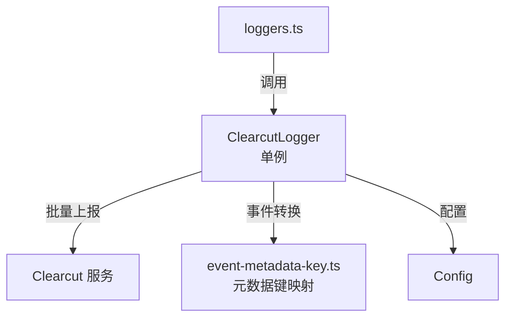

# clearcut-logger (Clearcut 日志子模块)

## 概述

`clearcut-logger/` 子目录实现了 Google Clearcut 日志服务的集成。Clearcut 是 Google 内部的遥测数据收集服务，该模块将 Gemini CLI 的遥测事件转换为 Clearcut 协议格式并批量上报。

## 目录结构

```
clearcut-logger/
├── clearcut-logger.ts          # ClearcutLogger 单例实现
├── event-metadata-key.ts       # 事件元数据键定义
└── clearcut-logger.test.ts     # 单元测试
```

## 架构图



## 核心组件

### ClearcutLogger (clearcut-logger.ts)
- **职责**: 将 CLI 遥测事件转换为 Clearcut 格式并批量上报
- **模式**: 单例模式，通过 `getInstance(config)` 获取
- **关键方法**: 为每种遥测事件提供独立的日志方法（`logStartSessionEvent()`, `logToolCallEvent()`, `logApiResponseEvent()` 等）
- **生命周期**: `shutdown()` 方法在进程退出时刷新剩余事件

### event-metadata-key.ts
- **职责**: 定义 Clearcut 事件的元数据键常量

## 依赖关系

### 内部依赖
- `telemetry/types.ts` - 遥测事件类型
- `config/config.ts` - Config 配置接口

### 外部依赖
- `systeminformation` - 系统信息采集
- `https-proxy-agent` - 代理支持
