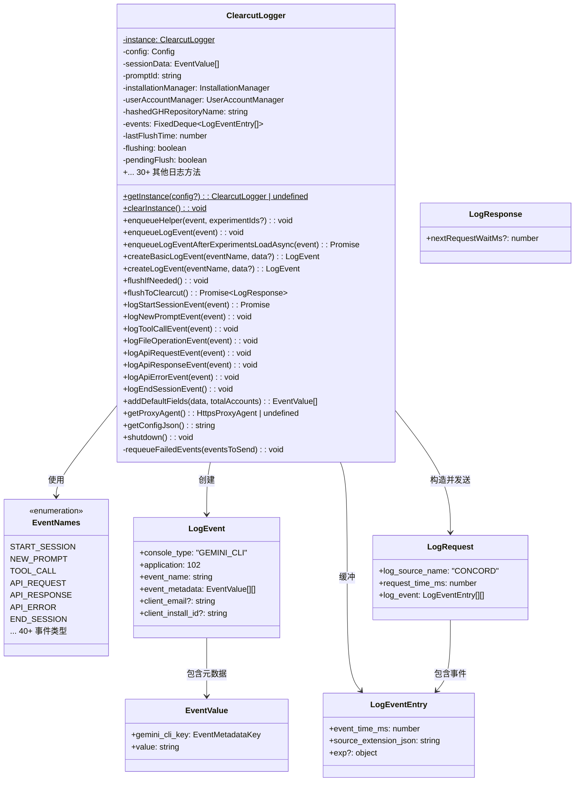
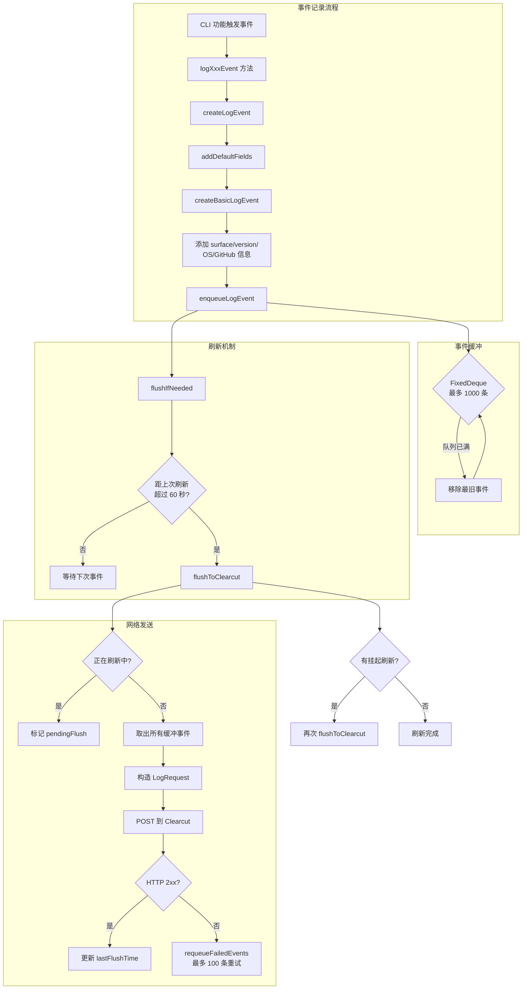
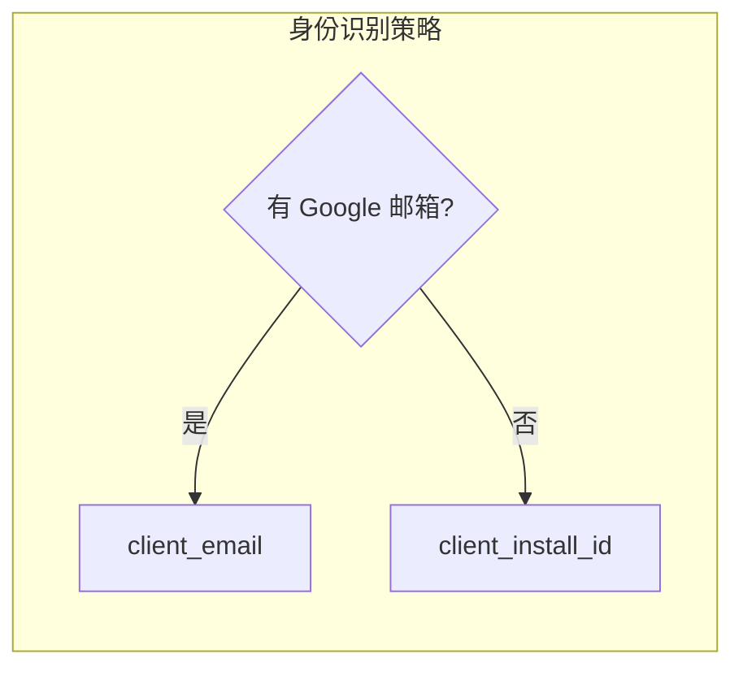
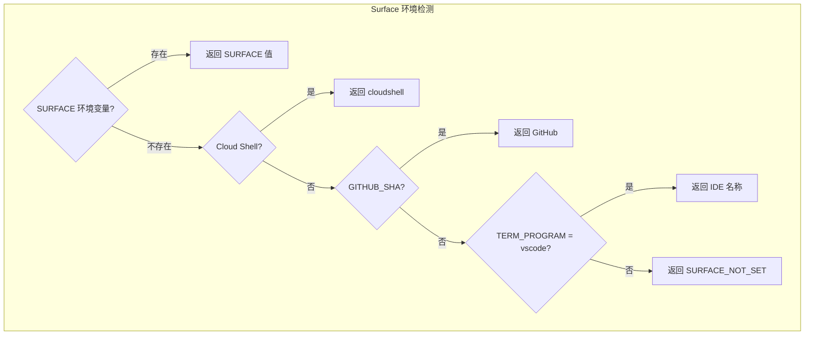

# clearcut-logger.ts

## 概述

`clearcut-logger.ts` 是 Gemini CLI 的核心遥测日志模块，负责将用户活动事件批量发送到 Google 的 **Clearcut** 日志收集服务（`play.googleapis.com/log`）。这是整个遥测系统中最重要、最复杂的模块，承担着事件创建、缓冲、序列化、批量发送和失败重试的全部职责。

该模块实现了一个**单例模式**的 `ClearcutLogger` 类，支持超过 **40 种不同类型**的遥测事件日志记录，覆盖了 Gemini CLI 的完整生命周期，包括会话启动/结束、用户输入、API 请求/响应、工具调用、扩展管理、计费事件等。

关键设计特点：
- **批量发送**: 事件先缓冲到内存队列中，以固定间隔（每分钟）批量刷新到 Clearcut
- **有界队列**: 使用 `FixedDeque` 限制最多 1000 个事件，防止内存泄漏
- **失败重试**: 发送失败的事件会被重新排入队列（最多 100 个）
- **并发控制**: 通过 `flushing` 和 `pendingFlush` 标志防止并发刷新
- **隐私保护**: 仅记录必要的元数据，不记录敏感信息如 API 密钥

## 架构图（Mermaid）









## 核心组件

### `EventNames` 枚举

定义了所有可记录的事件名称，共 **44 种**事件类型，按功能可分为：

| 分类 | 事件名称 | 说明 |
|------|----------|------|
| **会话管理** | `START_SESSION` | 会话开始 |
| | `END_SESSION` | 会话结束 |
| | `CONVERSATION_FINISHED` | 对话完成 |
| **用户交互** | `NEW_PROMPT` | 新的用户提示 |
| | `SLASH_COMMAND` | 斜杠命令 |
| | `MODEL_SLASH_COMMAND` | 模型切换斜杠命令 |
| | `REWIND` | 回退操作 |
| **工具调用** | `TOOL_CALL` | 工具调用 |
| | `FILE_OPERATION` | 文件操作 |
| | `TOOL_OUTPUT_TRUNCATED` | 工具输出被截断 |
| | `TOOL_OUTPUT_MASKING` | 工具输出被遮蔽 |
| **API 通信** | `API_REQUEST` | API 请求 |
| | `API_RESPONSE` | API 响应 |
| | `API_ERROR` | API 错误 |
| **模型相关** | `FLASH_FALLBACK` | Flash 模型回退 |
| | `RIPGREP_FALLBACK` | Ripgrep 回退 |
| | `MODEL_ROUTING` | 模型路由决策 |
| **循环检测** | `LOOP_DETECTED` | 检测到循环 |
| | `LOOP_DETECTION_DISABLED` | 循环检测已禁用 |
| | `LLM_LOOP_CHECK` | LLM 循环检查 |
| **重试/恢复** | `CONTENT_RETRY` | 内容重试 |
| | `CONTENT_RETRY_FAILURE` | 内容重试失败 |
| | `RETRY_ATTEMPT` | 网络重试尝试 |
| | `RECOVERY_ATTEMPT` | 恢复尝试 |
| **扩展管理** | `EXTENSION_ENABLE` | 启用扩展 |
| | `EXTENSION_DISABLE` | 禁用扩展 |
| | `EXTENSION_INSTALL` | 安装扩展 |
| | `EXTENSION_UNINSTALL` | 卸载扩展 |
| | `EXTENSION_UPDATE` | 更新扩展 |
| **编辑相关** | `EDIT_STRATEGY` | 编辑策略 |
| | `EDIT_CORRECTION` | 编辑修正 |
| **Agent 相关** | `AGENT_START` | Agent 启动 |
| | `AGENT_FINISH` | Agent 完成 |
| **审批模式** | `APPROVAL_MODE_SWITCH` | 审批模式切换 |
| | `APPROVAL_MODE_DURATION` | 审批模式持续时间 |
| | `PLAN_EXECUTION` | 计划执行 |
| **计费相关** | `CREDITS_USED` | 积分使用 |
| | `OVERAGE_OPTION_SELECTED` | 超额选项选择 |
| | `EMPTY_WALLET_MENU_SHOWN` | 空钱包菜单显示 |
| | `CREDIT_PURCHASE_CLICK` | 积分购买点击 |
| **其他** | `NEXT_SPEAKER_CHECK` | 下一发言者检查 |
| | `MALFORMED_JSON_RESPONSE` | JSON 响应格式错误 |
| | `IDE_CONNECTION` | IDE 连接 |
| | `INVALID_CHUNK` | 无效数据块 |
| | `CHAT_COMPRESSION` | 聊天压缩 |
| | `WEB_FETCH_FALLBACK_ATTEMPT` | 网页抓取回退尝试 |
| | `HOOK_CALL` | Hook 调用 |
| | `KEYCHAIN_AVAILABILITY` | 钥匙串可用性 |
| | `TOKEN_STORAGE_INITIALIZATION` | 令牌存储初始化 |
| | `STARTUP_STATS` | 启动统计 |
| | `ONBOARDING_START` | 引导开始 |
| | `ONBOARDING_SUCCESS` | 引导成功 |
| | `CONSECA_POLICY_GENERATION` | Conseca 策略生成 |
| | `CONSECA_VERDICT` | Conseca 裁定 |
| | `KITTY_SEQUENCE_OVERFLOW` | Kitty 序列溢出 |

---

### 数据接口

#### `LogResponse`

```typescript
interface LogResponse {
  nextRequestWaitMs?: number;  // Clearcut 建议的下次请求等待时间
}
```

#### `LogEventEntry`

```typescript
interface LogEventEntry {
  event_time_ms: number;           // 事件时间戳（毫秒）
  source_extension_json: string;   // 序列化的 LogEvent JSON 字符串
  exp?: { gws_experiment: number[] };  // 实验 ID 列表
}
```

#### `EventValue`

```typescript
interface EventValue {
  gemini_cli_key: EventMetadataKey;  // 元数据键（枚举值）
  value: string;                     // 元数据值（字符串）
}
```

#### `LogEvent`

```typescript
interface LogEvent {
  console_type: 'GEMINI_CLI';       // 固定标识
  application: number;               // 应用 ID，固定为 102
  event_name: string;                // 事件名称
  event_metadata: EventValue[][];    // 元数据二维数组
  client_email?: string;             // Google 账号邮箱
  client_install_id?: string;        // 安装 ID（与 email 二选一）
}
```

#### `LogRequest`

```typescript
interface LogRequest {
  log_source_name: 'CONCORD';       // 日志源名称，固定为 CONCORD
  request_time_ms: number;           // 请求发送时间
  log_event: LogEventEntry[][];      // 事件列表
}
```

---

### `ClearcutLogger` 类

#### 常量配置

| 常量 | 值 | 说明 |
|------|----|------|
| `CLEARCUT_URL` | `https://play.googleapis.com/log?format=json&hasfast=true` | Clearcut 日志收集端点 |
| `FLUSH_INTERVAL_MS` | `60000`（1 分钟） | 缓冲事件批量发送的时间间隔 |
| `MAX_EVENTS` | `1000` | 内存中最大事件缓冲数量 |
| `MAX_RETRY_EVENTS` | `100` | 失败重试时最多保留的事件数量 |

#### 私有成员

| 成员 | 类型 | 说明 |
|------|------|------|
| `instance` | `ClearcutLogger` (静态) | 单例实例 |
| `config` | `Config` | 核心配置对象 |
| `sessionData` | `EventValue[]` | 会话级数据，在 `START_SESSION` 时填充，后续事件复用 |
| `promptId` | `string` | 当前提示 ID |
| `installationManager` | `InstallationManager` | 安装 ID 管理器 |
| `userAccountManager` | `UserAccountManager` | 用户账号管理器 |
| `hashedGHRepositoryName` | `string` | SHA-256 哈希后的 GitHub 仓库名 |
| `events` | `FixedDeque<LogEventEntry[]>` | 固定容量的双端队列，存储待发送事件 |
| `lastFlushTime` | `number` | 上次成功刷新的时间戳 |
| `flushing` | `boolean` | 是否正在刷新中（防并发） |
| `pendingFlush` | `boolean` | 是否有等待中的刷新请求 |

#### 关键方法详解

##### `getInstance(config?): ClearcutLogger | undefined` (静态)

获取单例实例。若 `config` 未定义或 `usageStatisticsEnabled` 为 `false`，返回 `undefined`（不收集遥测）。

##### `createBasicLogEvent(eventName, data?): LogEvent`

创建基础日志事件，包含以下通用元数据：
- **Surface**（运行环境: Cloud Shell / GitHub / VSCode 等）
- **CLI 版本号**
- **Git 提交哈希**
- **操作系统平台**
- **GitHub Actions 信息**（工作流名称、仓库哈希、事件名、PR/Issue 编号等，仅在 GitHub Actions 环境中）
- **用户身份**: 优先使用 `client_email`，否则使用 `client_install_id`

##### `createLogEvent(eventName, data?): LogEvent`

在 `createBasicLogEvent` 基础上，额外添加：
- 会话数据（`sessionData`，除 `START_SESSION` 外的所有事件）
- 默认字段（通过 `addDefaultFields`）

##### `addDefaultFields(data, totalAccounts): EventValue[]`

添加所有事件都应携带的默认字段：
- `SESSION_ID` -- 会话标识
- `AUTH_TYPE` -- 认证类型
- `GOOGLE_ACCOUNTS_COUNT` -- Google 账号数量
- `PROMPT_ID` -- 提示 ID
- `NODE_VERSION` -- Node.js 版本
- `USER_SETTINGS` -- 用户配置（仅布尔值）
- `INTERACTIVE` -- 是否交互模式
- `ACTIVE_APPROVAL_MODE` -- 当前审批模式
- `EXPERIMENT_IDS` -- 实验 ID（若有）

##### `enqueueHelper(event, experimentIds?): void`

事件入队的核心逻辑：
1. 若队列已满（`>= MAX_EVENTS`），移除最旧事件（`shift()`）
2. 将事件序列化为 `LogEventEntry`（包含时间戳和 JSON 字符串）
3. 若有实验 ID，附加到 `exp.gws_experiment`
4. 推入队列

##### `flushIfNeeded(): void`

检查距上次刷新是否已超过 `FLUSH_INTERVAL_MS`（60秒），若是则触发 `flushToClearcut()`。

##### `flushToClearcut(): Promise<LogResponse>`

将缓冲事件批量发送到 Clearcut：
1. **并发控制**: 若已在刷新中，设置 `pendingFlush = true` 并立即返回
2. 取出所有缓冲事件，清空队列
3. 构造 `LogRequest`，通过 `fetch` POST 到 Clearcut
4. **成功** (2xx): 更新 `lastFlushTime`，解析 `nextRequestWaitMs`
5. **失败**: 调用 `requeueFailedEvents` 将事件重新排入队列
6. 若有 `pendingFlush`，刷新完成后立即再次刷新

##### `requeueFailedEvents(eventsToSend): void`

失败事件重排队逻辑：
1. 仅保留最近的 `MAX_RETRY_EVENTS`（100）条事件
2. 根据队列剩余空间计算可重排数量
3. 使用 `unshift()` 将事件插入队列前端（优先重试）
4. 若队列溢出，从尾部移除多余事件

##### `logStartSessionEvent(event): Promise<void>`

记录会话启动事件，这是最特殊的事件：
- 收集硬件信息（CPU 型号、核心数、总内存、GPU 信息）
- 记录配置信息（模型、沙箱、审批模式、MCP 服务器、扩展等）
- 数据保存到 `sessionData`，后续所有事件都会包含这些信息
- 等待实验配置加载后再入队
- 入队后立即刷新到 Clearcut

---

### 辅助函数

#### `determineSurface(): string`

检测用户当前使用的运行环境/分发渠道：
1. `SURFACE` 环境变量（最高优先级）
2. Cloud Shell 环境
3. GitHub Actions（检测 `GITHUB_SHA`）
4. VSCode 终端（检测 `TERM_PROGRAM`）
5. 默认: `'SURFACE_NOT_SET'`

#### GitHub Actions 环境检测函数

- `determineGHWorkflowName()` -- 工作流名称（`GH_WORKFLOW_NAME`）
- `determineGHRepositoryName()` -- 仓库名称（`GITHUB_REPOSITORY`）
- `determineGHEventName()` -- 事件名称（`GITHUB_EVENT_NAME`）
- `determineGHPRNumber()` -- PR 编号（`GH_PR_NUMBER`）
- `determineGHIssueNumber()` -- Issue 编号（`GH_ISSUE_NUMBER`）
- `determineGHCustomTrackingId()` -- 自定义追踪 ID（`GH_CUSTOM_TRACKING_ID`）

#### `getGpuInfo(): Promise<string>`

获取 GPU 信息（带缓存）：
- 首次调用时通过 `systeminformation` 库获取显卡型号
- 结果缓存到模块级变量 `cachedGpuInfo`
- 无 GPU 返回 `'NA'`，获取失败返回 `'FAILED'`

## 依赖关系

### 内部依赖

| 模块 | 导入内容 | 用途 |
|------|----------|------|
| `../types.js` | 约 40 种事件类型接口 | 所有日志方法的参数类型定义 |
| `../billingEvents.js` | `CreditsUsedEvent`, `OverageOptionSelectedEvent`, `EmptyWalletMenuShownEvent`, `CreditPurchaseClickEvent` | 计费相关事件类型 |
| `./event-metadata-key.js` | `EventMetadataKey` | 事件元数据键的枚举定义 |
| `../../config/config.js` | `Config` 类型 | 核心配置（会话 ID、使用统计开关、调试模式等） |
| `../../utils/installationManager.js` | `InstallationManager` | 获取安装唯一标识 |
| `../../utils/userAccountManager.js` | `UserAccountManager` | 获取 Google 账号信息 |
| `../../utils/safeJsonStringify.js` | `safeJsonStringify`, `safeJsonStringifyBooleanValuesOnly` | 安全的 JSON 序列化 |
| `../../tools/tool-names.js` | `ASK_USER_TOOL_NAME` | 工具名称常量（用于识别 ask_user 工具） |
| `../../generated/git-commit.js` | `GIT_COMMIT_INFO`, `CLI_VERSION` | 版本和 Git 提交信息 |
| `../../ide/detect-ide.js` | `IDE_DEFINITIONS`, `detectIdeFromEnv`, `isCloudShell` | IDE/环境检测 |
| `../../utils/debugLogger.js` | `debugLogger` | 调试日志 |
| `../../utils/errors.js` | `getErrorMessage` | 错误消息提取 |

### 外部依赖

| 包 | 导入内容 | 用途 |
|----|----------|------|
| `node:crypto` | `createHash` | SHA-256 哈希（用于哈希 GitHub 仓库名） |
| `node:os` | `os` | 获取 CPU、内存等系统信息 |
| `systeminformation` | `si` | 获取 GPU 显卡信息 |
| `https-proxy-agent` | `HttpsProxyAgent` | HTTP/HTTPS 代理支持 |
| `mnemonist` | `FixedDeque` | 固定容量双端队列数据结构 |

## 关键实现细节

1. **单例模式 + 条件创建**: `getInstance` 不仅是单例获取器，还有**门控逻辑** -- 若配置未启用使用统计（`getUsageStatisticsEnabled() === false`），直接返回 `undefined`，完全跳过遥测。这是一种优雅的"零开销关闭"设计。

2. **身份标识二选一策略**: 遵循 `go/cloudmill-1p-oss-instrumentation#define-sessionable-id` 规范，事件中要么携带 `client_email`（已登录用户），要么携带 `client_install_id`（匿名用户），不会同时携带两者。

3. **GitHub 仓库名哈希**: `GITHUB_REPOSITORY` 使用 SHA-256 哈希后再存储，保护用户仓库隐私。

4. **FixedDeque 溢出手动处理**: `mnemonist` 的 `FixedDeque` 在容量满时 `push` 会抛异常，因此 `enqueueHelper` 在推入前手动检查并移除最旧元素。

5. **并发刷新控制**: 使用 `flushing` 布尔标志实现简单的互斥锁。若刷新期间有新的刷新请求，通过 `pendingFlush` 标记，等当前刷新完成后自动触发下一次刷新。这避免了复杂的锁机制。

6. **失败重试策略**: 发送失败时，最多重排 `MAX_RETRY_EVENTS`（100）条最新事件到队列前端。这意味着旧的失败事件会被丢弃，新的事件获得更高的重试优先级。重排使用 `unshift` 插入前端，并倒序遍历以保持原始顺序。

7. **会话数据复用**: `logStartSessionEvent` 将会话级数据（模型、硬件信息等）保存到 `sessionData`，后续所有事件（通过 `createLogEvent`）都会自动附加这些数据，避免重复收集。

8. **实验 ID 异步加载**: `enqueueLogEventAfterExperimentsLoadAsync` 支持在实验配置异步加载完成后再将实验 ID 附加到事件中。这在 `START_SESSION` 事件中使用，因为实验配置可能尚未从 CCPA 服务器加载完毕。

9. **特定事件的即时刷新**: 以下事件不使用 `flushIfNeeded` 的 60 秒间隔，而是立即刷新：
   - `START_SESSION` -- 确保会话启动立即上报
   - `END_SESSION` -- 确保会话结束前数据不丢失
   - `FLASH_FALLBACK` / `RIPGREP_FALLBACK` -- 回退事件需要及时上报
   - `EXTENSION_INSTALL` / `EXTENSION_UNINSTALL` / `EXTENSION_UPDATE` / `EXTENSION_ENABLE` / `EXTENSION_DISABLE` -- 扩展管理操作

10. **配置 JSON 安全序列化**: `getConfigJson()` 使用 `safeJsonStringifyBooleanValuesOnly`，仅序列化配置中的布尔值字段，避免泄露敏感配置内容（如 API 密钥、端点 URL 等）。

11. **GPU 信息缓存**: GPU 信息通过 `systeminformation` 库异步获取，结果缓存在模块级变量中，仅在 `START_SESSION` 时获取一次，避免重复的异步系统调用。

12. **application 编号**: `LogEvent.application` 固定为 `102`，这是 Clearcut 系统中 Gemini CLI 的注册应用编号。

13. **测试支持**: 导出了 `TEST_ONLY` 对象，包含常量和辅助方法，方便单元测试重置缓存状态和验证配置。
