# event-metadata-key.ts

## 概述

`event-metadata-key.ts` 是 Gemini CLI 遥测系统中 Clearcut 日志记录器的核心枚举定义文件。该文件定义了 `EventMetadataKey` 枚举，包含了所有用于 Clearcut 日志记录的有效事件元数据键。每个枚举值对应一个唯一的数字 ID（从 0 到 194），用于标识不同类型的遥测事件属性。

该文件是遥测数据收集的基础组件，确保所有日志记录使用统一的、类型安全的键标识符，而不是容易出错的魔法字符串或数字。

## 架构图（Mermaid）

```mermaid
graph TB
    subgraph EventMetadataKey枚举
        A[EventMetadataKey]
    end

    subgraph 事件分类
        B[会话启动事件<br/>ID: 1-12, 63-65, 94, 119-120, 191]
        C[启动统计事件<br/>ID: 172-175]
        D[用户提示事件<br/>ID: 13]
        E[工具调用事件<br/>ID: 14-19, 62, 93, 95]
        F[编辑工具事件<br/>ID: 109-110, 116]
        G[GenAI API请求事件<br/>ID: 20]
        H[GenAI API响应事件<br/>ID: 21-29, 167-171]
        I[GenAI API错误事件<br/>ID: 30-33]
        J[会话结束事件<br/>ID: 34]
        K[共享键<br/>ID: 35-40, 54-55, 82, 84, 125, 130-132, 176-179]
        L[循环检测事件<br/>ID: 38, 126-129]
        M[斜杠命令事件<br/>ID: 41-42, 51]
        N[下一个发言者检查事件<br/>ID: 43-44]
        O[IDE连接事件<br/>ID: 46-50, 103-106]
        P[扩展事件<br/>ID: 85-88, 96, 102, 107, 117-121]
        Q[工具输出截断事件<br/>ID: 89-92]
        R[模型路由事件<br/>ID: 97-101, 108, 145-147]
        S[代理事件<br/>ID: 111-115, 122-124]
        T[Hook调用事件<br/>ID: 133-136]
        U[审批模式事件<br/>ID: 141-143]
        V[Conseca事件<br/>ID: 159-166]
        W[网络重试事件<br/>ID: 180-182]
        X[计费/AI积分事件<br/>ID: 185-190]
        Y[企业版入职事件<br/>ID: 192-194]
        Z[其他事件<br/>ID: 0, 45, 52-53, 56-61, 66-81, 83, 137-140, 144, 148-158]
    end

    A --> B
    A --> C
    A --> D
    A --> E
    A --> F
    A --> G
    A --> H
    A --> I
    A --> J
    A --> K
    A --> L
    A --> M
    A --> N
    A --> O
    A --> P
    A --> Q
    A --> R
    A --> S
    A --> T
    A --> U
    A --> V
    A --> W
    A --> X
    A --> Y
    A --> Z
```

## 核心组件

### EventMetadataKey 枚举

这是文件中唯一的导出，是一个大型 TypeScript 数字枚举，包含约 170+ 个成员。枚举按功能域组织为以下主要分类：

#### 1. 会话启动事件键（Start Session Event Keys）
| 键名 | ID | 说明 |
|------|-----|------|
| `GEMINI_CLI_START_SESSION_MODEL` | 1 | 会话使用的模型 ID |
| `GEMINI_CLI_START_SESSION_EMBEDDING_MODEL` | 2 | 嵌入模型 ID |
| `GEMINI_CLI_START_SESSION_SANDBOX` | 3 | 使用的沙箱环境 |
| `GEMINI_CLI_START_SESSION_CORE_TOOLS` | 4 | 启用的核心工具 |
| `GEMINI_CLI_START_SESSION_APPROVAL_MODE` | 5 | 审批模式 |
| `GEMINI_CLI_START_SESSION_API_KEY_ENABLED` | 6 | 是否使用 API 密钥 |
| `GEMINI_CLI_START_SESSION_VERTEX_API_ENABLED` | 7 | 是否使用 Vertex API |
| `GEMINI_CLI_START_SESSION_DEBUG_MODE_ENABLED` | 8 | 是否启用调试模式 |
| `GEMINI_CLI_START_SESSION_MCP_SERVERS` | 9 | 启用的 MCP 服务器 |
| `GEMINI_CLI_START_SESSION_TELEMETRY_ENABLED` | 10 | 遥测是否启用 |
| `GEMINI_CLI_START_SESSION_TELEMETRY_LOG_USER_PROMPTS_ENABLED` | 11 | 是否记录用户提示 |
| `GEMINI_CLI_START_SESSION_RESPECT_GITIGNORE` | 12 | 是否遵循 gitignore |
| `GEMINI_CLI_START_SESSION_OUTPUT_FORMAT` | 94 | 输出格式 |
| `GEMINI_CLI_START_SESSION_MCP_SERVERS_COUNT` | 63 | MCP 服务器数量 |
| `GEMINI_CLI_START_SESSION_MCP_TOOLS_COUNT` | 64 | MCP 工具数量 |
| `GEMINI_CLI_START_SESSION_MCP_TOOLS` | 65 | MCP 工具名称列表 |
| `GEMINI_CLI_START_SESSION_EXTENSIONS_COUNT` | 119 | 扩展数量 |
| `GEMINI_CLI_START_SESSION_EXTENSION_IDS` | 120 | 扩展 ID 列表 |
| `GEMINI_CLI_START_SESSION_WORKTREE_ACTIVE` | 191 | 是否在 Git worktree 中运行 |

#### 2. 启动统计事件键（Startup Stats Event Keys）
| 键名 | ID | 说明 |
|------|-----|------|
| `GEMINI_CLI_STARTUP_PHASES` | 172 | 启动阶段数组 |
| `GEMINI_CLI_STARTUP_OS_PLATFORM` | 173 | 操作系统平台 |
| `GEMINI_CLI_STARTUP_OS_RELEASE` | 174 | 操作系统版本 |
| `GEMINI_CLI_STARTUP_IS_DOCKER` | 175 | 是否在 Docker 中运行 |

#### 3. 工具调用事件键（Tool Call Event Keys）
| 键名 | ID | 说明 |
|------|-----|------|
| `GEMINI_CLI_TOOL_CALL_NAME` | 14 | 函数名称 |
| `GEMINI_CLI_TOOL_CALL_MCP_SERVER_NAME` | 95 | MCP 服务器名称 |
| `GEMINI_CLI_TOOL_CALL_DECISION` | 15 | 用户的处理决定 |
| `GEMINI_CLI_TOOL_CALL_SUCCESS` | 16 | 工具调用是否成功 |
| `GEMINI_CLI_TOOL_CALL_DURATION_MS` | 17 | 工具调用耗时（毫秒） |
| `GEMINI_CLI_TOOL_CALL_ERROR_TYPE` | 19 | 错误类型 |
| `GEMINI_CLI_TOOL_CALL_CONTENT_LENGTH` | 93 | 工具输出长度 |
| `GEMINI_CLI_TOOL_TYPE` | 62 | 工具类型（MCP 或原生） |

#### 4. GenAI API 响应事件键（GenAI API Response Event Keys）
| 键名 | ID | 说明 |
|------|-----|------|
| `GEMINI_CLI_API_RESPONSE_MODEL` | 21 | 模型 ID |
| `GEMINI_CLI_API_RESPONSE_STATUS_CODE` | 22 | 响应状态码 |
| `GEMINI_CLI_API_RESPONSE_DURATION_MS` | 23 | API 调用耗时 |
| `GEMINI_CLI_API_RESPONSE_INPUT_TOKEN_COUNT` | 25 | 输入 token 数量 |
| `GEMINI_CLI_API_RESPONSE_OUTPUT_TOKEN_COUNT` | 26 | 输出 token 数量 |
| `GEMINI_CLI_API_RESPONSE_CACHED_TOKEN_COUNT` | 27 | 缓存 token 数量 |
| `GEMINI_CLI_API_RESPONSE_THINKING_TOKEN_COUNT` | 28 | 思考 token 数量 |
| `GEMINI_CLI_API_RESPONSE_TOOL_TOKEN_COUNT` | 29 | 工具使用 token 数量 |
| `GEMINI_CLI_API_RESPONSE_CONTEXT_BREAKDOWN_*` | 167-171 | 上下文分解（系统指令、工具定义、历史、工具调用、MCP 服务器） |

#### 5. 模型路由事件键（Model Router Event Keys）
| 键名 | ID | 说明 |
|------|-----|------|
| `GEMINI_CLI_ROUTING_DECISION` | 97 | 路由决策结果 |
| `GEMINI_CLI_ROUTING_FAILURE` | 98 | 路由失败事件 |
| `GEMINI_CLI_ROUTING_LATENCY_MS` | 99 | 路由决策延迟 |
| `GEMINI_CLI_ROUTING_FAILURE_REASON` | 100 | 路由失败原因 |
| `GEMINI_CLI_ROUTING_DECISION_SOURCE` | 101 | 决策来源 |
| `GEMINI_CLI_ROUTING_REASONING` | 145 | 路由推理原因 |
| `GEMINI_CLI_ROUTING_NUMERICAL_ENABLED` | 146 | 是否启用数值路由 |
| `GEMINI_CLI_ROUTING_CLASSIFIER_THRESHOLD` | 147 | 分类器阈值 |

#### 6. 代理事件键（Agent Event Keys）
| 键名 | ID | 说明 |
|------|-----|------|
| `GEMINI_CLI_AGENT_NAME` | 111 | 代理名称 |
| `GEMINI_CLI_AGENT_ID` | 112 | 代理实例唯一 ID |
| `GEMINI_CLI_AGENT_DURATION_MS` | 113 | 代理执行耗时 |
| `GEMINI_CLI_AGENT_TURN_COUNT` | 114 | 代理执行轮次 |
| `GEMINI_CLI_AGENT_TERMINATE_REASON` | 115 | 代理终止原因 |
| `GEMINI_CLI_AGENT_RECOVERY_*` | 122-124 | 代理恢复相关（原因、耗时、是否成功） |

#### 7. Conseca 事件键
| 键名 | ID | 说明 |
|------|-----|------|
| `CONSECA_POLICY_GENERATION` | 159 | 策略生成事件 |
| `CONSECA_VERDICT` | 160 | 判定事件 |
| `CONSECA_GENERATED_POLICY` | 161 | 生成的策略内容 |
| `CONSECA_VERDICT_RESULT` | 162 | 判定结果（如 ALLOW/BLOCK） |
| `CONSECA_VERDICT_RATIONALE` | 163 | 判定理由 |
| `CONSECA_TRUSTED_CONTENT` | 164 | 可信内容 |
| `CONSECA_USER_PROMPT` | 165 | 用户提示 |
| `CONSECA_ERROR` | 166 | 错误消息 |

#### 8. 计费/AI 积分事件键（Billing / AI Credits Event Keys）
| 键名 | ID | 说明 |
|------|-----|------|
| `GEMINI_CLI_BILLING_MODEL` | 185 | 关联的模型 |
| `GEMINI_CLI_BILLING_CREDITS_CONSUMED` | 186 | 消耗的积分数 |
| `GEMINI_CLI_BILLING_CREDITS_REMAINING` | 187 | 剩余积分数 |
| `GEMINI_CLI_BILLING_SELECTED_OPTION` | 188 | 用户选择的超额选项 |
| `GEMINI_CLI_BILLING_CREDIT_BALANCE` | 189 | 显示超额菜单时的余额 |
| `GEMINI_CLI_BILLING_PURCHASE_SOURCE` | 190 | 购买点击来源 |

#### 9. 其他重要分类
- **用户提示事件**（ID: 13）：记录提示长度
- **编辑/替换工具事件**（ID: 109-110, 116）：编辑策略、编辑校正、Web 获取回退
- **API 请求/错误事件**（ID: 20, 30-33）：请求模型、错误类型、状态码、耗时
- **共享键**（ID: 35-40, 54-55, 82, 84 等）：Prompt ID、认证类型、会话 ID、版本、操作系统、GitHub Actions 信息
- **循环检测事件**（ID: 38, 126-129）：循环类型、LLM 循环检查置信度
- **斜杠命令事件**（ID: 41-42, 51）：命令名称、子命令、状态
- **IDE 连接事件**（ID: 46-50, 103-106）：连接类型、AI/用户增删行数和字符数
- **扩展事件**（ID: 85-88, 96, 102, 107, 117-121）：扩展安装/卸载/更新状态
- **工具输出截断事件**（ID: 89-92）：原始长度、截断长度、阈值
- **Hook 调用事件**（ID: 133-136）：Hook 名称、耗时、是否成功、退出码
- **审批模式事件**（ID: 141-143）：当前审批模式、目标模式、持续时间
- **内容流事件**（ID: 75-81）：无效块错误、重试相关
- **文件操作事件**（ID: 56-57, 72-74）：编程语言、操作类型、行数、MIME 类型
- **网络重试事件**（ID: 180-182）：重试次数、延迟、错误类型
- **工具输出遮蔽事件**（ID: 148-151）：遮蔽前后 token 数、遮蔽计数
- **Ask User 统计事件**（ID: 152-155）：问题类型、是否取消、答案计数
- **Keychain/Token 存储事件**（ID: 156-158）：Keychain 可用性、存储类型
- **企业版入职事件**（ID: 192-194）：入职开始、用户层级、入职耗时
- **Rewind 事件**（ID: 144）：回退操作结果
- **硬件信息**（ID: 137-140）：CPU 信息、CPU 核心数、GPU 信息、RAM 总量

### 已弃用的键
| 键名 | ID | 说明 |
|------|-----|------|
| `DEPRECATED_GEMINI_CLI_TOOL_ERROR_MESSAGE` | 18 | 已弃用，不要使用 |
| `DEPRECATED_GEMINI_CLI_KITTY_TRUNCATED_SEQUENCE` | 52 | 已弃用，不要使用 |

### ID 管理
- 已删除的枚举：24 个
- 下一个可用 ID：195
- 未知/默认键：`GEMINI_CLI_KEY_UNKNOWN = 0`

## 依赖关系

### 内部依赖
无。此文件是一个独立的枚举定义文件，不依赖项目中的其他模块。

### 外部依赖
无。此文件是纯 TypeScript 枚举定义，不依赖任何外部包。

## 关键实现细节

1. **数字枚举设计**：使用 TypeScript 数字枚举而非字符串枚举，这是因为 Clearcut 日志系统期望接收数字类型的元数据键。每个枚举成员都有一个明确指定的数字值，而非依赖自动递增，这确保了即使枚举成员被重排或中间有删除，其值也不会改变。

2. **ID 不连续性**：枚举 ID 并非连续分配（例如从 12 跳到 94，从 29 跳到 167）。这是因为在文件演化过程中有 24 个枚举被删除，同时新功能的键可能在不同时间点添加。注释中标注了 `Deleted enums: 24` 和 `Next ID: 195`，为后续开发者提供 ID 分配指引。

3. **命名约定**：所有键遵循 `GEMINI_CLI_<功能域>_<属性>` 的命名模式（Conseca 相关键除外，使用 `CONSECA_` 前缀）。已弃用的键以 `DEPRECATED_` 为前缀并注释标注 "Do not use"。

4. **功能域组织**：枚举成员通过注释块（`// ====` 分隔线）按功能域分组，方便阅读和维护。主要功能域包括：会话管理、工具调用、API 交互、模型路由、代理、扩展、计费等。

5. **版权与许可**：文件顶部标注了 Google LLC 版权信息和 Apache-2.0 许可证。

6. **单一导出**：文件只导出一个 `EventMetadataKey` 枚举，体现了单一职责原则。该枚举被整个遥测系统广泛引用，用于构建和解析遥测事件数据。

7. **事件覆盖面**：该枚举覆盖了 Gemini CLI 的几乎所有可观测维度，包括用户交互、AI 模型调用、工具执行、错误处理、性能指标、安全策略（Conseca）、计费信息等，体现了全面的可观测性设计思路。
