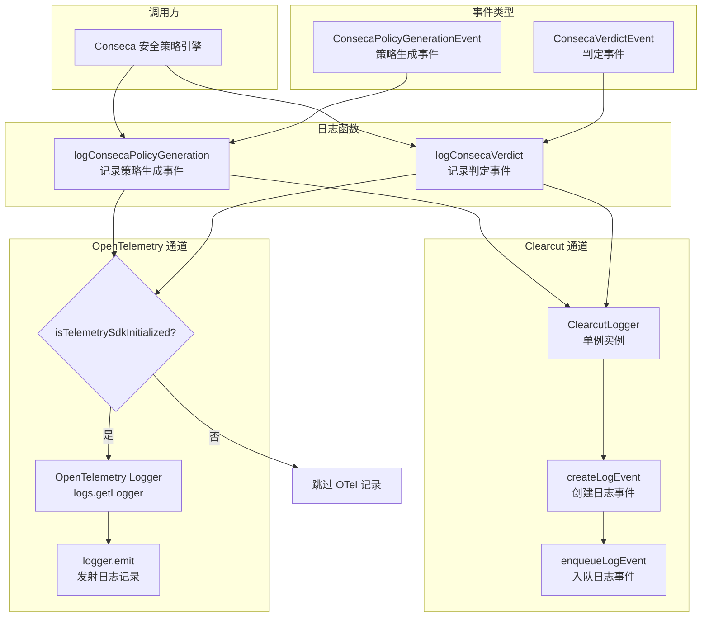

# conseca-logger.ts

## 概述

`conseca-logger.ts` 是 Gemini CLI 遥测系统中专门负责记录 Conseca（安全策略引擎）相关事件的日志模块。Conseca 是一个安全合规系统，负责在工具调用前生成安全策略并进行判定（允许/阻止）。该文件提供了两个核心日志记录函数：`logConsecaPolicyGeneration`（记录策略生成事件）和 `logConsecaVerdict`（记录判定事件）。

每个函数采用"双通道"日志记录策略：同时向 Google Clearcut 日志系统和 OpenTelemetry 标准日志系统发送事件数据，确保数据在两个遥测管道中均可用。

## 架构图（Mermaid）

## 核心组件

### 1. `logConsecaPolicyGeneration(config: Config, event: ConsecaPolicyGenerationEvent): void`

记录 Conseca 安全策略生成事件。在安全策略引擎根据用户提示和可信内容生成安全策略时被调用。

**执行流程**：

1. **调试日志**：通过 `debugLogger.debug()` 输出调试信息
2. **Clearcut 日志记录**：
   - 获取 `ClearcutLogger` 单例实例
   - 构建数据数组，包含以下元数据键值对：
     - `CONSECA_USER_PROMPT`：用户提示（JSON 序列化）
     - `CONSECA_TRUSTED_CONTENT`：可信内容（JSON 序列化）
     - `CONSECA_GENERATED_POLICY`：生成的策略内容（JSON 序列化）
     - `CONSECA_ERROR`：错误信息（仅在出错时添加）
   - 通过 `createLogEvent` 创建 `CONSECA_POLICY_GENERATION` 类型的日志事件
   - 通过 `enqueueLogEvent` 将事件入队发送
3. **OpenTelemetry 日志记录**：
   - 检查 OpenTelemetry SDK 是否已初始化
   - 若已初始化，获取以 `SERVICE_NAME` 命名的 logger
   - 构建 `LogRecord`，其中 `body` 来自 `event.toLogBody()`，`attributes` 来自 `event.toOpenTelemetryAttributes(config)`
   - 调用 `logger.emit()` 发射日志记录

### 2. `logConsecaVerdict(config: Config, event: ConsecaVerdictEvent): void`

记录 Conseca 安全判定事件。在安全策略引擎对工具调用进行允许/阻止判定时被调用。

**执行流程**：

1. **调试日志**：通过 `debugLogger.debug()` 输出调试信息
2. **Clearcut 日志记录**：
   - 获取 `ClearcutLogger` 单例实例
   - 构建数据数组，包含以下元数据键值对：
     - `CONSECA_USER_PROMPT`：用户提示（JSON 序列化）
     - `CONSECA_GENERATED_POLICY`：生成的策略内容（JSON 序列化）
     - `GEMINI_CLI_TOOL_CALL_NAME`：工具调用名称（JSON 序列化）
     - `CONSECA_VERDICT_RESULT`：判定结果，如 ALLOW/BLOCK（JSON 序列化）
     - `CONSECA_VERDICT_RATIONALE`：判定理由（原始字符串）
     - `CONSECA_ERROR`：错误信息（仅在出错时添加）
   - 通过 `createLogEvent` 创建 `CONSECA_VERDICT` 类型的日志事件
   - 通过 `enqueueLogEvent` 将事件入队发送
3. **OpenTelemetry 日志记录**：与策略生成事件处理方式相同

## 依赖关系

### 内部依赖

| 依赖模块 | 导入内容 | 用途 |
|----------|----------|------|
| `../config/config.js` | `Config`（类型） | 应用配置类型，传递给 ClearcutLogger 和 OTel 属性生成 |
| `./constants.js` | `SERVICE_NAME` | OpenTelemetry 服务名称常量 |
| `./sdk.js` | `isTelemetrySdkInitialized` | 检查 OpenTelemetry SDK 是否已初始化 |
| `./clearcut-logger/clearcut-logger.js` | `ClearcutLogger`, `EventNames` | Clearcut 日志记录器类和事件名称枚举 |
| `./clearcut-logger/event-metadata-key.js` | `EventMetadataKey` | 事件元数据键枚举 |
| `../utils/safeJsonStringify.js` | `safeJsonStringify` | 安全的 JSON 序列化工具（防止循环引用等错误） |
| `./types.js` | `ConsecaPolicyGenerationEvent`, `ConsecaVerdictEvent`（类型） | Conseca 事件类型定义 |
| `../utils/debugLogger.js` | `debugLogger` | 调试日志工具 |

### 外部依赖

| 依赖包 | 导入内容 | 用途 |
|--------|----------|------|
| `@opentelemetry/api-logs` | `logs`, `LogRecord`（类型） | OpenTelemetry 日志 API，用于获取 logger 实例和定义日志记录结构 |

## 关键实现细节

1. **双通道日志策略**：两个函数都采用了相同的双通道日志记录模式——先尝试 Clearcut 日志记录，再尝试 OpenTelemetry 日志记录。这两个通道是独立的：即使 Clearcut 不可用（`getInstance` 返回 null），OpenTelemetry 日志仍会尝试发送；反之亦然。

2. **独立的守卫检查**：Clearcut 通道通过 `ClearcutLogger.getInstance(config)` 的非空检查作为守卫；OpenTelemetry 通道通过 `isTelemetrySdkInitialized()` 作为守卫。两者的初始化状态可能不同，因此分别检查。

3. **安全的 JSON 序列化**：大部分事件数据（用户提示、可信内容、策略、工具调用、判定结果）都通过 `safeJsonStringify` 进行序列化，而非直接使用 `JSON.stringify`。这可以防止因循环引用或其他异常对象结构导致的序列化错误，增强了日志记录的健壮性。

4. **可选错误字段**：两个函数都会检查 `event.error` 是否存在，仅在有错误时才将错误信息添加到数据数组中。错误值直接使用原始字符串，不经过 JSON 序列化。

5. **事件对象的多态方法**：OpenTelemetry 日志记录依赖事件对象自身的 `toLogBody()` 和 `toOpenTelemetryAttributes(config)` 方法。这意味着 `ConsecaPolicyGenerationEvent` 和 `ConsecaVerdictEvent` 是具有明确接口契约的类（而非简单的数据传输对象），负责将自身转换为 OpenTelemetry 兼容的格式。

6. **Clearcut 与 OpenTelemetry 的数据格式差异**：Clearcut 通道使用扁平的键值对数组（`{ gemini_cli_key, value }`）格式，每个键是 `EventMetadataKey` 枚举值；OpenTelemetry 通道则使用结构化的 `LogRecord`，包含 `body` 和 `attributes`。两种格式由不同的序列化路径生成。

7. **判定事件的工具调用复用**：在 `logConsecaVerdict` 中，工具调用名称使用了 `EventMetadataKey.GEMINI_CLI_TOOL_CALL_NAME`（而非 Conseca 专有键），体现了与通用工具调用事件键的复用设计。

8. **无返回值设计**：两个函数都返回 `void`，日志记录是"发射后遗忘"（fire-and-forget）模式。Clearcut 使用异步队列（`enqueueLogEvent`），OpenTelemetry 使用 `emit` 方法，都不会阻塞调用方。
