# constants.ts

## 概述

`constants.ts` 是 Gemini CLI 遥测系统的常量定义文件。它定义了三类关键常量：

1. **服务标识常量**：用于在 OpenTelemetry 系统中标识 Gemini CLI 服务
2. **语义约定常量**：遵循 OpenTelemetry GenAI 语义约定（Semantic Conventions）的属性名称常量
3. **操作类型枚举**：Gemini CLI 特有的操作类型分类

这些常量在整个遥测系统中被广泛引用，确保了属性命名的一致性和与 OpenTelemetry 标准的兼容性。

## 架构图（Mermaid）

```mermaid
graph TD
    subgraph 服务标识
        SN[SERVICE_NAME<br/>'gemini-cli']
        SD[SERVICE_DESCRIPTION<br/>Gemini CLI 服务描述]
    end

    subgraph GenAI 语义约定属性
        direction LR
        subgraph 操作与代理
            OP[GEN_AI_OPERATION_NAME<br/>'gen_ai.operation.name']
            AN[GEN_AI_AGENT_NAME<br/>'gen_ai.agent.name']
            AD[GEN_AI_AGENT_DESCRIPTION<br/>'gen_ai.agent.description']
        end
        subgraph 输入输出
            IM[GEN_AI_INPUT_MESSAGES<br/>'gen_ai.input.messages']
            OM[GEN_AI_OUTPUT_MESSAGES<br/>'gen_ai.output.messages']
        end
        subgraph 模型
            RM[GEN_AI_REQUEST_MODEL<br/>'gen_ai.request.model']
            RSM[GEN_AI_RESPONSE_MODEL<br/>'gen_ai.response.model']
        end
        subgraph 工具
            TN[GEN_AI_TOOL_NAME<br/>'gen_ai.tool.name']
            TCI[GEN_AI_TOOL_CALL_ID<br/>'gen_ai.tool.call_id']
            TDE[GEN_AI_TOOL_DESCRIPTION<br/>'gen_ai.tool.description']
            TD[GEN_AI_TOOL_DEFINITIONS<br/>'gen_ai.tool.definitions']
        end
        subgraph Token 使用量
            UIT[GEN_AI_USAGE_INPUT_TOKENS<br/>'gen_ai.usage.input_tokens']
            UOT[GEN_AI_USAGE_OUTPUT_TOKENS<br/>'gen_ai.usage.output_tokens']
        end
        subgraph 其他
            PN[GEN_AI_PROMPT_NAME<br/>'gen_ai.prompt.name']
            SI[GEN_AI_SYSTEM_INSTRUCTIONS<br/>'gen_ai.system_instructions']
            CI[GEN_AI_CONVERSATION_ID<br/>'gen_ai.conversation.id']
        end
    end

    subgraph GeminiCliOperation 枚举
        TC[ToolCall<br/>'tool_call']
        LC[LLMCall<br/>'llm_call']
        UP[UserPrompt<br/>'user_prompt']
        SP[SystemPrompt<br/>'system_prompt']
        AC[AgentCall<br/>'agent_call']
        STC[ScheduleToolCalls<br/>'schedule_tool_calls']
    end

    subgraph 使用方
        OTL[OpenTelemetry Spans/Logs<br/>遥测数据记录]
        CL[Clearcut Logger<br/>Clearcut 日志]
        CLL[conseca-logger.ts<br/>Conseca 日志]
        OTHER[其他遥测模块]
    end

    SN --> OTL
    SN --> CLL
    OP --> OTL
    TC --> OTL
    LC --> OTL
```

## 核心组件

### 1. 服务标识常量

| 常量名 | 值 | 说明 |
|--------|-----|------|
| `SERVICE_NAME` | `'gemini-cli'` | OpenTelemetry 服务名称标识符，用于在遥测后端中区分不同服务的数据 |
| `SERVICE_DESCRIPTION` | `'Gemini CLI is an open-source AI agent...'` | 服务的人类可读描述，包含产品定位和目标用户群（开发者、工程师、SRE 等） |

### 2. GenAI 语义约定属性常量

这些常量遵循 [OpenTelemetry GenAI 语义约定](https://opentelemetry.io/docs/specs/semconv/registry/attributes/gen-ai/#genai-attributes) 规范，使用 `gen_ai.*` 命名空间。

#### 操作与代理相关
| 常量名 | 值 | 说明 |
|--------|-----|------|
| `GEN_AI_OPERATION_NAME` | `'gen_ai.operation.name'` | 生成式 AI 操作名称（如 tool_call、llm_call） |
| `GEN_AI_AGENT_NAME` | `'gen_ai.agent.name'` | AI 代理名称 |
| `GEN_AI_AGENT_DESCRIPTION` | `'gen_ai.agent.description'` | AI 代理描述 |

#### 输入/输出消息相关
| 常量名 | 值 | 说明 |
|--------|-----|------|
| `GEN_AI_INPUT_MESSAGES` | `'gen_ai.input.messages'` | 输入消息内容 |
| `GEN_AI_OUTPUT_MESSAGES` | `'gen_ai.output.messages'` | 输出消息内容 |

#### 模型相关
| 常量名 | 值 | 说明 |
|--------|-----|------|
| `GEN_AI_REQUEST_MODEL` | `'gen_ai.request.model'` | 请求时指定的模型标识符 |
| `GEN_AI_RESPONSE_MODEL` | `'gen_ai.response.model'` | 实际响应的模型标识符（可能与请求模型不同） |

#### 工具相关
| 常量名 | 值 | 说明 |
|--------|-----|------|
| `GEN_AI_TOOL_NAME` | `'gen_ai.tool.name'` | 工具名称 |
| `GEN_AI_TOOL_CALL_ID` | `'gen_ai.tool.call_id'` | 工具调用唯一标识符 |
| `GEN_AI_TOOL_DESCRIPTION` | `'gen_ai.tool.description'` | 工具描述 |
| `GEN_AI_TOOL_DEFINITIONS` | `'gen_ai.tool.definitions'` | 工具定义（如函数签名） |

#### Token 使用量相关
| 常量名 | 值 | 说明 |
|--------|-----|------|
| `GEN_AI_USAGE_INPUT_TOKENS` | `'gen_ai.usage.input_tokens'` | 输入 token 数量 |
| `GEN_AI_USAGE_OUTPUT_TOKENS` | `'gen_ai.usage.output_tokens'` | 输出 token 数量 |

#### 其他
| 常量名 | 值 | 说明 |
|--------|-----|------|
| `GEN_AI_PROMPT_NAME` | `'gen_ai.prompt.name'` | 提示名称 |
| `GEN_AI_SYSTEM_INSTRUCTIONS` | `'gen_ai.system_instructions'` | 系统指令内容 |
| `GEN_AI_CONVERSATION_ID` | `'gen_ai.conversation.id'` | 会话唯一标识符 |

### 3. GeminiCliOperation 枚举

定义了 Gemini CLI 特有的操作类型，用于标识不同类型的遥测 Span。

| 枚举成员 | 值 | 说明 |
|----------|-----|------|
| `ToolCall` | `'tool_call'` | 工具调用操作，如文件读写、代码执行等 |
| `LLMCall` | `'llm_call'` | 大语言模型调用操作，即向 Gemini API 发送请求 |
| `UserPrompt` | `'user_prompt'` | 用户提示操作，表示用户输入了一段提示 |
| `SystemPrompt` | `'system_prompt'` | 系统提示操作，表示系统指令的处理 |
| `AgentCall` | `'agent_call'` | 代理调用操作，表示子代理的执行 |
| `ScheduleToolCalls` | `'schedule_tool_calls'` | 调度工具调用操作，表示批量工具调用的编排 |

## 依赖关系

### 内部依赖

无。此文件是一个纯常量定义文件，不依赖项目中的其他模块。

### 外部依赖

无。此文件不依赖任何第三方包。所有常量值都是简单的字符串字面量或字符串枚举。

## 关键实现细节

1. **遵循 OpenTelemetry GenAI 语义约定**：文件中注释明确引用了 OpenTelemetry 语义约定的官方文档链接（`https://opentelemetry.io/docs/specs/semconv/registry/attributes/gen-ai/`）。所有 `GEN_AI_*` 常量严格遵循该规范的属性命名，确保 Gemini CLI 的遥测数据可以被任何兼容 OpenTelemetry 的后端正确解析和展示。

2. **常量化字符串避免拼写错误**：将属性名称字符串提取为导出常量，避免在代码各处直接使用魔法字符串。这样做有两个好处：一是 TypeScript 编译器可以在引用时提供自动补全和类型检查；二是如果属性名称需要更改，只需修改一处。

3. **字符串枚举 vs 数字枚举**：`GeminiCliOperation` 使用字符串枚举（如 `'tool_call'`）而非数字枚举。这是因为操作名称需要在遥测数据中以人类可读的形式展示，字符串值使得日志和追踪数据更易于理解和调试。

4. **服务描述的营销定位**：`SERVICE_DESCRIPTION` 不仅是技术描述，还包含了产品定位信息（"open-source AI agent"、"terminal-first, extensible, and powerful"），这些信息会出现在遥测后端的服务目录中。

5. **请求模型 vs 响应模型的区分**：分别定义了 `GEN_AI_REQUEST_MODEL` 和 `GEN_AI_RESPONSE_MODEL` 两个常量。这是因为在模型路由场景下，用户请求的模型（如 "gemini-pro"）和实际响应的模型（可能被路由到不同版本）可能不同，这种区分对于分析模型路由行为至关重要。

6. **工具相关属性的丰富性**：定义了四个工具相关常量（name、call_id、description、definitions），反映了 Gemini CLI 以工具调用为核心的架构特征。`GEN_AI_TOOL_DEFINITIONS` 用于记录完整的工具定义，这对于调试工具调用行为和分析工具使用模式很有价值。

7. **操作类型的全面覆盖**：`GeminiCliOperation` 枚举覆盖了 Gemini CLI 的所有核心操作类型，从用户交互（UserPrompt）到 AI 推理（LLMCall）、工具执行（ToolCall）、代理编排（AgentCall）和批量调度（ScheduleToolCalls），形成了完整的可观测性操作分类体系。
