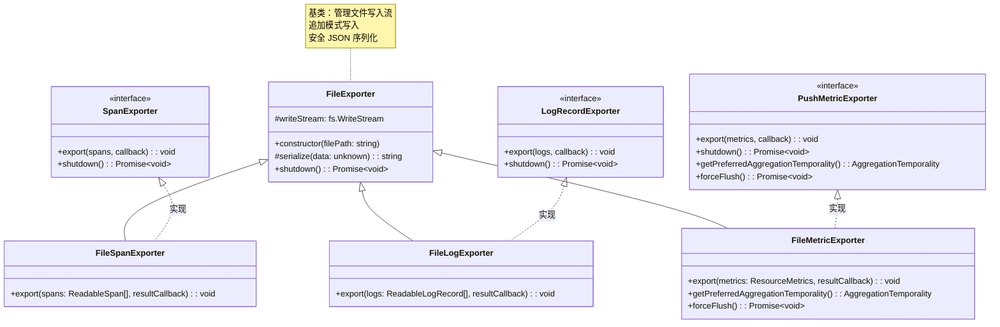
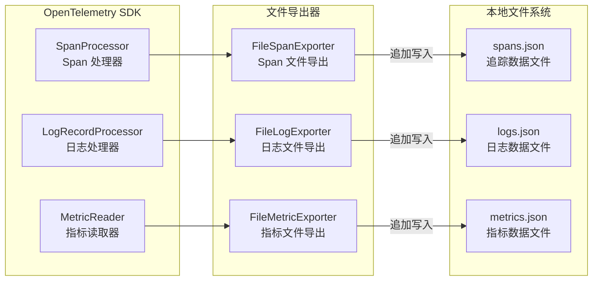

# file-exporters.ts

## 概述

`file-exporters.ts` 实现了三个基于文件的 OpenTelemetry 数据导出器（Exporter），分别用于将 Span（追踪）、Log（日志）和 Metric（指标）数据以 JSON 格式写入本地文件。这些导出器是 OpenTelemetry SDK 标准导出器接口的自定义实现，主要用于本地开发调试、离线分析或将遥测数据持久化到文件系统。

所有三个导出器继承自一个共享的 `FileExporter` 基类，该基类封装了文件写入流的管理和 JSON 序列化逻辑。

## 架构图（Mermaid）





## 核心组件

### 1. `FileExporter`（基类，非导出）

所有文件导出器的共享基类，封装了文件写入流管理和序列化逻辑。

**属性**：
- `writeStream: fs.WriteStream`（protected）：Node.js 文件写入流实例

**方法**：

| 方法 | 访问级别 | 说明 |
|------|---------|------|
| `constructor(filePath: string)` | public | 创建文件写入流，使用追加模式（`flags: 'a'`）打开指定路径的文件。如果文件不存在则自动创建，如果已存在则追加写入 |
| `serialize(data: unknown): string` | protected | 使用 `safeJsonStringify` 将数据转换为格式化的 JSON 字符串（缩进 2 空格），末尾附加换行符 `\n` |
| `shutdown(): Promise<void>` | public | 优雅关闭写入流，返回 Promise，在流完全关闭后 resolve |

### 2. `FileSpanExporter`（追踪 Span 导出器）

实现 OpenTelemetry `SpanExporter` 接口，将追踪 Span 数据导出到文件。

```typescript
export class FileSpanExporter extends FileExporter implements SpanExporter
```

**方法**：

| 方法 | 说明 |
|------|------|
| `export(spans: ReadableSpan[], resultCallback: (result: ExportResult) => void): void` | 将一批 Span 序列化后写入文件。每个 Span 单独序列化为 JSON 并拼接。写入完成后通过 `resultCallback` 回调报告成功或失败 |

**处理流程**：
1. 遍历 `spans` 数组，将每个 `ReadableSpan` 对象序列化为 JSON 字符串
2. 将所有序列化结果拼接为单个字符串
3. 通过 `writeStream.write()` 写入文件
4. 在写入回调中，根据是否有错误调用 `resultCallback`，返回 `SUCCESS` 或 `FAILED`

### 3. `FileLogExporter`（日志导出器）

实现 OpenTelemetry `LogRecordExporter` 接口，将日志记录导出到文件。

```typescript
export class FileLogExporter extends FileExporter implements LogRecordExporter
```

**方法**：

| 方法 | 说明 |
|------|------|
| `export(logs: ReadableLogRecord[], resultCallback: (result: ExportResult) => void): void` | 将一批日志记录序列化后写入文件。处理流程与 `FileSpanExporter` 完全一致 |

### 4. `FileMetricExporter`（指标导出器）

实现 OpenTelemetry `PushMetricExporter` 接口，将指标数据导出到文件。

```typescript
export class FileMetricExporter extends FileExporter implements PushMetricExporter
```

**方法**：

| 方法 | 说明 |
|------|------|
| `export(metrics: ResourceMetrics, resultCallback: (result: ExportResult) => void): void` | 将 `ResourceMetrics` 对象序列化后写入文件。与 Span/Log 导出器不同，指标数据是单个对象而非数组 |
| `getPreferredAggregationTemporality(): AggregationTemporality` | 返回 `AggregationTemporality.CUMULATIVE`（累积聚合时间性），表示每次导出的指标值是从开始到当前的累积值 |
| `forceFlush(): Promise<void>` | 立即返回已 resolve 的 Promise（空操作）。因为 `writeStream.write` 已经会将数据刷入操作系统缓冲区 |

## 依赖关系

### 内部依赖

| 依赖模块 | 导入内容 | 用途 |
|----------|----------|------|
| `../utils/safeJsonStringify.js` | `safeJsonStringify` | 安全的 JSON 序列化工具，防止因循环引用等导致序列化失败 |

### 外部依赖

| 依赖包 | 导入内容 | 用途 |
|--------|----------|------|
| `node:fs` | `*`（整个模块） | Node.js 文件系统模块，用于创建 `WriteStream` |
| `@opentelemetry/core` | `ExportResultCode`, `ExportResult`（类型） | OpenTelemetry 核心模块，提供导出结果状态码和类型定义 |
| `@opentelemetry/sdk-trace-base` | `ReadableSpan`（类型）, `SpanExporter`（类型） | OpenTelemetry 追踪 SDK，提供 Span 导出器接口和可读 Span 类型 |
| `@opentelemetry/sdk-logs` | `ReadableLogRecord`（类型）, `LogRecordExporter`（类型） | OpenTelemetry 日志 SDK，提供日志导出器接口和可读日志记录类型 |
| `@opentelemetry/sdk-metrics` | `AggregationTemporality`, `ResourceMetrics`（类型）, `PushMetricExporter`（类型） | OpenTelemetry 指标 SDK，提供指标导出器接口、聚合时间性枚举和资源指标类型 |

## 关键实现细节

1. **追加模式写入**：所有导出器通过 `fs.createWriteStream(filePath, { flags: 'a' })` 以追加模式打开文件。这意味着多次导出的数据会被追加到同一文件末尾，而不会覆盖已有数据。这对于长时间运行的 CLI 会话非常重要，因为遥测数据是分批次导出的。

2. **基类继承模式**：三个导出器通过继承 `FileExporter` 基类共享了文件流管理和序列化逻辑，避免了代码重复。基类的 `serialize` 方法是 `protected` 的，允许子类调用但不暴露给外部。基类本身没有被 `export` 导出，只是内部复用。

3. **安全 JSON 序列化**：使用 `safeJsonStringify` 而非原生 `JSON.stringify`。OpenTelemetry 的 `ReadableSpan`、`ReadableLogRecord` 等对象可能包含循环引用或不可序列化的属性（如 `SpanContext` 中的某些字段），`safeJsonStringify` 可以优雅地处理这些情况。

4. **格式化 JSON 输出**：`serialize` 方法使用 2 空格缩进（`safeJsonStringify(data, 2)`），这使得输出文件对人类来说是易读的，方便开发者直接查看和调试遥测数据。

5. **异步写入与回调模式**：`export` 方法采用回调模式而非 Promise 模式，这与 OpenTelemetry SDK 导出器接口的设计一致。`writeStream.write()` 本身是异步的，在写入完成后通过回调函数通知调用方结果。

6. **Span/Log 的批量处理 vs Metric 的单对象处理**：`FileSpanExporter` 和 `FileLogExporter` 接收数组参数（`spans[]` / `logs[]`），需要遍历并逐个序列化后拼接；而 `FileMetricExporter` 接收单个 `ResourceMetrics` 对象，直接序列化。这反映了 OpenTelemetry 中追踪/日志和指标的不同导出模型。

7. **累积聚合时间性**：`FileMetricExporter.getPreferredAggregationTemporality()` 返回 `CUMULATIVE`，这意味着每次导出的指标值都是从测量开始以来的累积值（而非 `DELTA` 模式下的增量值）。累积模式更适合文件导出场景，因为每条记录都包含完整的状态信息，不需要依赖前一条记录。

8. **`forceFlush` 的空操作实现**：`FileMetricExporter.forceFlush()` 是空操作，因为 Node.js 的 `WriteStream` 已经在调用 `write()` 时将数据传递给操作系统内核缓冲区。真正的磁盘刷新由操作系统负责。如果需要确保数据落盘，可能需要使用 `fsync`，但在遥测场景中通常不需要这种级别的保证。

9. **优雅关闭**：`shutdown()` 方法通过 `writeStream.end()` 优雅地关闭写入流，确保所有缓冲的数据都被写入文件后再完成关闭。这在进程退出时尤为重要，防止遥测数据丢失。

10. **错误处理策略**：导出方法在写入失败时不会抛出异常，而是通过 `resultCallback` 返回 `ExportResultCode.FAILED` 和错误对象。这遵循了 OpenTelemetry 的设计原则——遥测系统的失败不应该影响主业务逻辑。
