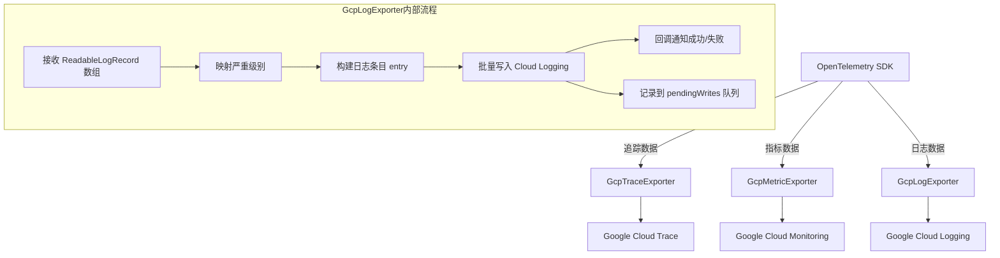

# gcp-exporters.ts

## 概述

`gcp-exporters.ts` 是 Gemini CLI 遥测系统的 **Google Cloud Platform 导出器模块**。该文件定义了三个导出器类，分别用于将 OpenTelemetry 标准的追踪（Trace）、指标（Metric）和日志（Log）数据导出到 Google Cloud 的对应服务中：

- **GcpTraceExporter** -- 导出到 Google Cloud Trace
- **GcpMetricExporter** -- 导出到 Google Cloud Monitoring
- **GcpLogExporter** -- 导出到 Google Cloud Logging

这三个类是对 Google Cloud 官方 OpenTelemetry 导出器的封装与定制化，统一了项目 ID 和凭证的传递方式，并为 Gemini CLI 项目设置了专有的前缀和日志名称。

## 架构图（Mermaid）

```mermaid
classDiagram
    class TraceExporter {
        <<来自 @google-cloud/opentelemetry-cloud-trace-exporter>>
    }
    class MetricExporter {
        <<来自 @google-cloud/opentelemetry-cloud-monitoring-exporter>>
    }
    class LogRecordExporter {
        <<OpenTelemetry 接口>>
        +export(logs, resultCallback)
        +forceFlush()
        +shutdown()
    }

    class GcpTraceExporter {
        +constructor(projectId?, credentials?)
    }
    class GcpMetricExporter {
        +constructor(projectId?, credentials?)
    }
    class GcpLogExporter {
        -logging: Logging
        -log: Log
        -pendingWrites: Promise[]
        +constructor(projectId?, credentials?)
        +export(logs, resultCallback)
        +forceFlush()
        +shutdown()
        -mapSeverityToCloudLogging(severityNumber?)
    }

    GcpTraceExporter --|> TraceExporter : 继承
    GcpMetricExporter --|> MetricExporter : 继承
    GcpLogExporter ..|> LogRecordExporter : 实现

    GcpLogExporter --> Logging : 使用
    GcpLogExporter --> Log : 使用
```

## 核心组件

### 1. GcpTraceExporter 类

继承自 `@google-cloud/opentelemetry-cloud-trace-exporter` 的 `TraceExporter`。

**构造函数参数：**
| 参数 | 类型 | 必填 | 说明 |
|------|------|------|------|
| `projectId` | `string` | 否 | GCP 项目 ID |
| `credentials` | `JWTInput` | 否 | GCP JWT 认证凭证 |

**关键配置：**
- `resourceFilter: /^gcp\./` -- 使用正则过滤器，只保留以 `gcp.` 开头的资源属性，避免将不相关的资源属性发送到 Cloud Trace。

---

### 2. GcpMetricExporter 类

继承自 `@google-cloud/opentelemetry-cloud-monitoring-exporter` 的 `MetricExporter`。

**构造函数参数：**
| 参数 | 类型 | 必填 | 说明 |
|------|------|------|------|
| `projectId` | `string` | 否 | GCP 项目 ID |
| `credentials` | `JWTInput` | 否 | GCP JWT 认证凭证 |

**关键配置：**
- `prefix: 'custom.googleapis.com/gemini_cli'` -- 所有自定义指标都使用此前缀，在 Cloud Monitoring 中可通过 `custom.googleapis.com/gemini_cli/*` 路径查询 Gemini CLI 的指标数据。

---

### 3. GcpLogExporter 类

实现了 OpenTelemetry 的 `LogRecordExporter` 接口，是一个完全自定义的日志导出器。

**私有属性：**
| 属性 | 类型 | 说明 |
|------|------|------|
| `logging` | `Logging` | Google Cloud Logging 客户端实例 |
| `log` | `Log` | 日志对象，日志名称为 `gemini_cli` |
| `pendingWrites` | `Promise<void>[]` | 待完成的写入 Promise 队列，用于 flush 和 shutdown |

**核心方法：**

#### `export(logs, resultCallback)`
将 OpenTelemetry 的 `ReadableLogRecord` 数组转换为 Cloud Logging 条目并写入。

处理流程：
1. 遍历每条日志记录，调用 `this.log.entry()` 构建 Cloud Logging 条目
2. 元数据包括：严重级别（经映射转换）、时间戳、资源类型（`global`）、项目 ID
3. 日志负载合并了 `log.attributes`、`log.resource?.attributes` 和 `log.body`（作为 `message` 字段）
4. 调用 `this.log.write(entries)` 批量写入
5. 写入成功则回调 `ExportResultCode.SUCCESS`，失败则回调 `ExportResultCode.FAILED`
6. 写入 Promise 被推入 `pendingWrites` 数组，完成后自动移除

#### `forceFlush()`
等待所有 `pendingWrites` 中的 Promise 完成，确保所有日志都已写入。

#### `shutdown()`
先调用 `forceFlush()` 等待所有写入完成，然后清空 `pendingWrites` 数组。

#### `mapSeverityToCloudLogging(severityNumber?)`
将 OpenTelemetry 的严重级别数字映射到 Cloud Logging 的严重级别字符串。

映射规则（基于 [OpenTelemetry 日志数据模型规范](https://opentelemetry.io/docs/specs/otel/logs/data-model/#field-severitynumber)）：

| OpenTelemetry severityNumber | Cloud Logging 级别 |
|------------------------------|---------------------|
| >= 21 | `CRITICAL` |
| >= 17 | `ERROR` |
| >= 13 | `WARNING` |
| >= 9 | `INFO` |
| >= 5 | `DEBUG` |
| < 5 或 undefined | `DEFAULT` |

## 依赖关系

### 内部依赖

无直接内部依赖。本文件是一个基础设施模块，被上层遥测初始化模块引用。

### 外部依赖

| 依赖包 | 导入内容 | 用途 |
|--------|----------|------|
| `google-auth-library` | `JWTInput`（类型） | GCP JWT 认证凭证类型定义 |
| `@google-cloud/opentelemetry-cloud-trace-exporter` | `TraceExporter` | 追踪数据导出基类 |
| `@google-cloud/opentelemetry-cloud-monitoring-exporter` | `MetricExporter` | 指标数据导出基类 |
| `@google-cloud/logging` | `Logging`, `Log` | Cloud Logging 客户端及日志对象 |
| `@opentelemetry/core` | `hrTimeToMilliseconds`, `ExportResultCode`, `ExportResult` | OTel 核心工具函数和类型 |
| `@opentelemetry/sdk-logs` | `ReadableLogRecord`, `LogRecordExporter`（类型） | OTel 日志 SDK 接口定义 |

## 关键实现细节

1. **继承 vs 实现模式**：`GcpTraceExporter` 和 `GcpMetricExporter` 通过继承官方导出器类来复用逻辑，只需在构造函数中传递定制配置。而 `GcpLogExporter` 由于官方没有提供对应的 OpenTelemetry 日志导出器，因此手动实现了 `LogRecordExporter` 接口。

2. **异步写入管理**：`GcpLogExporter` 通过 `pendingWrites` 数组追踪所有正在进行的写入操作。每次写入完成后，对应的 Promise 会从数组中自动移除（`finally` 回调中的 `splice` 操作）。这保证了 `forceFlush()` 和 `shutdown()` 能正确等待所有未完成的写入。

3. **资源类型固定为 `global`**：日志条目的资源类型被硬编码为 `global`，这是因为 Gemini CLI 作为命令行工具运行在用户本地环境中，不对应任何特定的 GCP 资源类型（如 GCE 实例或 GKE Pod）。

4. **日志属性合并策略**：日志负载将 `log.attributes`（日志级别属性）、`log.resource?.attributes`（资源级别属性）和 `log.body`（日志正文）合并到同一个对象中，其中 `body` 被映射为 `message` 字段。使用展开运算符时，后出现的属性会覆盖先出现的同名属性。

5. **时间戳转换**：使用 `hrTimeToMilliseconds` 将 OpenTelemetry 的高精度时间 (`HrTime`，即 `[seconds, nanoseconds]` 元组) 转换为毫秒级时间戳，再构建 `Date` 对象传递给 Cloud Logging。

6. **指标前缀约定**：`GcpMetricExporter` 使用 `custom.googleapis.com/gemini_cli` 作为前缀，这是 Google Cloud Monitoring 自定义指标的标准命名空间，确保 Gemini CLI 的指标不会与其他服务冲突。

7. **追踪资源过滤**：`GcpTraceExporter` 使用 `resourceFilter: /^gcp\./` 正则表达式，只将以 `gcp.` 开头的资源属性发送到 Cloud Trace，减少无关数据传输。
