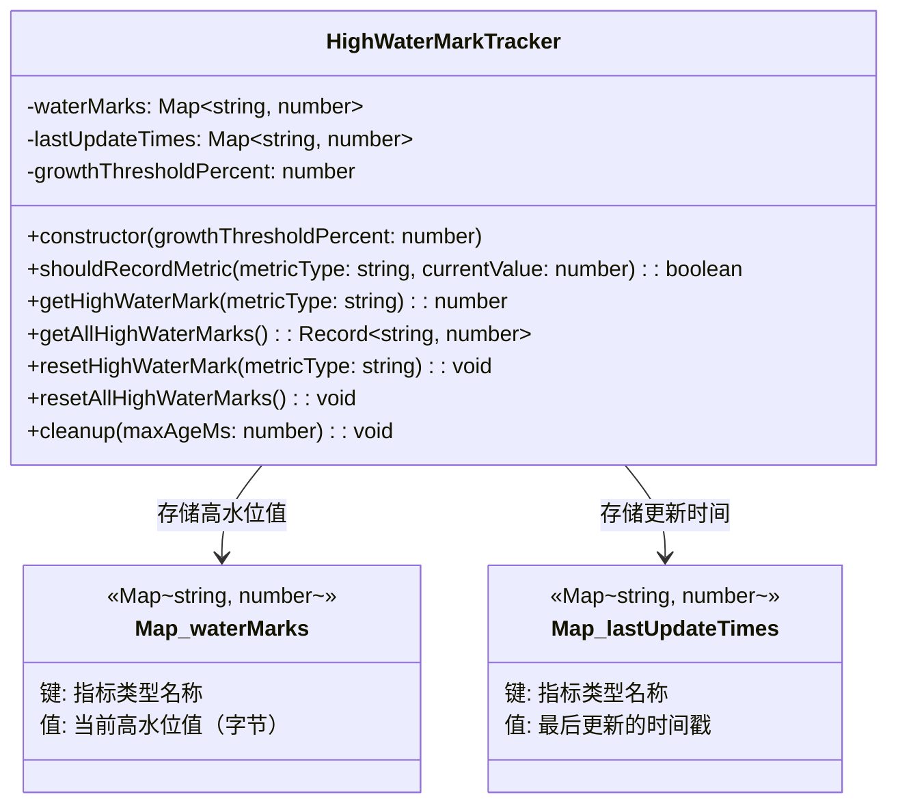
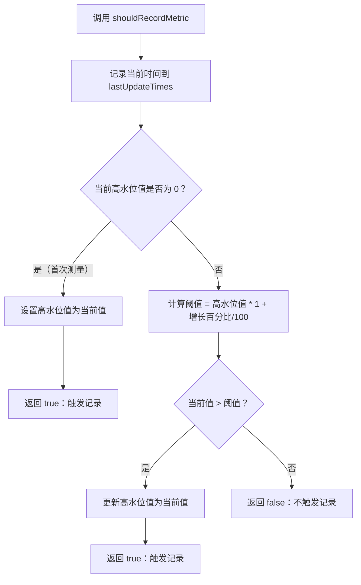
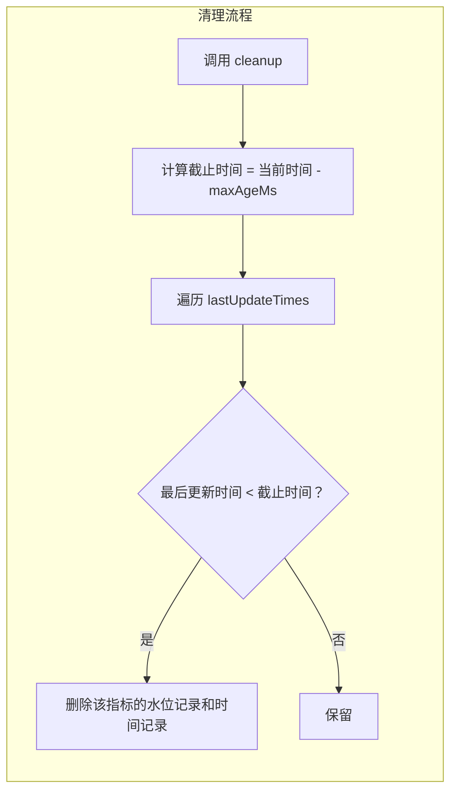

# high-water-mark-tracker.ts

## 概述

`high-water-mark-tracker.ts` 实现了一个 **高水位线追踪器**（High Water Mark Tracker），用于监控内存指标的峰值变化。其核心思想是：不是每次内存变化都记录，而是只在内存使用量相对于上一次记录值增长超过一定百分比阈值时才触发记录。这种机制能够有效减少遥测数据量，同时保留关键的内存增长趋势信息。

该类是一个通用的指标追踪工具，支持同时追踪多种指标类型（如 `heap_used`、`rss` 等），每种指标独立维护各自的高水位线。

## 架构图（Mermaid）







## 核心组件

### HighWaterMarkTracker 类

#### 私有属性

| 属性 | 类型 | 说明 |
|------|------|------|
| `waterMarks` | `Map<string, number>` | 存储每种指标类型对应的当前高水位值（单位通常为字节） |
| `lastUpdateTimes` | `Map<string, number>` | 存储每种指标类型最后一次被更新/访问的时间戳（`Date.now()` 毫秒） |
| `growthThresholdPercent` | `number`（只读） | 增长阈值百分比，默认值为 5，即内存增长超过当前高水位的 5% 时才触发记录 |

#### 构造函数

```typescript
constructor(growthThresholdPercent: number = 5)
```

- 默认增长阈值为 **5%**
- 如果传入负数会抛出 `Error('growthThresholdPercent must be non-negative.')`
- 允许传入 `0`，表示任何增长都触发记录

#### 核心方法

##### `shouldRecordMetric(metricType: string, currentValue: number): boolean`

决策方法，判断当前值是否应该被记录。

**逻辑：**
1. 无论是否触发记录，都会更新 `lastUpdateTimes` 中该指标的时间戳
2. 如果是该指标的首次测量（高水位值为 0），直接记录并返回 `true`
3. 否则，计算阈值：`currentWaterMark * (1 + growthThresholdPercent / 100)`
4. 如果当前值超过阈值，更新高水位值并返回 `true`
5. 否则返回 `false`

**示例：** 假设 `growthThresholdPercent = 5`，当前高水位为 100MB：
- 当前值 = 104MB --> `104 < 100 * 1.05 = 105` --> 不记录
- 当前值 = 106MB --> `106 > 105` --> 记录，高水位更新为 106MB

##### `getHighWaterMark(metricType: string): number`

获取指定指标类型的当前高水位值，不存在则返回 0。

##### `getAllHighWaterMarks(): Record<string, number>`

将所有高水位数据以普通对象形式返回（通过 `Object.fromEntries` 转换 Map）。

##### `resetHighWaterMark(metricType: string): void`

重置指定指标类型的高水位值和最后更新时间。同时从两个 Map 中删除对应条目。

##### `resetAllHighWaterMarks(): void`

清除所有指标的高水位值和更新时间，调用两个 Map 的 `clear()` 方法。

##### `cleanup(maxAgeMs: number = 3600000): void`

清理过期条目以避免内存无限增长。默认清理 **1 小时**（3600000 毫秒）内未更新的条目。

**逻辑：**
1. 计算截止时间 `cutoffTime = Date.now() - maxAgeMs`
2. 遍历 `lastUpdateTimes`，如果某条目的最后更新时间早于截止时间，则同时从 `lastUpdateTimes` 和 `waterMarks` 中删除

## 依赖关系

### 内部依赖

无。该类是完全独立的工具类，不依赖项目中其他模块。

### 外部依赖

无。该类仅使用 JavaScript/TypeScript 标准库（`Map`、`Date.now()`、`Object.fromEntries`）。

## 关键实现细节

1. **阈值机制的设计意图**：在高频遥测场景中，内存指标可能每隔几秒就采集一次。如果每次都记录，会产生大量无价值的数据。通过设置 5% 的增长阈值，系统只在内存有显著增长时才记录，大幅降低了数据量，同时不会遗漏重要的内存增长事件。

2. **只追踪增长，不追踪下降**：该追踪器是"高水位线"模式，只关心值是否创了新高。如果内存使用从 200MB 降到 100MB 再涨到 150MB，第二次 150MB 不会被记录，因为它没有超过高水位线 200MB 的 105%（即 210MB）。这符合"高水位线"的语义——追踪历史最大值。

3. **首次测量始终记录**：当某指标类型的高水位值为 0（即尚未记录过）时，无论当前值是多少都会触发记录。这确保了每种指标类型至少有一个初始数据点。

4. **过期清理机制**：`cleanup()` 方法用于防止 `waterMarks` 和 `lastUpdateTimes` 无限增长。如果指标类型名称是动态生成的（例如包含时间戳或会话 ID），不清理会导致内存泄漏。默认 1 小时过期时间适合大多数 CLI 会话的生命周期。

5. **lastUpdateTimes 的双重更新**：在 `shouldRecordMetric` 中，`lastUpdateTimes` 会在方法开始时无条件更新一次（第 32 行），在触发记录时再更新一次（第 39 或 50 行）。开头的无条件更新确保了 `cleanup()` 不会错误地删除仍在被活跃查询的指标。

6. **线程安全性**：由于 JavaScript 是单线程的，该类不需要考虑并发问题。Map 的操作都是同步的，不会出现竞态条件。

7. **参数校验**：构造函数对 `growthThresholdPercent` 做了非负校验，但 `shouldRecordMetric` 的 `currentValue` 没有校验。如果传入负数或 0 作为 `currentValue`，不会抛错但行为可能不符合预期（永远不会超过阈值）。
