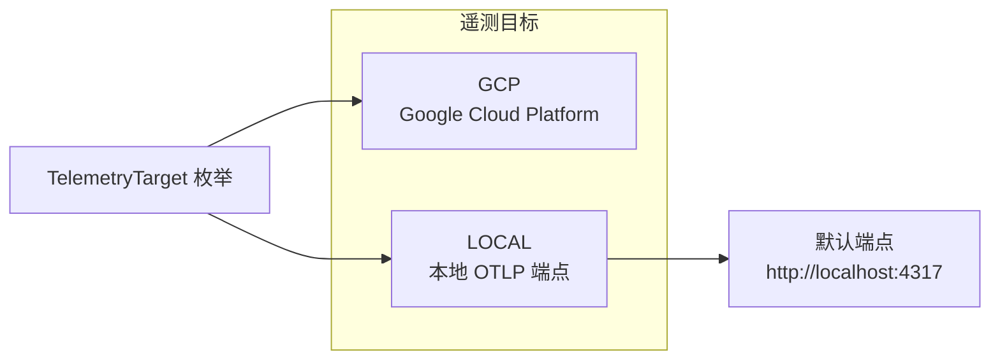

# index.ts

## 概述

`index.ts` 是 Gemini CLI 遥测（Telemetry）子系统的 **入口模块**（barrel file）。它不包含任何业务逻辑实现，而是作为统一的导出聚合器，将遥测子系统内部各个模块的公共 API 集中导出，供项目其他部分引用。

通过这个入口文件，外部模块只需要 `import { ... } from './telemetry'` 即可访问遥测系统的所有功能，无需关心内部模块的组织结构。

该文件还定义了两个枚举/常量：`TelemetryTarget` 枚举和默认配置值。

## 架构图（Mermaid）

```mermaid
flowchart TD
    A["index.ts<br/>（遥测入口模块）"]

    subgraph 核心初始化
        B["sdk.ts<br/>SDK 初始化与生命周期"]
        C["config.ts<br/>配置解析"]
    end

    subgraph 数据导出
        D["gcp-exporters.ts<br/>GCP 导出器"]
    end

    subgraph 日志记录
        E["loggers.ts<br/>业务日志记录器"]
        F["conseca-logger.ts<br/>Conseca 策略日志"]
    end

    subgraph 指标采集
        G["metrics.ts<br/>指标记录函数"]
        H["memory-monitor.ts<br/>内存监控"]
        I["high-water-mark-tracker.ts<br/>高水位追踪器"]
        J["rate-limiter.ts<br/>速率限制器"]
    end

    subgraph 活动监控
        K["activity-detector.ts<br/>用户活动检测"]
        L["activity-monitor.ts<br/>活动监控器"]
        M["activity-types.ts<br/>活动类型定义"]
    end

    subgraph 追踪与性能
        N["trace.ts<br/>追踪 Span 工具"]
        O["startupProfiler.ts<br/>启动性能分析器"]
    end

    subgraph 类型与常量
        P["types.ts<br/>事件类型定义"]
        Q["llmRole.ts<br/>LLM 角色枚举"]
        R["constants.ts<br/>常量定义"]
    end

    subgraph UI与计费
        S["uiTelemetry.ts<br/>UI 遥测"]
        T["billingEvents.ts<br/>计费事件"]
    end

    A --> B
    A --> C
    A --> D
    A --> E
    A --> F
    A --> G
    A --> H
    A --> I
    A --> J
    A --> K
    A --> L
    A --> M
    A --> N
    A --> O
    A --> P
    A --> Q
    A --> R
    A --> S
    A --> T
```

## 核心组件

### 1. TelemetryTarget 枚举

定义遥测数据的目标发送位置：

| 枚举值 | 字符串值 | 说明 |
|--------|----------|------|
| `GCP` | `'gcp'` | 将遥测数据发送到 Google Cloud Platform（Trace、Monitoring、Logging） |
| `LOCAL` | `'local'` | 将遥测数据发送到本地 OTLP 端点（用于开发和调试） |

### 2. 默认配置常量

| 常量 | 值 | 说明 |
|------|-----|------|
| `DEFAULT_TELEMETRY_TARGET` | `TelemetryTarget.LOCAL` | 默认遥测目标为本地 |
| `DEFAULT_OTLP_ENDPOINT` | `'http://localhost:4317'` | 默认 OTLP（OpenTelemetry Protocol）端点地址，使用 gRPC 标准端口 4317 |

### 3. 导出模块分类总览

以下是该入口文件从各子模块导出的所有内容，按功能领域分类：

#### 3.1 SDK 生命周期管理（从 `sdk.ts`）

| 导出项 | 类型 | 说明 |
|--------|------|------|
| `initializeTelemetry` | 函数 | 初始化遥测 SDK |
| `shutdownTelemetry` | 函数 | 关闭遥测 SDK |
| `flushTelemetry` | 函数 | 刷新遥测缓冲区 |
| `isTelemetrySdkInitialized` | 函数 | 检查 SDK 是否已初始化 |

#### 3.2 配置解析（从 `config.ts`）

| 导出项 | 类型 | 说明 |
|--------|------|------|
| `resolveTelemetrySettings` | 函数 | 解析遥测配置 |
| `parseBooleanEnvFlag` | 函数 | 解析布尔型环境变量 |
| `parseTelemetryTargetValue` | 函数 | 解析遥测目标值 |

#### 3.3 GCP 导出器（从 `gcp-exporters.ts`）

| 导出项 | 类型 | 说明 |
|--------|------|------|
| `GcpTraceExporter` | 类 | Google Cloud Trace 导出器 |
| `GcpMetricExporter` | 类 | Google Cloud Monitoring 导出器 |
| `GcpLogExporter` | 类 | Google Cloud Logging 导出器 |

#### 3.4 业务日志记录器（从 `loggers.ts`）

| 导出项 | 说明 |
|--------|------|
| `logCliConfiguration` | 记录 CLI 配置信息 |
| `logUserPrompt` | 记录用户提示词 |
| `logToolCall` | 记录工具调用 |
| `logApiRequest` | 记录 API 请求 |
| `logApiError` | 记录 API 错误 |
| `logApiResponse` | 记录 API 响应 |
| `logFlashFallback` | 记录 Flash 降级事件 |
| `logSlashCommand` | 记录斜杠命令 |
| `logConversationFinishedEvent` | 记录对话完成事件 |
| `logChatCompression` | 记录聊天压缩事件 |
| `logToolOutputTruncated` | 记录工具输出截断 |
| `logExtensionEnable` | 记录扩展启用 |
| `logExtensionInstallEvent` | 记录扩展安装事件 |
| `logExtensionUninstall` | 记录扩展卸载 |
| `logExtensionUpdateEvent` | 记录扩展更新事件 |
| `logWebFetchFallbackAttempt` | 记录 Web 获取降级尝试 |
| `logNetworkRetryAttempt` | 记录网络重试尝试 |
| `logRewind` | 记录回退操作 |
| `logOnboardingStart` | 记录引导流程开始 |
| `logOnboardingSuccess` | 记录引导流程成功 |

#### 3.5 Conseca 日志（从 `conseca-logger.ts`）

| 导出项 | 说明 |
|--------|------|
| `logConsecaPolicyGeneration` | 记录 Conseca 策略生成 |
| `logConsecaVerdict` | 记录 Conseca 裁定结果 |

#### 3.6 事件类型（从 `types.ts`）

**类型导出（type）：** `SlashCommandEvent`、`ChatCompressionEvent`、`TelemetryEvent`

**值导出：** `SlashCommandStatus`、`EndSessionEvent`、`UserPromptEvent`、`ApiRequestEvent`、`ApiErrorEvent`、`ApiResponseEvent`、`FlashFallbackEvent`、`StartSessionEvent`、`ToolCallEvent`、`ConversationFinishedEvent`、`ToolOutputTruncatedEvent`、`WebFetchFallbackAttemptEvent`、`NetworkRetryAttemptEvent`、`ToolCallDecision`、`RewindEvent`、`OnboardingStartEvent`、`OnboardingSuccessEvent`、`ConsecaPolicyGenerationEvent`、`ConsecaVerdictEvent`

**工厂函数：** `makeSlashCommandEvent`、`makeChatCompressionEvent`

#### 3.7 LLM 角色（从 `llmRole.ts`）

| 导出项 | 说明 |
|--------|------|
| `LlmRole` | LLM 角色枚举 |

#### 3.8 指标记录（从 `metrics.ts`）

大量指标记录函数，涵盖：
- **核心指标**：工具调用、Token 使用、API 响应、API 错误、文件操作、重试、模型路由等
- **自定义指标**：自定义 Token 使用和 API 响应指标
- **GenAI 语义约定指标**：`recordGenAiClientTokenUsage`、`recordGenAiClientOperationDuration`
- **性能监控**：启动性能、内存使用、CPU 使用、工具队列深度、渲染性能等
- **计费指标**：超额选项、购买点击
- **枚举类型**：`PerformanceMetricType`、`MemoryMetricType`、`ToolExecutionPhase`、`ApiRequestPhase`、`FileOperation`、`GenAiOperationName`、`GenAiProviderName`、`GenAiTokenType`

#### 3.9 内存监控（从 `memory-monitor.ts`）

| 导出项 | 说明 |
|--------|------|
| `MemoryMonitor` | 内存监控类 |
| `initializeMemoryMonitor` | 初始化内存监控 |
| `getMemoryMonitor` | 获取内存监控实例 |
| `recordCurrentMemoryUsage` | 记录当前内存使用 |
| `startGlobalMemoryMonitoring` | 启动全局内存监控 |
| `stopGlobalMemoryMonitoring` | 停止全局内存监控 |
| `MemorySnapshot`（类型） | 内存快照类型 |
| `ProcessMetrics`（类型） | 进程指标类型 |

#### 3.10 高水位追踪与速率限制（从 `high-water-mark-tracker.ts`、`rate-limiter.ts`）

| 导出项 | 说明 |
|--------|------|
| `HighWaterMarkTracker` | 高水位线追踪器 |
| `RateLimiter` | 速率限制器 |

#### 3.11 用户活动监控（从 `activity-detector.ts`、`activity-monitor.ts`、`activity-types.ts`）

| 导出项 | 说明 |
|--------|------|
| `ActivityType` | 活动类型枚举 |
| `ActivityDetector` | 活动检测器类 |
| `getActivityDetector` | 获取活动检测器实例 |
| `recordUserActivity` | 记录用户活动 |
| `isUserActive` | 检查用户是否活跃 |
| `ActivityMonitor` | 活动监控器类 |
| `initializeActivityMonitor` | 初始化活动监控 |
| `getActivityMonitor` | 获取活动监控实例 |
| `startGlobalActivityMonitoring` | 启动全局活动监控 |
| `stopGlobalActivityMonitoring` | 停止全局活动监控 |

#### 3.12 追踪与性能分析（从 `trace.ts`、`startupProfiler.ts`）

| 导出项 | 说明 |
|--------|------|
| `runInDevTraceSpan` | 在开发追踪 Span 中运行函数 |
| `SpanMetadata`（类型） | Span 元数据类型 |
| `startupProfiler` | 启动性能分析器实例 |
| `StartupProfiler` | 启动性能分析器类 |

#### 3.13 UI 遥测与计费事件（从 `uiTelemetry.ts`、`billingEvents.ts`）

通过 `export *` 导出所有内容。

#### 3.14 OpenTelemetry 重导出（从 `@opentelemetry/api`、`@opentelemetry/semantic-conventions`）

| 导出项 | 来源 | 说明 |
|--------|------|------|
| `SpanStatusCode` | `@opentelemetry/api` | Span 状态码枚举 |
| `ValueType` | `@opentelemetry/api` | 指标值类型枚举 |
| `SemanticAttributes` | `@opentelemetry/semantic-conventions` | 语义约定属性常量 |

#### 3.15 常量（从 `constants.ts`）

通过 `export *` 导出所有常量定义。

## 依赖关系

### 内部依赖

该文件汇聚了遥测子系统内部 **16 个子模块** 的导出：

| 子模块 | 文件 |
|--------|------|
| SDK 生命周期 | `./sdk.js` |
| 配置解析 | `./config.js` |
| GCP 导出器 | `./gcp-exporters.js` |
| 业务日志 | `./loggers.js` |
| Conseca 日志 | `./conseca-logger.js` |
| 类型定义 | `./types.js` |
| LLM 角色 | `./llmRole.js` |
| 指标记录 | `./metrics.js` |
| 内存监控 | `./memory-monitor.js` |
| 高水位追踪 | `./high-water-mark-tracker.js` |
| 速率限制 | `./rate-limiter.js` |
| 活动类型 | `./activity-types.js` |
| 活动检测 | `./activity-detector.js` |
| 活动监控 | `./activity-monitor.js` |
| 追踪工具 | `./trace.js` |
| 启动分析 | `./startupProfiler.js` |
| UI 遥测 | `./uiTelemetry.js` |
| 计费事件 | `./billingEvents.js` |
| 常量定义 | `./constants.js` |

### 外部依赖

| 依赖包 | 导入内容 | 用途 |
|--------|----------|------|
| `@opentelemetry/api` | `SpanStatusCode`, `ValueType` | 重导出 OpenTelemetry API 的核心类型 |
| `@opentelemetry/semantic-conventions` | `SemanticAttributes` | 重导出语义约定属性常量 |

## 关键实现细节

1. **Barrel 模式（桶文件）**：这是一个经典的 TypeScript barrel file，通过集中式导出简化了外部模块的引入路径。外部消费者只需 `import { ... } from '@gemini-cli/core/telemetry'` 而无需知道内部文件结构。

2. **默认目标为 LOCAL**：`DEFAULT_TELEMETRY_TARGET` 设置为 `TelemetryTarget.LOCAL`，表明在未显式配置的情况下，遥测数据发往本地 OTLP 端点而非 GCP，这是出于安全和隐私的考虑——开发阶段不应默认将数据发送到云端。

3. **OTLP 标准端口 4317**：默认端点使用 `http://localhost:4317`，这是 OpenTelemetry Collector 的标准 gRPC 接收端口。开发者可以在本地启动 OTLP Collector（如 Jaeger、Grafana Tempo）来接收和查看遥测数据。

4. **混合导出策略**：文件中使用了三种导出策略：
   - **具名导出** (`export { ... } from ...`)：明确控制哪些 API 暴露给外部
   - **通配符导出** (`export * from ...`)：用于 `uiTelemetry.ts`、`billingEvents.ts`、`constants.ts` 等内容完全公开的模块
   - **类型导出** (`export type { ... } from ...`)：仅导出类型信息，不会在运行时产生 JavaScript 代码

5. **外部依赖重导出**：将 `@opentelemetry/api` 的 `SpanStatusCode`、`ValueType` 和 `@opentelemetry/semantic-conventions` 的 `SemanticAttributes` 重导出，使得下游模块可以从遥测入口统一获取这些常用的 OpenTelemetry 类型，而不需要直接依赖这些第三方包。

6. **模块规模**：该入口文件汇聚了约 100+ 个导出项，覆盖了日志记录、指标采集、追踪、活动监控、内存监控、性能分析等多个遥测维度，反映出 Gemini CLI 遥测系统的全面性和复杂性。
