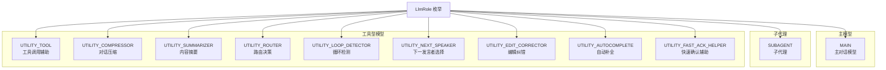
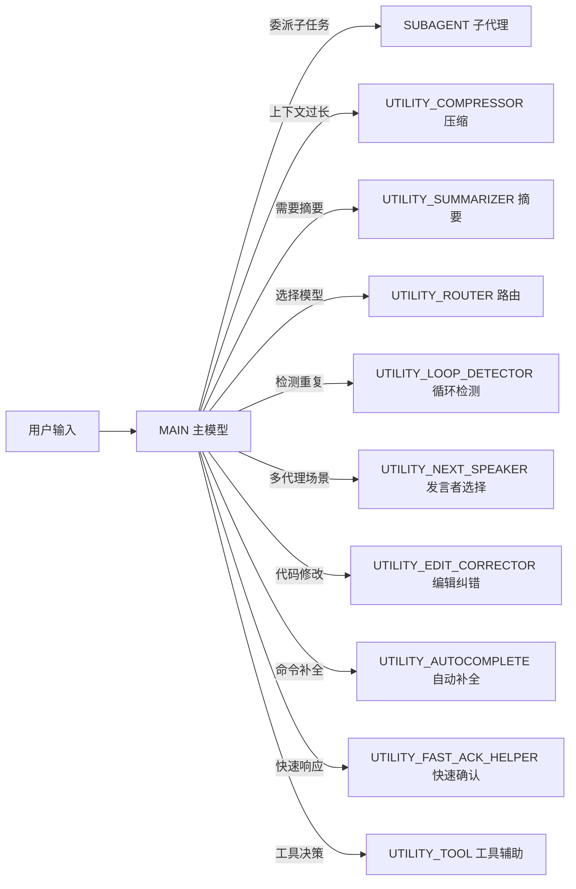

# llmRole.ts

## 概述

`llmRole.ts` 定义了 `LlmRole` 枚举，用于标识 Gemini CLI 系统中 **LLM（大语言模型）调用的角色类型**。在 Gemini CLI 的遥测系统中，不同的 LLM 调用具有不同的目的和上下文。该枚举为每一次 LLM 调用打上角色标签，使得遥测数据可以按角色维度进行分类、过滤和分析。

系统中的 LLM 角色分为三大类别：
- **主模型**：负责核心对话交互
- **子代理**：具备独立执行能力的子任务模型
- **工具型模型**：执行特定辅助功能的轻量级模型调用

## 架构图（Mermaid）

## 核心组件

### LlmRole 枚举

| 枚举成员 | 字符串值 | 类别 | 说明 |
|----------|----------|------|------|
| `MAIN` | `'main'` | 主模型 | 负责核心用户对话交互的主 LLM。这是 Gemini CLI 最主要的模型调用，处理用户提问并生成回复。 |
| `SUBAGENT` | `'subagent'` | 子代理 | 被主模型委派执行独立子任务的子代理 LLM。子代理拥有独立的上下文和工具访问权限，可以自主执行复杂操作。 |
| `UTILITY_TOOL` | `'utility_tool'` | 工具型 | 辅助工具调用决策的 LLM 调用。帮助主模型决定是否以及如何调用特定工具。 |
| `UTILITY_COMPRESSOR` | `'utility_compressor'` | 工具型 | 对话压缩器。当对话历史过长时，使用 LLM 将冗长的对话压缩为精简版本，以节省 Token 用量和上下文窗口空间。 |
| `UTILITY_SUMMARIZER` | `'utility_summarizer'` | 工具型 | 内容摘要生成器。用于对长文本、文件内容或工具输出进行摘要。 |
| `UTILITY_ROUTER` | `'utility_router'` | 工具型 | 模型路由器。在多模型系统中，使用 LLM 决定将请求路由到哪个模型（如选择使用 Flash 还是 Pro 模型）。 |
| `UTILITY_LOOP_DETECTOR` | `'utility_loop_detector'` | 工具型 | 循环检测器。检测模型是否陷入了重复的工具调用或思考循环，防止无限循环浪费资源。 |
| `UTILITY_NEXT_SPEAKER` | `'utility_next_speaker'` | 工具型 | 下一发言者选择器。在多代理协作场景中，决定下一步由哪个代理发言或执行操作。 |
| `UTILITY_EDIT_CORRECTOR` | `'utility_edit_corrector'` | 工具型 | 编辑纠错器。当主模型生成的代码编辑出现错误时（如格式不正确、应用失败），使用 LLM 尝试修正编辑。 |
| `UTILITY_AUTOCOMPLETE` | `'utility_autocomplete'` | 工具型 | 自动补全。为用户输入提供命令或内容的自动补全建议。 |
| `UTILITY_FAST_ACK_HELPER` | `'utility_fast_ack_helper'` | 工具型 | 快速确认辅助。在需要快速响应用户时（如工具执行前的确认），使用轻量级 LLM 调用生成快速反馈。 |

## 依赖关系

### 内部依赖

无。该文件是纯枚举定义，不依赖任何内部模块。

### 外部依赖

无。该文件仅使用 TypeScript 标准语法。

## 关键实现细节

1. **字符串枚举的选择**：所有枚举值都使用小写蛇形命名的字符串（如 `'main'`、`'utility_tool'`），而非数字。这使得遥测日志和指标中的角色标签具有良好的可读性，在 Cloud Logging 或 Monitoring 仪表板中可以直接辨识。

2. **UTILITY_ 前缀约定**：所有工具型模型角色统一使用 `UTILITY_` 前缀，这是一种命名约定，有助于在遥测数据中快速区分主要 LLM 调用和辅助 LLM 调用。可以通过前缀过滤来聚合分析所有工具型调用的 Token 消耗和延迟。

3. **遥测维度标签**：该枚举在遥测系统中主要用作指标和日志的维度标签（dimension/label）。例如，API 请求指标可以按 `LlmRole` 分组，分析不同角色的调用频率、Token 消耗和响应延迟分布。

4. **架构反映**：枚举成员的设计揭示了 Gemini CLI 的多层 LLM 架构：
   - 第一层：`MAIN`（用户直接交互的主模型）
   - 第二层：`SUBAGENT`（可独立运行的子代理）
   - 第三层：多种 `UTILITY_*`（为主模型或子代理提供辅助功能的微调用）

5. **资源消耗分析**：通过这些角色标签，运营团队可以分析出哪类辅助调用消耗了最多的 Token（如压缩器和摘要器通常输入 Token 量较大），从而优化模型使用策略（如为不同角色选择不同规格的模型）。

6. **可扩展性**：枚举设计易于扩展。随着 Gemini CLI 功能的增加，可以方便地新增更多 `UTILITY_*` 角色，而不影响现有遥测数据的兼容性（因为使用字符串值而非数字索引）。
