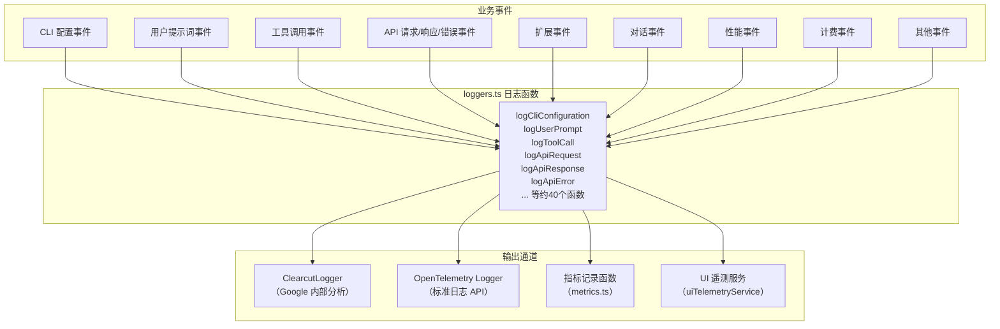
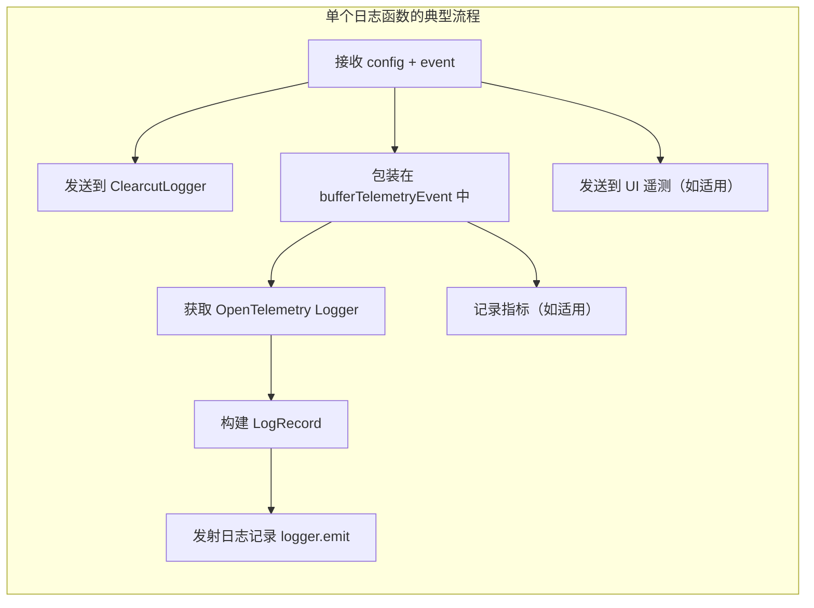
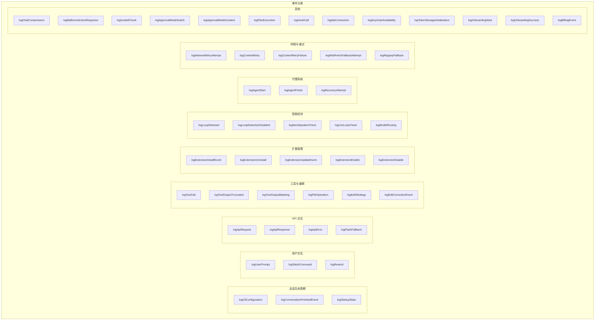

# loggers.ts

## 概述

`loggers.ts` 是 Gemini CLI 遥测系统的 **业务日志记录器集合**。该文件定义了约 40 个导出函数，每个函数对应一种特定的业务事件类型，负责将该事件以多种渠道同时记录。

这些日志函数遵循统一的 **三通道记录模式**：
1. **ClearcutLogger** -- Google 内部的日志分析系统（Clearcut）
2. **OpenTelemetry Logger** -- 标准 OpenTelemetry 日志 API，最终导出到 GCP 或本地 OTLP
3. **指标记录（可选）** -- 部分事件还会同步记录对应的 OpenTelemetry 指标

此外，某些关键事件还会发送到 **UI 遥测服务**（uiTelemetryService），用于前端/IDE 集成场景的数据展示。

该文件是遥测系统中最"业务密集"的模块，涵盖了 Gemini CLI 几乎所有可观测事件的记录逻辑。

## 架构图（Mermaid）







## 核心组件

### 日志函数清单

以下按功能类别列出所有导出的日志函数，并标注其特殊行为。

#### 会话生命周期事件

| 函数名 | 事件类型 | 异步 | UI 遥测 | 记录指标 | 特殊说明 |
|--------|----------|------|---------|----------|----------|
| `logCliConfiguration` | `StartSessionEvent` | 否 | 否 | 否 | 等待实验配置加载后再发射日志，以捕获 experimentIds |
| `logConversationFinishedEvent` | `ConversationFinishedEvent` | 否 | 否 | 否 | |
| `logStartupStats` | `StartupStatsEvent` | 否 | 否 | 否 | 同样等待实验配置加载 |

#### 用户交互事件

| 函数名 | 事件类型 | 异步 | UI 遥测 | 记录指标 | 特殊说明 |
|--------|----------|------|---------|----------|----------|
| `logUserPrompt` | `UserPromptEvent` | 否 | 否 | 否 | |
| `logSlashCommand` | `SlashCommandEvent` | 否 | 否 | 否 | |
| `logRewind` | `RewindEvent` | 否 | 是 | 否 | 发送 EVENT_REWIND 到 UI 遥测 |

#### API 交互事件

| 函数名 | 事件类型 | 异步 | UI 遥测 | 记录指标 | 特殊说明 |
|--------|----------|------|---------|----------|----------|
| `logApiRequest` | `ApiRequestEvent` | 否 | 否 | 否 | 发射两条日志：标准 + 语义约定 |
| `logApiResponse` | `ApiResponseEvent` | 否 | 是 | 是 | 记录 API 响应指标 + 5 种 Token 使用指标 |
| `logApiError` | `ApiErrorEvent` | 否 | 是 | 是 | 记录 API 错误指标 + API 响应指标（含 error.type） |
| `logFlashFallback` | `FlashFallbackEvent` | 否 | 否 | 否 | |

#### 工具与编辑事件

| 函数名 | 事件类型 | 异步 | UI 遥测 | 记录指标 | 特殊说明 |
|--------|----------|------|---------|----------|----------|
| `logToolCall` | `ToolCallEvent` | 否 | 是 | 是 | 记录工具调用指标 + 代码行数变化指标 |
| `logToolOutputTruncated` | `ToolOutputTruncatedEvent` | 否 | 否 | 否 | |
| `logToolOutputMasking` | `ToolOutputMaskingEvent` | 否 | 否 | 否 | |
| `logFileOperation` | `FileOperationEvent` | 否 | 否 | 是 | 记录文件操作指标 |
| `logEditStrategy` | `EditStrategyEvent` | 否 | 否 | 否 | |
| `logEditCorrectionEvent` | `EditCorrectionEvent` | 否 | 否 | 否 | |

#### 扩展管理事件

| 函数名 | 事件类型 | 异步 | UI 遥测 | 记录指标 | 特殊说明 |
|--------|----------|------|---------|----------|----------|
| `logExtensionInstallEvent` | `ExtensionInstallEvent` | **是** | 否 | 否 | `await` Clearcut 调用 |
| `logExtensionUninstall` | `ExtensionUninstallEvent` | **是** | 否 | 否 | `await` Clearcut 调用 |
| `logExtensionUpdateEvent` | `ExtensionUpdateEvent` | **是** | 否 | 否 | `await` Clearcut 调用 |
| `logExtensionEnable` | `ExtensionEnableEvent` | **是** | 否 | 否 | `await` Clearcut 调用 |
| `logExtensionDisable` | `ExtensionDisableEvent` | **是** | 否 | 否 | `await` Clearcut 调用 |

#### 智能检测事件

| 函数名 | 事件类型 | 异步 | UI 遥测 | 记录指标 | 特殊说明 |
|--------|----------|------|---------|----------|----------|
| `logLoopDetected` | `LoopDetectedEvent` | 否 | 否 | 否 | |
| `logLoopDetectionDisabled` | `LoopDetectionDisabledEvent` | 否 | 否 | 否 | |
| `logNextSpeakerCheck` | `NextSpeakerCheckEvent` | 否 | 否 | 否 | |
| `logLlmLoopCheck` | `LlmLoopCheckEvent` | 否 | 否 | 否 | |
| `logModelRouting` | `ModelRoutingEvent` | 否 | 否 | 是 | 记录模型路由指标 |
| `logModelSlashCommand` | `ModelSlashCommandEvent` | 否 | 否 | 是 | 记录模型斜杠命令指标 |

#### 代理系统事件

| 函数名 | 事件类型 | 异步 | UI 遥测 | 记录指标 | 特殊说明 |
|--------|----------|------|---------|----------|----------|
| `logAgentStart` | `AgentStartEvent` | 否 | 否 | 否 | |
| `logAgentFinish` | `AgentFinishEvent` | 否 | 否 | 是 | 记录代理运行指标 |
| `logRecoveryAttempt` | `RecoveryAttemptEvent` | 否 | 否 | 是 | 记录恢复尝试指标 |

#### 网络与重试事件

| 函数名 | 事件类型 | 异步 | UI 遥测 | 记录指标 | 特殊说明 |
|--------|----------|------|---------|----------|----------|
| `logNetworkRetryAttempt` | `NetworkRetryAttemptEvent` | 否 | 否 | 是 | 记录重试指标 |
| `logContentRetry` | `ContentRetryEvent` | 否 | 否 | 是 | 记录内容重试计数 |
| `logContentRetryFailure` | `ContentRetryFailureEvent` | 否 | 否 | 是 | 记录内容重试失败计数 |
| `logWebFetchFallbackAttempt` | `WebFetchFallbackAttemptEvent` | 否 | 否 | 否 | |
| `logRipgrepFallback` | `RipgrepFallbackEvent` | 否 | 否 | 否 | |

#### 其他事件

| 函数名 | 事件类型 | 异步 | UI 遥测 | 记录指标 | 特殊说明 |
|--------|----------|------|---------|----------|----------|
| `logChatCompression` | `ChatCompressionEvent` | 否 | 否 | 是 | **不使用 bufferTelemetryEvent**，直接发射 |
| `logMalformedJsonResponse` | `MalformedJsonResponseEvent` | 否 | 否 | 否 | |
| `logInvalidChunk` | `InvalidChunkEvent` | 否 | 否 | 是 | 记录无效 chunk 计数 |
| `logApprovalModeSwitch` | `ApprovalModeSwitchEvent` | 否 | 否 | 否 | |
| `logApprovalModeDuration` | `ApprovalModeDurationEvent` | 否 | 否 | 否 | |
| `logPlanExecution` | `PlanExecutionEvent` | 否 | 否 | 是 | 记录计划执行指标 |
| `logHookCall` | `HookCallEvent` | 否 | 否 | 是 | 记录钩子调用指标 |
| `logIdeConnection` | `IdeConnectionEvent` | 否 | 否 | 否 | |
| `logKeychainAvailability` | `KeychainAvailabilityEvent` | 否 | 否 | 是 | 记录密钥链可用性 |
| `logTokenStorageInitialization` | `TokenStorageInitializationEvent` | 否 | 否 | 是 | 记录 Token 存储初始化 |
| `logOnboardingStart` | `OnboardingStartEvent` | 否 | 否 | 是 | 记录引导开始计数 |
| `logOnboardingSuccess` | `OnboardingSuccessEvent` | 否 | 否 | 是 | 记录引导成功（含用户层级和耗时） |
| `logBillingEvent` | `BillingTelemetryEvent` | 否 | 否 | 否 | 根据事件具体类型调用不同 Clearcut 方法 |

### 关键函数深入分析

#### logApiResponse -- 最复杂的日志函数

```typescript
export function logApiResponse(config: Config, event: ApiResponseEvent): void
```

该函数是所有日志函数中逻辑最复杂的，因为它除了标准日志记录外，还需要：

1. **发送到 UI 遥测服务**：将事件加上 `event.name` 和 `event.timestamp` 后发送
2. **发射两条 OTel 日志**：标准日志记录 (`toLogRecord`) 和语义约定日志 (`toSemanticLogRecord`)
3. **记录 API 响应指标**：包含模型名、状态码和 GenAI 语义约定属性
4. **记录 5 种 Token 使用指标**：分别为 `input`、`output`、`cache`、`thought`、`tool`

#### logToolCall -- 含代码行数统计

```typescript
export function logToolCall(config: Config, event: ToolCallEvent): void
```

除标准记录外，还会：
1. 记录工具调用指标（耗时、函数名、成功状态、决策类型、工具类型）
2. 如果 `event.metadata` 中包含 `model_added_lines`（正数），则记录代码新增行数
3. 如果 `event.metadata` 中包含 `model_removed_lines`（正数），则记录代码删除行数

#### logBillingEvent -- 多态分发

```typescript
export function logBillingEvent(config: Config, event: BillingTelemetryEvent): void
```

该函数使用 `instanceof` 检查来将计费事件分发到对应的 Clearcut 方法：
- `CreditsUsedEvent` --> `cc.logCreditsUsedEvent()`
- `OverageOptionSelectedEvent` --> `cc.logOverageOptionSelectedEvent()`
- `EmptyWalletMenuShownEvent` --> `cc.logEmptyWalletMenuShownEvent()`
- `CreditPurchaseClickEvent` --> `cc.logCreditPurchaseClickEvent()`

## 依赖关系

### 内部依赖

| 模块 | 导入内容 | 用途 |
|------|----------|------|
| `../config/config.js` | `Config`（类型） | 配置对象，传递给每个日志函数 |
| `./constants.js` | `SERVICE_NAME` | OpenTelemetry Logger 的服务名称 |
| `./types.js` | 约 40 种事件类型 + 事件名常量 | 各种遥测事件的类型定义 |
| `./metrics.js` | 约 20 个指标记录函数 | 用于记录 OpenTelemetry 指标 |
| `./sdk.js` | `bufferTelemetryEvent` | 遥测事件缓冲，确保 SDK 初始化后再发射 |
| `./uiTelemetry.js` | `uiTelemetryService`, `UiEvent` | UI 遥测服务，供前端/IDE 消费 |
| `./clearcut-logger/clearcut-logger.js` | `ClearcutLogger` | Google Clearcut 日志系统客户端 |
| `../utils/debugLogger.js` | `debugLogger` | 调试日志工具 |
| `./billingEvents.js` | `BillingTelemetryEvent` 及其子类 | 计费相关事件类型 |

### 外部依赖

| 依赖包 | 导入内容 | 用途 |
|--------|----------|------|
| `@opentelemetry/api-logs` | `logs`, `LogRecord`（类型） | OpenTelemetry 日志 API，获取 Logger 实例和构建日志记录 |

## 关键实现细节

1. **三通道记录模式**：几乎所有日志函数都遵循相同的模式：
   - 第一步：调用 `ClearcutLogger.getInstance(config)?.logXxxEvent(event)` 发送到 Clearcut
   - 第二步：在 `bufferTelemetryEvent(() => { ... })` 回调中发射 OpenTelemetry 日志和指标
   - 可选：某些事件还会发送到 `uiTelemetryService`

2. **bufferTelemetryEvent 的作用**：该函数将遥测事件的发射操作放入缓冲区。这是因为 OpenTelemetry SDK 可能尚未初始化完成，通过缓冲机制可以确保在 SDK 就绪后才发射日志，避免丢失早期事件。

3. **ClearcutLogger 的可选链调用**：使用 `ClearcutLogger.getInstance(config)?.logXxxEvent(event)` 的可选链 (`?.`)，说明 ClearcutLogger 可能不存在（例如在非 Google 环境中），此时 Clearcut 日志会被静默跳过。

4. **事件对象的协议方法**：所有事件对象都实现了两个关键方法：
   - `toLogBody()` -- 返回日志正文
   - `toOpenTelemetryAttributes(config)` -- 返回 OpenTelemetry 属性对象
   - 部分事件（如 `ApiRequestEvent`、`ApiResponseEvent`、`ApiErrorEvent`）还有 `toLogRecord(config)` 和 `toSemanticLogRecord(config)` 方法

5. **扩展事件的异步处理**：5 个扩展管理函数（install、uninstall、update、enable、disable）是 `async` 函数，使用 `await` 等待 Clearcut 调用完成。这可能是因为扩展操作需要确保日志成功发送后才能继续流程（例如在卸载扩展前确保日志已记录）。

6. **logChatCompression 的特殊性**：这是唯一不使用 `bufferTelemetryEvent` 的函数（除 `logBillingEvent` 外）。它直接调用 `logger.emit(logRecord)` 发射日志，这意味着如果 SDK 尚未初始化，该日志可能会丢失。这可能是因为聊天压缩总是发生在对话进行中，此时 SDK 肯定已经初始化完成。

7. **UI 遥测事件的构造**：发送到 `uiTelemetryService` 的事件需要额外添加 `event.name`（事件常量名）和 `event.timestamp`（ISO 时间戳）两个字段。这些事件供前端 UI 或 IDE 插件实时展示。

8. **Token 使用的 5 维记录**：`logApiResponse` 将 Token 使用分为 5 个维度记录：
   - `input` -- 输入 Token
   - `output` -- 输出 Token
   - `cache` -- 缓存内容 Token
   - `thought` -- 思考过程 Token（如 Chain-of-Thought）
   - `tool` -- 工具相关 Token

9. **实验配置等待机制**：`logCliConfiguration` 和 `logStartupStats` 两个函数在发射日志前会先等待 `config.getExperimentsAsync()` 完成。这确保了日志中包含当前激活的实验 ID，对于 A/B 测试分析至关重要。等待失败时会使用 `debugLogger.error` 记录错误但不会抛出异常。

10. **logBillingEvent 的多态分发**：该函数使用 `instanceof` 检查来区分不同的计费事件子类，这是唯一使用运行时类型检查的日志函数。其他函数都是通过静态类型（函数签名中的事件类型参数）来区分事件类型的。

11. **双日志记录**：`logApiRequest`、`logApiResponse`、`logApiError` 三个函数都会发射两条 OpenTelemetry 日志：
    - `event.toLogRecord(config)` -- 自定义格式的日志记录
    - `event.toSemanticLogRecord(config)` -- 符合 OpenTelemetry GenAI 语义约定的日志记录

    这种双记录确保了与 OTel 生态系统工具的兼容性，同时保留了 Gemini CLI 特有的详细信息。
