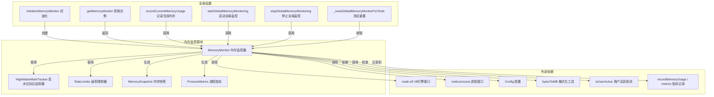

# memory-monitor.ts

## 概述

`memory-monitor.ts` 是 Gemini CLI 核心遥测系统中的**内存监控模块**。它提供了一个功能完备的 `MemoryMonitor` 类，用于持续监控 Node.js 进程的内存使用情况（堆内存、RSS、外部内存、ArrayBuffers 等），并通过**高水位标记追踪器（HighWaterMarkTracker）**和**速率限制器（RateLimiter）**来智能地决定何时记录内存指标，避免产生过多的遥测数据。

该模块采用**单例模式**对外暴露全局内存监控实例，并提供了一系列便捷的模块级函数供外部调用。

## 架构图（Mermaid）



## 核心组件

### 1. `MemorySnapshot` 接口

内存快照数据结构，包含某一时刻的完整内存状态：

| 字段 | 类型 | 说明 |
|------|------|------|
| `timestamp` | `number` | 快照时间戳 |
| `heapUsed` | `number` | 已使用的堆内存（字节） |
| `heapTotal` | `number` | 堆内存总量（字节） |
| `external` | `number` | V8 外部内存（C++ 对象绑定的内存） |
| `rss` | `number` | 常驻内存集大小（Resident Set Size） |
| `arrayBuffers` | `number` | ArrayBuffer 和 SharedArrayBuffer 占用的内存 |
| `heapSizeLimit` | `number` | V8 堆大小限制 |

### 2. `ProcessMetrics` 接口

进程级别的综合指标：

| 字段 | 类型 | 说明 |
|------|------|------|
| `cpuUsage` | `NodeJS.CpuUsage` | CPU 使用情况（用户态和系统态时间） |
| `memoryUsage` | `NodeJS.MemoryUsage` | 完整的内存使用信息 |
| `uptime` | `number` | 进程运行时长（秒） |

### 3. `MemoryMonitor` 类

核心监控类，提供以下关键功能：

#### 私有属性

| 属性 | 类型 | 默认值 | 说明 |
|------|------|--------|------|
| `intervalId` | `NodeJS.Timeout \| null` | `null` | 定时器 ID |
| `isRunning` | `boolean` | `false` | 监控是否运行中 |
| `lastSnapshot` | `MemorySnapshot \| null` | `null` | 上一次内存快照 |
| `monitoringInterval` | `number` | `10000` | 监控间隔（毫秒） |
| `highWaterMarkTracker` | `HighWaterMarkTracker` | 5% 阈值 | 高水位标记追踪器 |
| `rateLimiter` | `RateLimiter` | 60000ms | 速率限制器 |
| `useEnhancedMonitoring` | `boolean` | `true` | 是否使用增强型监控 |
| `lastCleanupTimestamp` | `number` | `Date.now()` | 上次清理时间戳 |

#### 静态常量

| 常量 | 值 | 说明 |
|------|----|------|
| `STATE_CLEANUP_INTERVAL_MS` | `15 * 60 * 1000` (15分钟) | 状态清理间隔 |
| `STATE_CLEANUP_MAX_AGE_MS` | `60 * 60 * 1000` (1小时) | 状态最大存活时间 |

#### 公共方法

| 方法 | 参数 | 返回值 | 说明 |
|------|------|--------|------|
| `start(config, intervalMs?)` | Config, number | `void` | 启动持续监控，默认 10 秒间隔 |
| `stop(config?)` | Config? | `void` | 停止监控，可选地记录最终快照 |
| `takeSnapshot(context, config)` | string, Config | `MemorySnapshot` | 获取快照并记录指标 |
| `getCurrentMemoryUsage()` | - | `MemorySnapshot` | 获取当前内存使用（不记录指标） |
| `getMemoryGrowth()` | - | `Partial<MemorySnapshot> \| null` | 获取自上次快照以来的内存增长量 |
| `getHeapStatistics()` | - | `v8.HeapInfo` | 获取详细的堆统计信息 |
| `getHeapSpaceStatistics()` | - | `v8.HeapSpaceInfo[]` | 获取各堆空间的统计信息 |
| `getProcessMetrics()` | - | `ProcessMetrics` | 获取进程级 CPU 和内存指标 |
| `recordComponentMemoryUsage(config, component, operation?)` | Config, string, string? | `MemorySnapshot` | 记录特定组件/操作的内存使用 |
| `checkMemoryThreshold(thresholdMB)` | number | `boolean` | 检查内存是否超过阈值（MB） |
| `getMemoryUsageSummary()` | - | 对象 | 获取以 MB 为单位的内存摘要 |
| `setEnhancedMonitoring(enabled)` | boolean | `void` | 开启/关闭增强监控 |
| `getHighWaterMarkStats()` | - | `Record<string, number>` | 获取高水位标记统计 |
| `getRateLimitingStats()` | - | 对象 | 获取速率限制统计 |
| `forceRecordMemory(config, context?)` | Config, string? | `MemorySnapshot` | 强制记录（绕过速率限制） |
| `resetHighWaterMarks()` | - | `void` | 重置高水位标记 |
| `destroy()` | - | `void` | 销毁监控器并清理资源 |

### 4. 全局模块级函数

| 函数 | 说明 |
|------|------|
| `initializeMemoryMonitor()` | 初始化并返回全局单例 |
| `getMemoryMonitor()` | 获取全局单例（可能为 null） |
| `recordCurrentMemoryUsage(config, context)` | 便捷方法：记录当前内存 |
| `startGlobalMemoryMonitoring(config, intervalMs?)` | 便捷方法：启动全局监控 |
| `stopGlobalMemoryMonitoring(config?)` | 便捷方法：停止全局监控 |
| `_resetGlobalMemoryMonitorForTests()` | 测试专用：重置全局单例 |

## 依赖关系

### 内部依赖

| 模块 | 导入内容 | 用途 |
|------|----------|------|
| `../config/config.js` | `Config` 类型 | 传递配置信息给指标记录 |
| `../utils/formatters.js` | `bytesToMB` | 将字节数转换为 MB |
| `./activity-detector.js` | `isUserActive` | 检测用户是否活跃（增强监控模式下使用） |
| `./high-water-mark-tracker.js` | `HighWaterMarkTracker` | 跟踪内存高水位标记，判断是否有显著增长 |
| `./metrics.js` | `recordMemoryUsage`, `MemoryMetricType`, `isPerformanceMonitoringActive` | 实际的指标记录和性能监控状态检查 |
| `./rate-limiter.js` | `RateLimiter` | 限制指标记录频率 |

### 外部依赖

| 模块 | 导入内容 | 用途 |
|------|----------|------|
| `node:v8` | 默认导入 | 获取 V8 引擎的堆统计信息（`getHeapStatistics`, `getHeapSpaceStatistics`） |
| `node:process` | 默认导入 | 获取进程的内存使用（`memoryUsage`）、CPU 使用（`cpuUsage`）和运行时间（`uptime`） |

## 关键实现细节

### 1. 增强型监控与智能记录策略

`checkAndRecordIfNeeded` 方法实现了一套精密的决策逻辑，避免产生过量的遥测数据：

```
增强监控决策流程：
1. 执行定期清理 → performPeriodicCleanup()
2. 如果非增强模式 → 直接记录周期快照
3. 检查用户是否活跃 → isUserActive()，不活跃则跳过
4. 获取当前内存使用情况
5. 检查 RSS 和堆内存是否有显著增长（5% 阈值）
6. 检查速率限制：
   - 高优先级通道（high_water_memory）：用于显著增长事件
   - 普通通道（periodic_memory）：用于周期性基线记录
7. 综合判断：
   - 有显著增长 + 高优先级未受限 → 记录增长快照
   - 无显著增长 + 普通通道未受限 → 仅更新内部追踪（不上报）
```

### 2. 双层过滤机制

- **高水位标记过滤**：通过 `HighWaterMarkTracker`（5% 阈值）追踪 RSS 和 heap_used 两个关键指标，只有当内存相比上次记录的高水位增长超过 5% 时才认为值得记录。
- **速率限制过滤**：通过 `RateLimiter`（60 秒最小间隔）确保即使内存频繁增长，也不会过于频繁地上报指标。速率限制器区分普通优先级和高优先级。

### 3. 定期状态清理

为避免 `highWaterMarkTracker` 和 `rateLimiter` 的内部状态无限增长（例如，当追踪的 key 不断变化时），每 15 分钟执行一次清理操作，移除超过 1 小时未更新的条目。

### 4. 单例模式

模块级变量 `globalMemoryMonitor` 保持全局唯一实例。`initializeMemoryMonitor()` 实现了懒初始化：首次调用时创建实例，后续调用返回已有实例。构造函数注释中特别说明了**不存储 Config 对象**，以避免多会话归属问题。

### 5. `takeSnapshot` vs `takeSnapshotWithoutRecording`

- `takeSnapshot`：获取快照 + 向遥测系统上报四种内存指标（HEAP_USED, HEAP_TOTAL, EXTERNAL, RSS）。
- `takeSnapshotWithoutRecording`：获取快照 + 仅更新内部高水位追踪器状态，不上报指标。用于周期性基线检查场景。

### 6. 定时器不阻止进程退出

`start()` 方法中对 `setInterval` 返回的定时器调用了 `.unref()`，这意味着如果这是事件循环中唯一的活动定时器，Node.js 进程可以正常退出，不会因为监控定时器而被阻塞。

### 7. 强制记录机制

`forceRecordMemory()` 方法通过调用 `rateLimiter.forceRecord()` 绕过速率限制，直接记录快照。适用于关键事件（如内存溢出风险、特殊操作前后的对比）等场景。
