# metrics.ts

## 概述

`metrics.ts` 是 Gemini CLI 遥测系统的**核心指标定义与记录模块**。它基于 **OpenTelemetry API** 构建，定义了整个 CLI 工具所需的全部指标（Counters 和 Histograms），并为每个业务场景提供了类型安全的指标记录函数。

该模块涵盖以下指标类别：
1. **核心业务指标** -- 工具调用、API 请求、Token 使用、会话、文件操作等
2. **Agent 指标** -- Agent 运行次数、时长、轮次、恢复尝试等
3. **OpenTelemetry GenAI 语义约定指标** -- 符合 OTel GenAI 标准的 Token 使用和操作时长
4. **性能监控指标** -- 启动时间、内存/CPU 使用、工具队列深度、性能评分、回归检测等
5. **UI 指标** -- 闪烁帧数、慢渲染延迟
6. **认证与安全指标** -- 钥匙串可用性、Token 存储初始化、配额超额选项、信用购买

## 架构图（Mermaid）

```mermaid
graph TB
    subgraph 指标系统架构
        direction TB

        subgraph 初始化层
            INIT[initializeMetrics 初始化所有指标]
            INIT_PERF[initializePerformanceMonitoring 初始化性能监控]
            GET_METER[getMeter 获取计量器]
        end

        subgraph 指标定义层
            COUNTER_DEF[COUNTER_DEFINITIONS<br/>核心计数器定义 - 28个]
            HIST_DEF[HISTOGRAM_DEFINITIONS<br/>核心直方图定义 - 14个]
            PERF_COUNTER_DEF[PERFORMANCE_COUNTER_DEFINITIONS<br/>性能计数器定义]
            PERF_HIST_DEF[PERFORMANCE_HISTOGRAM_DEFINITIONS<br/>性能直方图定义]
        end

        subgraph 指标实例层
            COUNTERS[Counter 计数器实例<br/>约30个]
            HISTOGRAMS[Histogram 直方图实例<br/>约20个]
        end

        subgraph 记录函数层
            REC_TOOL[recordToolCallMetrics<br/>工具调用]
            REC_API[recordApiResponseMetrics<br/>API响应]
            REC_TOKEN[recordTokenUsageMetrics<br/>Token使用]
            REC_AGENT[recordAgentRunMetrics<br/>Agent运行]
            REC_MEM[recordMemoryUsage<br/>内存使用]
            REC_PERF[recordPerformanceScore<br/>性能评分]
            REC_MORE[...其他30+记录函数]
        end
    end

    subgraph 外部依赖
        OTEL[OpenTelemetry API]
        CONFIG[Config 配置]
        COMMON_ATTR[getCommonAttributes<br/>通用属性]
        SANITIZE[sanitizeHookName<br/>钩子名清洗]
    end

    INIT --> GET_METER
    INIT --> COUNTER_DEF
    INIT --> HIST_DEF
    INIT --> INIT_PERF
    INIT_PERF --> PERF_COUNTER_DEF
    INIT_PERF --> PERF_HIST_DEF
    GET_METER --> OTEL

    COUNTER_DEF --> COUNTERS
    HIST_DEF --> HISTOGRAMS
    PERF_COUNTER_DEF --> COUNTERS
    PERF_HIST_DEF --> HISTOGRAMS

    REC_TOOL --> COUNTERS
    REC_TOOL --> HISTOGRAMS
    REC_API --> COUNTERS
    REC_API --> HISTOGRAMS
    REC_TOKEN --> COUNTERS
    REC_TOKEN --> HISTOGRAMS
    REC_AGENT --> COUNTERS
    REC_AGENT --> HISTOGRAMS
    REC_MEM --> HISTOGRAMS
    REC_PERF --> HISTOGRAMS
    REC_MORE --> COUNTERS
    REC_MORE --> HISTOGRAMS

    REC_TOOL --> COMMON_ATTR
    REC_API --> COMMON_ATTR
    REC_TOKEN --> COMMON_ATTR
```



## 核心组件

### 1. 指标名称常量

所有指标名称以 `gemini_cli.` 为前缀，按业务分域定义：

| 分类 | 常量名 | 指标名称 | 说明 |
|------|--------|----------|------|
| 工具 | `TOOL_CALL_COUNT` | `gemini_cli.tool.call.count` | 工具调用计数 |
| 工具 | `TOOL_CALL_LATENCY` | `gemini_cli.tool.call.latency` | 工具调用延迟 |
| API | `API_REQUEST_COUNT` | `gemini_cli.api.request.count` | API 请求计数 |
| API | `API_REQUEST_LATENCY` | `gemini_cli.api.request.latency` | API 请求延迟 |
| Token | `TOKEN_USAGE` | `gemini_cli.token.usage` | Token 使用量 |
| 会话 | `SESSION_COUNT` | `gemini_cli.session.count` | CLI 会话计数 |
| 文件 | `FILE_OPERATION_COUNT` | `gemini_cli.file.operation.count` | 文件操作计数 |
| 文件 | `LINES_CHANGED` | `gemini_cli.lines.changed` | 代码行变更数 |
| 流处理 | `INVALID_CHUNK_COUNT` | `gemini_cli.chat.invalid_chunk.count` | 无效数据块计数 |
| 重试 | `CONTENT_RETRY_COUNT` | `gemini_cli.chat.content_retry.count` | 内容重试计数 |
| 重试 | `CONTENT_RETRY_FAILURE_COUNT` | `gemini_cli.chat.content_retry_failure.count` | 内容重试失败计数 |
| 重试 | `NETWORK_RETRY_COUNT` | `gemini_cli.network_retry.count` | 网络重试计数 |
| 路由 | `MODEL_ROUTING_LATENCY` | `gemini_cli.model_routing.latency` | 模型路由延迟 |
| 路由 | `MODEL_ROUTING_FAILURE_COUNT` | `gemini_cli.model_routing.failure.count` | 模型路由失败计数 |
| 命令 | `MODEL_SLASH_COMMAND_CALL_COUNT` | `gemini_cli.slash_command.model.call_count` | 斜杠命令调用计数 |
| 钩子 | `EVENT_HOOK_CALL_COUNT` | `gemini_cli.hook_call.count` | Hook 调用计数 |
| 钩子 | `EVENT_HOOK_CALL_LATENCY` | `gemini_cli.hook_call.latency` | Hook 调用延迟 |
| 压缩 | `EVENT_CHAT_COMPRESSION` | `gemini_cli.chat_compression` | 聊天压缩事件 |
| Agent | `AGENT_RUN_COUNT` | `gemini_cli.agent.run.count` | Agent 运行计数 |
| Agent | `AGENT_DURATION_MS` | `gemini_cli.agent.duration` | Agent 运行时长 |
| Agent | `AGENT_TURNS` | `gemini_cli.agent.turns` | Agent 轮次数 |
| Agent | `AGENT_RECOVERY_ATTEMPT_COUNT` | `gemini_cli.agent.recovery_attempt.count` | Agent 恢复尝试计数 |
| Agent | `AGENT_RECOVERY_ATTEMPT_DURATION` | `gemini_cli.agent.recovery_attempt.duration` | Agent 恢复尝试时长 |
| GenAI | `GEN_AI_CLIENT_TOKEN_USAGE` | `gen_ai.client.token.usage` | GenAI 语义约定 Token 使用 |
| GenAI | `GEN_AI_CLIENT_OPERATION_DURATION` | `gen_ai.client.operation.duration` | GenAI 语义约定操作时长 |
| 性能 | `STARTUP_TIME` | `gemini_cli.startup.duration` | 启动时间 |
| 性能 | `MEMORY_USAGE` | `gemini_cli.memory.usage` | 内存使用 |
| 性能 | `CPU_USAGE` | `gemini_cli.cpu.usage` | CPU 使用率 |
| 性能 | `TOOL_QUEUE_DEPTH` | `gemini_cli.tool.queue.depth` | 工具队列深度 |
| 性能 | `TOOL_EXECUTION_BREAKDOWN` | `gemini_cli.tool.execution.breakdown` | 工具执行分阶段耗时 |
| 性能 | `TOKEN_EFFICIENCY` | `gemini_cli.token.efficiency` | Token 效率 |
| 性能 | `API_REQUEST_BREAKDOWN` | `gemini_cli.api.request.breakdown` | API 请求分阶段耗时 |
| 性能 | `PERFORMANCE_SCORE` | `gemini_cli.performance.score` | 综合性能评分 |
| 性能 | `REGRESSION_DETECTION` | `gemini_cli.performance.regression` | 回归检测 |
| 性能 | `REGRESSION_PERCENTAGE_CHANGE` | `gemini_cli.performance.regression.percentage_change` | 回归百分比变化 |
| 性能 | `BASELINE_COMPARISON` | `gemini_cli.performance.baseline.comparison` | 基线比较 |
| UI | `FLICKER_FRAME_COUNT` | `gemini_cli.ui.flicker.count` | 闪烁帧计数 |
| UI | `SLOW_RENDER_LATENCY` | `gemini_cli.ui.slow_render.latency` | 慢渲染延迟 |
| 安全 | `KEYCHAIN_AVAILABILITY_COUNT` | `gemini_cli.keychain.availability.count` | 钥匙串可用性 |
| 安全 | `TOKEN_STORAGE_TYPE_COUNT` | `gemini_cli.token_storage.type.count` | Token 存储类型 |
| 计费 | `OVERAGE_OPTION_COUNT` | `gemini_cli.overage_option.count` | 超额选项 |
| 计费 | `CREDIT_PURCHASE_COUNT` | `gemini_cli.credit_purchase.count` | 信用购买 |
| 退出 | `EXIT_FAIL_COUNT` | `gemini_cli.exit.fail.count` | 退出失败 |
| 计划 | `PLAN_EXECUTION_COUNT` | `gemini_cli.plan.execution.count` | 计划执行 |
| 引导 | `EVENT_ONBOARDING_START` | `gemini_cli.onboarding.start` | 引导开始 |
| 引导 | `EVENT_ONBOARDING_SUCCESS` | `gemini_cli.onboarding.success` | 引导成功 |
| 引导 | `EVENT_ONBOARDING_DURATION_MS` | `gemini_cli.onboarding.duration` | 引导时长 |

### 2. 枚举类型

| 枚举 | 值 | 说明 |
|------|-----|------|
| `FileOperation` | `CREATE`, `READ`, `UPDATE` | 文件操作类型 |
| `PerformanceMetricType` | `STARTUP`, `MEMORY`, `CPU`, `TOOL_EXECUTION`, `API_REQUEST`, `TOKEN_EFFICIENCY` | 性能指标类型 |
| `MemoryMetricType` | `HEAP_USED`, `HEAP_TOTAL`, `EXTERNAL`, `RSS` | 内存指标类型 |
| `ToolExecutionPhase` | `VALIDATION`, `PREPARATION`, `EXECUTION`, `RESULT_PROCESSING` | 工具执行阶段 |
| `ApiRequestPhase` | `REQUEST_PREPARATION`, `NETWORK_LATENCY`, `RESPONSE_PROCESSING`, `TOKEN_PROCESSING` | API 请求阶段 |
| `GenAiOperationName` | `GENERATE_CONTENT` | GenAI 操作名 |
| `GenAiProviderName` | `GCP_GEN_AI`, `GCP_VERTEX_AI` | GenAI 提供者名 |
| `GenAiTokenType` | `INPUT`, `OUTPUT` | GenAI Token 类型 |

### 3. 指标定义结构

指标定义使用四个 `const` 对象，每个定义包含：

```typescript
{
  description: string;      // 指标描述
  valueType: ValueType;     // 值类型（INT 或 DOUBLE）
  unit?: string;            // 单位（直方图专用）
  assign: (instrument) => void; // 将创建的 OTel 仪器绑定到模块级变量
  attributes: {};           // 类型声明（用于 TypeScript 类型推断）
}
```

- `COUNTER_DEFINITIONS` -- 28 个核心计数器
- `HISTOGRAM_DEFINITIONS` -- 14 个核心直方图
- `PERFORMANCE_COUNTER_DEFINITIONS` -- 1 个性能计数器（回归检测）
- `PERFORMANCE_HISTOGRAM_DEFINITIONS` -- 10 个性能直方图

### 4. 核心记录函数

#### 通用业务函数

| 函数 | 说明 |
|------|------|
| `recordToolCallMetrics(config, durationMs, attrs)` | 记录工具调用（计数+延迟） |
| `recordCustomTokenUsageMetrics(config, tokenCount, attrs)` | 记录自定义 Token 使用 |
| `recordCustomApiResponseMetrics(config, durationMs, attrs)` | 记录自定义 API 响应 |
| `recordApiErrorMetrics(config, durationMs, attrs)` | 记录 API 错误（带 error_type） |
| `recordFileOperationMetric(config, attrs)` | 记录文件操作 |
| `recordLinesChanged(config, lines, changeType, attrs?)` | 记录代码行变更 |
| `recordChatCompressionMetrics(config, attrs)` | 记录聊天压缩事件 |
| `recordInvalidChunk(config)` | 记录无效数据块 |
| `recordContentRetry(config)` | 记录内容重试 |
| `recordContentRetryFailure(config)` | 记录内容重试失败 |
| `recordRetryAttemptMetrics(config, attrs)` | 记录网络重试 |
| `recordModelRoutingMetrics(config, event)` | 记录模型路由（延迟+失败） |
| `recordModelSlashCommand(config, event)` | 记录斜杠命令调用 |
| `recordHookCallMetrics(config, hookEventName, hookName, durationMs, success)` | 记录 Hook 调用（带清洗） |
| `recordFlickerFrame(config)` | 记录 UI 闪烁帧 |
| `recordSlowRender(config, renderLatency)` | 记录慢渲染 |
| `recordExitFail(config)` | 记录退出失败 |
| `recordPlanExecution(config, attrs)` | 记录计划执行 |

#### Agent 相关函数

| 函数 | 说明 |
|------|------|
| `recordAgentRunMetrics(config, event)` | 记录 Agent 运行（计数+时长+轮次） |
| `recordRecoveryAttemptMetrics(config, event)` | 记录 Agent 恢复尝试 |

#### GenAI 语义约定函数

| 函数 | 说明 |
|------|------|
| `recordGenAiClientTokenUsage(config, tokenCount, attrs)` | GenAI Token 使用直方图 |
| `recordGenAiClientOperationDuration(config, durationSeconds, attrs)` | GenAI 操作时长直方图 |
| `getConventionAttributes(event)` | 构建 GenAI 语义约定属性 |

#### 聚合函数（同时发出自定义和约定指标）

| 函数 | 说明 |
|------|------|
| `recordTokenUsageMetrics(config, tokenCount, attrs)` | 统一 Token 使用记录（自定义 + GenAI 约定） |
| `recordApiResponseMetrics(config, durationMs, attrs)` | 统一 API 响应记录（自定义 + GenAI 约定） |

#### 性能监控函数

| 函数 | 说明 |
|------|------|
| `recordStartupPerformance(config, durationMs, attrs)` | 启动性能 |
| `recordMemoryUsage(config, bytes, attrs)` | 内存使用 |
| `recordCpuUsage(config, percentage, attrs)` | CPU 使用率 |
| `recordToolQueueDepth(config, queueDepth)` | 工具队列深度 |
| `recordToolExecutionBreakdown(config, durationMs, attrs)` | 工具执行分阶段耗时 |
| `recordTokenEfficiency(config, value, attrs)` | Token 效率 |
| `recordApiRequestBreakdown(config, durationMs, attrs)` | API 请求分阶段耗时 |
| `recordPerformanceScore(config, score, attrs)` | 综合性能评分 |
| `recordPerformanceRegression(config, attrs)` | 性能回归检测 |
| `recordBaselineComparison(config, attrs)` | 基线比较 |

#### 认证与安全函数

| 函数 | 说明 |
|------|------|
| `recordKeychainAvailability(config, event)` | 钥匙串可用性 |
| `recordTokenStorageInitialization(config, event)` | Token 存储初始化 |
| `recordOverageOptionSelected(config, attrs)` | 超额选项选择 |
| `recordCreditPurchaseClick(config, attrs)` | 信用购买点击 |

#### 引导函数

| 函数 | 说明 |
|------|------|
| `recordOnboardingStart(config)` | 引导开始 |
| `recordOnboardingSuccess(config, userTier?, durationMs?)` | 引导成功（可选 tier 和时长） |

### 5. 控制函数

| 函数 | 说明 |
|------|------|
| `initializeMetrics(config)` | 初始化所有指标（幂等） |
| `isPerformanceMonitoringActive()` | 检查性能监控是否激活 |

## 依赖关系

### 内部依赖

| 模块 | 导入内容 | 用途 |
|------|----------|------|
| `./constants.js` | `SERVICE_NAME` | OpenTelemetry Meter 名称 |
| `../config/config.js` | `Config` 类型 | 获取遥测开启状态、传递给通用属性函数 |
| `./types.js` | `ModelRoutingEvent`, `ModelSlashCommandEvent`, `AgentFinishEvent`, `RecoveryAttemptEvent`, `KeychainAvailabilityEvent`, `TokenStorageInitializationEvent` | 各业务事件的类型定义 |
| `../core/contentGenerator.js` | `AuthType` | 认证类型枚举，用于映射 GenAI Provider |
| `./telemetryAttributes.js` | `getCommonAttributes` | 获取通用指标属性（版本、环境等） |
| `./sanitize.js` | `sanitizeHookName` | 清洗 Hook 名称，防止敏感信息泄露到指标中 |

### 外部依赖

| 模块 | 导入内容 | 用途 |
|------|----------|------|
| `@opentelemetry/api` | `diag`, `metrics`, `ValueType`, `Attributes`, `Meter`, `Counter`, `Histogram` | OpenTelemetry 核心 API -- 诊断日志、指标 API、值类型、属性类型、计量器、计数器和直方图接口 |

## 关键实现细节

### 1. 延迟初始化与幂等保护

`initializeMetrics` 使用 `isMetricsInitialized` 标志确保只初始化一次。所有指标记录函数在执行前都检查对应的仪器是否已创建以及 `isMetricsInitialized` 状态，未初始化时静默返回。

```typescript
export function recordToolCallMetrics(...) {
  if (!toolCallCounter || !toolCallLatencyHistogram || !isMetricsInitialized) return;
  // ...
}
```

### 2. 指标定义的声明式模式

使用 `COUNTER_DEFINITIONS` 和 `HISTOGRAM_DEFINITIONS` 等对象进行声明式定义，每个定义包含一个 `assign` 回调函数，在初始化时将 OTel 创建的仪器赋值给模块级变量。这种模式实现了：
- 集中管理所有指标定义
- 类型安全的属性声明（通过 `attributes` 字段的类型断言）
- 统一的初始化循环

### 3. 双轨指标发射

`recordTokenUsageMetrics` 和 `recordApiResponseMetrics` 两个聚合函数同时发射：
- **自定义指标**（`gemini_cli.*` 前缀）-- 用于 CLI 特有的分析
- **GenAI 语义约定指标**（`gen_ai.client.*` 前缀）-- 符合 OpenTelemetry GenAI 语义约定，便于跨工具的统一可观测性

### 4. GenAI Provider 映射

`getGenAiProvider` 函数根据认证类型映射到 GenAI Provider：
- `USE_VERTEX_AI` / `COMPUTE_ADC` / `LOGIN_WITH_GOOGLE` --> `gcp.vertex_ai`
- `USE_GEMINI` / 默认 --> `gcp.gen_ai`

### 5. 性能监控的条件初始化

性能监控指标（`PERFORMANCE_*`）只在遥测功能开启时才初始化，通过 `isPerformanceMonitoringEnabled` 标志单独控制。所有性能记录函数检查此标志而非 `isMetricsInitialized`。

### 6. Hook 名称清洗

`recordHookCallMetrics` 在记录前调用 `sanitizeHookName` 清洗 Hook 名称，这是因为 Hook 名称可能包含用户定义的路径或敏感信息，而指标数据是聚合并暴露的。

### 7. 回归百分比变化计算

`recordPerformanceRegression` 在记录回归事件的同时计算百分比变化：

```typescript
percentageChange = ((current_value - baseline_value) / baseline_value) * 100
```

当 `baseline_value` 为 0 时跳过计算以避免除零错误。`recordBaselineComparison` 使用相同逻辑，并通过 `diag.warn` 记录警告。

### 8. 行变更数据校验

`recordLinesChanged` 包含输入校验：`lines` 必须为有限正数（`Number.isFinite(lines) && lines > 0`），否则静默跳过。

### 9. Histogram 替代 ObservableGauge

代码注释表明 `memoryUsageGauge`、`cpuUsageGauge` 等实际上使用 `Histogram` 类型而非 `ObservableGauge`，这是因为在当前 OpenTelemetry SDK 版本中 `ObservableGauge` 尚不可用或不完善，使用 Histogram 作为临时替代方案。
