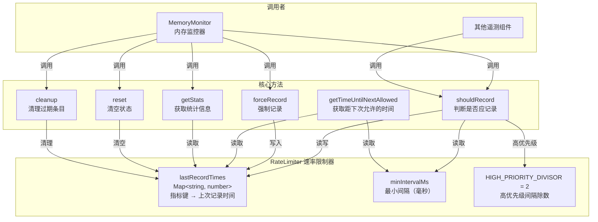

# rate-limiter.ts

## 概述

`rate-limiter.ts` 实现了一个**基于时间间隔的速率限制器**（`RateLimiter` 类），用于防止遥测指标的过度记录。它确保同一指标键（metric key）在指定的最小时间间隔内不会被重复发送，同时支持**高优先级事件**使用更短的间隔，以及**强制记录**来绕过限制。

该模块被 `MemoryMonitor` 等模块使用，是遥测系统中控制数据发射频率的关键基础设施。

## 架构图（Mermaid）



## 核心组件

### `RateLimiter` 类

#### 私有属性

| 属性 | 类型 | 说明 |
|------|------|------|
| `lastRecordTimes` | `Map<string, number>` | 存储每个指标键的上次记录时间戳 |
| `minIntervalMs` | `number`（readonly） | 最小记录间隔（毫秒），默认 60000（1 分钟） |

#### 静态常量

| 常量 | 值 | 说明 |
|------|----|------|
| `HIGH_PRIORITY_DIVISOR` | `2` | 高优先级事件的间隔除数。即高优先级间隔 = `minIntervalMs / 2` |

#### 构造函数

```typescript
constructor(minIntervalMs: number = 60000)
```

- 默认最小间隔为 60 秒
- 当 `minIntervalMs < 0` 时抛出错误

#### 公共方法

| 方法 | 参数 | 返回值 | 说明 |
|------|------|--------|------|
| `shouldRecord(metricKey, isHighPriority?)` | `string`, `boolean` | `boolean` | 判断指定指标是否可以记录。满足间隔条件时自动更新上次记录时间并返回 `true` |
| `forceRecord(metricKey)` | `string` | `void` | 强制更新指标的上次记录时间（不做间隔检查），用于关键事件 |
| `getTimeUntilNextAllowed(metricKey, isHighPriority?)` | `string`, `boolean` | `number` | 返回距下次允许记录的剩余毫秒数，已可记录时返回 `0` |
| `getStats()` | - | 对象 | 返回统计信息：总指标数、最早记录时间、最新记录时间、平均间隔 |
| `reset()` | - | `void` | 清空所有速率限制状态 |
| `cleanup(maxAgeMs?)` | `number`（默认 3600000） | `void` | 移除超过 `maxAgeMs` 毫秒未更新的条目，防止内存泄漏 |

## 依赖关系

### 内部依赖

无。`RateLimiter` 是一个完全独立的工具类，不依赖项目中的任何其他模块。

### 外部依赖

无。仅使用 JavaScript 内置的 `Map`、`Date.now()`、`Math` 等标准 API。

## 关键实现细节

### 1. 基于 Map 的令牌桶简化模型

`RateLimiter` 使用 `Map<string, number>` 记录每个指标键的**上次记录时间**。判断逻辑为：

```
当前时间 - 上次记录时间 >= 间隔 → 允许记录
```

这是一种滑动窗口的简化实现：每次成功记录后，窗口起点重置为当前时间。首次记录一个指标键时，`lastRecordTime` 默认为 `0`（即 1970 年），所以第一次调用必定允许。

### 2. 高优先级机制

高优先级事件（如内存泄漏告警）使用更短的间隔：

```typescript
interval = Math.round(minIntervalMs / HIGH_PRIORITY_DIVISOR)  // 即 minIntervalMs / 2
```

例如默认配置下，普通事件每 60 秒最多记录一次，高优先级事件每 30 秒最多记录一次。

### 3. `shouldRecord` 的副作用

`shouldRecord` 不是纯查询方法 -- 当返回 `true` 时，它会**自动更新** `lastRecordTimes` 中对应键的时间戳。这意味着：
- 调用方无需在记录指标后手动更新限制器状态
- 即使调用方最终没有成功记录指标，间隔窗口也已被重置

### 4. `forceRecord` 的设计意图

`forceRecord` 不执行任何检查，仅更新时间戳。它的目的是：
- 在关键事件（如内存溢出）需要立即记录时，绕过速率限制
- 更新时间戳后，后续的 `shouldRecord` 调用会基于此时间点计算间隔

### 5. 防内存泄漏的 `cleanup` 方法

当系统长时间运行时，`lastRecordTimes` 可能积累大量不再使用的键（例如一次性的 metric key）。`cleanup` 方法遍历所有条目，删除超过 `maxAgeMs`（默认 1 小时）的旧条目。

在 `MemoryMonitor` 中，每 15 分钟调用一次 `cleanup(1 小时)`。

### 6. 统计信息计算

`getStats()` 返回的 `averageInterval` 计算方式：

```
averageInterval = (newestRecord - oldestRecord) / (totalMetrics - 1)
```

当只有一个指标时返回 `0`。注意这是所有指标键的总体统计，而非单个键的间隔统计。

### 7. 输入校验

构造函数对 `minIntervalMs` 进行了负值校验，但允许 `0` 值（表示不限速）。`minIntervalMs = 0` 时，所有 `shouldRecord` 调用都会返回 `true`（因为 `now - lastRecordTime >= 0` 恒成立）。
