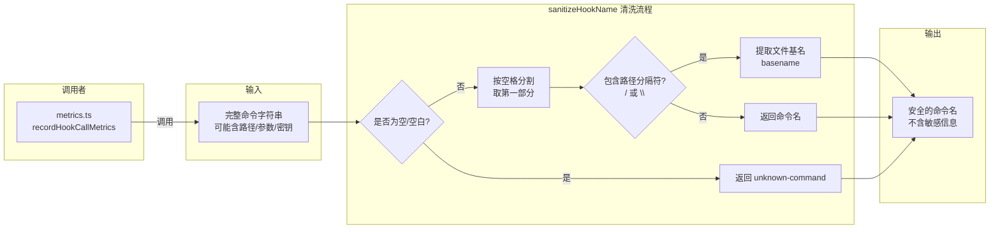

# sanitize.ts

## 概述

`sanitize.ts` 是遥测系统中的**数据清洗模块**，专门用于从 Hook 命令名称中移除潜在的敏感信息（PII -- 个人身份信息）。它确保在遥测指标中记录 Hook 名称时，不会泄露用户的文件路径、用户名、API 密钥、Token 等私密数据。

该模块仅导出一个函数 `sanitizeHookName`，被 `metrics.ts` 中的 `recordHookCallMetrics` 调用。

## 架构图（Mermaid）



## 核心组件

### `sanitizeHookName(hookName: string): string`

该函数是模块唯一的导出。它接收一个完整的 Hook 命令字符串，返回清洗后的安全命令名。

#### 清洗规则

| 步骤 | 处理逻辑 | 示例 |
|------|----------|------|
| 1. 空值检查 | 空字符串或纯空白返回 `"unknown-command"` | `""` / `"   "` --> `"unknown-command"` |
| 2. 分割取首段 | 按空白字符分割，只取第一段（命令本身），丢弃所有参数 | `"python script.py --token=xyz"` --> `"python"` |
| 3. 路径提取基名 | 如果命令包含 `/` 或 `\`，按路径分隔符分割，取最后一段 | `"/path/to/check-secrets.sh"` --> `"check-secrets.sh"` |
| 4. 基名为空回退 | 如果提取的基名为空（如以 `/` 结尾），返回 `"unknown-command"` | `"/path/to/"` --> `"unknown-command"` |

#### 清洗示例

| 输入 | 输出 | 移除的敏感信息 |
|------|------|---------------|
| `"/path/to/.gemini/hooks/check-secrets.sh --api-key=abc123"` | `"check-secrets.sh"` | 文件路径、API 密钥 |
| `"python /home/user/script.py --token=xyz"` | `"python"` | 用户主目录路径、Token |
| `"node index.js"` | `"node"` | 脚本文件名和参数 |
| `"C:\\Windows\\System32\\cmd.exe /c secret.bat"` | `"cmd.exe"` | Windows 系统路径、子命令 |
| `""` | `"unknown-command"` | -- |
| `"   "` | `"unknown-command"` | -- |

## 依赖关系

### 内部依赖

无。`sanitizeHookName` 是一个纯函数，不依赖项目中的任何其他模块。

### 外部依赖

无。仅使用 JavaScript 内置的字符串方法（`trim`、`split`、`includes`）和正则表达式。

## 关键实现细节

### 1. 防护的 PII 类型

该函数明确保护以下类型的敏感信息：
- **文件路径**：可能包含用户名（如 `/home/username/`、`C:\Users\username\`）
- **命令参数**：可能包含凭据、API 密钥、Token（如 `--api-key=abc123`、`--token=xyz`）
- **环境变量**：参数中可能引用敏感的环境变量值

### 2. 只保留命令名

采用"最小信息原则"：只保留命令的基本名称（basename），丢弃所有路径信息和参数。这种激进的清洗策略牺牲了一定的诊断细节，但最大化了隐私保护。

### 3. 跨平台路径处理

通过同时检查 `/`（Unix 风格）和 `\`（Windows 风格）路径分隔符，确保在所有操作系统上都能正确提取基名。分割时使用正则 `/[/\\]/` 同时处理两种分隔符。

### 4. 多层防御性编程

函数包含多层 fallback 到 `"unknown-command"` 的逻辑：
- 输入为 falsy 值（`null`、`undefined`、空字符串）
- 输入为纯空白字符串
- 分割后数组为空
- 命令部分为空字符串
- 路径提取后基名为空

这种设计确保函数在任何输入情况下都不会抛出异常或返回空字符串。

### 5. 调用场景

在 `metrics.ts` 的 `recordHookCallMetrics` 中被调用：

```typescript
const sanitizedHookName = sanitizeHookName(hookName);
// 使用 sanitizedHookName 作为指标属性值
```

由于指标数据会被聚合并暴露给监控系统，在数据进入遥测管道之前进行清洗是防止敏感信息泄露的关键防线。
