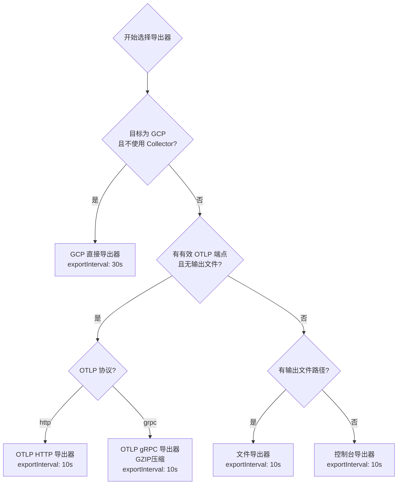

# sdk.ts

## 概述

`sdk.ts` 是 Gemini CLI 遥测系统的**SDK 初始化与生命周期管理模块**。它负责配置和启动 **OpenTelemetry NodeSDK**，根据不同的配置策略选择合适的导出器（Exporter），并管理遥测系统的完整生命周期（初始化、缓冲、刷新、关闭）。

该模块是遥测系统的**入口点和控制中心**，所有遥测数据（Traces、Logs、Metrics）的采集与导出都依赖于此模块完成的 SDK 初始化。

## 架构图（Mermaid）

```mermaid
graph TB
    subgraph SDK初始化与生命周期
        INIT[initializeTelemetry<br/>初始化遥测]
        FLUSH[flushTelemetry<br/>刷新遥测数据]
        SHUTDOWN[shutdownTelemetry<br/>关闭遥测系统]
        BUFFER[bufferTelemetryEvent<br/>缓冲遥测事件]
        FLUSH_BUF[flushTelemetryBuffer<br/>执行缓冲事件]
        IS_INIT[isTelemetrySdkInitialized<br/>检查初始化状态]
    end

    subgraph 导出器选择策略
        GCP_EXP[GCP 直接导出器<br/>GcpTraceExporter<br/>GcpLogExporter<br/>GcpMetricExporter]
        OTLP_GRPC[OTLP gRPC 导出器<br/>OTLPTraceExporter<br/>OTLPLogExporter<br/>OTLPMetricExporter]
        OTLP_HTTP[OTLP HTTP 导出器<br/>OTLPTraceExporterHttp<br/>OTLPLogExporterHttp<br/>OTLPMetricExporterHttp]
        FILE_EXP[文件导出器<br/>FileSpanExporter<br/>FileLogExporter<br/>FileMetricExporter]
        CONSOLE_EXP[控制台导出器<br/>ConsoleSpanExporter<br/>ConsoleLogRecordExporter<br/>ConsoleMetricExporter]
    end

    subgraph OpenTelemetry SDK
        NODE_SDK[NodeSDK 实例]
        SPAN_PROC[BatchSpanProcessor<br/>批量Span处理器]
        LOG_PROC[BatchLogRecordProcessor<br/>批量日志处理器]
        METRIC_READER[PeriodicExportingMetricReader<br/>周期性指标读取器]
        HTTP_INST[HttpInstrumentation<br/>HTTP自动插桩]
        RESOURCE[Resource 资源属性<br/>服务名 / 版本 / 会话ID]
    end

    subgraph 外部系统
        CONFIG[Config 配置]
        AUTH[authEvents<br/>认证事件]
        CORE_EVENTS[coreEvents<br/>核心事件]
        METRICS_INIT[initializeMetrics<br/>指标初始化]
        CLEARCUT[ClearcutLogger<br/>Clearcut日志器]
        DIAG_ADAPTER[DiagLoggerAdapter<br/>诊断日志适配器]
    end

    INIT -->|创建| NODE_SDK
    INIT -->|选择| GCP_EXP
    INIT -->|选择| OTLP_GRPC
    INIT -->|选择| OTLP_HTTP
    INIT -->|选择| FILE_EXP
    INIT -->|选择| CONSOLE_EXP
    INIT -->|创建| SPAN_PROC
    INIT -->|创建| LOG_PROC
    INIT -->|创建| METRIC_READER
    INIT -->|创建| RESOURCE
    INIT -->|调用| METRICS_INIT
    INIT -->|监听| AUTH
    INIT -->|监听| CORE_EVENTS
    INIT -->|触发| FLUSH_BUF

    NODE_SDK -->|包含| SPAN_PROC
    NODE_SDK -->|包含| LOG_PROC
    NODE_SDK -->|包含| METRIC_READER
    NODE_SDK -->|包含| HTTP_INST

    FLUSH -->|刷新| SPAN_PROC
    FLUSH -->|刷新| LOG_PROC
    SHUTDOWN -->|关闭| NODE_SDK
    SHUTDOWN -->|关闭| CLEARCUT
    SHUTDOWN -->|清理| AUTH
    SHUTDOWN -->|清理| CORE_EVENTS

    BUFFER -->|缓存到| FLUSH_BUF
    CONFIG -->|配置| INIT
    DIAG_ADAPTER -->|适配| NODE_SDK
```

## 核心组件

### 1. `DiagLoggerAdapter` 类

OpenTelemetry 诊断日志适配器，将 OTel 的内部诊断日志桥接到项目的 `debugLogger` 系统。

| 方法 | OTel 日志级别 | 映射到 debugLogger |
|------|-------------|-------------------|
| `error(message, ...args)` | ERROR | `debugLogger.error()` |
| `warn(message, ...args)` | WARN | `debugLogger.warn()` |
| `info(message, ...args)` | INFO | `debugLogger.log()` |
| `debug(message, ...args)` | DEBUG | `debugLogger.debug()` |
| `verbose(message, ...args)` | VERBOSE | `debugLogger.debug()` |

在模块顶层通过 `diag.setLogger(new DiagLoggerAdapter(), DiagLogLevel.INFO)` 注册。

### 2. 模块级状态变量

| 变量 | 类型 | 说明 |
|------|------|------|
| `sdk` | `NodeSDK \| undefined` | OpenTelemetry SDK 实例 |
| `spanProcessor` | `BatchSpanProcessor \| undefined` | Span 批处理器，用于手动刷新 |
| `logRecordProcessor` | `BatchLogRecordProcessor \| undefined` | 日志批处理器，用于手动刷新 |
| `telemetryInitialized` | `boolean` | 遥测是否已初始化 |
| `callbackRegistered` | `boolean` | 认证回调是否已注册 |
| `authListener` | `Function \| undefined` | 认证事件监听器引用 |
| `keychainAvailabilityListener` | `Function \| undefined` | 钥匙串可用性事件监听器 |
| `tokenStorageTypeListener` | `Function \| undefined` | Token 存储类型事件监听器 |
| `telemetryBuffer` | `Array<() => void \| Promise<void>>` | 初始化前的遥测事件缓冲区 |
| `activeTelemetryEmail` | `string \| undefined` | 当前活跃的遥测认证邮箱 |

### 3. 导出函数

#### `initializeTelemetry(config: Config, credentials?: JWTInput): Promise<void>`

遥测系统的主初始化函数。执行流程：

1. **前置检查**：遥测未启用则返回；已初始化且凭据变化则记录警告；`useCollector + useCliAuth` 冲突则禁用遥测
2. **延迟初始化**：如果使用 CLI 认证但尚无凭据，注册 `post_auth` 回调并返回
3. **创建资源**：包含服务名称、版本、会话 ID
4. **注册事件监听**：钥匙串可用性、Token 存储类型
5. **选择导出器**（详见下方决策表）
6. **创建处理器**：`BatchSpanProcessor`、`BatchLogRecordProcessor`、`PeriodicExportingMetricReader`
7. **构建并启动 NodeSDK**
8. **初始化指标**：调用 `initializeMetrics(config)`
9. **刷新缓冲区**：执行初始化前缓冲的事件
10. **注册信号处理**：`SIGTERM` 和 `SIGINT` 触发关闭

#### `flushTelemetry(config: Config): Promise<void>`

强制刷新所有待发送的遥测数据到目标端。并行刷新 `spanProcessor` 和 `logRecordProcessor`。适用于 `/clear` 等关键操作前确保数据不丢失。

#### `shutdownTelemetry(config: Config, fromProcessExit?: boolean): Promise<void>`

完整关闭遥测系统：

1. 关闭 `ClearcutLogger` 实例
2. 关闭 `NodeSDK`（会级联关闭所有处理器和导出器）
3. 禁用所有 OpenTelemetry 全局 API（`trace`、`context`、`metrics`、`propagation`、`diag`）
4. 移除所有事件监听器
5. 重置所有状态变量

#### `isTelemetrySdkInitialized(): boolean`

返回遥测系统当前的初始化状态。

#### `bufferTelemetryEvent(fn: () => void | Promise<void>): void`

遥测事件缓冲机制：如果已初始化则立即执行，否则存入缓冲区等待初始化完成后执行。

### 4. 内部函数

#### `parseOtlpEndpoint(otlpEndpointSetting, protocol): string | undefined`

解析和规范化 OTLP 端点 URL：
- 去除引号包裹
- gRPC 协议：返回 `origin`（scheme + host + port）
- HTTP 协议：返回完整 `href`
- 无效 URL：记录错误并返回 `undefined`

#### `flushTelemetryBuffer(): Promise<void>`

按顺序执行缓冲区中的所有遥测事件函数，逐个处理以保证顺序，每个事件单独 try-catch 防止一个失败影响其他。

## 导出器选择决策表

| 优先级 | 条件 | 导出器 | 指标导出间隔 | 特殊设置 |
|--------|------|--------|-------------|---------|
| 1 | `telemetryTarget === GCP && !useCollector` | `GcpTraceExporter` / `GcpLogExporter` / `GcpMetricExporter` | 30 秒 | 支持凭据或 ADC |
| 2 | 有效 OTLP 端点 + 无输出文件 + HTTP 协议 | `OTLPTraceExporterHttp` / `OTLPLogExporterHttp` / `OTLPMetricExporterHttp` | 10 秒 | URL 路径拼接 (`v1/traces`, `v1/logs`, `v1/metrics`) |
| 3 | 有效 OTLP 端点 + 无输出文件 + gRPC 协议 | `OTLPTraceExporter` / `OTLPLogExporter` / `OTLPMetricExporter` | 10 秒 | GZIP 压缩 |
| 4 | 有输出文件路径 | `FileSpanExporter` / `FileLogExporter` / `FileMetricExporter` | 10 秒 | 写入本地文件 |
| 5 | 默认回退 | `ConsoleSpanExporter` / `ConsoleLogRecordExporter` / `ConsoleMetricExporter` | 10 秒 | 输出到控制台 |

## 依赖关系

### 内部依赖

| 模块 | 导入内容 | 用途 |
|------|----------|------|
| `../config/config.js` | `Config` 类型 | 读取遥测配置（启用状态、端点、协议、目标、调试模式等） |
| `./constants.js` | `SERVICE_NAME` | OpenTelemetry 服务名称 |
| `./metrics.js` | `initializeMetrics` | SDK 启动后初始化所有指标定义 |
| `./clearcut-logger/clearcut-logger.js` | `ClearcutLogger` | Clearcut 日志系统，关闭时一并停止 |
| `./file-exporters.js` | `FileLogExporter`, `FileMetricExporter`, `FileSpanExporter` | 文件输出导出器 |
| `./gcp-exporters.js` | `GcpTraceExporter`, `GcpMetricExporter`, `GcpLogExporter` | GCP 直接导出器 |
| `./index.js` | `TelemetryTarget` | 遥测目标枚举 |
| `../utils/debugLogger.js` | `debugLogger` | 调试日志输出 |
| `../code_assist/oauth2.js` | `authEvents` | OAuth2 认证事件总线 |
| `../utils/events.js` | `coreEvents`, `CoreEvent` | 核心事件总线 |
| `./loggers.js` | `logKeychainAvailability`, `logTokenStorageInitialization` | 遥测日志记录函数 |
| `./types.js` | `KeychainAvailabilityEvent`, `TokenStorageInitializationEvent` | 事件类型定义 |

### 外部依赖

| 模块 | 导入内容 | 用途 |
|------|----------|------|
| `@opentelemetry/api` | `DiagLogLevel`, `diag`, `trace`, `context`, `metrics`, `propagation` | OpenTelemetry 核心 API -- 诊断、追踪、上下文、指标、传播 |
| `@opentelemetry/exporter-trace-otlp-grpc` | `OTLPTraceExporter` | gRPC Trace 导出器 |
| `@opentelemetry/exporter-logs-otlp-grpc` | `OTLPLogExporter` | gRPC 日志导出器 |
| `@opentelemetry/exporter-metrics-otlp-grpc` | `OTLPMetricExporter` | gRPC 指标导出器 |
| `@opentelemetry/exporter-trace-otlp-http` | `OTLPTraceExporterHttp` | HTTP Trace 导出器 |
| `@opentelemetry/exporter-logs-otlp-http` | `OTLPLogExporterHttp` | HTTP 日志导出器 |
| `@opentelemetry/exporter-metrics-otlp-http` | `OTLPMetricExporterHttp` | HTTP 指标导出器 |
| `@opentelemetry/otlp-exporter-base` | `CompressionAlgorithm` | GZIP 压缩算法选项 |
| `@opentelemetry/sdk-node` | `NodeSDK` | OpenTelemetry Node.js SDK |
| `@opentelemetry/semantic-conventions` | `SemanticResourceAttributes` | 语义约定的资源属性 |
| `@opentelemetry/resources` | `resourceFromAttributes` | 从属性创建 Resource |
| `@opentelemetry/sdk-trace-node` | `BatchSpanProcessor`, `ConsoleSpanExporter` | Span 批处理器、控制台导出 |
| `@opentelemetry/sdk-logs` | `BatchLogRecordProcessor`, `ConsoleLogRecordExporter` | 日志批处理器、控制台导出 |
| `@opentelemetry/sdk-metrics` | `ConsoleMetricExporter`, `PeriodicExportingMetricReader` | 控制台指标导出、周期性读取器 |
| `@opentelemetry/instrumentation-http` | `HttpInstrumentation` | HTTP 请求自动插桩 |
| `google-auth-library` | `JWTInput` 类型 | JWT 凭据输入类型 |

## 关键实现细节

### 1. 延迟初始化与认证回调

当配置了 CLI 认证（`useCliAuth`）但尚未提供凭据时，SDK 不会立即初始化。而是注册一个 `post_auth` 事件监听器，等待用户完成登录后自动触发初始化。这确保了：
- 无凭据时不会发送遥测数据
- 用户登录后可以无缝开始遥测
- 回调只注册一次（`callbackRegistered` 防重复）

### 2. 配置冲突检测

`useCollector` 和 `useCliAuth` 不能同时为 `true`，因为 CLI 认证只适用于进程内导出器（直连 GCP），不适用于通过 Collector 转发的场景。检测到冲突时直接禁用遥测并记录错误。

### 3. 遥测事件缓冲机制

`telemetryBuffer` 解决了初始化时序问题：在 SDK 启动之前产生的遥测事件被缓存，SDK 就绪后自动按顺序回放。`bufferTelemetryEvent` 在已初始化时直接执行函数，否则将其入队。

### 4. 凭据变更检测

如果遥测已初始化后凭据发生变化（不同的 `client_email`），由于 SDK 不支持运行时重新配置，只能记录错误并提示用户重启 CLI。通过 `activeTelemetryEmail` 追踪当前凭据。

### 5. OTLP 端点解析

`parseOtlpEndpoint` 对端点 URL 进行了精细处理：
- **去除引号**：处理环境变量中可能存在的引号包裹
- **gRPC 协议**：提取 `origin`（`scheme://host:port`），因为 gRPC 不需要路径
- **HTTP 协议**：保留完整 URL（包括路径），因为 HTTP OTLP 需要拼接 `v1/traces`、`v1/logs`、`v1/metrics` 路径

### 6. 完整的关闭与清理

`shutdownTelemetry` 在 `finally` 块中执行彻底的清理，包括：
- 禁用所有 5 个 OpenTelemetry 全局 API（`trace`、`context`、`metrics`、`propagation`、`diag`）
- 移除所有事件监听器（`authListener`、`keychainAvailabilityListener`、`tokenStorageTypeListener`）
- 重置所有状态变量

这种彻底的清理主要是为测试环境设计的，允许在同一进程中多次启动和停止 SDK。

### 7. 信号处理

注册了 `SIGTERM` 和 `SIGINT` 信号处理器来触发遥测关闭。注释中特别说明了不使用 `process.on('exit')`，因为 exit 回调是同步的，无法等待异步的 `shutdownTelemetry()` 完成。正常退出时的遥测关闭由 `cleanup.ts` 中的 `runExitCleanup()` 负责。

### 8. HTTP 插桩

SDK 配置了 `HttpInstrumentation`，这会自动为所有 HTTP 出站请求创建 Span，无需手动插桩。这对于追踪 API 请求延迟和错误非常有用。

### 9. gRPC 压缩

gRPC 导出器启用了 GZIP 压缩（`CompressionAlgorithm.GZIP`），减少遥测数据的网络传输量。HTTP 导出器未配置压缩。

### 10. GCP 导出与其他导出的间隔差异

GCP 直接导出的指标导出间隔为 30 秒，而其他所有导出方式（OTLP、文件、控制台）均为 10 秒。这可能是考虑到 GCP API 的配额限制。
