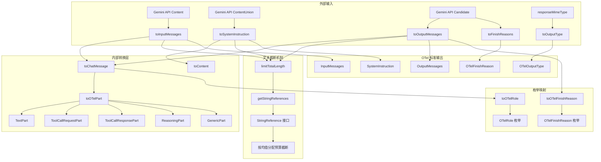

# semantic.ts

## 概述

`semantic.ts` 是 Gemini CLI 遥测模块的核心文件之一，负责将 Gemini API 的请求/响应格式转换为符合 **OpenTelemetry 生成式 AI 语义规范**（GenAI Semantic Conventions）的标准格式。该文件实现了从 Gemini 原始数据结构到 OTel 标准数据结构的完整映射层，包括消息内容、角色、完成原因、输出类型等多个维度的转换。

文件参考了 OpenTelemetry 语义规范中关于生成式 AI 事件的定义：
- [GenAI Events 规范](https://github.com/open-telemetry/semantic-conventions/blob/8b4f210f43136e57c1f6f47292eb6d38e3bf30bb/docs/gen-ai/gen-ai-events.md)

## 架构图（Mermaid）



## 核心组件

### 1. Part 类体系（OTel 部件数据模型）

文件定义了 5 种 Part 类，用于表示 OTel 规范中消息的不同组成部分：

| 类名 | `type` 值 | 描述 | 关键字段 |
|------|----------|------|---------|
| `TextPart` | `'text'` | 纯文本内容 | `content: string` |
| `ToolCallRequestPart` | `'tool_call'` | 工具调用请求 | `name`, `id`, `arguments` |
| `ToolCallResponsePart` | `'tool_call_response'` | 工具调用响应 | `response`, `id` |
| `ReasoningPart` | `'reasoning'` | 推理/思考内容（`part.thought` 为 true 时） | `content: string` |
| `GenericPart` | 动态类型 | 通用部件，处理 `executableCode`、`codeExecutionResult` 等 | 动态属性（通过 `Object.assign`） |

联合类型 `AnyPart` 是这五种 Part 的联合：
```typescript
export type AnyPart = TextPart | ToolCallRequestPart | ToolCallResponsePart | ReasoningPart | GenericPart;
```

### 2. 消息转换函数

#### `toInputMessages(contents: Content[]): InputMessages`
将 Gemini API 的 `Content[]` 数组转换为 OTel 标准的 `ChatMessage[]` 输入消息。转换完成后会对所有文本内容执行全局长度限制。

#### `toSystemInstruction(systemInstruction?: ContentUnion): SystemInstruction | undefined`
将 Gemini API 的系统指令（支持 `string`、`Part`、`PartUnion[]`、`Content` 等多种格式）统一转换为 OTel 标准的 `AnyPart[]`。

#### `toOutputMessages(candidates?: Candidate[]): OutputMessages`
将 Gemini API 的候选响应 `Candidate[]` 转换为 OTel 标准的 `OutputMessage[]`，每条输出消息包含 `finish_reason` 字段。

#### `toChatMessage(content?: Content): ChatMessage`
核心的单条消息转换函数，将 Gemini `Content` 转换为包含 `role` 和 `parts` 的 `ChatMessage` 对象。

### 3. 枚举映射

#### `OTelRole` 枚举与 `toOTelRole` 函数
将 Gemini API 的角色字符串映射为 OTel 标准角色：

| Gemini 角色 | OTel 角色 |
|------------|----------|
| `'system'` | `SYSTEM` |
| `'model'` | `SYSTEM`（Gemini 特有，映射为 system） |
| `'user'` | `USER` |
| `'assistant'` | `ASSISTANT` |
| `'tool'` | `TOOL` |
| 默认值 | `SYSTEM` |

#### `OTelFinishReason` 枚举与 `toOTelFinishReason` 函数
将 Gemini API 丰富的完成原因映射为 OTel 规范的 5 种标准原因：

| OTel 完成原因 | 对应的 Gemini FinishReason |
|-------------|--------------------------|
| `STOP` | `FINISH_REASON_UNSPECIFIED`, `STOP`, `OTHER`, 以及默认值 |
| `LENGTH` | `MAX_TOKENS` |
| `CONTENT_FILTER` | `SAFETY`, `RECITATION`, `LANGUAGE`, `BLOCKLIST`, `PROHIBITED_CONTENT`, `SPII`, `IMAGE_SAFETY` |
| `TOOL_CALL` | （当前未映射，保留用） |
| `ERROR` | `MALFORMED_FUNCTION_CALL`, `UNEXPECTED_TOOL_CALL` |

#### `OTelOutputType` 枚举与 `toOutputType` 函数
将 MIME 类型映射为 OTel 输出类型：
- `'text/plain'` -> `TEXT`
- `'application/json'` -> `JSON`
- 其他 MIME 类型直接透传

### 4. 文本截断机制

#### 全局文本限制常量
```typescript
const GLOBAL_TEXT_LIMIT = 160 * 1024; // 160KB
```
总日志条目大小限制为 256KB，其中预留约 96KB（37%）用于 JSON 转义、结构开销和其他字段。

#### `StringReference` 接口
提供对 Part 内字符串内容的间接引用，支持 `get`/`set`/`len` 操作，允许就地修改截断后的内容。

#### `getStringReferences(parts: AnyPart[]): StringReference[]`
遍历所有 Part，收集可截断的字符串引用：
- `TextPart` -> `content`
- `ReasoningPart` -> `content`
- `ToolCallRequestPart` -> `arguments`
- `ToolCallResponsePart` -> `response`
- `GenericPart`（executableCode）-> `code`
- `GenericPart`（codeExecutionResult）-> `output`

#### `limitTotalLength(parts: AnyPart[]): void`
核心截断算法，当所有文本内容总长度超过 `GLOBAL_TEXT_LIMIT` 时执行：
1. 计算所有 Part 文本内容的总长度
2. 如果总长度 <= 160KB，直接返回不做处理
3. 计算每个 Part 的平均预算（`GLOBAL_TEXT_LIMIT / 总 Part 数`）
4. 将 Part 分为"小 Part"（已在平均预算内）和"大 Part"（超出平均预算）
5. 将剩余预算（`160KB - 小 Part 总长`）均匀分配给大 Part
6. 对每个大 Part 调用 `truncateString` 进行截断

### 5. 辅助转换函数

#### `toOTelPart(part: Part): AnyPart`
Gemini Part 到 OTel Part 的核心映射函数，按优先级依次判断：
1. `part.thought` 为 true -> `ReasoningPart`（思考/推理内容）
2. `part.text` 存在 -> `TextPart`
3. `part.functionCall` 存在 -> `ToolCallRequestPart`（将 args 序列化为 JSON 字符串）
4. `part.functionResponse` 存在 -> `ToolCallResponsePart`（将 response 序列化为 JSON 字符串）
5. `part.executableCode` 存在 -> `GenericPart('executableCode', ...)`
6. `part.codeExecutionResult` 存在 -> `GenericPart('codeExecutionResult', ...)`
7. 以上均不匹配 -> `GenericPart('unknown', ...)`

#### `toContent(content: ContentUnion): Content | undefined`
处理 Gemini API 灵活的输入格式，支持 4 种输入形式：
1. 字符串 -> 包装为 `{ parts: [{ text: string }] }`
2. `PartUnion[]` 数组 -> 包装为 `{ parts: [...] }`
3. `Content` 对象（含 `parts` 属性） -> 直接返回
4. 单个 `Part` 对象 -> 包装为 `{ parts: [part] }`

#### `isPart(value: unknown): value is Part`
类型守卫函数，判断一个值是否为 Gemini `Part` 对象（对象类型、非数组、不含 `parts` 属性）。

## 依赖关系

### 内部依赖

| 模块 | 导入内容 | 用途 |
|------|---------|------|
| `../utils/textUtils.js` | `truncateString` | 用于截断超长字符串内容 |

### 外部依赖

| 包名 | 导入内容 | 用途 |
|------|---------|------|
| `@google/genai` | `FinishReason`, `Candidate`, `Content`, `ContentUnion`, `Part`, `PartUnion` | Gemini API 的类型定义和枚举，是转换的源数据类型 |

## 关键实现细节

1. **角色映射的特殊处理**：Gemini API 中 `'model'` 角色被映射为 OTel 的 `SYSTEM` 而非 `ASSISTANT`，这是因为 Gemini API 频繁使用 `'model'` 作为角色名，且默认未知角色也映射为 `SYSTEM`。

2. **文本截断的公平分配策略**：`limitTotalLength` 采用"小 Part 保留、大 Part 均分"的策略，避免了简单按比例截断导致小内容被不必要截断的问题。这确保了在 160KB 限制下的最大信息保留。

3. **GenericPart 的动态属性机制**：`GenericPart` 类使用 `Object.assign(this, data)` 和索引签名 `[key: string]: unknown` 来支持任意属性。这种设计使得 `executableCode` 和 `codeExecutionResult` 等特殊类型的字段可以动态挂载到实例上，同时 `getStringReferences` 可以通过字符串索引访问这些动态属性。

4. **thought 优先于 text 的判断逻辑**：在 `toOTelPart` 中，`part.thought` 的检查优先于 `part.text`。这意味着如果一个 Part 同时包含 `thought=true` 和 `text` 内容，它会被识别为 `ReasoningPart` 而非 `TextPart`，确保推理过程被正确分类。

5. **256KB 日志限制的拆分**：总限制 256KB 被分为 160KB 文本内容 + 96KB JSON 开销，约 63:37 的比例，为 JSON 序列化中的转义字符（如 `\n`、`\"`）和结构字符（`{}`、`[]`、`,`）预留了充足空间。

6. **导出与非导出的设计**：核心转换函数（`toInputMessages`、`toOutputMessages`、`toSystemInstruction`、`toFinishReasons`、`toOutputType`、`toChatMessage`）被导出供外部使用，而内部辅助函数（`toOTelPart`、`toOTelRole`、`toOTelFinishReason`、`limitTotalLength`、`getStringReferences`）保持私有，体现了清晰的封装设计。
