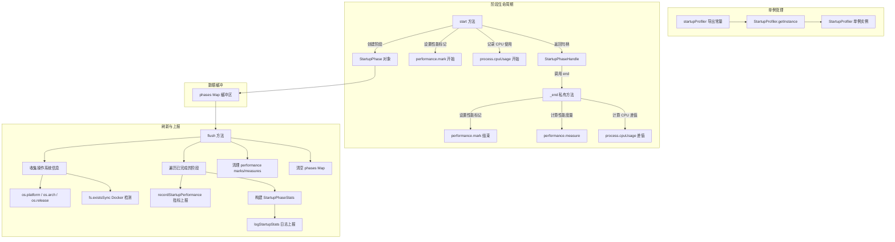

# startupProfiler.ts

## 概述

`startupProfiler.ts` 实现了一个 **启动性能分析器（Startup Profiler）**，用于在 Gemini CLI 的遥测系统完全初始化之前，缓冲和记录启动阶段的性能指标。它基于 Node.js 的 `performance` API（`perf_hooks`）进行精确的时间测量，并同时收集 CPU 使用数据和操作系统环境信息。

该分析器采用单例模式，在整个应用生命周期中仅存在一个实例。启动过程中的各个阶段通过"开始-结束"配对标记进行追踪，在遥测系统就绪后统一 flush 到遥测后端。

## 架构图（Mermaid）



## 核心组件

### 1. `StartupProfiler` 类

单例类，是整个启动性能分析的核心。

#### 私有属性
- `phases: Map<string, StartupPhase>` - 以阶段名为 key 的缓冲区，存储所有启动阶段的数据
- `static instance: StartupProfiler` - 单例实例

#### 构造与实例获取
```typescript
private constructor() {}
static getInstance(): StartupProfiler
```
使用经典的懒汉式单例模式，确保全局唯一实例。

#### `start(phaseName, details?): StartupPhaseHandle | undefined`
启动一个新的性能追踪阶段：
1. 检查是否存在同名且未结束的活跃阶段，如有则输出警告并返回 `undefined`
2. 使用 `performance.mark()` 创建开始标记，标记名格式为 `startup:{phaseName}:start`
3. 记录当前 CPU 使用情况（`process.cpuUsage()`）
4. 创建 `StartupPhase` 对象并存入 `phases` Map
5. 返回 `StartupPhaseHandle` 句柄，调用者通过 `handle.end()` 结束阶段

返回 `undefined` 的设计允许调用者使用可选链（`handle?.end()`）安全调用，适用于初始化可能重复执行的环境。

#### `_end(phase, details?): void`（私有方法）
结束一个性能追踪阶段：
1. 检查阶段是否已结束，防止重复结束
2. 检查开始标记是否存在（可能被 reset 清除）
3. 使用 `performance.mark()` 创建结束标记
4. 使用 `performance.measure()` 计算阶段持续时间
5. 通过 `process.cpuUsage(startCpuUsage)` 计算 CPU 使用差值
6. 合并结束时的详情数据

#### `flush(config: Config): void`
将所有缓冲的性能指标刷新到遥测系统：

**第一步：收集环境信息**
```typescript
const commonDetails = {
    os_platform: os.platform(),   // 操作系统平台
    os_arch: os.arch(),           // CPU 架构
    os_release: os.release(),     // 系统版本
    is_docker: fs.existsSync('/.dockerenv'),  // 是否在 Docker 中
};
```

**第二步：上报指标数据**
遍历所有已完成的阶段，对每个阶段调用 `recordStartupPerformance()` 上报指标，包括：
- 阶段名称
- 持续时间（毫秒）
- CPU 使用（用户态和系统态，微秒）
- 环境信息
- 自定义详情

**第三步：发送 StartupStats 事件**
构建 `StartupPhaseStats[]` 数组，每个元素包含：
- `name` - 阶段名
- `duration_ms` - 持续时间（毫秒，取整）
- `cpu_usage_user_usec` - 用户态 CPU 使用（微秒）
- `cpu_usage_system_usec` - 系统态 CPU 使用（微秒）
- `start_time_usec` - 绝对开始时间（微秒）
- `end_time_usec` - 绝对结束时间（微秒）

通过 `logStartupStats()` 发送 `StartupStatsEvent` 日志事件。

**第四步：清理**
- 清除所有 `performance.mark` 和 `performance.measure`
- 清空 `phases` Map

### 2. `StartupPhase` 接口（私有）

```typescript
interface StartupPhase {
    name: string;                                    // 阶段名称
    startCpuUsage: NodeJS.CpuUsage;                 // 开始时的 CPU 使用快照
    cpuUsage?: NodeJS.CpuUsage;                     // 结束时计算的 CPU 使用差值
    details?: Record<string, string | number | boolean>; // 附加详情
    ended: boolean;                                  // 是否已结束
}
```

### 3. `StartupPhaseHandle` 接口（导出）

```typescript
export interface StartupPhaseHandle {
    end(details?: Record<string, string | number | boolean>): void;
}
```
由 `start()` 返回的句柄，封装了阶段结束操作。调用者无需记忆阶段名称，直接通过句柄的 `end()` 方法结束阶段。支持在结束时传入额外的详情数据。

### 4. 导出的单例常量

```typescript
export const startupProfiler = StartupProfiler.getInstance();
```
提供便捷的全局访问点，其他模块可直接导入使用。

## 依赖关系

### 内部依赖

| 模块 | 导入内容 | 用途 |
|------|---------|------|
| `../config/config.js` | `Config`（类型） | `flush()` 方法需要配置对象来上报指标 |
| `./metrics.js` | `recordStartupPerformance` | 将启动性能指标记录到遥测指标系统 |
| `../utils/debugLogger.js` | `debugLogger` | 输出调试日志和警告信息 |
| `./types.js` | `StartupStatsEvent`, `StartupPhaseStats` | 启动统计事件和阶段统计的类型定义 |
| `./loggers.js` | `logStartupStats` | 将启动统计日志发送到遥测日志系统 |

### 外部依赖

| 包名 | 导入内容 | 用途 |
|------|---------|------|
| `node:perf_hooks` | `performance` | Node.js 高精度性能计时 API（mark/measure/getEntries） |
| `node:os` | `os` | 获取操作系统平台、架构、版本信息 |
| `node:fs` | `fs` | 检测 Docker 环境（`/.dockerenv` 文件是否存在） |

## 关键实现细节

1. **单例模式保证全局唯一性**：使用经典的懒汉式单例（`private constructor` + `static getInstance()`），确保在整个应用中只有一个 Profiler 实例管理所有启动阶段。同时导出了 `startupProfiler` 常量作为便捷访问点。

2. **句柄模式（Handle Pattern）**：`start()` 返回 `StartupPhaseHandle`，调用者只需保留句柄并调用 `handle.end()`，无需重复传入阶段名称。这种设计既减少了出错可能，也使代码更加简洁。返回 `undefined` 的设计支持可选链调用模式。

3. **性能标记命名规范**：标记名遵循 `startup:{phaseName}:start` 和 `startup:{phaseName}:end` 的固定格式，便于在 `performance.getEntriesByName()` 中精确查找。

4. **双重上报机制**：`flush()` 中同时进行了两种上报：
   - 通过 `recordStartupPerformance()` 上报到指标系统（metrics），每个阶段单独上报
   - 通过 `logStartupStats()` 上报到日志系统（logs），所有阶段打包为一个 `StartupStatsEvent`

5. **绝对时间计算**：在构建 `StartupPhaseStats` 时，使用 `performance.timeOrigin + measure.startTime` 将相对时间转换为绝对时间（Unix 时间戳），并乘以 1000 转换为微秒精度。

6. **防御性编程**：
   - 重复 `start()` 同一阶段时输出警告并返回 `undefined`
   - 重复 `end()` 同一阶段时输出警告并跳过
   - 开始标记被清除（如 reset 后）时安全处理
   - 未完成的阶段在 `flush()` 时跳过并输出警告

7. **Docker 环境检测**：通过检查 `/.dockerenv` 文件是否存在来判断是否运行在 Docker 容器中，这是一个广泛使用的 Docker 容器检测方法。

8. **资源清理**：`flush()` 在上报完成后，会清除所有 `performance` API 创建的标记（marks）和度量（measures），并清空内部缓冲区，防止内存泄漏和重复上报。
