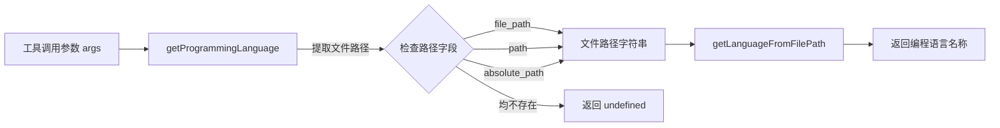

# telemetry-utils.ts

## 概述

`telemetry-utils.ts` 是一个轻量级的遥测工具函数文件，提供了从工具调用参数中提取编程语言信息的辅助功能。该文件目前仅包含一个导出函数 `getProgrammingLanguage`，用于根据文件路径参数推断编程语言类型，以便在遥测数据中附加语言维度信息。

## 架构图（Mermaid）

## 核心组件

### `getProgrammingLanguage(args: Record<string, unknown>): string | undefined`

从工具调用的参数对象中提取编程语言信息。

**参数**：
- `args: Record<string, unknown>` - 工具调用时传入的参数字典，通常来自 Gemini 模型的 `functionCall.args`

**返回值**：
- `string` - 检测到的编程语言名称
- `undefined` - 无法从参数中提取文件路径，或路径字段不是字符串类型

**路径字段查找顺序**：
函数按以下优先级从 `args` 中查找文件路径：
1. `args['file_path']` - 最常用的文件路径参数名
2. `args['path']` - 简化的路径参数名
3. `args['absolute_path']` - 绝对路径参数名

使用逻辑或（`||`）运算符实现 fallback 机制，取第一个存在且为真值的字段。

**类型安全**：
找到的路径值会通过 `typeof filePath === 'string'` 进行类型检查，确保只有在值为字符串时才调用语言检测函数，避免传入意外类型导致运行时错误。

## 依赖关系

### 内部依赖

| 模块 | 导入内容 | 用途 |
|------|---------|------|
| `../utils/language-detection.js` | `getLanguageFromFilePath` | 根据文件路径（通常是扩展名）推断编程语言 |

### 外部依赖

无外部依赖。

## 关键实现细节

1. **多字段兼容设计**：不同的工具（tool）可能使用不同的参数名来表示文件路径。通过同时支持 `file_path`、`path` 和 `absolute_path` 三种字段名，该函数能兼容多种工具定义，无需为每种工具单独编写路径提取逻辑。

2. **防御性类型检查**：由于 `args` 的类型为 `Record<string, unknown>`（值为 `unknown`），函数在调用 `getLanguageFromFilePath` 之前使用 `typeof` 类型守卫确保值为 `string`，这是一种安全的类型收窄策略。

3. **用途场景**：该函数主要用于在遥测事件中标注编程语言维度。例如，当模型请求编辑或读取文件时，遥测系统可以通过此函数自动识别操作涉及的编程语言（如 TypeScript、Python、Go 等），从而生成按语言维度的使用统计。

4. **简洁的单一职责**：文件仅包含一个函数，职责明确，符合单一职责原则。将语言检测逻辑委托给 `language-detection` 模块，自身只负责从遥测上下文中提取必要的参数。
