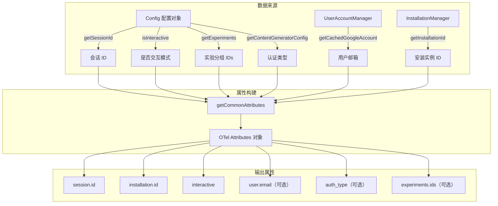

# telemetryAttributes.ts

## 概述

`telemetryAttributes.ts` 负责构建遥测数据中的 **通用属性（Common Attributes）**，这些属性会附加到所有遥测事件（指标、日志、跟踪）上，用于标识和区分不同的会话、安装实例、用户和实验分组。该文件是遥测系统中属性标准化的核心模块，确保所有遥测数据都携带一致的上下文信息。

## 架构图（Mermaid）



## 核心组件

### 1. 模块级单例实例

```typescript
const userAccountManager = new UserAccountManager();
const installationManager = new InstallationManager();
```

文件在模块加载时创建了两个管理器的实例：
- **`userAccountManager`**：负责管理和缓存 Google 用户账户信息
- **`installationManager`**：负责管理 CLI 安装实例的唯一标识

这两个实例在模块生命周期内保持存在，避免重复创建。

### 2. `getCommonAttributes(config: Config): Attributes`

核心导出函数，接受 `Config` 配置对象作为参数，返回符合 OpenTelemetry `Attributes` 接口的属性字典。

**返回的属性一览**：

| 属性键 | 类型 | 是否必需 | 来源 | 描述 |
|--------|------|---------|------|------|
| `session.id` | `string` | 是 | `config.getSessionId()` | 当前会话的唯一标识 |
| `installation.id` | `string` | 是 | `installationManager.getInstallationId()` | CLI 安装实例的唯一标识 |
| `interactive` | `boolean` | 是 | `config.isInteractive()` | 是否在交互模式下运行（vs 非交互/管道模式） |
| `user.email` | `string` | 否 | `userAccountManager.getCachedGoogleAccount()` | 用户的 Google 账户邮箱（仅在已缓存时包含） |
| `auth_type` | `string` | 否 | `config.getContentGeneratorConfig()?.authType` | 认证类型（仅在配置中存在时包含） |
| `experiments.ids` | `string[]` | 否 | `config.getExperiments()` | 用户所属的实验分组 ID 列表（仅在有实验时包含） |

**条件性属性包含机制**：
函数使用了 JavaScript 的展开运算符（spread operator）与短路求值相结合的模式来有条件地包含属性：
```typescript
...(email && { 'user.email': email }),
```
当 `email` 为 falsy（`undefined`、`null`、空字符串）时，展开运算符展开 `false`，不添加任何属性；当 `email` 有值时，展开 `{ 'user.email': email }` 对象，将属性加入结果。

对于 `experiments.ids`，还增加了数组长度检查：
```typescript
...(experiments && experiments.experimentIds.length > 0 && { 'experiments.ids': experiments.experimentIds }),
```
确保只有在实验 ID 列表非空时才包含该属性。

## 依赖关系

### 内部依赖

| 模块 | 导入内容 | 用途 |
|------|---------|------|
| `../config/config.js` | `Config`（类型） | 获取会话 ID、交互模式、实验分组、认证类型等配置信息 |
| `../utils/installationManager.js` | `InstallationManager` | 获取 CLI 安装实例的唯一标识符 |
| `../utils/userAccountManager.js` | `UserAccountManager` | 获取缓存的 Google 用户账户邮箱 |

### 外部依赖

| 包名 | 导入内容 | 用途 |
|------|---------|------|
| `@opentelemetry/api` | `Attributes`（类型） | OpenTelemetry 标准属性接口定义，确保返回的属性字典符合 OTel 规范 |

## 关键实现细节

1. **通用属性的设计理念**：`getCommonAttributes` 返回的属性集合旨在被附加到所有遥测信号（traces、metrics、logs）上。这些属性提供了分析遥测数据时必要的上下文维度，包括：
   - **会话维度**（`session.id`）：用于关联同一会话内的所有事件
   - **安装维度**（`installation.id`）：用于追踪同一安装实例的行为模式
   - **用户维度**（`user.email`）：用于关联特定用户的使用情况
   - **实验维度**（`experiments.ids`）：用于 A/B 测试的数据分组

2. **可选属性的安全处理**：使用展开运算符 + 短路求值的模式（`...(value && { key: value })`）来优雅地处理可选属性。相比 `if` 语句逐个添加，这种方式在对象字面量中更为简洁。注意这种模式依赖于 `...false` 在对象展开中不产生任何属性的行为。

3. **模块级实例的考量**：`UserAccountManager` 和 `InstallationManager` 在模块顶层实例化而非在函数内部创建。这意味着：
   - 实例在首次导入时创建，后续调用 `getCommonAttributes` 复用同一实例
   - 如果这些管理器内部有缓存机制，模块级实例可以跨调用共享缓存
   - 模块级实例的生命周期与进程一致

4. **认证类型链式访问**：`config.getContentGeneratorConfig()?.authType` 使用可选链操作符，安全处理 `getContentGeneratorConfig()` 返回 `undefined` 或 `null` 的情况。

5. **与 OpenTelemetry 的集成**：返回值类型为 `@opentelemetry/api` 的 `Attributes` 接口，这是 OTel 标准中用于表示键值对属性的通用接口。属性键使用点分命名空间（如 `session.id`、`user.email`、`experiments.ids`），遵循 OTel 属性命名惯例。
