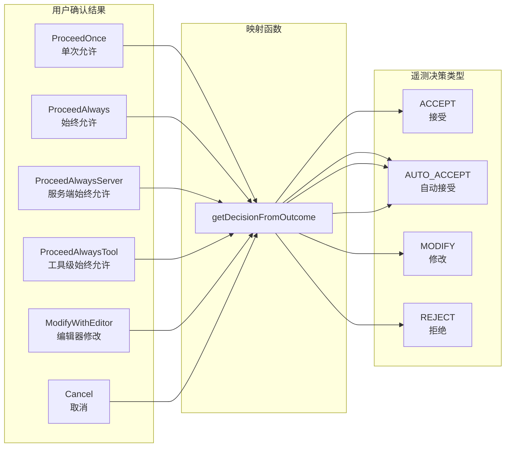

# tool-call-decision.ts

## 概述

`tool-call-decision.ts` 定义了遥测系统中用于记录 **工具调用决策（Tool Call Decision）** 的枚举和转换函数。当 Gemini 模型请求调用工具（如文件编辑、命令执行等）时，用户需要确认是否允许执行。该文件负责将用户的确认结果（`ToolConfirmationOutcome`）映射为标准化的遥测决策类型（`ToolCallDecision`），以便在遥测数据中统一记录用户对工具调用的审批行为。

## 架构图（Mermaid）



## 核心组件

### 1. `ToolCallDecision` 枚举

定义了 4 种标准化的工具调用决策类型：

```typescript
export enum ToolCallDecision {
    ACCEPT = 'accept',          // 用户明确接受（单次）
    REJECT = 'reject',          // 用户拒绝执行
    MODIFY = 'modify',          // 用户修改后执行
    AUTO_ACCEPT = 'auto_accept', // 自动接受（用户之前已授权"始终允许"）
}
```

| 枚举值 | 字符串值 | 含义 |
|--------|---------|------|
| `ACCEPT` | `'accept'` | 用户手动确认允许本次工具调用 |
| `REJECT` | `'reject'` | 用户拒绝本次工具调用，或取消操作 |
| `MODIFY` | `'modify'` | 用户通过编辑器修改了工具调用的参数后执行 |
| `AUTO_ACCEPT` | `'auto_accept'` | 工具调用被自动批准（用户先前设置了"始终允许"策略） |

### 2. `getDecisionFromOutcome(outcome: ToolConfirmationOutcome): ToolCallDecision`

将工具确认的具体结果映射为遥测决策类型。这是一个多对一的映射函数，将多种细粒度的确认结果归类为较少的遥测决策类别。

**映射关系详解**：

| ToolConfirmationOutcome | ToolCallDecision | 说明 |
|------------------------|------------------|------|
| `ProceedOnce` | `ACCEPT` | 用户明确批准本次执行 |
| `ProceedAlways` | `AUTO_ACCEPT` | 用户选择"始终允许"（全局级别） |
| `ProceedAlwaysServer` | `AUTO_ACCEPT` | 用户选择"始终允许"（服务端级别） |
| `ProceedAlwaysTool` | `AUTO_ACCEPT` | 用户选择"始终允许"（特定工具级别） |
| `ModifyWithEditor` | `MODIFY` | 用户在编辑器中修改了工具参数 |
| `Cancel` | `REJECT` | 用户取消了工具调用 |
| 默认值（其他） | `REJECT` | 未知结果默认视为拒绝 |

**设计特点**：
- 三种"始终允许"（`ProceedAlways`、`ProceedAlwaysServer`、`ProceedAlwaysTool`）统一映射为 `AUTO_ACCEPT`，遥测层不区分自动批准的粒度级别
- `Cancel` 和 `default` 分支合并，任何未知的确认结果都安全地归类为 `REJECT`

## 依赖关系

### 内部依赖

| 模块 | 导入内容 | 用途 |
|------|---------|------|
| `../tools/tools.js` | `ToolConfirmationOutcome` | 工具确认结果的枚举类型，是映射函数的输入类型 |

### 外部依赖

无外部依赖。

## 关键实现细节

1. **多对一映射的信息压缩**：源枚举 `ToolConfirmationOutcome` 有至少 6 种值，目标枚举 `ToolCallDecision` 仅有 4 种值。这种映射是有意为之的信息压缩——遥测层关注的是用户决策的大类（接受/拒绝/修改/自动接受），而非确认策略的具体粒度（全局/服务端/工具级别）。这简化了遥测数据的分析和可视化。

2. **安全的默认拒绝策略**：`default` 分支与 `Cancel` 共享 `REJECT` 返回值。这意味着如果未来 `ToolConfirmationOutcome` 新增了枚举值但此函数未更新，新值将默认被记录为"拒绝"，这是一种安全的保守策略——宁可误报拒绝，也不误报接受。

3. **遥测分析用途**：该枚举和函数的产出数据主要用于分析用户与工具调用的交互模式，例如：
   - 用户接受/拒绝工具调用的比率
   - 自动接受（始终允许）的使用频率
   - 用户修改工具调用参数的频率
   - 不同工具的接受率差异

4. **与工具安全模型的关系**：`ToolConfirmationOutcome` 是工具安全确认流程的产出，代表用户在工具执行前的审批决定。`ToolCallDecision` 则是这一决定在遥测维度的抽象表示。两者分离的设计使得工具系统和遥测系统可以独立演进。

5. **枚举值采用小写字符串**：`ToolCallDecision` 的值使用小写字符串（`'accept'`、`'reject'` 等），这是遥测属性值的常见约定，便于在查询和过滤遥测数据时使用。
