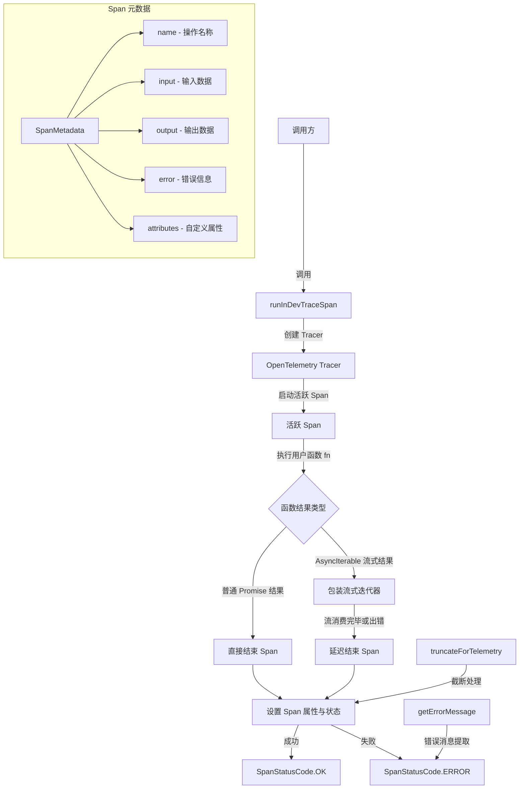

# trace.ts

## 概述

`trace.ts` 是 Gemini CLI 遥测追踪系统的核心执行模块。它基于 OpenTelemetry API 封装了 Span（追踪跨度）的创建、属性设置、错误处理和生命周期管理。该文件提供了一个关键函数 `runInDevTraceSpan`，用于在 OpenTelemetry Span 上下文中运行异步函数，并自动收集输入/输出、自定义属性和错误信息。同时支持对普通 Promise 和 AsyncIterable 流式结果的追踪。

## 架构图（Mermaid）

## 核心组件

### 1. `truncateForTelemetry(value, maxLength?)` 函数

**导出类型**: 公开导出

**功能**: 对遥测数据进行截断处理，防止过大的数据被发送到追踪后端。

**参数**:
- `value: unknown` - 待截断的值
- `maxLength: number` - 最大长度，默认 10000

**处理逻辑**:
| 值类型 | 处理方式 |
|--------|---------|
| `string` | 使用 `truncateString` 截断，并附加 `...[TRUNCATED: original length X]` 后缀 |
| `object` (非 null) | 先用 `safeJsonStringify` 序列化为字符串，再截断 |
| `number` / `boolean` | 直接返回原始值 |
| 其他类型 | 返回 `undefined` |

**返回值**: `AttributeValue | undefined`

### 2. `isAsyncIterable<T>(value)` 函数

**导出类型**: 私有（模块内部）

**功能**: 类型守卫函数，判断一个值是否为 AsyncIterable（异步可迭代对象）。通过检查对象上是否存在 `Symbol.asyncIterator` 属性来判断。

### 3. `SpanMetadata` 接口

**导出类型**: 公开导出

**功能**: 定义 Span 的元数据结构。

**字段**:
| 字段 | 类型 | 必填 | 说明 |
|------|------|------|------|
| `name` | `string` | 是 | Span 的名称 |
| `input` | `unknown` | 否 | Span 的输入数据 |
| `output` | `unknown` | 否 | Span 的输出数据 |
| `error` | `unknown` | 否 | 错误信息 |
| `attributes` | `Record<string, AttributeValue>` | 是 | 附加到 Span 的自定义属性键值对 |

### 4. `runInDevTraceSpan<R>(opts, fn)` 函数

**导出类型**: 公开导出

**功能**: 核心追踪函数。在一个新的 OpenTelemetry Span 中执行异步函数，自动管理 Span 的生命周期。

**参数**:
- `opts`: 包含 `SpanOptions`、`operation: GeminiCliOperation`（操作名，也用作 Span 名）和可选的 `logPrompts?: boolean`
- `fn`: 用户提供的异步函数，接收 `{ metadata: SpanMetadata }` 参数

**执行流程**:

1. 通过 `trace.getTracer(TRACER_NAME, TRACER_VERSION)` 获取名为 `gemini-cli` 版本 `v1` 的 Tracer
2. 调用 `tracer.startActiveSpan` 启动一个活跃 Span
3. 初始化 `SpanMetadata`，预填充标准属性：
   - `gen_ai.operation.name` - 操作名称
   - `gen_ai.agent.name` - 服务名称 (SERVICE_NAME)
   - `gen_ai.agent.description` - 服务描述 (SERVICE_DESCRIPTION)
   - `gen_ai.conversation.id` - 会话 ID (sessionId)
4. 执行用户函数 `fn`
5. **根据结果类型分流处理**:
   - **普通结果**: 直接在 `finally` 块中调用 `endSpan()` 结束 Span
   - **AsyncIterable 流式结果**: 用生成器函数包装原始流，在流消费完毕（`finally`）时才调用 `endSpan()`。通过 `Object.assign` 将原始对象的属性复制到包装后的流上

**`endSpan()` 内部逻辑**:
1. 如果 `logPrompts !== false`，将 `meta.input` 和 `meta.output` 截断后设置为 Span 属性
2. 遍历 `meta.attributes` 中的所有键值对，截断后设置为 Span 属性
3. 如果存在错误，设置 Span 状态为 `ERROR`，若错误是 `Error` 实例则同时记录异常
4. 如果无错误，设置 Span 状态为 `OK`
5. 无论成功或失败，最终都调用 `span.end()` 结束 Span
6. 整个 `endSpan` 内部用 try-catch 保护，确保即使属性设置出错，Span 也一定会被结束

### 5. `getErrorMessage(e)` 函数

**导出类型**: 私有（模块内部）

**功能**: 从任意错误对象中提取错误消息字符串。

**处理逻辑**:
- `Error` 实例 -> 返回 `e.message`
- `string` 类型 -> 直接返回
- 其他类型 -> 使用 `safeJsonStringify` 序列化后返回

### 6. 模块常量

| 常量 | 值 | 用途 |
|------|-----|------|
| `TRACER_NAME` | `'gemini-cli'` | OpenTelemetry Tracer 名称 |
| `TRACER_VERSION` | `'v1'` | OpenTelemetry Tracer 版本 |

## 依赖关系

### 内部依赖

| 依赖模块 | 导入项 | 用途 |
|---------|-------|------|
| `../utils/safeJsonStringify.js` | `safeJsonStringify` | 安全 JSON 序列化，用于截断对象和提取错误消息 |
| `./constants.js` | `GeminiCliOperation`, `GEN_AI_AGENT_DESCRIPTION`, `GEN_AI_AGENT_NAME`, `GEN_AI_CONVERSATION_ID`, `GEN_AI_INPUT_MESSAGES`, `GEN_AI_OPERATION_NAME`, `GEN_AI_OUTPUT_MESSAGES`, `SERVICE_DESCRIPTION`, `SERVICE_NAME` | 遥测常量定义，包括属性名和服务元数据 |
| `../utils/session.js` | `sessionId` | 当前会话唯一标识，用于关联同一会话的所有 Span |
| `../utils/textUtils.js` | `truncateString` | 字符串截断工具函数 |

### 外部依赖

| 依赖包 | 导入项 | 用途 |
|--------|-------|------|
| `@opentelemetry/api` | `diag`, `SpanStatusCode`, `trace`, `AttributeValue` (类型), `SpanOptions` (类型) | OpenTelemetry 核心 API：诊断日志、Span 状态码枚举、全局追踪入口、属性值类型、Span 选项类型 |

## 关键实现细节

1. **流式结果的延迟 Span 结束**: 对于返回 `AsyncIterable` 的函数，Span 不会在函数返回时立即结束，而是在流被完全消费（迭代完毕或抛出异常）后才结束。这是通过一个包装生成器函数实现的，该生成器在 `finally` 块中调用 `endSpan()`。

2. **流式包装的属性保留**: 使用 `Object.assign(streamWrapper, result)` 确保原始结果对象上的其他属性（非迭代器属性）在包装后仍然可访问。

3. **防御性错误处理**: `endSpan()` 函数内部使用了 try-catch-finally 结构。即使在设置 Span 属性的过程中发生异常（如序列化错误），`span.end()` 也一定会被调用，防止 Span 泄漏。

4. **遥测数据截断**: 所有写入 Span 的属性值都经过 `truncateForTelemetry` 处理，默认最大长度为 10000 字符，防止过大的数据影响遥测系统性能。

5. **可选的 Prompt 日志记录**: 通过 `logPrompts` 参数控制是否将输入/输出消息记录到 Span 属性中。默认情况下会记录（`logPrompts !== false`），但可以显式设置为 `false` 来禁用，用于保护敏感的 Prompt 数据。

6. **元数据的可变引用模式**: `SpanMetadata` 对象通过引用传递给用户函数 `fn`，用户可以在函数执行过程中随时修改 `metadata.input`、`metadata.output` 和 `metadata.attributes`，这些修改会在 Span 结束时被自动采集。
