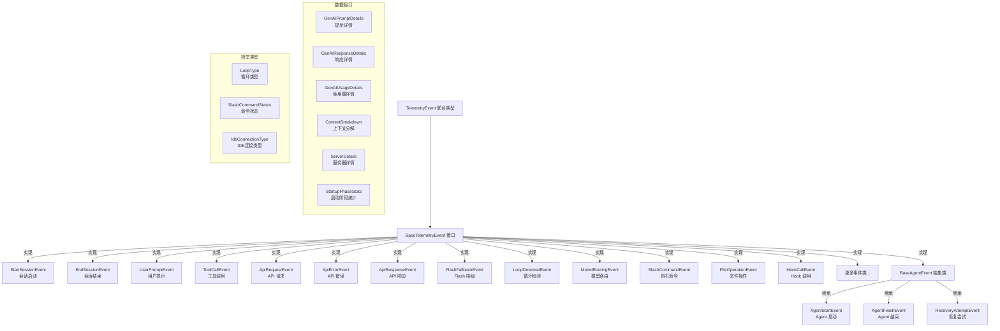

# types.ts

## 概述

`types.ts` 是 Gemini CLI 遥测系统的类型定义和事件类核心文件。它定义了所有遥测事件的数据结构（超过 30 个事件类/接口），涵盖了 CLI 生命周期中的各个关键阶段：从会话启动到结束、用户提示、API 请求/响应/错误、工具调用、循环检测、模型路由、扩展管理、Hook 调用、编辑策略等。每个事件类都实现了统一的 `BaseTelemetryEvent` 接口，并提供 `toOpenTelemetryAttributes()` 和 `toLogBody()` 方法，用于将事件数据转换为 OpenTelemetry 日志属性和可读的日志文本。

## 架构图（Mermaid）

## 核心组件

### 1. `BaseTelemetryEvent` 接口

所有遥测事件的基础接口，定义了两个必备字段：

| 字段 | 类型 | 说明 |
|------|------|------|
| `event.name` | `string` | 事件名称标识 |
| `event.timestamp` | `string` | ISO 8601 格式的时间戳 |

### 2. 会话生命周期事件

#### `StartSessionEvent` 类
**事件名**: `cli_config` / 常量: `EVENT_CLI_CONFIG = 'gemini_cli.config'`

记录 CLI 启动时的完整配置快照，字段极其丰富：

| 字段 | 类型 | 说明 |
|------|------|------|
| `model` | `string` | 使用的模型名称 |
| `embedding_model` | `string` | 嵌入模型名称 |
| `sandbox_enabled` | `boolean` | 沙箱是否启用 |
| `core_tools_enabled` | `string` | 启用的核心工具列表（逗号分隔） |
| `approval_mode` | `string` | 审批模式 |
| `api_key_enabled` | `boolean` | API Key 是否启用 |
| `vertex_ai_enabled` | `boolean` | Vertex AI 是否启用 |
| `debug_enabled` | `boolean` | 调试模式是否启用 |
| `mcp_servers` | `string` | MCP 服务器名称列表 |
| `telemetry_enabled` | `boolean` | 遥测是否启用 |
| `telemetry_log_user_prompts_enabled` | `boolean` | 是否记录用户提示 |
| `file_filtering_respect_git_ignore` | `boolean` | 是否遵守 .gitignore |
| `mcp_servers_count` | `number` | MCP 服务器数量 |
| `mcp_tools_count` | `number` | MCP 工具数量（可选） |
| `mcp_tools` | `string` | MCP 工具名称列表（可选） |
| `output_format` | `OutputFormat` | 输出格式 |
| `extensions_count` | `number` | 扩展数量 |
| `extensions` | `string` | 扩展名称列表 |
| `extension_ids` | `string` | 扩展 ID 列表 |
| `auth_type` | `string` | 认证类型（可选） |
| `worktree_active` | `boolean` | Git Worktree 是否活跃 |

构造函数从 `Config` 对象中提取所有配置信息，可选择性传入 `ToolRegistry` 以获取 MCP 工具信息。

#### `EndSessionEvent` 类
**事件名**: `end_session`

记录会话结束，包含可选的 `session_id`。

### 3. 用户交互事件

#### `UserPromptEvent` 类
**事件名**: `user_prompt` / 常量: `EVENT_USER_PROMPT = 'gemini_cli.user_prompt'`

| 字段 | 类型 | 说明 |
|------|------|------|
| `prompt_length` | `number` | 提示文本长度 |
| `prompt_id` | `string` | 提示唯一标识 |
| `auth_type` | `string` | 认证类型（可选） |
| `prompt` | `string` | 提示内容（可选，受隐私控制） |

**隐私控制**: `prompt` 字段仅在 `config.getTelemetryLogPromptsEnabled()` 为 `true` 时才写入遥测属性。

### 4. API 通信事件

#### `ApiRequestEvent` 类
**事件名**: `api_request` / 常量: `EVENT_API_REQUEST = 'gemini_cli.api_request'`

记录发送给 Gemini API 的请求。提供两种日志记录方法：
- `toLogRecord()` - 基础日志记录
- `toSemanticLogRecord()` - 符合 GenAI 语义约定的日志记录，包含 `GenerateContentConfig` 属性、服务器地址、输入消息等

#### `ApiResponseEvent` 类
**事件名**: `api_response` / 常量: `EVENT_API_RESPONSE = 'gemini_cli.api_response'`

记录 API 响应，包含丰富的使用量数据：

| 字段 | 类型 | 说明 |
|------|------|------|
| `model` | `string` | 模型名称 |
| `duration_ms` | `number` | 请求耗时（毫秒） |
| `usage` | `GenAIUsageDetails` | Token 使用量详情 |
| `finish_reasons` | `OTelFinishReason[]` | 完成原因列表 |
| `response` | `GenAIResponseDetails` | 响应详情 |
| `prompt` | `GenAIPromptDetails` | 请求提示详情 |

同样提供 `toLogRecord()` 和 `toSemanticLogRecord()` 两种记录方法。

#### `ApiErrorEvent` 类
**事件名**: `api_error` / 常量: `EVENT_API_ERROR = 'gemini_cli.api_error'`

记录 API 错误，包含错误信息、错误类型、HTTP 状态码和持续时间。使用 `SemanticAttributes.HTTP_STATUS_CODE` 设置语义化的 HTTP 状态码属性。

### 5. 工具调用事件

#### `ToolCallEvent` 类
**事件名**: `tool_call` / 常量: `EVENT_TOOL_CALL = 'gemini_cli.tool_call'`

最复杂的事件类之一，支持两种构造方式（函数重载）：
1. 从 `CompletedToolCall` 对象构造（自动提取所有信息）
2. 手动指定各参数

| 字段 | 类型 | 说明 |
|------|------|------|
| `function_name` | `string` | 工具函数名称 |
| `function_args` | `Record<string, unknown>` | 函数参数 |
| `duration_ms` | `number` | 调用耗时 |
| `success` | `boolean` | 是否成功 |
| `decision` | `ToolCallDecision` | 工具调用决策（可选） |
| `tool_type` | `'native' \| 'mcp'` | 工具类型 |
| `content_length` | `number` | 内容长度（可选） |
| `mcp_server_name` | `string` | MCP 服务器名称（可选） |
| `extension_name` | `string` | 扩展名称（可选） |
| `extension_id` | `string` | 扩展 ID（可选） |
| `metadata` | `object` | 额外元数据（文件 diff 统计等） |

**特殊逻辑**: 当工具调用成功且结果包含文件 diff 时，自动提取 `model_added_lines`、`model_removed_lines` 等 diff 统计信息到 metadata。

### 6. 循环检测事件

#### `LoopType` 枚举

| 值 | 说明 |
|----|------|
| `CONSECUTIVE_IDENTICAL_TOOL_CALLS` | 连续相同的工具调用 |
| `CHANTING_IDENTICAL_SENTENCES` | 重复相同的句子 |
| `LLM_DETECTED_LOOP` | LLM 检测到的循环 |

#### `LoopDetectedEvent` 类
**事件名**: `loop_detected`

记录循环检测结果，包含循环类型、计数、是否由模型确认、分析文本和置信度。`toLogBody()` 会根据 `count` 值判断是"尝试恢复"还是"终止会话"。

#### `LlmLoopCheckEvent` 类
**事件名**: `llm_loop_check` / 常量: `EVENT_LLM_LOOP_CHECK`

记录 LLM 循环检查结果，包含 Flash 模型置信度和主模型置信度。

### 7. 模型路由事件

#### `ModelRoutingEvent` 类
**事件名**: `model_routing` / 常量: `EVENT_MODEL_ROUTING = 'gemini_cli.model_routing'`

| 字段 | 类型 | 说明 |
|------|------|------|
| `decision_model` | `string` | 决策选择的模型 |
| `decision_source` | `string` | 决策来源 |
| `routing_latency_ms` | `number` | 路由决策延迟 |
| `reasoning` | `string` | 决策理由（可选） |
| `failed` | `boolean` | 路由是否失败 |
| `approval_mode` | `ApprovalMode` | 审批模式 |
| `enable_numerical_routing` | `boolean` | 是否启用数值路由（可选） |
| `classifier_threshold` | `string` | 分类器阈值（可选） |

### 8. 降级与重试事件

#### `FlashFallbackEvent` 类
**事件名**: `flash_fallback` / 常量: `EVENT_FLASH_FALLBACK`

记录降级到 Flash 模型的事件。

#### `RipgrepFallbackEvent` 类
**事件名**: `ripgrep_fallback` / 常量: `EVENT_RIPGREP_FALLBACK`

记录从 ripgrep 降级到 grep 的事件。

#### `ContentRetryEvent` 类
**事件名**: `content_retry` / 常量: `EVENT_CONTENT_RETRY`

记录内容生成的重试尝试，包含尝试次数、错误类型、重试延迟和模型。

#### `ContentRetryFailureEvent` 类
**事件名**: `content_retry_failure` / 常量: `EVENT_CONTENT_RETRY_FAILURE`

记录所有重试失败后的最终状态。

#### `NetworkRetryAttemptEvent` 类
**事件名**: `network_retry_attempt` / 常量: `EVENT_NETWORK_RETRY_ATTEMPT`

记录网络层面的重试尝试。

#### `WebFetchFallbackAttemptEvent` 类
**事件名**: `web_fetch_fallback_attempt` / 常量: `EVENT_WEB_FETCH_FALLBACK_ATTEMPT`

Web 抓取降级尝试，原因类型 `WebFetchFallbackReason` 包含: `'private_ip'`、`'primary_failed'`、`'private_ip_skipped'`。

### 9. 扩展管理事件

四个扩展相关事件类，均记录扩展名称、哈希后名称、ID 和操作状态：

| 事件类 | 事件常量 | 说明 |
|--------|---------|------|
| `ExtensionInstallEvent` | `EVENT_EXTENSION_INSTALL` | 扩展安装 |
| `ExtensionUninstallEvent` | `EVENT_EXTENSION_UNINSTALL` | 扩展卸载 |
| `ExtensionUpdateEvent` | `EVENT_EXTENSION_UPDATE` | 扩展更新（含版本变更） |
| `ExtensionEnableEvent` | `EVENT_EXTENSION_ENABLE` | 扩展启用 |
| `ExtensionDisableEvent` | `EVENT_EXTENSION_DISABLE` | 扩展禁用 |

### 10. Agent 生命周期事件

基于 `BaseAgentEvent` 抽象类的三个事件：

#### `BaseAgentEvent` 抽象类
提供 `agent_id` 和 `agent_name` 基础字段和通用的 `toOpenTelemetryAttributes()` 方法。

#### `AgentStartEvent` 类
**事件名**: `agent_start` / 常量: `EVENT_AGENT_START`

#### `AgentFinishEvent` 类
**事件名**: `agent_finish` / 常量: `EVENT_AGENT_FINISH`

额外包含 `duration_ms`、`turn_count` 和 `terminate_reason`。

#### `RecoveryAttemptEvent` 类
**事件名**: `agent_recovery_attempt` / 常量: `EVENT_AGENT_RECOVERY_ATTEMPT`

额外包含恢复原因、持续时间、是否成功和回合数。

### 11. 其他事件类

| 事件类 | 事件常量 | 说明 |
|--------|---------|------|
| `SlashCommandEvent` | `EVENT_SLASH_COMMAND` | 斜杠命令（接口+工厂函数） |
| `ChatCompressionEvent` | `EVENT_CHAT_COMPRESSION` | 聊天压缩（接口+工厂函数） |
| `RewindEvent` | `EVENT_REWIND` | 回退操作 |
| `FileOperationEvent` | `EVENT_FILE_OPERATION` | 文件操作 |
| `InvalidChunkEvent` | `EVENT_INVALID_CHUNK` | 无效的流数据块 |
| `MalformedJsonResponseEvent` | `EVENT_MALFORMED_JSON_RESPONSE` | 畸形 JSON 响应 |
| `IdeConnectionEvent` | `EVENT_IDE_CONNECTION` | IDE 连接 |
| `ConversationFinishedEvent` | `EVENT_CONVERSATION_FINISHED` | 对话完成 |
| `NextSpeakerCheckEvent` | `EVENT_NEXT_SPEAKER_CHECK` | 下一发言者检查 |
| `ToolOutputTruncatedEvent` | `EVENT_TOOL_OUTPUT_TRUNCATED` | 工具输出截断 |
| `ToolOutputMaskingEvent` | `EVENT_TOOL_OUTPUT_MASKING` | 工具输出遮蔽 |
| `EditStrategyEvent` | `EVENT_EDIT_STRATEGY` | 编辑策略 |
| `EditCorrectionEvent` | `EVENT_EDIT_CORRECTION` | 编辑修正 |
| `StartupStatsEvent` | `EVENT_STARTUP_STATS` | 启动统计 |
| `HookCallEvent` | `EVENT_HOOK_CALL` | Hook 调用 |
| `ConsecaPolicyGenerationEvent` | `EVENT_CONSECA_POLICY_GENERATION` | Conseca 策略生成 |
| `ConsecaVerdictEvent` | `EVENT_CONSECA_VERDICT` | Conseca 判决 |
| `ApprovalModeSwitchEvent` | `EVENT_APPROVAL_MODE_SWITCH` | 审批模式切换 |
| `ApprovalModeDurationEvent` | `EVENT_APPROVAL_MODE_DURATION` | 审批模式持续时间 |
| `PlanExecutionEvent` | `EVENT_PLAN_EXECUTION` | 计划执行 |
| `KeychainAvailabilityEvent` | `EVENT_KEYCHAIN_AVAILABILITY` | 钥匙串可用性 |
| `OnboardingStartEvent` | `EVENT_ONBOARDING_START` | 引导流程开始 |
| `OnboardingSuccessEvent` | `EVENT_ONBOARDING_SUCCESS` | 引导流程成功 |
| `TokenStorageInitializationEvent` | `EVENT_TOKEN_STORAGE_INITIALIZATION` | Token 存储初始化 |
| `ModelSlashCommandEvent` | `EVENT_MODEL_SLASH_COMMAND` | 模型斜杠命令 |
| `LoopDetectionDisabledEvent` | - | 循环检测禁用 |

### 12. 数据接口

#### `GenAIPromptDetails` 接口
| 字段 | 类型 | 说明 |
|------|------|------|
| `prompt_id` | `string` | 提示 ID |
| `contents` | `Content[]` | 内容数组 |
| `generate_content_config` | `GenerateContentConfig` | 生成配置（可选） |
| `server` | `ServerDetails` | 服务器详情（可选） |

#### `GenAIResponseDetails` 接口
| 字段 | 类型 | 说明 |
|------|------|------|
| `response_id` | `string` | 响应 ID（可选） |
| `candidates` | `Candidate[]` | 候选结果数组（可选） |

#### `GenAIUsageDetails` 接口
| 字段 | 类型 | 说明 |
|------|------|------|
| `input_token_count` | `number` | 输入 Token 数 |
| `output_token_count` | `number` | 输出 Token 数 |
| `cached_content_token_count` | `number` | 缓存内容 Token 数 |
| `thoughts_token_count` | `number` | 思考 Token 数 |
| `tool_token_count` | `number` | 工具 Token 数 |
| `total_token_count` | `number` | 总 Token 数 |
| `context_breakdown` | `ContextBreakdown` | 上下文分解（可选） |

#### `ContextBreakdown` 接口
| 字段 | 类型 | 说明 |
|------|------|------|
| `system_instructions` | `number` | 系统指令占用 |
| `tool_definitions` | `number` | 工具定义占用 |
| `history` | `number` | 历史消息占用 |
| `tool_calls` | `Record<string, number>` | 各工具调用占用 |
| `mcp_servers` | `number` | MCP 服务器占用 |

#### `ServerDetails` 接口
| 字段 | 类型 |
|------|------|
| `address` | `string` |
| `port` | `number` |

#### `StartupPhaseStats` 接口
| 字段 | 类型 | 说明 |
|------|------|------|
| `name` | `string` | 阶段名称 |
| `duration_ms` | `number` | 持续时间（毫秒） |
| `cpu_usage_user_usec` | `number` | 用户 CPU 时间（微秒） |
| `cpu_usage_system_usec` | `number` | 系统 CPU 时间（微秒） |
| `start_time_usec` | `number` | 开始时间（微秒） |
| `end_time_usec` | `number` | 结束时间（微秒） |

### 13. `TelemetryEvent` 联合类型

定义所有遥测事件的联合类型（约 30+ 类型），用于遥测系统的类型安全分发。

### 14. `toGenerateContentConfigAttributes()` 辅助函数

**导出类型**: 模块内部私有

将 `GenerateContentConfig` 转换为 OpenTelemetry 日志属性，映射关系：

| 配置字段 | 属性名 |
|---------|--------|
| `temperature` | `gen_ai.request.temperature` |
| `topP` | `gen_ai.request.top_p` |
| `topK` | `gen_ai.request.top_k` |
| `candidateCount` | `gen_ai.request.choice.count` |
| `seed` | `gen_ai.request.seed` |
| `frequencyPenalty` | `gen_ai.request.frequency_penalty` |
| `presencePenalty` | `gen_ai.request.presence_penalty` |
| `maxOutputTokens` | `gen_ai.request.max_tokens` |
| `responseMimeType` | `gen_ai.output.type`（经 `toOutputType` 转换） |
| `stopSequences` | `gen_ai.request.stop_sequences` |
| `systemInstruction` | `gen_ai.system_instructions`（经 `toSystemInstruction` 转换并序列化） |

## 依赖关系

### 内部依赖

| 依赖模块 | 导入项 | 用途 |
|---------|-------|------|
| `../config/config.js` | `Config` (类型) | 配置对象类型，用于获取各事件的通用属性 |
| `../policy/types.js` | `ApprovalMode` (类型) | 审批模式类型 |
| `../scheduler/types.js` | `CompletedToolCall` (类型), `CoreToolCallStatus` | 工具调用结果类型和状态枚举 |
| `../tools/mcp-tool.js` | `DiscoveredMCPTool` | MCP 工具类，用于判断工具类型和提取服务器信息 |
| `../core/contentGenerator.js` | `AuthType` | 认证类型枚举 |
| `./tool-call-decision.js` | `getDecisionFromOutcome`, `ToolCallDecision` | 工具调用决策相关 |
| `./metrics.js` | `getConventionAttributes`, `FileOperation` (类型) | 获取约定属性、文件操作类型 |
| `../tools/tool-registry.js` | `ToolRegistry` (类型) | 工具注册表类型 |
| `../output/types.js` | `OutputFormat` (类型) | 输出格式类型 |
| `../agents/types.js` | `AgentTerminateMode` (类型) | Agent 终止模式类型 |
| `./telemetryAttributes.js` | `getCommonAttributes` | 获取所有事件共有的通用属性 |
| `../utils/safeJsonStringify.js` | `safeJsonStringify` | 安全 JSON 序列化 |
| `./semantic.js` | `toInputMessages`, `toOutputMessages`, `toFinishReasons`, `toOutputType`, `toSystemInstruction`, `OTelFinishReason` (类型) | 语义化转换函数 |
| `./sanitize.js` | `sanitizeHookName` | Hook 名称脱敏 |
| `../utils/fileDiffUtils.js` | `getFileDiffFromResultDisplay` | 从工具结果中提取文件 diff |
| `./llmRole.js` | `LlmRole` | LLM 角色枚举 |
| `../hooks/types.js` | `HookType` (类型) | Hook 类型 |

### 外部依赖

| 依赖包 | 导入项 | 用途 |
|--------|-------|------|
| `@google/genai` | `Candidate`, `Content`, `GenerateContentConfig`, `GenerateContentResponseUsageMetadata` (类型) | Google GenAI SDK 的核心类型 |
| `@opentelemetry/api-logs` | `LogAttributes`, `LogRecord` (类型) | OpenTelemetry 日志 API 类型 |
| `@opentelemetry/semantic-conventions` | `SemanticAttributes` | OpenTelemetry 语义约定常量（如 HTTP_STATUS_CODE） |

## 关键实现细节

1. **统一的事件模式**: 所有事件类都遵循相同的模式 -- 实现 `BaseTelemetryEvent` 接口，提供 `toOpenTelemetryAttributes(config)` 和 `toLogBody()` 方法。`toOpenTelemetryAttributes` 始终以 `getCommonAttributes(config)` 作为基础，确保所有事件都携带通用属性。

2. **双重日志记录**: API 相关事件（`ApiRequestEvent`、`ApiResponseEvent`、`ApiErrorEvent`）提供两种日志记录方法：
   - `toLogRecord()` - 传统的简单日志记录
   - `toSemanticLogRecord()` - 符合 GenAI 语义约定（`gen_ai.client.inference.operation.details`）的标准化记录，包含更丰富的结构化属性

3. **隐私保护机制**: 多个事件在序列化时会检查 `config.getTelemetryLogPromptsEnabled()`，只有在明确启用时才记录用户提示内容、Hook 输入/输出等敏感数据。`HookCallEvent` 在未启用完整日志时会使用 `sanitizeHookName()` 对 Hook 名称进行脱敏。

4. **工厂函数模式**: `SlashCommandEvent` 和 `ChatCompressionEvent` 使用接口+工厂函数（`makeSlashCommandEvent`、`makeChatCompressionEvent`）模式替代类，返回带有方法的普通对象。

5. **ToolCallEvent 的复杂构造**: 支持两种构造方式（函数重载），从 `CompletedToolCall` 构造时会自动：
   - 判断是否为 MCP 工具并提取服务器/扩展信息
   - 从结果中提取 diff 统计信息（`model_added_lines` 等）
   - 合并响应数据到 metadata

6. **事件常量命名约定**: 所有事件常量以 `EVENT_` 前缀命名，值遵循 `gemini_cli.<category>.<action>` 的点分命名空间格式。

7. **重导出模式**: 文件重导出了 `ToolCallDecision` 和 `LlmRole`，使消费者可以直接从 `types.ts` 导入这些类型。
