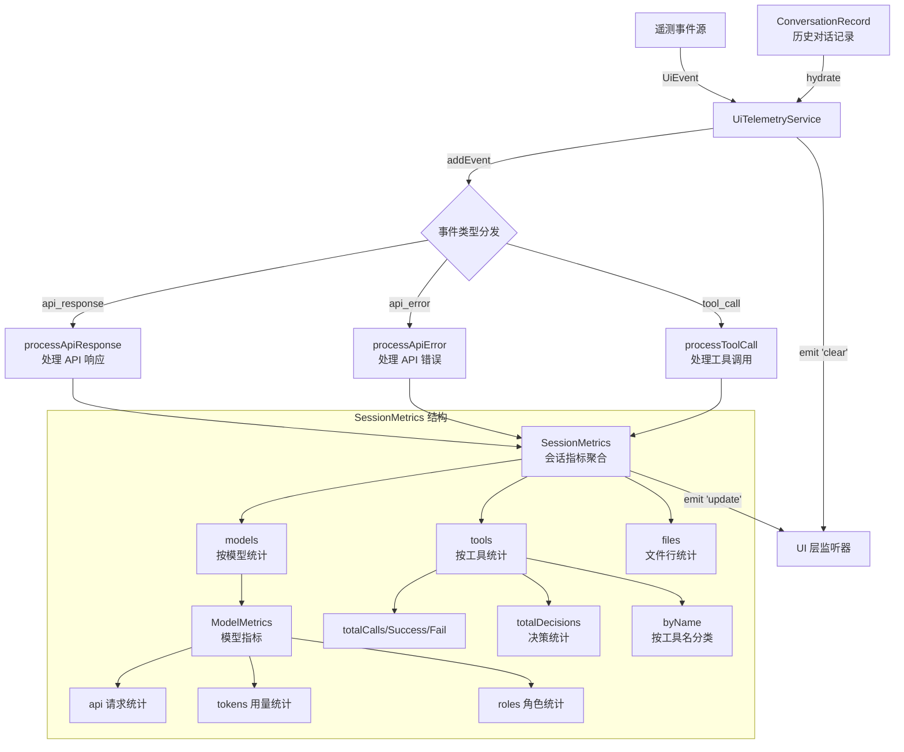

# uiTelemetry.ts

## 概述

`uiTelemetry.ts` 是 Gemini CLI 面向 UI 层的遥测聚合服务模块。它提供了一个基于 `EventEmitter` 的 `UiTelemetryService` 服务类，负责实时收集和聚合来自 API 响应、API 错误、工具调用三类遥测事件的指标数据，并在数据更新时通过事件机制通知 UI 层刷新显示。该模块是连接底层遥测事件系统和上层 UI 展示层的桥梁，提供了按模型、按角色、按工具名称分类的多维度指标统计，还支持从历史对话记录中恢复（hydrate）指标状态。

## 架构图（Mermaid）



## 核心组件

### 1. `UiEvent` 联合类型

定义了 UI 遥测服务接受的三种事件类型：

| 类型 | 事件名 | 说明 |
|------|--------|------|
| `ApiResponseEvent` | `EVENT_API_RESPONSE` | API 响应事件 |
| `ApiErrorEvent` | `EVENT_API_ERROR` | API 错误事件 |
| `ToolCallEvent` | `EVENT_TOOL_CALL` | 工具调用事件 |

每个类型通过交叉类型 `&` 确保 `event.name` 字段的类型精确匹配对应的事件常量。

### 2. `ToolCallStats` 接口

单个工具的调用统计：

| 字段 | 类型 | 说明 |
|------|------|------|
| `count` | `number` | 总调用次数 |
| `success` | `number` | 成功次数 |
| `fail` | `number` | 失败次数 |
| `durationMs` | `number` | 累计耗时（毫秒） |
| `decisions` | `object` | 各决策类型的计数（ACCEPT/REJECT/MODIFY/AUTO_ACCEPT） |

### 3. `RoleMetrics` 接口

按 LLM 角色（如主模型、子代理等）统计的指标：

| 字段 | 类型 | 说明 |
|------|------|------|
| `totalRequests` | `number` | 总请求数 |
| `totalErrors` | `number` | 总错误数 |
| `totalLatencyMs` | `number` | 总延迟（毫秒） |
| `tokens` | `object` | Token 使用量（input/prompt/candidates/total/cached/thoughts/tool） |

### 4. `ModelMetrics` 接口

按模型统计的指标：

| 字段 | 类型 | 说明 |
|------|------|------|
| `api` | `object` | API 层面统计（totalRequests/totalErrors/totalLatencyMs） |
| `tokens` | `object` | 累计 Token 使用量（input/prompt/candidates/total/cached/thoughts/tool） |
| `roles` | `Partial<Record<LlmRole, RoleMetrics>>` | 按角色细分的指标 |

### 5. `SessionMetrics` 接口

整个会话的汇总指标，是 UI 层主要消费的数据结构：

| 字段 | 类型 | 说明 |
|------|------|------|
| `models` | `Record<string, ModelMetrics>` | 按模型名称索引的指标集合 |
| `tools.totalCalls` | `number` | 工具总调用次数 |
| `tools.totalSuccess` | `number` | 工具总成功次数 |
| `tools.totalFail` | `number` | 工具总失败次数 |
| `tools.totalDurationMs` | `number` | 工具总耗时 |
| `tools.totalDecisions` | `object` | 各决策类型的汇总计数 |
| `tools.byName` | `Record<string, ToolCallStats>` | 按工具名称索引的详细统计 |
| `files.totalLinesAdded` | `number` | 文件总新增行数 |
| `files.totalLinesRemoved` | `number` | 文件总删除行数 |

### 6. `UiTelemetryService` 类

**继承自**: `EventEmitter`

**私有字段**:
- `#metrics: SessionMetrics` - 当前会话的聚合指标
- `#lastPromptTokenCount: number` - 最近一次提示的 Token 数量

#### 公开方法

##### `addEvent(event: UiEvent): void`
核心入口方法。根据事件类型分发到不同的处理方法，处理完成后触发 `'update'` 事件通知 UI 层。

##### `getMetrics(): SessionMetrics`
获取当前会话的所有聚合指标。

##### `getLastPromptTokenCount(): number`
获取最近一次提示的 Token 数。

##### `setLastPromptTokenCount(lastPromptTokenCount: number): void`
手动设置最近提示 Token 数并触发 `'update'` 事件。

##### `clear(newSessionId?: string): void`
重置所有指标到初始状态，触发 `'clear'` 事件（带可选的新会话 ID），然后触发 `'update'` 事件。

##### `hydrate(conversation: ConversationRecord): void`
从历史对话记录中恢复指标状态。用于会话恢复场景。处理流程：
1. 先调用 `clear()` 重置状态
2. 遍历所有 `gemini` 类型的消息，恢复 API 请求统计和 Token 用量
3. 恢复工具调用统计
4. 将最后一条消息的总 Token 数设为 `lastPromptTokenCount`（代表当前上下文大小）
5. 触发 `'update'` 事件

#### 私有方法

##### `getOrCreateModelMetrics(modelName: string): ModelMetrics`
按模型名称获取或创建初始指标对象。

##### `processApiResponse(event: ApiResponseEvent): void`
处理 API 响应事件：
- 累加模型级别的请求数、延迟、Token 用量
- 计算 `input = max(0, prompt - cached)` 作为实际输入 Token 数
- 如果事件包含 `role` 信息，同时更新角色级别的指标

##### `processApiError(event: ApiErrorEvent): void`
处理 API 错误事件：
- 累加请求数、错误数、延迟
- 如果包含 `role`，同时更新角色级别的指标

##### `processToolCall(event: ToolCallEvent): void`
处理工具调用事件：
- 累加全局工具统计
- 按工具名称累加细分统计
- 处理决策计数（ACCEPT/REJECT/MODIFY/AUTO_ACCEPT）
- 从 `metadata` 中提取文件行增删统计（`model_added_lines`/`model_removed_lines`）

### 7. 初始化工厂函数

| 函数名 | 用途 |
|--------|------|
| `createInitialRoleMetrics()` | 创建角色指标的零值初始对象 |
| `createInitialModelMetrics()` | 创建模型指标的零值初始对象 |
| `createInitialMetrics()` | 创建会话指标的零值初始对象 |

### 8. 模块单例

```typescript
export const uiTelemetryService = new UiTelemetryService();
```

导出一个全局单例实例，整个应用共享同一个 UI 遥测服务。

## 依赖关系

### 内部依赖

| 依赖模块 | 导入项 | 用途 |
|---------|-------|------|
| `./types.js` | `EVENT_API_ERROR`, `EVENT_API_RESPONSE`, `EVENT_TOOL_CALL`, `ApiErrorEvent` (类型), `ApiResponseEvent` (类型), `ToolCallEvent` (类型), `LlmRole` (类型) | 遥测事件类型定义和事件名常量 |
| `./tool-call-decision.js` | `ToolCallDecision` | 工具调用决策枚举（ACCEPT/REJECT/MODIFY/AUTO_ACCEPT） |
| `../services/chatRecordingService.js` | `ConversationRecord` (类型) | 对话记录类型，用于 `hydrate` 恢复 |

### 外部依赖

| 依赖包 | 导入项 | 用途 |
|--------|-------|------|
| `node:events` | `EventEmitter` | Node.js 内置事件发射器，作为 `UiTelemetryService` 的基类 |

## 关键实现细节

1. **EventEmitter 模式**: `UiTelemetryService` 继承 `EventEmitter`，在指标更新时触发 `'update'` 事件、在清除时触发 `'clear'` 事件。UI 层通过监听这些事件来实时刷新显示，实现了遥测聚合与 UI 渲染的解耦。

2. **`update` 事件载荷**: 每次触发 `'update'` 事件时，会携带 `{ metrics, lastPromptTokenCount }` 载荷，UI 层可以直接消费完整的指标快照。

3. **Token 计算公式**: `input = max(0, prompt - cached)` 表示实际新增输入 Token 数（总提示 Token 减去缓存命中的 Token）。这是一个有意义的指标，反映了每次请求的实际上下文传输量。

4. **全局单例模式**: 模块底部导出 `uiTelemetryService` 单例，确保整个应用的 UI 遥测数据集中在一个实例中管理，避免数据分散。

5. **Hydrate 恢复机制**: `hydrate()` 方法支持从 `ConversationRecord` 历史记录中恢复指标状态。这在会话恢复场景中非常关键，用户重新打开之前的对话时，UI 可以显示正确的累计 Token 用量和工具调用统计。恢复时使用最后一条 Gemini 消息的 `total_token_count` 作为当前上下文大小的估算。

6. **三级指标层次**: 指标采用三级聚合结构：
   - **会话级**: `SessionMetrics` 全局汇总
   - **模型级**: `ModelMetrics` 按模型名称分类
   - **角色级**: `RoleMetrics` 在模型内按 LLM 角色细分

7. **文件变更统计**: `processToolCall` 会从工具调用的 `metadata` 中提取 `model_added_lines` 和 `model_removed_lines`，累加到 `files.totalLinesAdded` 和 `files.totalLinesRemoved`，用于 UI 展示模型对文件的修改量。

8. **私有字段**: 使用 JavaScript 原生私有字段语法（`#metrics`、`#lastPromptTokenCount`），确保内部状态不会被外部直接访问或修改，仅通过公开的方法操作。
