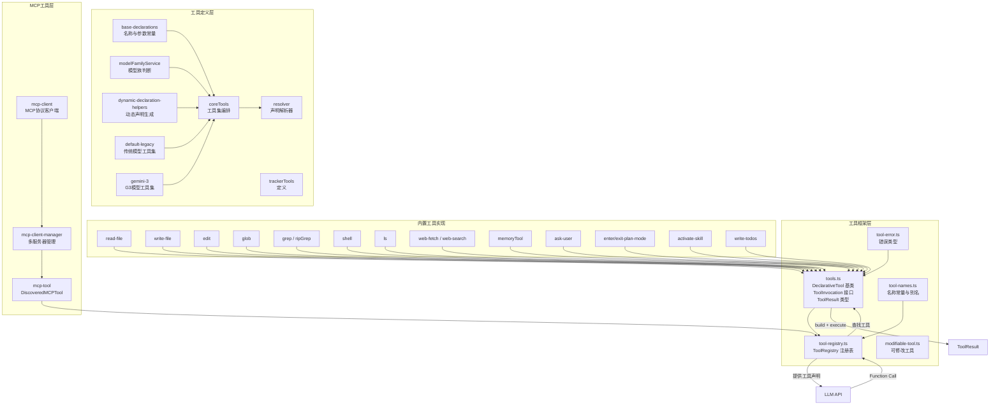
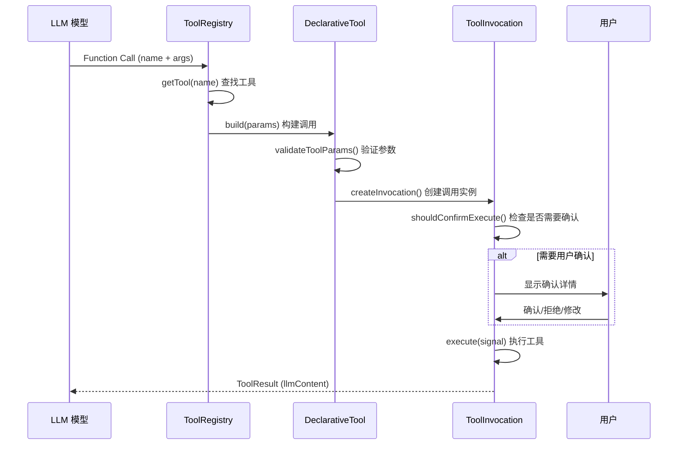
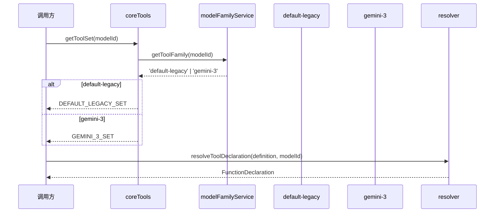

# tools

## 概述

`tools` 目录是 Gemini CLI 的**工具系统核心**，负责定义、注册、发现和执行所有可供 AI 模型调用的工具（Function Calling）。它实现了一套声明式工具框架，包含内置工具（文件操作、搜索、Shell 执行等）、MCP 协议工具、以及动态发现的外部工具。该目录是连接 LLM 与实际操作能力的桥梁。

## 目录结构

```
tools/
├── definitions/                  # 工具声明定义子目录（Schema、参数名等）
│   ├── base-declarations.ts      # 所有工具名称和参数名常量的基础注册表
│   ├── coreTools.ts              # 核心工具集编排器，按模型族解析工具定义
│   ├── types.ts                  # 工具定义相关类型（ToolFamily、ToolDefinition、CoreToolSet）
│   ├── resolver.ts               # 工具声明解析器，合并 base 与 overrides
│   ├── modelFamilyService.ts     # 模型族判断服务（default-legacy / gemini-3）
│   ├── dynamic-declaration-helpers.ts  # 动态工具声明生成（Shell、ExitPlanMode、ActivateSkill）
│   ├── trackerTools.ts           # 任务追踪器工具定义
│   └── model-family-sets/        # 按模型族组织的完整工具 Schema 集合
│       ├── default-legacy.ts     # 默认/传统模型的工具集
│       └── gemini-3.ts           # Gemini 3 模型优化的工具集
├── tools.ts                      # 核心类型与基类（ToolInvocation、DeclarativeTool、ToolResult 等）
├── tool-registry.ts              # 工具注册表（ToolRegistry），管理工具的注册、发现和查询
├── tool-names.ts                 # 工具名称常量、别名映射、验证函数
├── tool-error.ts                 # 工具错误类型枚举与致命错误判断
├── constants.ts                  # 搜索相关常量（默认匹配数、超时）
├── modifiable-tool.ts            # 可修改工具接口与外部编辑器修改流程
├── diffOptions.ts                # Diff 选项配置
├── diff-utils.ts                 # Diff 工具函数
├── omissionPlaceholderDetector.ts # 省略占位符检测
├── grep-utils.ts                 # Grep 工具辅助函数
├── read-file.ts                  # ReadFile 工具实现
├── read-many-files.ts            # ReadManyFiles 工具实现
├── write-file.ts                 # WriteFile 工具实现
├── edit.ts                       # Edit（Replace）工具实现
├── glob.ts                       # Glob 文件搜索工具实现
├── grep.ts                       # Grep 内容搜索工具实现
├── ripGrep.ts                    # RipGrep 高性能搜索工具实现
├── ls.ts                         # ListDirectory 工具实现
├── shell.ts                      # Shell 命令执行工具实现
├── web-fetch.ts                  # WebFetch URL 内容获取工具实现
├── web-search.ts                 # WebSearch 网页搜索工具实现
├── memoryTool.ts                 # Memory 全局记忆存储工具实现
├── write-todos.ts                # WriteTodos 任务列表工具实现
├── ask-user.ts                   # AskUser 用户交互工具实现
├── activate-skill.ts             # ActivateSkill 技能激活工具实现
├── enter-plan-mode.ts            # EnterPlanMode 进入计划模式工具实现
├── exit-plan-mode.ts             # ExitPlanMode 退出计划模式工具实现
├── get-internal-docs.ts          # GetInternalDocs 内部文档获取工具实现
├── jit-context.ts                # JIT 上下文工具
├── trackerTools.ts               # 任务追踪器工具实现
├── mcp-client.ts                 # MCP 客户端实现
├── mcp-client-manager.ts         # MCP 客户端管理器
├── mcp-tool.ts                   # MCP 工具封装（DiscoveredMCPTool）
├── xcode-mcp-fix-transport.ts    # Xcode MCP 传输修复
└── __snapshots__/                # 测试快照
```

## 架构图



## 核心组件

### `tools.ts` - 工具核心类型与基类

- **`ToolInvocation<TParams, TResult>`**: 工具调用接口，定义了 `getDescription()`、`shouldConfirmExecute()`、`execute()` 等方法
- **`BaseToolInvocation`**: ToolInvocation 的便捷基类，提供了消息总线确认决策逻辑
- **`DeclarativeTool<TParams, TResult>`**: 声明式工具基类，实现 `ToolBuilder` 接口，将验证与执行分离
- **`BaseDeclarativeTool`**: DeclarativeTool 的扩展基类，提供 JSON Schema 验证和 `createInvocation()` 抽象方法
- **`ToolResult`**: 工具执行结果结构，包含 `llmContent`（返回给 LLM）、`returnDisplay`（展示给用户）和可选 `error`
- **`Kind`**: 工具类别枚举（Read、Edit、Delete、Execute、Search、Fetch 等）
- **`ToolConfirmationOutcome`**: 用户确认结果枚举（ProceedOnce、ProceedAlways、Cancel 等）

### `tool-registry.ts` - 工具注册表

- **`ToolRegistry`**: 核心注册表类，管理所有已知工具
  - `registerTool()` / `unregisterTool()`: 注册/注销工具
  - `discoverAllTools()`: 通过命令行发现外部工具
  - `getFunctionDeclarations()`: 获取活跃工具的 Schema 列表供 LLM 使用
  - `getTool()`: 按名称查找工具（支持旧名称别名）
  - `getActiveTools()`: 获取未被排除的活跃工具列表
- **`DiscoveredTool`**: 通过命令行发现的外部工具封装

### `tool-names.ts` - 工具名称管理

- 定义所有内置工具的名称常量（`GLOB_TOOL_NAME`、`SHELL_TOOL_NAME` 等）
- `TOOL_LEGACY_ALIASES`: 旧工具名到新名的映射
- `isValidToolName()`: 验证工具名称是否合法
- `ALL_BUILTIN_TOOL_NAMES`: 所有内置工具名称列表
- `PLAN_MODE_TOOLS`: 计划模式下可用的只读工具列表

### `tool-error.ts` - 工具错误分类

- **`ToolErrorType`**: 完整的错误类型枚举，分为通用错误、文件系统错误、编辑错误、搜索错误、MCP 错误等
- **`isFatalToolError()`**: 判断错误是否为致命错误（如磁盘空间不足）

### `modifiable-tool.ts` - 可修改工具

- **`ModifiableDeclarativeTool`**: 支持用户通过外部编辑器修改参数的工具接口
- **`modifyWithEditor()`**: 启动外部编辑器让用户修改提议内容，返回更新后的参数

## 依赖关系

### 内部依赖
- `config/config.ts` - 全局配置（工具排除列表、沙箱设置等）
- `policy/` - 策略引擎（工具执行审批）
- `confirmation-bus/` - 消息总线（用户确认交互）
- `hooks/` - 钩子系统（工具执行前后的钩子事件）
- `services/sandboxManager.ts` - 沙箱管理（安全命令执行）
- `utils/` - 各种工具函数

### 外部依赖
- `@google/genai` - Google GenAI SDK（FunctionDeclaration 类型）
- `diff` - Diff 库（文件差异对比）
- `shell-quote` - Shell 命令解析
- `zod` / `zod-to-json-schema` - Schema 验证与转换

## 数据流

### 工具调用流程



### 工具声明解析流程


