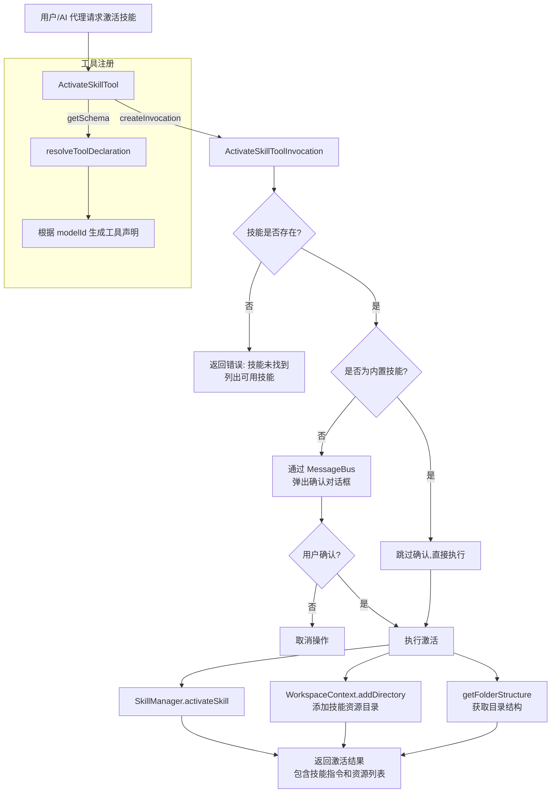

# activate-skill.ts

## 概述

`activate-skill.ts` 是 Gemini CLI 核心工具包中的**技能激活工具**。它允许 AI 代理在对话过程中动态激活预定义的"技能"（Skill），从而为代理加载专用的指令集和资源目录。激活后，代理即可访问技能所绑定的文件资源，并按照技能内置的指令执行特定任务。

该文件导出了两个关键类：
- `ActivateSkillToolInvocation`（内部类）：负责单次调用的确认流程与执行逻辑。
- `ActivateSkillTool`（公开类）：作为声明式工具注册到工具系统中，负责工具定义与调用分发。

文件路径：`packages/core/src/tools/activate-skill.ts`

## 架构图（Mermaid）



## 核心组件

### 1. `ActivateSkillToolParams` 接口

```typescript
export interface ActivateSkillToolParams {
  name: string; // 要激活的技能名称
}
```

工具调用时接收的参数结构，仅包含一个 `name` 字段，用于指定目标技能的名称。

### 2. `ActivateSkillToolInvocation` 类

继承自 `BaseToolInvocation<ActivateSkillToolParams, ToolResult>`，代表一次具体的技能激活调用。

#### 关键属性

| 属性 | 类型 | 说明 |
|------|------|------|
| `config` | `Config` | 全局配置对象，用于获取 SkillManager 和 WorkspaceContext |
| `cachedFolderStructure` | `string \| undefined` | 缓存的目录结构字符串，避免重复读取文件系统 |

#### 关键方法

- **`getDescription(): string`**
  返回技能的人类可读描述。如果技能存在，返回 `"技能名": 技能描述`；否则返回 `"技能名" (?) unknown skill`。

- **`getOrFetchFolderStructure(skillLocation: string): Promise<string>`**
  获取技能所在目录的文件结构。使用 `cachedFolderStructure` 进行缓存，确保同一次调用中只读取一次目录。底层调用 `getFolderStructure(path.dirname(skillLocation))`。

- **`getConfirmationDetails(_abortSignal: AbortSignal): Promise<ToolCallConfirmationDetails | false>`**
  重写父类方法，决定是否需要用户确认。逻辑如下：
  - 如果没有 `messageBus`，返回 `false`（无需确认）
  - 如果技能不存在，返回 `false`（由 execute 处理错误）
  - 如果技能是**内置技能**（`skill.isBuiltin`），返回 `false`（无需确认）
  - 否则，返回确认详情对象，包含技能名称、描述和将要共享的资源目录结构

- **`execute(_signal: AbortSignal): Promise<ToolResult>`**
  执行激活操作的核心方法：
  1. 从 `SkillManager` 查找技能，找不到则返回错误信息及所有可用技能列表
  2. 调用 `skillManager.activateSkill(skillName)` 激活技能
  3. 将技能所在目录添加到 `WorkspaceContext`，授予代理读取权限
  4. 获取目录结构
  5. 返回包含 XML 格式指令和资源列表的 `ToolResult`

  返回的 `llmContent`（供 LLM 使用）格式为：
  ```xml
  <activated_skill name="技能名">
    <instructions>技能指令内容</instructions>
    <available_resources>目录结构</available_resources>
  </activated_skill>
  ```

### 3. `ActivateSkillTool` 类

继承自 `BaseDeclarativeTool<ActivateSkillToolParams, ToolResult>`，是注册到工具系统中的声明式工具。

#### 静态属性

| 属性 | 类型 | 说明 |
|------|------|------|
| `Name` | `string`（只读） | 工具名称常量，来自 `ACTIVATE_SKILL_TOOL_NAME` |

#### 构造函数

```typescript
constructor(config: Config, messageBus: MessageBus)
```

构造时：
1. 从 `config` 获取所有已注册技能的名称列表
2. 调用 `getActivateSkillDefinition(skillNames)` 生成工具定义（包含可用技能名的参数 schema）
3. 将工具注册为 `Kind.Other` 类型，启用确认（`true`），不启用流式输出（`false`）

#### 关键方法

- **`createInvocation(...): ToolInvocation`**
  工厂方法，创建 `ActivateSkillToolInvocation` 实例。

- **`getSchema(modelId?: string)`**
  重写父类方法，动态生成工具的 JSON Schema。每次调用时重新获取当前可用技能列表，通过 `resolveToolDeclaration` 根据目标模型 ID 解析出适配的工具声明。这意味着技能列表可以在运行时动态变化。

## 依赖关系

### 内部依赖

| 模块路径 | 导入内容 | 用途 |
|----------|----------|------|
| `../utils/getFolderStructure.js` | `getFolderStructure` | 获取指定目录的文件/文件夹结构字符串 |
| `../confirmation-bus/message-bus.js` | `MessageBus`（类型） | 用于工具确认的消息总线 |
| `./tools.js` | `BaseDeclarativeTool`, `BaseToolInvocation`, `Kind`, `ToolResult`, `ToolCallConfirmationDetails`, `ToolInvocation`, `ToolConfirmationOutcome` | 工具基类与类型定义 |
| `../config/config.js` | `Config`（类型） | 全局配置，提供 SkillManager 和 WorkspaceContext |
| `./tool-names.js` | `ACTIVATE_SKILL_TOOL_NAME` | 工具名称常量 |
| `./tool-error.js` | `ToolErrorType` | 工具错误类型枚举 |
| `./definitions/coreTools.js` | `getActivateSkillDefinition` | 获取激活技能工具的声明定义 |
| `./definitions/resolver.js` | `resolveToolDeclaration` | 根据模型 ID 解析工具声明 |

### 外部依赖

| 包名 | 导入内容 | 用途 |
|------|----------|------|
| `node:path` | `path` | Node.js 路径处理模块，用于 `path.dirname()` 获取技能文件所在目录 |

## 关键实现细节

1. **缓存机制**：`cachedFolderStructure` 确保在一次调用周期内（确认阶段 + 执行阶段），目录结构只被读取一次。这对于非内置技能尤其重要，因为 `getConfirmationDetails` 和 `execute` 都需要目录结构。

2. **内置技能免确认**：通过 `skill.isBuiltin` 标记区分内置技能和用户自定义技能。内置技能被信任，不需要用户确认；自定义技能需要用户明确同意，因为它们可能访问敏感资源。

3. **动态 Schema 生成**：`getSchema` 方法每次调用时都重新获取技能列表，确保工具的参数 schema（特别是 `name` 字段的枚举值）始终反映最新的可用技能。

4. **工作区权限扩展**：激活技能时，通过 `WorkspaceContext.addDirectory` 将技能资源目录加入代理的可访问范围，实现了基于目录的权限隔离。

5. **XML 格式输出**：向 LLM 返回的内容使用 XML 标签包裹（`<activated_skill>`, `<instructions>`, `<available_resources>`），这是一种常见的 prompt engineering 技术，帮助 LLM 更好地理解和使用结构化信息。

6. **错误处理**：技能未找到时，返回的错误信息中包含所有可用技能的名称列表，帮助 LLM 或用户快速定位正确的技能名。错误类型使用 `ToolErrorType.INVALID_TOOL_PARAMS`。

7. **确认流程中的策略更新**：在用户确认对话框的 `onConfirm` 回调中，调用 `publishPolicyUpdate(outcome)` 将用户的确认策略（如"始终允许"）持久化，减少后续调用的确认次数。
