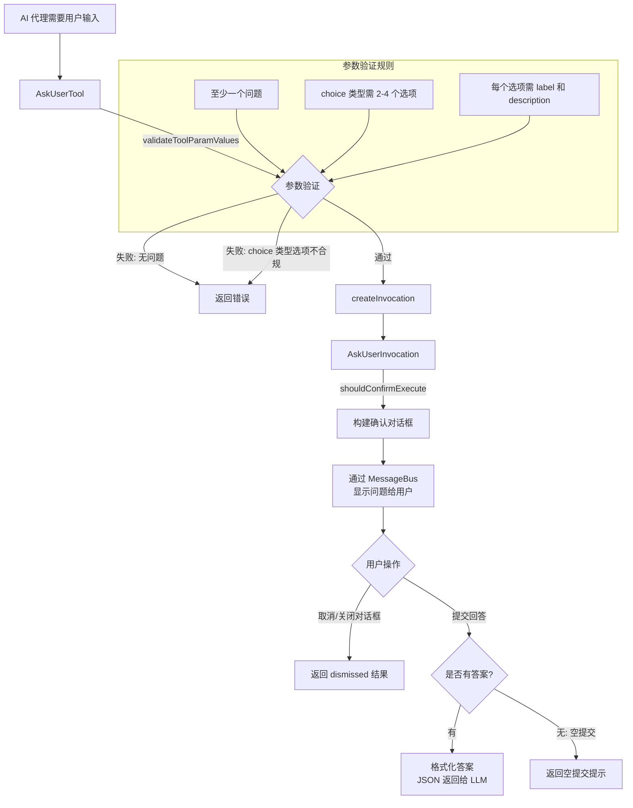

# ask-user.ts

## 概述

`ask-user.ts` 是 Gemini CLI 核心工具包中的**用户交互工具**。它允许 AI 代理在执行过程中主动向用户提问，收集用户的输入或选择，然后将回答传回给 LLM。这是一种"代理-用户"双向通信机制，使得 AI 代理能够在需要用户决策或额外信息时暂停并等待用户响应。

该文件导出了以下关键内容：
- `AskUserParams` 接口：工具参数结构定义
- `AskUserTool` 类：声明式工具注册类，负责参数验证和调用分发
- `AskUserInvocation` 类：单次调用的确认流程与执行逻辑
- `isCompletedAskUserTool` 函数：判断工具调用是否已完成的辅助函数

文件路径：`packages/core/src/tools/ask-user.ts`

## 架构图（Mermaid）



## 核心组件

### 1. `AskUserParams` 接口

```typescript
export interface AskUserParams {
  questions: Question[];
}
```

工具参数结构，包含一个 `questions` 数组。`Question` 类型来自 `../confirmation-bus/types.js`，支持不同的问题类型（如自由文本、选择题等）。

### 2. `AskUserTool` 类

继承自 `BaseDeclarativeTool<AskUserParams, ToolResult>`，是注册到工具系统中的声明式工具。

#### 静态属性

| 属性 | 类型 | 说明 |
|------|------|------|
| `Name` | `string`（只读） | 工具名称常量，来自 `ASK_USER_TOOL_NAME` |

#### 构造函数

```typescript
constructor(messageBus: MessageBus)
```

将工具注册为 `Kind.Communicate` 类型，表示这是一个通信类工具。使用 `ASK_USER_DEFINITION` 中的描述和参数 schema。

#### 关键方法

- **`validateToolParamValues(params: AskUserParams): string | null`**
  重写父类验证方法，对传入参数进行严格校验：
  1. `questions` 数组不能为空（至少一个问题）
  2. 类型为 `QuestionType.CHOICE` 的问题必须包含 `options` 数组，且长度为 2-4
  3. 每个选项（option）必须有非空字符串的 `label` 和字符串类型的 `description`

  返回 `null` 表示验证通过，返回错误字符串表示验证失败。

- **`createInvocation(...): AskUserInvocation`**
  工厂方法，创建 `AskUserInvocation` 实例。

- **`validateBuildAndExecute(params, abortSignal): Promise<ToolResult>`**
  重写父类方法，对 `INVALID_TOOL_PARAMS` 类型的错误做特殊处理：将 `returnDisplay` 设为空字符串。这意味着参数验证错误不会在 UI 上显示给用户（因为这是 LLM 的参数构造问题，不是用户的问题）。

- **`getSchema(modelId?: string)`**
  根据模型 ID 解析并返回工具声明 schema。

### 3. `AskUserInvocation` 类

继承自 `BaseToolInvocation<AskUserParams, ToolResult>`，代表一次具体的用户交互调用。

#### 关键属性

| 属性 | 类型 | 说明 |
|------|------|------|
| `confirmationOutcome` | `ToolConfirmationOutcome \| null` | 用户在确认对话框中的操作结果（确认/取消） |
| `userAnswers` | `{ [questionIndex: string]: string }` | 用户回答的映射表，key 为问题索引（字符串），value 为回答内容 |

#### 关键方法

- **`shouldConfirmExecute(_abortSignal: AbortSignal): Promise<ToolAskUserConfirmationDetails | false>`**
  重写确认逻辑。此工具**始终需要确认**（因为本身就是向用户提问），返回 `ToolAskUserConfirmationDetails` 对象：
  - `type`: `'ask_user'`，标识这是一个用户提问类型的确认
  - `title`: `'Ask User'`
  - `questions`: 规范化后的问题列表
  - `onConfirm`: 回调函数，接收用户操作结果和答案 payload

  `onConfirm` 回调中：
  - 记录 `confirmationOutcome`（确认或取消）
  - 如果 payload 中包含 `answers`，存储到 `userAnswers`

- **`getDescription(): string`**
  返回所有问题的拼接描述，格式为 `"Asking user: 问题1, 问题2, ..."`。

- **`execute(_signal: AbortSignal): Promise<ToolResult>`**
  执行逻辑（在用户响应后调用）：

  **用户取消时**：返回 `dismissed: true` 状态，`llmContent` 告知 LLM 用户未作答。

  **用户提交时**：
  - 构建指标数据（`metrics`），包含问题类型、是否为空提交、答案数量等
  - `returnDisplay`（UI 显示）：将每个回答格式化为 `类别 -> 回答` 的缩进格式，支持多行对齐
  - `llmContent`（LLM 使用）：将答案序列化为 JSON 格式 `{ answers: {...} }`
  - 如果用户提交但没有填写任何答案，显示"User submitted without answering questions."

### 4. `isCompletedAskUserTool` 函数

```typescript
export function isCompletedAskUserTool(name: string, status: string): boolean
```

辅助函数，判断一个工具调用是否是已完成的 AskUser 工具调用。当工具名为 `ASK_USER_DISPLAY_NAME` 且状态为 `'Success'`、`'Error'` 或 `'Canceled'` 之一时返回 `true`。

## 依赖关系

### 内部依赖

| 模块路径 | 导入内容 | 用途 |
|----------|----------|------|
| `./tools.js` | `BaseDeclarativeTool`, `BaseToolInvocation`, `ToolResult`, `Kind`, `ToolAskUserConfirmationDetails`, `ToolConfirmationPayload`, `ToolConfirmationOutcome` | 工具基类与类型定义 |
| `./tool-error.js` | `ToolErrorType` | 工具错误类型枚举 |
| `../confirmation-bus/message-bus.js` | `MessageBus`（类型） | 消息总线，用于工具与 UI 层通信 |
| `../confirmation-bus/types.js` | `QuestionType`, `Question`（类型） | 问题类型枚举和问题接口定义 |
| `./tool-names.js` | `ASK_USER_TOOL_NAME`, `ASK_USER_DISPLAY_NAME` | 工具名称和显示名称常量 |
| `./definitions/coreTools.js` | `ASK_USER_DEFINITION` | 工具声明定义（描述、参数 schema 等） |
| `./definitions/resolver.js` | `resolveToolDeclaration` | 根据模型 ID 解析工具声明 |

### 外部依赖

无外部第三方依赖。本文件仅依赖项目内部模块。

## 关键实现细节

1. **确认机制即交互机制**：与其他工具不同，`AskUserTool` 的"确认"流程本身就是它的核心功能。其他工具使用确认来获得用户授权，而此工具使用确认机制来收集用户回答。`shouldConfirmExecute` 始终返回确认详情，不会返回 `false`。

2. **参数验证的严格性**：对 `choice` 类型问题的选项数量限制为 2-4 个，这是一个 UX 设计决策，避免选项过多导致用户体验下降。每个选项都必须同时具备 `label`（标签）和 `description`（描述），确保选项信息完整。

3. **错误信息隐藏**：`validateBuildAndExecute` 中对参数验证错误特别处理，将 `returnDisplay` 设为空字符串。这是因为参数错误是 LLM 生成的问题格式不正确导致的，不应该暴露给终端用户。

4. **答案格式化**：`returnDisplay` 中使用了精心设计的缩进逻辑。对于多行回答，后续行会按照 `类别 -> ` 前缀的长度进行缩进对齐，确保视觉效果整齐。

5. **指标收集**：`execute` 方法返回的 `data` 字段包含丰富的使用指标，包括问题类型列表、是否被取消、是否空提交、回答数量等，可用于分析工具使用情况。

6. **`isCompletedAskUserTool` 的用途**：此辅助函数通常被 UI 层或流程控制层使用，用于判断当前工具调用是否已经完成（包括成功、错误、取消三种终态），以便决定是否可以继续后续流程。

7. **问题规范化**：在 `shouldConfirmExecute` 中，通过展开运算符 `{...q, type: q.type}` 对问题进行浅拷贝并确保 `type` 字段存在。这是一种防御性编程，确保传递给 UI 层的问题对象结构完整。
