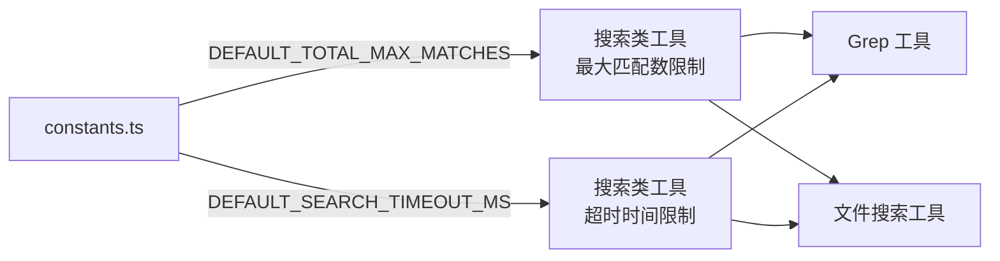

# constants.ts

## 概述

`constants.ts` 是 Gemini CLI 核心工具包中的**常量定义文件**。它定义了工具系统中搜索相关操作的默认配置常量。文件非常精简，仅包含两个导出常量，为搜索类工具提供统一的默认上限值。

文件路径：`packages/core/src/tools/constants.ts`

## 架构图（Mermaid）



## 核心组件

### 1. `DEFAULT_TOTAL_MAX_MATCHES`

```typescript
export const DEFAULT_TOTAL_MAX_MATCHES = 100;
```

| 属性 | 说明 |
|------|------|
| 类型 | `number`（常量） |
| 值 | `100` |
| 用途 | 搜索操作返回的**最大匹配结果数量**上限。当搜索结果超过此阈值时，工具应截断结果并仅返回前 100 条匹配项。这一限制防止了大规模搜索结果导致的内存占用过高或 LLM 上下文窗口溢出等问题。 |

### 2. `DEFAULT_SEARCH_TIMEOUT_MS`

```typescript
export const DEFAULT_SEARCH_TIMEOUT_MS = 30000;
```

| 属性 | 说明 |
|------|------|
| 类型 | `number`（常量） |
| 值 | `30000`（即 30 秒） |
| 用途 | 搜索操作的**默认超时时间**（毫秒）。如果搜索在 30 秒内未完成，应被终止并返回已有结果或超时错误。这一限制防止了对大型代码库执行复杂搜索时出现无限等待的情况。 |

## 依赖关系

### 内部依赖

无。此文件不依赖项目内任何其他模块。

### 外部依赖

无。此文件不依赖任何外部包。

## 关键实现细节

1. **纯常量文件**：此文件不包含任何类、函数或逻辑，仅作为常量的集中定义点。这种设计遵循了"单一职责原则"，使搜索相关的默认配置易于查找和修改。

2. **常量命名规范**：使用大写蛇形命名法（`UPPER_SNAKE_CASE`），符合 TypeScript/JavaScript 社区中常量的命名惯例。前缀 `DEFAULT_` 明确表示这些值是默认值，可能在使用处被自定义配置覆盖。

3. **合理的默认值选择**：
   - **100 条匹配**：在 LLM 上下文窗口有限的情况下，100 条结果既能提供足够的搜索信息，又不会占用过多 token。
   - **30 秒超时**：对于大多数代码库搜索，30 秒是一个合理的上限。过短可能导致大项目搜索被过早终止，过长则影响用户体验。

4. **被其他搜索工具引用**：这些常量会被 `grep` 工具、文件搜索工具等搜索类工具导入使用，作为它们的默认参数值。修改此处的常量将影响所有使用默认值的搜索操作。
