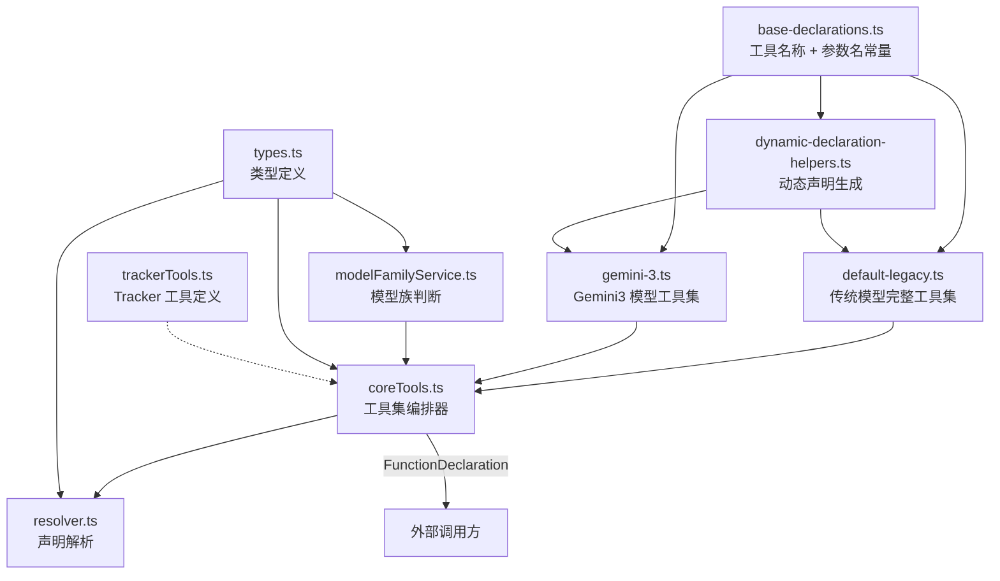
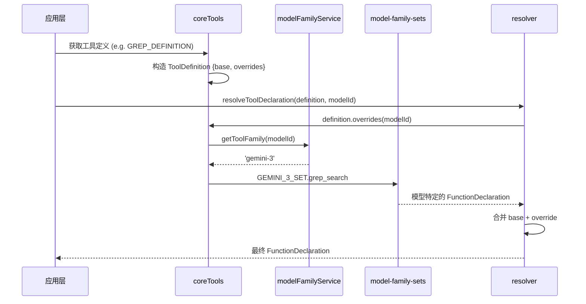

# definitions

## 概述

`definitions` 目录负责管理所有核心工具的**声明定义（FunctionDeclaration）**，即发送给 LLM 的工具名称、描述和参数 Schema。它实现了按模型族（Model Family）差异化工具声明的机制，使得不同代的 Gemini 模型可以获得优化过的工具描述和参数约束。

## 目录结构

```
definitions/
├── base-declarations.ts          # 底层常量注册表：所有工具名和参数名
├── coreTools.ts                  # 核心编排器：按模型族解析工具集，提供 legacy 导出
├── types.ts                      # 类型定义：ToolFamily、ToolDefinition、CoreToolSet
├── resolver.ts                   # 声明解析器：合并 base 与 model-specific overrides
├── modelFamilyService.ts         # 模型族判断服务：将 modelId 映射到 ToolFamily
├── dynamic-declaration-helpers.ts # 动态声明生成器：Shell、ExitPlanMode、ActivateSkill
├── trackerTools.ts               # 任务追踪器工具定义（CRUD + 可视化）
├── model-family-sets/            # 按模型族组织的完整工具 Schema
│   ├── default-legacy.ts         # 传统模型（Gemini 2.5 等）的工具集
│   └── gemini-3.ts               # Gemini 3 模型优化的工具集
└── __snapshots__/                # 测试快照
```

## 架构图



## 核心组件

### `base-declarations.ts` - 标识常量注册表

位于依赖树最底层，防止循环引用。定义了：
- **工具名称常量**: `GLOB_TOOL_NAME = 'glob'`、`SHELL_TOOL_NAME = 'run_shell_command'` 等全部 15+ 个核心工具名
- **共享参数名**: `PARAM_FILE_PATH`、`PARAM_DIR_PATH`、`PARAM_PATTERN` 等跨工具共享的参数名
- **工具专属参数名**: 如 `GREP_PARAM_INCLUDE_PATTERN`、`EDIT_PARAM_OLD_STRING` 等

### `types.ts` - 核心类型定义

- **`ToolFamily`**: 支持的模型族类型，当前为 `'default-legacy' | 'gemini-3'`
- **`ToolDefinition`**: 工具定义接口，包含 `base`（基础声明）和 `overrides`（按模型覆盖的函数）
- **`CoreToolSet`**: 所有核心工具的完整映射接口，定义了 `read_file`、`write_file`、`grep_search`、`run_shell_command` 等全部工具的 FunctionDeclaration

### `coreTools.ts` - 工具集编排器

核心编排文件，负责：
- `getToolSet(modelId)`: 根据模型 ID 返回对应的 `CoreToolSet`
- 导出所有工具的 `ToolDefinition`（如 `READ_FILE_DEFINITION`、`GREP_DEFINITION`）
- 导出动态工具定义函数（`getShellDefinition()`、`getExitPlanModeDefinition()`、`getActivateSkillDefinition()`）

### `modelFamilyService.ts` - 模型族判断

- `getToolFamily(modelId)`: 根据模型 ID 判断属于哪个工具族
  - Gemini 3 系列模型返回 `'gemini-3'`
  - 其他模型返回 `'default-legacy'`

### `resolver.ts` - 声明解析器

- `resolveToolDeclaration(definition, modelId)`: 解析最终的 FunctionDeclaration
  - 如果有 modelId 且定义了 overrides，则合并 base 和 override
  - 否则返回 base 声明

### `dynamic-declaration-helpers.ts` - 动态声明生成

生成依赖运行时状态的工具声明：
- `getShellDeclaration()`: 根据 OS 平台（Win/Unix）、交互模式、效率模式、沙箱配置生成 Shell 工具 Schema
- `getExitPlanModeDeclaration()`: 生成退出计划模式的工具 Schema
- `getActivateSkillDeclaration()`: 根据可用技能列表动态生成技能激活工具 Schema（使用 zod 生成 enum）

### `trackerTools.ts` - 任务追踪器工具定义

定义 6 个任务追踪相关工具：
- `TRACKER_CREATE_TASK_DEFINITION`: 创建任务
- `TRACKER_UPDATE_TASK_DEFINITION`: 更新任务
- `TRACKER_GET_TASK_DEFINITION`: 获取任务详情
- `TRACKER_LIST_TASKS_DEFINITION`: 列出任务
- `TRACKER_ADD_DEPENDENCY_DEFINITION`: 添加依赖
- `TRACKER_VISUALIZE_DEFINITION`: ASCII 树可视化

## 依赖关系

### 内部依赖
- `config/models.ts` - 模型判断函数（`isGemini3Model`）
- `utils/constants.ts` - 文件大小限制常量

### 外部依赖
- `@google/genai` - `FunctionDeclaration` 类型
- `zod` + `zod-to-json-schema` - 动态 Schema 生成（ActivateSkill 工具）

## 数据流

### 工具声明获取流程


