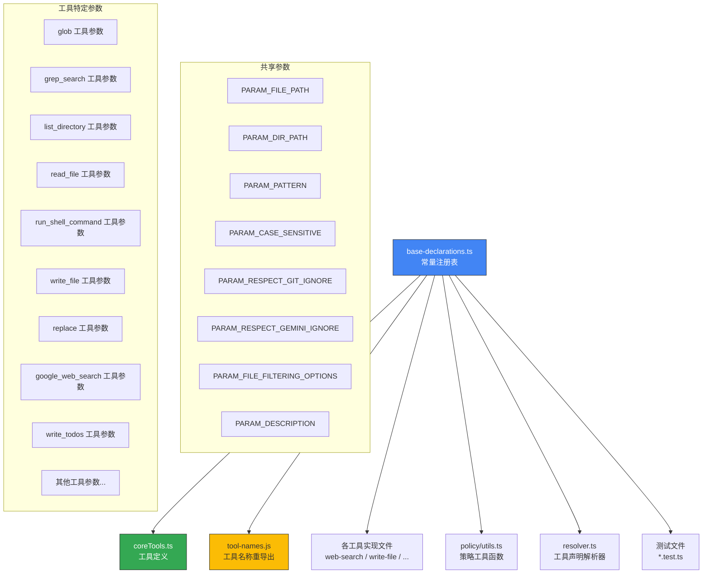

# base-declarations.ts

## 概述

`base-declarations.ts` 是 Gemini CLI 核心工具系统的 **身份注册表和参数名称常量定义文件**。它位于依赖树的最底层，故意设计为不导入任何其他模块，以 **防止循环依赖**。

该文件的核心职责是为所有核心工具提供：
1. **工具名称常量**（Tool Names）— 每个工具的唯一标识符
2. **参数名称常量**（Parameter Names）— 工具参数的键名字符串

所有常量均以 `export const` 导出，类型为字符串字面量。其他工具定义文件、工具实现文件、策略模块等都从该文件导入常量，确保工具名和参数名在整个代码库中保持一致，避免硬编码字符串的拼写错误问题。

该文件约 128 行，不包含任何逻辑代码，纯粹是声明性的常量注册表。

## 架构图（Mermaid）

## 核心组件

### 1. 共享参数名称常量

这些参数在多个工具之间共享使用：

| 常量名 | 值 | 使用场景 |
|--------|-----|----------|
| `PARAM_FILE_PATH` | `'file_path'` | read_file、write_file、replace 等需要指定文件路径的工具 |
| `PARAM_DIR_PATH` | `'dir_path'` | glob、grep_search、list_directory 等需要指定目录路径的工具 |
| `PARAM_PATTERN` | `'pattern'` | glob、grep_search 等需要匹配模式的工具 |
| `PARAM_CASE_SENSITIVE` | `'case_sensitive'` | grep_search 等支持大小写敏感选项的工具 |
| `PARAM_RESPECT_GIT_IGNORE` | `'respect_git_ignore'` | 文件搜索工具中是否遵循 .gitignore 规则 |
| `PARAM_RESPECT_GEMINI_IGNORE` | `'respect_gemini_ignore'` | 文件搜索工具中是否遵循 .geminiignore 规则 |
| `PARAM_FILE_FILTERING_OPTIONS` | `'file_filtering_options'` | 文件过滤选项的嵌套参数组 |
| `PARAM_DESCRIPTION` | `'description'` | 通用描述字段 |

### 2. 工具名称与工具特定参数

#### glob 工具
| 常量名 | 值 |
|--------|-----|
| `GLOB_TOOL_NAME` | `'glob'` |

无额外工具特定参数（使用共享参数 `PARAM_PATTERN`、`PARAM_DIR_PATH`）。

#### grep_search 工具
| 常量名 | 值 | 说明 |
|--------|-----|------|
| `GREP_TOOL_NAME` | `'grep_search'` | 工具名称 |
| `GREP_PARAM_INCLUDE_PATTERN` | `'include_pattern'` | 文件包含模式 |
| `GREP_PARAM_EXCLUDE_PATTERN` | `'exclude_pattern'` | 文件排除模式 |
| `GREP_PARAM_NAMES_ONLY` | `'names_only'` | 只返回文件名 |
| `GREP_PARAM_MAX_MATCHES_PER_FILE` | `'max_matches_per_file'` | 每文件最大匹配数 |
| `GREP_PARAM_TOTAL_MAX_MATCHES` | `'total_max_matches'` | 总最大匹配数 |
| `GREP_PARAM_FIXED_STRINGS` | `'fixed_strings'` | 固定字符串匹配（ripgrep） |
| `GREP_PARAM_CONTEXT` | `'context'` | 上下文行数（ripgrep） |
| `GREP_PARAM_AFTER` | `'after'` | 匹配后显示行数（ripgrep） |
| `GREP_PARAM_BEFORE` | `'before'` | 匹配前显示行数（ripgrep） |
| `GREP_PARAM_NO_IGNORE` | `'no_ignore'` | 不遵循忽略规则（ripgrep） |

grep_search 工具拥有最多的工具特定参数（11个），反映了其作为搜索工具的丰富配置需求。注释标明了 ripgrep 特有的参数。

#### list_directory 工具
| 常量名 | 值 |
|--------|-----|
| `LS_TOOL_NAME` | `'list_directory'` |
| `LS_PARAM_IGNORE` | `'ignore'` |

#### read_file 工具
| 常量名 | 值 |
|--------|-----|
| `READ_FILE_TOOL_NAME` | `'read_file'` |
| `READ_FILE_PARAM_START_LINE` | `'start_line'` |
| `READ_FILE_PARAM_END_LINE` | `'end_line'` |

#### run_shell_command 工具
| 常量名 | 值 |
|--------|-----|
| `SHELL_TOOL_NAME` | `'run_shell_command'` |
| `SHELL_PARAM_COMMAND` | `'command'` |
| `SHELL_PARAM_IS_BACKGROUND` | `'is_background'` |

#### write_file 工具
| 常量名 | 值 |
|--------|-----|
| `WRITE_FILE_TOOL_NAME` | `'write_file'` |
| `WRITE_FILE_PARAM_CONTENT` | `'content'` |

#### replace（edit）工具
| 常量名 | 值 | 说明 |
|--------|-----|------|
| `EDIT_TOOL_NAME` | `'replace'` | 工具名称（内部称为 edit） |
| `EDIT_PARAM_INSTRUCTION` | `'instruction'` | 编辑指令 |
| `EDIT_PARAM_OLD_STRING` | `'old_string'` | 要替换的原文本 |
| `EDIT_PARAM_NEW_STRING` | `'new_string'` | 替换后的新文本 |
| `EDIT_PARAM_ALLOW_MULTIPLE` | `'allow_multiple'` | 是否允许多处替换 |

#### google_web_search 工具
| 常量名 | 值 |
|--------|-----|
| `WEB_SEARCH_TOOL_NAME` | `'google_web_search'` |
| `WEB_SEARCH_PARAM_QUERY` | `'query'` |

#### write_todos 工具
| 常量名 | 值 |
|--------|-----|
| `WRITE_TODOS_TOOL_NAME` | `'write_todos'` |
| `TODOS_PARAM_TODOS` | `'todos'` |
| `TODOS_ITEM_PARAM_DESCRIPTION` | `'description'` |
| `TODOS_ITEM_PARAM_STATUS` | `'status'` |

#### web_fetch 工具
| 常量名 | 值 |
|--------|-----|
| `WEB_FETCH_TOOL_NAME` | `'web_fetch'` |
| `WEB_FETCH_PARAM_PROMPT` | `'prompt'` |

#### read_many_files 工具
| 常量名 | 值 |
|--------|-----|
| `READ_MANY_FILES_TOOL_NAME` | `'read_many_files'` |
| `READ_MANY_PARAM_INCLUDE` | `'include'` |
| `READ_MANY_PARAM_EXCLUDE` | `'exclude'` |
| `READ_MANY_PARAM_RECURSIVE` | `'recursive'` |
| `READ_MANY_PARAM_USE_DEFAULT_EXCLUDES` | `'useDefaultExcludes'` |

#### save_memory 工具
| 常量名 | 值 |
|--------|-----|
| `MEMORY_TOOL_NAME` | `'save_memory'` |
| `MEMORY_PARAM_FACT` | `'fact'` |

#### get_internal_docs 工具
| 常量名 | 值 |
|--------|-----|
| `GET_INTERNAL_DOCS_TOOL_NAME` | `'get_internal_docs'` |
| `DOCS_PARAM_PATH` | `'path'` |

#### activate_skill 工具
| 常量名 | 值 |
|--------|-----|
| `ACTIVATE_SKILL_TOOL_NAME` | `'activate_skill'` |
| `SKILL_PARAM_NAME` | `'name'` |

#### ask_user 工具
| 常量名 | 值 | 说明 |
|--------|-----|------|
| `ASK_USER_TOOL_NAME` | `'ask_user'` | 工具名称 |
| `ASK_USER_PARAM_QUESTIONS` | `'questions'` | 问题列表参数 |
| `ASK_USER_QUESTION_PARAM_QUESTION` | `'question'` | 问题文本 |
| `ASK_USER_QUESTION_PARAM_HEADER` | `'header'` | 问题标题 |
| `ASK_USER_QUESTION_PARAM_TYPE` | `'type'` | 问题类型 |
| `ASK_USER_QUESTION_PARAM_OPTIONS` | `'options'` | 选项列表 |
| `ASK_USER_QUESTION_PARAM_MULTI_SELECT` | `'multiSelect'` | 是否多选 |
| `ASK_USER_QUESTION_PARAM_PLACEHOLDER` | `'placeholder'` | 占位符文本 |
| `ASK_USER_OPTION_PARAM_LABEL` | `'label'` | 选项标签 |
| `ASK_USER_OPTION_PARAM_DESCRIPTION` | `'description'` | 选项描述 |

ask_user 工具具有最复杂的嵌套参数结构：工具 -> 问题列表 -> 问题项 -> 选项列表 -> 选项项。

#### exit_plan_mode 工具
| 常量名 | 值 |
|--------|-----|
| `EXIT_PLAN_MODE_TOOL_NAME` | `'exit_plan_mode'` |
| `EXIT_PLAN_PARAM_PLAN_FILENAME` | `'plan_filename'` |

#### enter_plan_mode 工具
| 常量名 | 值 |
|--------|-----|
| `ENTER_PLAN_MODE_TOOL_NAME` | `'enter_plan_mode'` |
| `PLAN_MODE_PARAM_REASON` | `'reason'` |

#### sandbox 相关
| 常量名 | 值 |
|--------|-----|
| `PARAM_ADDITIONAL_PERMISSIONS` | `'additional_permissions'` |

### 3. 工具清单总览

该文件共注册了 **16 个核心工具**：

| 序号 | 工具名称 | 类别 |
|------|----------|------|
| 1 | `glob` | 文件搜索 |
| 2 | `grep_search` | 内容搜索 |
| 3 | `list_directory` | 目录浏览 |
| 4 | `read_file` | 文件读取 |
| 5 | `run_shell_command` | Shell 执行 |
| 6 | `write_file` | 文件写入 |
| 7 | `replace` | 文件编辑 |
| 8 | `google_web_search` | 网络搜索 |
| 9 | `write_todos` | 任务管理 |
| 10 | `web_fetch` | 网页获取 |
| 11 | `read_many_files` | 批量文件读取 |
| 12 | `save_memory` | 记忆保存 |
| 13 | `get_internal_docs` | 内部文档 |
| 14 | `activate_skill` | 技能激活 |
| 15 | `ask_user` | 用户交互 |
| 16 | `exit_plan_mode` / `enter_plan_mode` | 计划模式切换 |

## 依赖关系

### 内部依赖

**无任何导入。** 这是该文件最重要的设计特征——它位于依赖树的最底层，故意不导入任何其他模块，以防止循环依赖。文件头部的注释明确说明了这一点：

> Identity registry for all core tools.
> Sits at the bottom of the dependency tree to prevent circular imports.

### 外部依赖

**无任何外部依赖。** 该文件是纯 TypeScript 常量声明文件，不依赖任何第三方包或 Node.js 内置模块。

## 关键实现细节

### 1. 防止循环依赖的底层设计

该文件是整个工具系统的依赖根节点。在工具系统中，多个模块可能互相引用工具名和参数名：
- 工具定义文件（`coreTools.ts`）需要工具名称
- 工具实现文件需要参数名称
- 策略模块需要工具名称进行权限判断
- 测试文件需要工具名称和参数名称

如果这些常量分散在各个工具文件中，会导致循环导入。集中在一个无依赖的文件中彻底解决了这个问题。

### 2. 命名约定

常量名遵循严格的命名约定：
- **工具名称**：`<TOOL_PREFIX>_TOOL_NAME`（如 `GLOB_TOOL_NAME`、`GREP_TOOL_NAME`）
- **共享参数**：`PARAM_<NAME>`（如 `PARAM_FILE_PATH`、`PARAM_PATTERN`）
- **工具特定参数**：`<TOOL_PREFIX>_PARAM_<NAME>`（如 `GREP_PARAM_INCLUDE_PATTERN`、`SHELL_PARAM_COMMAND`）
- **嵌套项参数**：`<TOOL_PREFIX>_ITEM_PARAM_<NAME>`（如 `TODOS_ITEM_PARAM_STATUS`）

### 3. 工具名称值的约定

工具名称使用 snake_case 格式的字符串值（如 `'grep_search'`、`'write_file'`），这些字符串直接对应 Gemini API 的 function calling 中工具声明的 `name` 字段。

### 4. 注释分组结构

文件使用 `// ============` 横线和 `// -- tool_name --` 注释来清晰分组，便于快速定位特定工具的常量。每个工具的常量按工具名称 -> 参数名称的顺序排列。

### 5. 参数值与常量名的对应关系

所有参数常量的值都是简单的字符串，等于 JSON Schema 中属性的键名。例如 `PARAM_FILE_PATH = 'file_path'` 对应 JSON Schema 中 `properties.file_path` 的键。这确保了代码中引用参数名时不会出现拼写错误。
