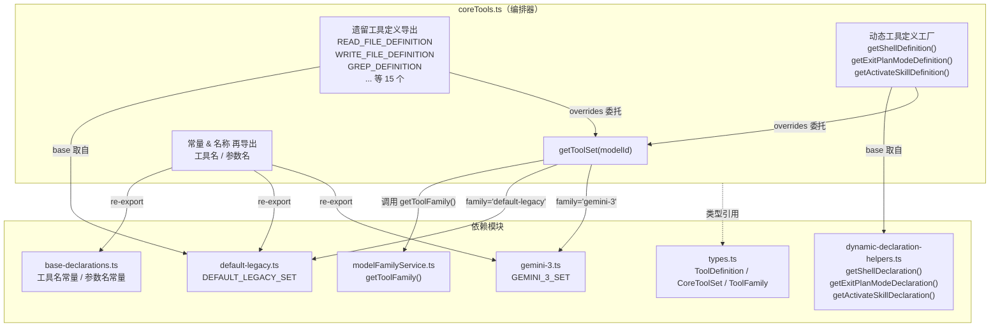

# coreTools.ts

## 概述

`coreTools.ts` 是工具定义模块的**顶层编排器（Orchestrator）**。它的核心职责有三个：

1. **工具集解析**：根据传入的模型 ID，通过 `modelFamilyService` 判断模型所属家族，然后返回对应的工具集（`CoreToolSet`）。
2. **遗留导出兼容**：为项目中已有的消费方提供稳定的、按工具名称拆分的 `ToolDefinition` 导出（如 `READ_FILE_DEFINITION`、`GREP_DEFINITION` 等），内部实际委托给工具集。
3. **动态工具定义**：对 Shell、退出计划模式、激活技能等需要运行时参数才能构建声明的工具，提供工厂函数。

该文件本身**不包含任何工具的参数定义或描述文本**，所有实际声明均来自 `base-declarations.ts`、`default-legacy.ts` 和 `gemini-3.ts`。

## 架构图（Mermaid）

## 核心组件

### 1. `getToolSet(modelId?: string): CoreToolSet`

根据模型 ID 返回匹配的工具集。

- 调用 `getToolFamily(modelId)` 获取模型家族标识（`ToolFamily` 类型，值为 `'gemini-3'` 或 `'default-legacy'`）。
- 使用 `switch` 分支：
  - `'gemini-3'` → 返回 `GEMINI_3_SET`
  - `'default-legacy'` 或其他任意值 → 返回 `DEFAULT_LEGACY_SET`（兜底默认值）

### 2. 静态遗留工具定义（15 个）

每个定义都是一个 `ToolDefinition` 对象，包含：
- `base`（getter）：惰性取自 `DEFAULT_LEGACY_SET` 中对应工具的 `FunctionDeclaration`。
- `overrides`（函数）：接受 `modelId`，通过 `getToolSet(modelId)` 动态获取可能不同的声明。

导出的定义列表：

| 导出名 | 对应 CoreToolSet 键 |
|---|---|
| `READ_FILE_DEFINITION` | `read_file` |
| `WRITE_FILE_DEFINITION` | `write_file` |
| `GREP_DEFINITION` | `grep_search` |
| `RIP_GREP_DEFINITION` | `grep_search_ripgrep` |
| `WEB_SEARCH_DEFINITION` | `google_web_search` |
| `EDIT_DEFINITION` | `replace` |
| `GLOB_DEFINITION` | `glob` |
| `LS_DEFINITION` | `list_directory` |
| `WEB_FETCH_DEFINITION` | `web_fetch` |
| `READ_MANY_FILES_DEFINITION` | `read_many_files` |
| `MEMORY_DEFINITION` | `save_memory` |
| `WRITE_TODOS_DEFINITION` | `write_todos` |
| `GET_INTERNAL_DOCS_DEFINITION` | `get_internal_docs` |
| `ASK_USER_DEFINITION` | `ask_user` |
| `ENTER_PLAN_MODE_DEFINITION` | `enter_plan_mode` |

### 3. 动态工具定义工厂（3 个）

这些工具的声明需要运行时参数，因此以函数形式导出：

#### `getShellDefinition(enableInteractiveShell, enableEfficiency, enableToolSandboxing)`
- **参数**：
  - `enableInteractiveShell: boolean` — 是否启用交互式 Shell
  - `enableEfficiency: boolean` — 是否启用效率优化
  - `enableToolSandboxing: boolean` — 是否启用沙盒模式（默认 `false`）
- **返回**：`ToolDefinition`，其 `base` 由 `getShellDeclaration()` 生成，`overrides` 由工具集的 `run_shell_command()` 方法生成。

#### `getExitPlanModeDefinition()`
- 无参数
- **返回**：`ToolDefinition`，其 `base` 由 `getExitPlanModeDeclaration()` 生成。

#### `getActivateSkillDefinition(skillNames: string[])`
- **参数**：`skillNames` — 可用技能名称列表
- **返回**：`ToolDefinition`，其 `base` 由 `getActivateSkillDeclaration(skillNames)` 生成。

### 4. 再导出（Re-exports）

#### 常量再导出（来自 `base-declarations.ts`）
大量工具名常量（如 `GLOB_TOOL_NAME`、`SHELL_TOOL_NAME`）和参数名常量（如 `PARAM_FILE_PATH`、`GREP_PARAM_INCLUDE_PATTERN`）被透传再导出，供外部模块引用。

#### 工具集再导出
- `DEFAULT_LEGACY_SET`（来自 `default-legacy.ts`）
- `GEMINI_3_SET`（来自 `gemini-3.ts`）

#### 辅助函数再导出（来自 `dynamic-declaration-helpers.ts`）
- `getShellToolDescription`
- `getCommandDescription`

## 依赖关系

### 内部依赖

| 模块 | 引入内容 | 用途 |
|---|---|---|
| `./types.js` | `ToolDefinition`, `CoreToolSet` | 类型定义 |
| `./modelFamilyService.js` | `getToolFamily` | 根据模型 ID 判断所属家族 |
| `./model-family-sets/default-legacy.js` | `DEFAULT_LEGACY_SET` | 默认/遗留工具集 |
| `./model-family-sets/gemini-3.js` | `GEMINI_3_SET` | Gemini 3 系列工具集 |
| `./dynamic-declaration-helpers.js` | `getShellDeclaration`, `getExitPlanModeDeclaration`, `getActivateSkillDeclaration` | 构建动态工具声明 |
| `./base-declarations.js` | 全部工具名和参数名常量 | 再导出供外部使用 |

### 外部依赖

无直接外部依赖（`@google/genai` 的 `FunctionDeclaration` 类型仅在 `types.ts` 中引用）。

## 关键实现细节

1. **惰性求值（Lazy Evaluation）**：静态遗留定义的 `base` 属性使用 `get base()` getter 而非直接赋值。这意味着 `DEFAULT_LEGACY_SET` 中的声明在首次访问时才被读取，避免模块加载时的循环依赖或时序问题。

2. **双层覆盖模式**：`ToolDefinition` 的设计采用 base + overrides 模式。`base` 始终指向 `DEFAULT_LEGACY_SET`（保证向后兼容），`overrides` 函数根据运行时模型 ID 动态解析可能不同的声明。调用方可以先使用 `base`，再根据实际模型调用 `overrides` 获取更精确的定义。

3. **工具集路由逻辑极简**：`getToolSet` 中的 `switch` 语句只有两个分支（`gemini-3` 和 `default-legacy`），新增模型家族只需：(a) 在 `types.ts` 的 `ToolFamily` 联合类型中添加新值；(b) 创建新的工具集文件；(c) 在此处的 `switch` 中添加分支。

4. **大规模再导出策略**：文件通过 `export { ... } from` 语法再导出了约 60+ 个常量，使得 `coreTools.ts` 成为外部模块访问工具相关常量的统一入口，避免外部直接依赖底层的 `base-declarations.ts`。

5. **动态声明与静态声明的分离**：Shell、退出计划模式、激活技能这三个工具因为需要运行时参数（如是否启用交互式 Shell、技能名列表等），无法作为静态常量导出，因此单独提供工厂函数。其内部模式与静态定义一致：base 来自 helper，overrides 委托给工具集。
