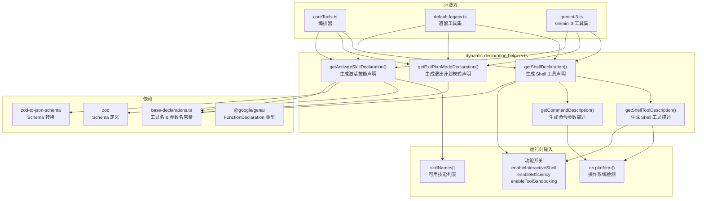

# dynamic-declaration-helpers.ts

## 概述

`dynamic-declaration-helpers.ts` 提供了三个**运行时动态生成工具声明**的辅助函数，以及两个生成平台特定描述文本的工具函数。

之所以将这些工具声明从静态的 `base-declarations.ts` 中分离出来，是因为它们的声明内容依赖于**运行时状态**：
- **操作系统平台**（`os.platform()`）：Shell 工具在 Windows 上使用 `powershell.exe`，在其他平台使用 `bash`。
- **功能开关**（`enableInteractiveShell`、`enableEfficiency`、`enableToolSandboxing`）：影响 Shell 工具的描述文本和参数 schema。
- **动态枚举值**（`skillNames`）：激活技能工具的参数 schema 需要根据当前可用技能列表动态生成枚举约束。

## 架构图（Mermaid）



## 核心组件

### 1. `getShellToolDescription(enableInteractiveShell, enableEfficiency): string`

生成 Shell 工具的完整描述文本，根据平台和功能开关动态组装内容。

**参数**：
- `enableInteractiveShell: boolean` — 是否启用交互式 Shell 模式
- `enableEfficiency: boolean` — 是否附加效率优化指南

**平台差异化行为**：

| 条件 | Windows (`win32`) | 其他平台 |
|---|---|---|
| 执行方式 | `powershell.exe -NoProfile -Command <command>` | `bash -c <command>` |
| 后台运行（交互式） | 设置 `is_background` 参数为 `true`，禁止使用 PowerShell 后台构造 | 设置 `is_background` 参数为 `true`，禁止使用 `&` |
| 后台运行（非交互式） | 使用 `Start-Process -NoNewWindow` 或 `Start-Job` | 使用 `&` |

**效率优化指南**（仅在 `enableEfficiency=true` 时附加）：
- 使用静默/安静标志（如 `npm install --silent`、`git --no-pager`）减少输出量
- 禁用终端分页以确保命令正常终止

**返回信息说明**（始终包含）：
描述了工具返回的结构化信息字段：Output、Exit Code、Error、Signal、Background PIDs、Process Group PGID。

### 2. `getCommandDescription(): string`

返回 Shell 工具 `command` 参数的平台特定描述。

- Windows: `"Exact command to execute as powershell.exe -NoProfile -Command <command>"`
- 其他: `"Exact bash command to execute as bash -c <command>"`

### 3. `getShellDeclaration(enableInteractiveShell, enableEfficiency, enableToolSandboxing): FunctionDeclaration`

构建完整的 Shell 工具 `FunctionDeclaration`。

**参数**：
- `enableInteractiveShell: boolean`
- `enableEfficiency: boolean`
- `enableToolSandboxing: boolean`（默认 `false`）

**生成的 JSON Schema 结构**：

```
{
  type: "object",
  required: ["command"],
  properties: {
    command: string       // 必需 - 要执行的命令
    description: string   // 命令的简短描述
    dir_path: string      // 可选 - 工作目录
    is_background: boolean // 是否后台运行
    additional_permissions: object  // 仅当 enableToolSandboxing=true 时出现
  }
}
```

**沙盒权限参数**（`additional_permissions`，条件性包含）：
当 `enableToolSandboxing=true` 时，schema 中会额外包含沙盒权限对象：
- `network: boolean` — 是否启用网络访问
- `fileSystem.read: string[]` — 额外允许读取的绝对路径列表
- `fileSystem.write: string[]` — 额外允许写入的绝对路径列表

### 4. `getExitPlanModeDeclaration(): FunctionDeclaration`

构建退出计划模式工具的声明。

**声明内容**：
- **名称**：来自 `EXIT_PLAN_MODE_TOOL_NAME` 常量
- **描述**：说明该工具用于完成规划阶段并过渡到实施阶段，必须在任何源码编辑前调用
- **参数**：
  - `plan_filename`（必需，`string`）— 最终计划的文件名（如 `"feature-x.md"`），不接受绝对路径

### 5. `getActivateSkillDeclaration(skillNames: string[]): FunctionDeclaration`

构建激活技能工具的声明，使用 Zod 动态生成参数 schema。

**参数**：
- `skillNames: string[]` — 当前可用的技能名称列表

**动态 Schema 生成逻辑**：

| 条件 | Schema 行为 |
|---|---|
| `skillNames.length === 0` | `skill_name` 为普通 `z.string()`，描述为 "No skills are currently available." |
| `skillNames.length > 0` | `skill_name` 为 `z.enum(skillNames)`，描述为 "The name of the skill to activate."，并在工具描述中列出可用技能 |

**Zod → JSON Schema 转换**：使用 `zodToJsonSchema()` 将 Zod schema 转为 JSON Schema 格式赋值给 `parametersJsonSchema`。

**工具描述**：动态拼接，包含可用技能名称提示（如 `"(Available: 'skill-a', 'skill-b')"`），说明返回值包裹在 `<activated_skill>` 标签中。

## 依赖关系

### 内部依赖

| 模块 | 引入内容 | 用途 |
|---|---|---|
| `./base-declarations.js` | `SHELL_TOOL_NAME`, `EXIT_PLAN_MODE_TOOL_NAME`, `ACTIVATE_SKILL_TOOL_NAME`, `SHELL_PARAM_COMMAND`, `PARAM_DESCRIPTION`, `PARAM_DIR_PATH`, `SHELL_PARAM_IS_BACKGROUND`, `EXIT_PLAN_PARAM_PLAN_FILENAME`, `SKILL_PARAM_NAME`, `PARAM_ADDITIONAL_PERMISSIONS` | 工具名和参数名常量 |

### 外部依赖

| 包 | 引入内容 | 用途 |
|---|---|---|
| `@google/genai` | `FunctionDeclaration`（类型） | 工具声明的类型定义 |
| `node:os` | `os.platform()` | 检测操作系统平台 |
| `zod` | `z` | 定义参数 schema（用于激活技能工具） |
| `zod-to-json-schema` | `zodToJsonSchema` | 将 Zod schema 转换为 JSON Schema |

## 关键实现细节

1. **平台感知的描述生成**：`getShellToolDescription` 和 `getCommandDescription` 通过 `os.platform()` 在运行时检测操作系统，为 Windows 和 Unix 系统生成不同的命令执行说明。这确保了 AI 模型在调用 Shell 工具时能获得正确的平台指引。

2. **条件性 Schema 扩展**：Shell 工具的参数 schema 使用了 JavaScript 的展开运算符（`...`）和三元表达式来有条件地包含 `additional_permissions` 字段。当 `enableToolSandboxing=false` 时，展开一个空对象 `{}`，不会添加任何额外属性。

3. **Zod 动态枚举**：`getActivateSkillDeclaration` 使用 `z.enum()` 为技能名称参数创建严格的枚举约束。当技能列表为空时，回退为普通字符串类型，避免 `z.enum()` 在空数组上报错。这里有一个类型断言 `skillNames as [string, ...string[]]`，因为 `z.enum()` 要求非空元组类型。

4. **返回信息文档化**：Shell 工具描述中详细列出了所有可能返回的字段（Output、Exit Code、Error、Signal、Background PIDs、Process Group PGID）及其出现条件，这为 AI 模型解析工具返回值提供了清晰的文档。

5. **效率指南注入**：效率优化指南作为可选段落拼接到描述中，遵循"不启用则不增加 token 消耗"的设计原则。
