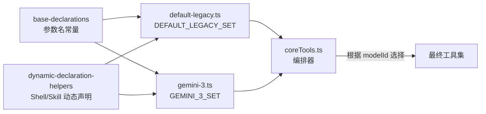
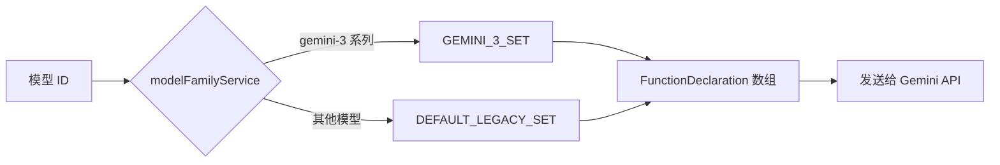

# model-family-sets

## 概述

`model-family-sets` 目录包含按**模型族（Model Family）**组织的完整工具 Schema 清单。每个文件导出一个完整的 `CoreToolSet` 对象，包含所有核心工具的 `FunctionDeclaration`（名称、描述、参数 Schema）。不同模型族可以为同一工具提供不同的描述和参数约束，以优化特定模型的工具使用效果。

## 目录结构

```
model-family-sets/
├── default-legacy.ts    # 默认/传统模型的工具集（Gemini 2.5 系列等）
└── gemini-3.ts          # Gemini 3 系列模型优化的工具集
```

## 架构图



## 核心组件

### `default-legacy.ts` - 传统模型工具集

导出 `DEFAULT_LEGACY_SET: CoreToolSet`，包含以下工具的完整声明：

| 工具名 | 说明 |
|--------|------|
| `read_file` | 读取文件内容，支持文本/图片/音频/PDF |
| `write_file` | 写入文件内容 |
| `grep_search` | 正则内容搜索（标准版） |
| `grep_search_ripgrep` | 正则内容搜索（ripgrep 高性能版） |
| `glob` | Glob 模式文件查找 |
| `list_directory` | 目录列表 |
| `run_shell_command` | Shell 命令执行（动态生成） |
| `replace` | 文本替换编辑 |
| `google_web_search` | Google 网页搜索 |
| `web_fetch` | URL 内容获取与分析 |
| `read_many_files` | 批量文件读取 |
| `save_memory` | 全局记忆存储 |
| `write_todos` | 任务列表管理 |
| `get_internal_docs` | 内部文档获取 |
| `ask_user` | 用户交互问答 |
| `enter_plan_mode` | 进入计划模式 |
| `exit_plan_mode` | 退出计划模式（动态生成） |
| `activate_skill` | 技能激活（动态生成） |

### `gemini-3.ts` - Gemini 3 模型工具集

导出 `GEMINI_3_SET: CoreToolSet`，结构与 `DEFAULT_LEGACY_SET` 相同，但针对 Gemini 3 模型做了以下优化：

- **read_file**: 增加了截断限制提示（行数、行长度、文件大小），鼓励 `start_line`/`end_line` 精准读取
- **write_file**: 精简描述，明确与 `replace` 工具的使用场景区分
- **grep_search_ripgrep**: 强调 ripgrep 的性能优势，推荐优先使用
- **google_web_search**: 增加了 grounded search 描述和与 `web_fetch` 的配合说明
- **web_fetch**: 优化了 GitHub URL 自动转换等描述
- **save_memory**: 增加了与 `write_file` 的场景区分说明
- **ask_user**: 增加了多选选项偏好描述

## 依赖关系

### 内部依赖
- `../base-declarations.ts` - 工具名和参数名常量
- `../dynamic-declaration-helpers.ts` - Shell、ExitPlanMode、ActivateSkill 的动态声明
- `../types.ts` - `CoreToolSet` 接口

### 外部依赖
- `@google/genai` - `FunctionDeclaration` 类型（隐式通过 CoreToolSet）

## 数据流


