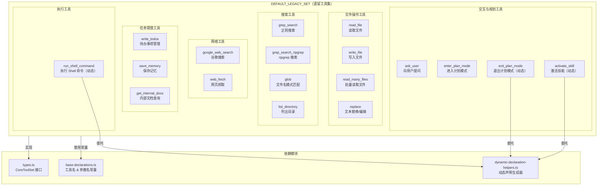

# default-legacy.ts

## 概述

`default-legacy.ts` 定义了**遗留/默认模型家族的完整工具清单**（`DEFAULT_LEGACY_SET`），是一个实现了 `CoreToolSet` 接口的常量对象。它包含了 Gemini CLI 所有核心工具的 `FunctionDeclaration`，每个声明包括工具名称、详细的自然语言描述和 JSON Schema 参数定义。

该文件是**工具定义的真实来源（Single Source of Truth）**——所有不属于 Gemini 3 特殊优化的模型都会使用这套工具集。同时它也是 `coreTools.ts` 中所有遗留导出的 `base` 属性的数据来源。

文件内定义了 **18 个工具**（15 个静态 + 3 个动态）。

## 架构图（Mermaid）

## 核心组件

### 工具集总览

`DEFAULT_LEGACY_SET` 导出了以下 18 个工具的完整声明：

| 键名 | 工具名常量 | 类型 | 功能简述 |
|---|---|---|---|
| `read_file` | `READ_FILE_TOOL_NAME` | 静态 | 读取单个文件内容（支持文本、图片、音频、PDF） |
| `write_file` | `WRITE_FILE_TOOL_NAME` | 静态 | 写入内容到指定文件 |
| `grep_search` | `GREP_TOOL_NAME` | 静态 | 使用正则在文件中搜索（最多100个匹配） |
| `grep_search_ripgrep` | `GREP_TOOL_NAME` | 静态 | 基于 ripgrep 的增强版搜索 |
| `glob` | `GLOB_TOOL_NAME` | 静态 | 使用 glob 模式查找文件 |
| `list_directory` | `LS_TOOL_NAME` | 静态 | 列出目录下的文件和子目录 |
| `run_shell_command` | `SHELL_TOOL_NAME` | 动态 | 执行 Shell 命令 |
| `replace` | `EDIT_TOOL_NAME` | 静态 | 文本替换编辑（搜索并替换） |
| `google_web_search` | `WEB_SEARCH_TOOL_NAME` | 静态 | 通过 Gemini API 执行谷歌搜索 |
| `web_fetch` | `WEB_FETCH_TOOL_NAME` | 静态 | 抓取并处理 URL 内容 |
| `read_many_files` | `READ_MANY_FILES_TOOL_NAME` | 静态 | 基于 glob 模式批量读取多个文件 |
| `save_memory` | `MEMORY_TOOL_NAME` | 静态 | 保存全局用户上下文记忆 |
| `write_todos` | `WRITE_TODOS_TOOL_NAME` | 静态 | 管理任务的待办事项列表 |
| `get_internal_docs` | `GET_INTERNAL_DOCS_TOOL_NAME` | 静态 | 查询 CLI 内部文档 |
| `ask_user` | `ASK_USER_TOOL_NAME` | 静态 | 向用户提出选择题/文本题/确认题 |
| `enter_plan_mode` | `ENTER_PLAN_MODE_TOOL_NAME` | 静态 | 切换到只读计划模式 |
| `exit_plan_mode` | `EXIT_PLAN_MODE_TOOL_NAME` | 动态 | 退出计划模式并提交计划 |
| `activate_skill` | `ACTIVATE_SKILL_TOOL_NAME` | 动态 | 激活指定技能代理 |

### 各工具详细参数说明

#### 1. `read_file` — 读取文件

读取并返回指定文件内容。支持文本、图片（PNG/JPG/GIF/WEBP/SVG/BMP）、音频（MP3/WAV/AIFF/AAC/OGG/FLAC）和 PDF 文件。对于文本文件支持按行范围读取。

| 参数 | 类型 | 必需 | 说明 |
|---|---|---|---|
| `file_path` | string | 是 | 文件路径 |
| `start_line` | number | 否 | 开始行号（从1开始） |
| `end_line` | number | 否 | 结束行号（包含，从1开始） |

#### 2. `write_file` — 写入文件

将内容写入本地文件系统的指定文件。用户有权修改 `content` 内容。

| 参数 | 类型 | 必需 | 说明 |
|---|---|---|---|
| `file_path` | string | 是 | 文件路径 |
| `content` | string | 是 | 要写入的完整内容，不得使用省略占位符 |

#### 3. `grep_search` — 正则搜索

在文件内容中搜索正则表达式模式，最多返回 100 个匹配。

| 参数 | 类型 | 必需 | 说明 |
|---|---|---|---|
| `pattern` | string | 是 | 正则表达式模式 |
| `dir_path` | string | 否 | 搜索目录的绝对路径 |
| `include_pattern` | string | 否 | 文件过滤 glob 模式 |
| `exclude_pattern` | string | 否 | 结果排除的正则模式 |
| `names_only` | boolean | 否 | 仅返回文件路径 |
| `max_matches_per_file` | integer(>=1) | 否 | 单文件最大匹配数 |
| `total_max_matches` | integer(>=1) | 否 | 总最大匹配数（默认100） |

#### 4. `grep_search_ripgrep` — ripgrep 增强搜索

基于 ripgrep 的增强搜索，支持更多参数。

| 参数 | 类型 | 必需 | 说明 |
|---|---|---|---|
| `pattern` | string | 是 | Rust 风格正则（默认），支持 `\b` 精确匹配 |
| `dir_path` | string | 否 | 搜索目录或文件 |
| `include_pattern` | string | 否 | 文件过滤 glob 模式 |
| `exclude_pattern` | string | 否 | 排除正则模式 |
| `names_only` | boolean | 否 | 仅返回文件路径 |
| `case_sensitive` | boolean | 否 | 大小写敏感（默认 false） |
| `fixed_strings` | boolean | 否 | 字面量搜索（非正则，默认 false） |
| `context` | integer | 否 | 上下文行数（类似 grep -C） |
| `after` | integer(>=0) | 否 | 匹配后显示行数（类似 grep -A） |
| `before` | integer(>=0) | 否 | 匹配前显示行数（类似 grep -B） |
| `no_ignore` | boolean | 否 | 是否搜索被 .gitignore 忽略的文件 |
| `max_matches_per_file` | integer(>=1) | 否 | 单文件最大匹配数 |
| `total_max_matches` | integer(>=1) | 否 | 总最大匹配数（默认100） |

#### 5. `glob` — 文件名模式匹配

按 glob 模式查找文件，返回按修改时间排序（最新优先）的绝对路径。

| 参数 | 类型 | 必需 | 说明 |
|---|---|---|---|
| `pattern` | string | 是 | glob 模式 |
| `dir_path` | string | 否 | 搜索目录 |
| `case_sensitive` | boolean | 否 | 大小写敏感（默认 false） |
| `respect_gitignore` | boolean | 否 | 尊重 .gitignore（默认 true） |
| `respect_geminiignore` | boolean | 否 | 尊重 .geminiignore（默认 true） |

#### 6. `list_directory` — 列出目录

列出指定目录下的直接文件和子目录名称。

| 参数 | 类型 | 必需 | 说明 |
|---|---|---|---|
| `dir_path` | string | 是 | 目录路径 |
| `ignore` | string[] | 否 | 要忽略的 glob 模式列表 |
| `file_filtering_options` | object | 否 | 包含 `respect_gitignore` 和 `respect_geminiignore` |

#### 7. `run_shell_command` — Shell 命令（动态）

委托给 `getShellDeclaration()` 动态生成声明。参数包括 `enableInteractiveShell`、`enableEfficiency`、`enableToolSandboxing`。

#### 8. `replace` — 文本替换编辑

在文件中查找并替换文本。默认期望精确匹配一处，可设置 `allow_multiple` 替换所有匹配。

| 参数 | 类型 | 必需 | 说明 |
|---|---|---|---|
| `file_path` | string | 是 | 文件路径 |
| `instruction` | string | 是 | 变更的语义化描述（说明为何、在哪、改什么、期望结果） |
| `old_string` | string | 是 | 要替换的精确原文（需含至少3行上下文） |
| `new_string` | string | 是 | 替换后的精确新文本 |
| `allow_multiple` | boolean | 否 | 是否替换所有匹配（默认 false） |

#### 9. `google_web_search` — 谷歌搜索

通过 Gemini API 执行谷歌搜索并返回结果。

| 参数 | 类型 | 必需 | 说明 |
|---|---|---|---|
| `query` | string | 是 | 搜索查询 |

#### 10. `web_fetch` — 网页抓取

处理 URL 内容，支持本地地址和私有网络，可同时处理最多 20 个 URL。

| 参数 | 类型 | 必需 | 说明 |
|---|---|---|---|
| `prompt` | string | 是 | 包含 URL 和处理指令的综合提示 |

#### 11. `read_many_files` — 批量读取文件

基于 glob 模式批量读取目录中的多个文件。支持文本、图片、音频和 PDF。文件间以 `--- {filePath} ---` 分隔。

| 参数 | 类型 | 必需 | 说明 |
|---|---|---|---|
| `include` | string[] | 是 | glob 模式或路径数组 |
| `exclude` | string[] | 否 | 排除的 glob 模式（默认 []） |
| `recursive` | boolean | 否 | 是否递归搜索（默认 true） |
| `useDefaultExcludes` | boolean | 否 | 是否使用默认排除规则（默认 true） |
| `file_filtering_options` | object | 否 | gitignore/geminiignore 设置 |

#### 12. `save_memory` — 保存记忆

保存跨所有工作区的全局用户上下文（偏好、事实），严禁保存工作区特定内容。

| 参数 | 类型 | 必需 | 说明 |
|---|---|---|---|
| `fact` | string | 是 | 要记住的具体事实 |

#### 13. `write_todos` — 待办事项管理

管理复杂任务的子任务列表。仅在任务复杂度高于 2 步时使用。

| 参数 | 类型 | 必需 | 说明 |
|---|---|---|---|
| `todos` | object[] | 是 | 完整的待办项列表（替换现有列表） |

每个待办项：
| 属性 | 类型 | 说明 |
|---|---|---|
| `description` | string | 任务描述 |
| `status` | enum | `pending` / `in_progress` / `completed` / `cancelled` / `blocked` |

#### 14. `get_internal_docs` — 内部文档查询

返回 CLI 内部文档内容。不传路径时列出所有可用文档。

| 参数 | 类型 | 必需 | 说明 |
|---|---|---|---|
| `path` | string | 否 | 文档相对路径 |

#### 15. `ask_user` — 向用户提问

向用户提出 1-4 个问题，支持选择题、文本题和是非题。

| 参数 | 类型 | 必需 | 说明 |
|---|---|---|---|
| `questions` | object[] | 是 | 问题数组（1-4 个） |

每个问题对象：
| 属性 | 类型 | 必需 | 说明 |
|---|---|---|---|
| `question` | string | 是 | 完整的问题文本 |
| `header` | string | 是 | 简短标签（如 "Auth"、"Config"） |
| `type` | enum | 是 | `choice` / `text` / `yesno` |
| `options` | object[] | 否 | 选择题选项（2-4 个，自动添加 "Other"） |
| `multi_select` | boolean | 否 | 是否允许多选（仅 choice 类型） |
| `placeholder` | string | 否 | 输入框提示文本 |

#### 16. `enter_plan_mode` — 进入计划模式

切换到计划模式，只能使用只读工具进行研究和设计。

| 参数 | 类型 | 必需 | 说明 |
|---|---|---|---|
| `reason` | string | 否 | 进入计划模式的原因 |

#### 17. `exit_plan_mode` — 退出计划模式（动态）

委托给 `getExitPlanModeDeclaration()` 生成。

#### 18. `activate_skill` — 激活技能（动态）

委托给 `getActivateSkillDeclaration(skillNames)` 生成。

## 依赖关系

### 内部依赖

| 模块 | 引入内容 | 用途 |
|---|---|---|
| `../types.js` | `CoreToolSet` | 工具集的类型接口 |
| `../base-declarations.js` | 全部工具名常量（16 个）+ 全部参数名常量（40+ 个） | 用作 JSON Schema 中的属性键名 |
| `../dynamic-declaration-helpers.js` | `getShellDeclaration`, `getExitPlanModeDeclaration`, `getActivateSkillDeclaration` | 动态工具声明的生成 |

### 外部依赖

无直接外部依赖。`FunctionDeclaration` 类型通过 `CoreToolSet` 接口间接引用自 `@google/genai`。

## 关键实现细节

1. **完整内联声明**：与 `gemini-3.ts` 可能的简化版不同，该文件包含每个工具的**完整描述文本和参数 schema**，方便在一个文件中审计所有工具定义。文件注释明确提到 "includes complete descriptions and schemas for auditing in one place"。

2. **两种 grep 工具共存**：`grep_search` 和 `grep_search_ripgrep` 共用同一个工具名 `GREP_TOOL_NAME`，但参数集不同。`grep_search` 是简化版（最多 100 匹配，不支持上下文行数），`grep_search_ripgrep` 是增强版（支持大小写控制、字面量搜索、上下文行数、ignore 控制等）。具体使用哪个由上层决定。

3. **用户可修改内容的声明**：`write_file` 和 `replace` 工具的描述中明确指出 "The user has the ability to modify content. If modified, this will be stated in the response."，这是对 AI 模型的重要行为指引。

4. **replace 工具的严格约束**：编辑工具要求 `old_string` 必须包含至少 3 行上下文，且为精确字面文本，禁止转义。如果匹配多处且未设置 `allow_multiple`，工具会失败。这些约束通过描述文本传达给 AI 模型。

5. **save_memory 的全局性约束**：记忆工具描述中用加粗和大写明确强调 "CRITICAL: GLOBAL CONTEXT ONLY"，禁止保存工作区特定信息，这是对 AI 模型行为的关键限制。

6. **write_todos 的详细方法论**：待办事项工具包含了极其详细的使用方法论、状态定义、使用示例和不使用示例，总计超过 60 行描述文本，是所有工具中描述最长的。

7. **动态工具的延迟生成**：`run_shell_command`、`exit_plan_mode`、`activate_skill` 三个工具在 CoreToolSet 中以函数形式存在（而非直接的 FunctionDeclaration 对象），调用时才委托给 `dynamic-declaration-helpers.ts` 生成实际声明。

8. **文件过滤选项的复用模式**：`list_directory` 和 `read_many_files` 都使用了嵌套的 `file_filtering_options` 对象来包含 `respect_gitignore` 和 `respect_geminiignore` 参数，而 `glob` 则将这两个参数平铺在顶层——这是不同工具间的细微设计差异。
