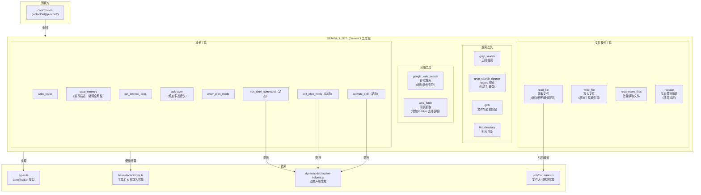

# gemini-3.ts

## 概述

`gemini-3.ts` 定义了**Gemini 3 模型家族的完整工具清单**（`GEMINI_3_SET`），是一个实现了 `CoreToolSet` 接口的常量对象。该文件允许针对 Gemini 3 模型进行**模型特定的描述和 schema 优化**。

虽然注释中标注 "Initially a copy of the default legacy set"，但实际上多个工具的描述已经经过重新编写，以更好地引导 Gemini 3 模型的行为。主要优化方向包括：
- **Token 效率意识**：如 `read_file` 增加了截断阈值的具体数值，要求精准的局部读取
- **工具链引导**：如 `google_web_search` 和 `web_fetch` 增加了协作使用的指引
- **性能偏好**：如 `grep_search_ripgrep` 明确标注为优于 Shell grep 的首选方案
- **更简洁精确的描述**：如 `write_file`、`save_memory`、`replace` 等的描述被大幅精简

文件内定义了与 `default-legacy.ts` 相同的 **18 个工具**（15 个静态 + 3 个动态）。

## 架构图（Mermaid）



## 核心组件

### 与 default-legacy.ts 的差异对比

以下表格详细列出 `GEMINI_3_SET` 与 `DEFAULT_LEGACY_SET` 之间的差异。**未列出的工具表示两者完全一致**。

#### 1. `read_file` — 差异：描述增加截断阈值和效率指引

| 维度 | default-legacy | gemini-3 |
|---|---|---|
| 描述重点 | 通用描述，提到文件大时会截断 | 明确给出截断阈值数值：`DEFAULT_MAX_LINES_TEXT_FILE` 行、`MAX_LINE_LENGTH_TEXT_FILE` 字符/行、`MAX_FILE_SIZE_MB` MB |
| 效率指引 | 无 | 要求"MUST use start_line and end_line for targeted, surgical reads"，触发截断限制被视为"token-inefficient" |
| 参数 schema | 相同 | 相同 |

**Gemini 3 新增的额外导入**：
```typescript
import { DEFAULT_MAX_LINES_TEXT_FILE, MAX_LINE_LENGTH_TEXT_FILE, MAX_FILE_SIZE_MB } from '../../../utils/constants.js';
```
这些常量被嵌入到描述字符串中，使模型了解具体的截断边界。

#### 2. `write_file` — 差异：描述精简并增加工具链引导

| 维度 | default-legacy | gemini-3 |
|---|---|---|
| 描述风格 | 较为通用 | 精简，强调 "automatically creating missing parent directories" 和 "Overwrites existing files" |
| 工具链引导 | 无 | 增加 `"use '${EDIT_TOOL_NAME}' for targeted edits to large files"`，引导模型在大文件编辑时使用替换工具 |
| 参数描述 | `file_path` 描述较长 | 精简为 "Path to the file." |

#### 3. `grep_search_ripgrep` — 差异：描述增加性能优先提示

| 维度 | default-legacy | gemini-3 |
|---|---|---|
| 描述 | 简单的功能描述 | 增加 "This tool is FAST and optimized, powered by ripgrep. PREFERRED over standard `run_shell_command("grep ...")`"，明确标注为首选搜索工具 |
| 参数 schema | 相同 | 相同 |

#### 4. `replace` — 差异：描述大幅精简

| 维度 | default-legacy | gemini-3 |
|---|---|---|
| 描述长度 | 约 15 行，包含详细的参数期望说明 | 约 2 行，移除了大量重复的参数使用指引 |
| `instruction` 参数描述 | 包含 GOOD/BAD 示例（约 12 行） | 精简为一句话 |
| `old_string` 参数描述 | 包含 "3 lines of context" 要求 | 精简，移除具体行数要求 |
| 核心约束 | 保留 | 保留（用户可修改、精确字面文本、allow_multiple） |

#### 5. `google_web_search` — 差异：描述重写，增加协作引导

| 维度 | default-legacy | gemini-3 |
|---|---|---|
| 描述 | "Performs a web search using Google Search (via the Gemini API) and returns the results." | 重写为 "Performs a grounded Google Search..."，增加返回值说明（"synthesized answer with citations"），增加使用场景指引，增加与 `web_fetch` 的协作引导 |
| `query` 参数描述 | "The search query to find information on the web." | 增加自然语言查询示例 |

#### 6. `web_fetch` — 差异：描述重写，增加 GitHub 支持说明

| 维度 | default-legacy | gemini-3 |
|---|---|---|
| 描述 | 强调支持本地和私有网络地址 | 重写为强调 "documentation review, technical research, or reading raw code from GitHub"，增加 GitHub blob URL 自动转换说明 |
| `prompt` 参数描述 | 详细的 URL 格式要求 | 精简，移除 URL 格式细节 |

#### 7. `save_memory` — 差异：描述重写

| 维度 | default-legacy | gemini-3 |
|---|---|---|
| 描述风格 | Markdown 格式，包含标题和列表 | 散文式，提到 `write_file` 对比、"global memory file loaded in every workspace" |
| 不确定时行为 | 未提及 | 增加 "If you are unsure whether a fact should be remembered globally, ask the user first." |
| `fact` 参数描述 | "The specific fact or piece of information to remember." | 增加示例 "e.g., 'I prefer using tabs'" 和 "Do not include local paths or project-specific names." |

#### 8. `ask_user` — 差异：描述增加行为引导

| 维度 | default-legacy | gemini-3 |
|---|---|---|
| 描述 | 功能描述 | 增加 "prefer providing multiple-choice options with detailed descriptions and enable multi-select where appropriate" |

### 完全一致的工具

以下工具在 `GEMINI_3_SET` 和 `DEFAULT_LEGACY_SET` 中**完全相同**（描述和参数 schema 均一致）：

- `grep_search`（基础版正则搜索）
- `glob`（文件名模式匹配）
- `list_directory`（列出目录）
- `run_shell_command`（Shell 命令，委托给同一个 helper）
- `read_many_files`（批量读取文件）
- `write_todos`（待办事项管理）
- `get_internal_docs`（内部文档查询）
- `enter_plan_mode`（进入计划模式）
- `exit_plan_mode`（退出计划模式）
- `activate_skill`（激活技能）

## 依赖关系

### 内部依赖

| 模块 | 引入内容 | 用途 |
|---|---|---|
| `../types.js` | `CoreToolSet` | 工具集的类型接口 |
| `../base-declarations.js` | 全部工具名常量（16 个）+ 全部参数名常量（40+ 个） | 用作 JSON Schema 中的属性键名 |
| `../dynamic-declaration-helpers.js` | `getShellDeclaration`, `getExitPlanModeDeclaration`, `getActivateSkillDeclaration` | 动态工具声明的生成 |
| `../../../utils/constants.js` | `DEFAULT_MAX_LINES_TEXT_FILE`, `MAX_LINE_LENGTH_TEXT_FILE`, `MAX_FILE_SIZE_MB` | 文件读取截断阈值常量（Gemini 3 独有依赖） |

### 外部依赖

无直接外部依赖。

## 关键实现细节

1. **模型特定优化的设计哲学**：Gemini 3 工具集的优化方向是**减少描述冗余、增加行为引导**。遗留版本的描述偏向"完整文档"风格（包含所有细节和示例），而 Gemini 3 版本假设模型有更强的理解能力，采用"精确指令"风格。

2. **截断阈值的显式注入**：`read_file` 是 Gemini 3 最显著的差异之一。通过导入 `utils/constants.js` 中的实际常量值并嵌入描述字符串，确保模型了解具体的限制数字，而非模糊的"如果文件太大会截断"。这是**唯一一个额外引入 `utils/constants.js` 的工具集文件**。

3. **工具链协作引导**：多处描述中增加了工具之间的协作指引：
   - `write_file` 引导使用 `replace` 编辑大文件
   - `google_web_search` 引导使用 `web_fetch` 深入分析搜索结果
   - `grep_search_ripgrep` 引导优先使用而非 Shell grep
   - `save_memory` 与 `write_file` 的功能区分

4. **渐进式差异化策略**：文件注释标注 "Initially a copy of the default legacy set"，意味着新工具集的开发策略是先复制遗留版本，再逐步针对 Gemini 3 模型的特性进行优化。当前约有 8 个工具已经有差异化描述，10 个工具保持一致。

5. **动态工具的一致性**：三个动态工具（`run_shell_command`、`exit_plan_mode`、`activate_skill`）在两个工具集中完全一致，都委托给同一组 helper 函数。这意味着动态工具目前不需要模型特定的优化。

6. **ripgrep 的显式推荐**：Gemini 3 版本的 `grep_search_ripgrep` 描述中明确使用了 "PREFERRED" 和 "FAST and optimized" 等词汇，这是对模型行为的强引导——在需要搜索时应优先选择 ripgrep 版本而非 Shell 中的 grep 命令。
