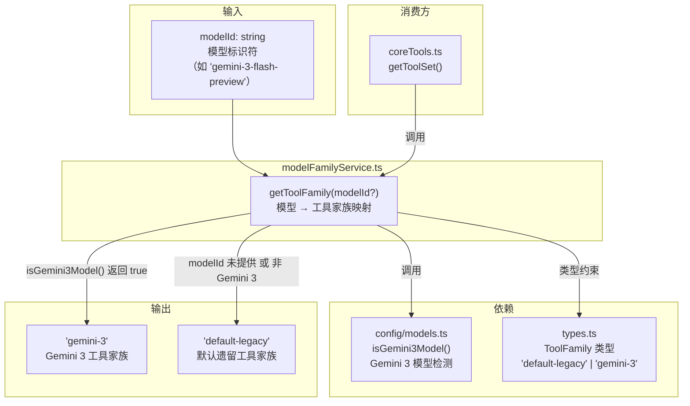
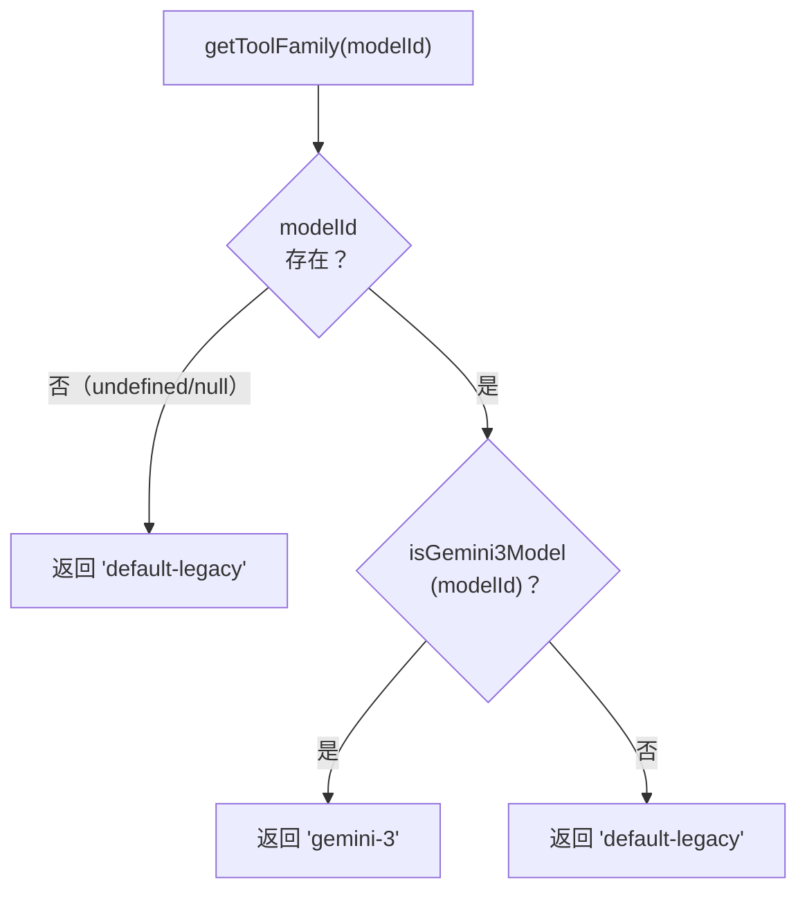

# modelFamilyService.ts

## 概述

`modelFamilyService.ts` 是**模型 ID 到工具家族映射的唯一权威来源（Single Source of Truth）**。它提供了一个核心函数 `getToolFamily()`，将模型标识符（如 `'gemini-2.5-pro'`、`'gemini-3-flash-preview'`）映射到工具家族标识（`ToolFamily` 类型），从而决定该模型应使用哪套工具定义。

该文件极其精简（仅 33 行），职责高度聚焦：**只做模型分类，不做工具集选择**。工具集的实际选择由上层的 `coreTools.ts` 中的 `getToolSet()` 函数根据返回的 `ToolFamily` 值完成。

## 架构图（Mermaid）



## 核心组件

### `getToolFamily(modelId?: string): ToolFamily`

将模型 ID 解析为对应的工具家族标识。

**函数签名**：
```typescript
export function getToolFamily(modelId?: string): ToolFamily
```

**参数**：
- `modelId`（可选）：模型标识符字符串，如 `'gemini-2.5-pro'`、`'gemini-3-flash-preview'`

**返回值**：`ToolFamily` 类型（`'default-legacy' | 'gemini-3'`）

**解析逻辑**（按优先级排列）：

```
1. 如果 modelId 为 undefined/null/空字符串 → 返回 'default-legacy'
2. 如果 isGemini3Model(modelId) 返回 true → 返回 'gemini-3'
3. 其他所有情况 → 返回 'default-legacy'（兜底默认值）
```

**决策流程图**：



### `isGemini3Model()` 的内部实现（外部依赖详情）

虽然 `isGemini3Model` 定义在 `config/models.ts` 中，但理解其行为对理解 `getToolFamily` 至关重要：

```typescript
export function isGemini3Model(model: string, config?: ModelCapabilityContext): boolean {
  if (config?.getExperimentalDynamicModelConfiguration?.() === true) {
    const resolved = resolveModel(model);
    return config.modelConfigService.getModelDefinition(resolved)?.family === 'gemini-3';
  }
  const resolved = resolveModel(model);
  return /^gemini-3(\.|-|$)/.test(resolved);
}
```

**两条检测路径**：
1. **动态模型配置模式**：当实验性动态模型配置启用时，通过 `modelConfigService` 查询模型定义的 `family` 属性是否为 `'gemini-3'`
2. **静态正则匹配模式**（默认）：先 `resolveModel()` 解析模型别名，再用正则 `/^gemini-3(\.|-|$)/` 匹配，即模型 ID 以 `gemini-3` 开头，后跟 `.`、`-` 或字符串结尾

**匹配示例**：
- `gemini-3` → 匹配（`$` 匹配字符串结尾）
- `gemini-3-flash-preview` → 匹配（`-` 分隔符）
- `gemini-3.0-pro` → 匹配（`.` 分隔符）
- `gemini-2.5-pro` → 不匹配
- `gemini-35-flash` → 不匹配（`3` 后面不是 `.`、`-` 或结尾）

**注意**：`modelFamilyService.ts` 调用 `isGemini3Model(modelId)` 时**没有**传递 `config` 参数，因此始终使用静态正则匹配模式。

## 依赖关系

### 内部依赖

| 模块 | 引入内容 | 用途 |
|---|---|---|
| `../../config/models.js` | `isGemini3Model` | 检测模型 ID 是否属于 Gemini 3 家族 |
| `./types.js` | `ToolFamily`（类型） | 返回值的类型约束 |

### 外部依赖

无外部依赖。

## 关键实现细节

1. **关注点分离**：该文件仅负责"模型 → 家族"的映射，不涉及"家族 → 工具集"的选择。这种分离使得：
   - 添加新的模型家族只需在此文件增加判断分支
   - 工具集的选择逻辑在 `coreTools.ts` 中独立管理
   - 两者可以独立测试

2. **安全的默认值策略**：函数在两种情况下返回 `'default-legacy'`：
   - `modelId` 未提供（`undefined`/`null`/空字符串）
   - `modelId` 不匹配任何已知的特殊家族

   这确保了**任何未知模型都会得到完整的工具支持**，不会因模型识别失败而崩溃。

3. **扩展点设计**：当前只有两个家族（`'default-legacy'` 和 `'gemini-3'`），但代码结构预留了清晰的扩展路径。添加新家族（如假设的 `'gemini-4'`）只需：
   - 在 `types.ts` 的 `ToolFamily` 联合类型中添加新值
   - 在 `config/models.ts` 中添加新的模型检测函数
   - 在此文件中添加新的 `if` 分支
   - 在 `coreTools.ts` 的 `getToolSet()` 中添加新的 `switch case`
   - 创建新的工具集文件

4. **无 config 参数传递**：调用 `isGemini3Model(modelId)` 时未传递 `config` 参数。这意味着在工具家族解析的上下文中，始终使用基于正则表达式的静态匹配，而非依赖动态模型配置服务。这是一个有意的简化——工具定义模块不需要访问运行时配置服务。

5. **模型别名透明处理**：虽然 `isGemini3Model` 内部会调用 `resolveModel()` 来解析模型别名（如将短别名映射到完整模型 ID），但 `getToolFamily` 的调用方无需关心这一细节，只需传入用户配置的原始模型 ID 即可。
