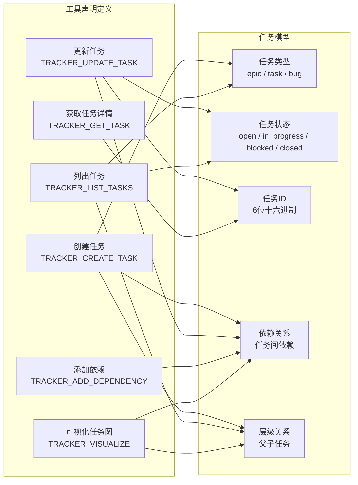
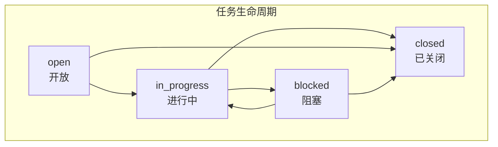

# trackerTools.ts

## 概述

`trackerTools.ts` 是任务追踪器（Tracker）工具的**声明定义模块**，集中定义了与任务追踪系统交互的全部 6 个工具的函数声明。这些声明遵循 `ToolDefinition` 接口规范，用于向 Google GenAI API 注册可调用的函数（Function Calling），使 AI 模型能够创建、更新、查询、列表、添加依赖和可视化任务。

任务追踪器支持三种任务类型（`epic`、`task`、`bug`）和四种任务状态（`open`、`in_progress`、`blocked`、`closed`），形成了一个带有层级关系和依赖关系的任务管理系统。

## 架构图（Mermaid）

## 核心组件

### 1. `TRACKER_CREATE_TASK_DEFINITION` -- 创建任务

创建一个新的追踪任务。

| 参数 | 类型 | 必填 | 说明 |
|------|------|------|------|
| `title` | `string` | 是 | 任务的简短标题 |
| `description` | `string` | 是 | 任务的详细描述 |
| `type` | `string` (枚举) | 是 | 任务类型，可选值：`epic`（史诗）、`task`（任务）、`bug`（缺陷） |
| `parentId` | `string` | 否 | 父任务的 ID，用于建立层级关系 |
| `dependencies` | `string[]` | 否 | 依赖的任务 ID 列表 |

### 2. `TRACKER_UPDATE_TASK_DEFINITION` -- 更新任务

更新已有任务的属性。

| 参数 | 类型 | 必填 | 说明 |
|------|------|------|------|
| `id` | `string` | 是 | 任务的 6 位十六进制 ID |
| `title` | `string` | 否 | 新的任务标题 |
| `description` | `string` | 否 | 新的任务描述 |
| `status` | `string` (枚举) | 否 | 新的任务状态，可选值：`open`、`in_progress`、`blocked`、`closed` |
| `dependencies` | `string[]` | 否 | 新的依赖 ID 列表（整体替换） |

### 3. `TRACKER_GET_TASK_DEFINITION` -- 获取任务详情

根据 ID 获取某个具体任务的详细信息。

| 参数 | 类型 | 必填 | 说明 |
|------|------|------|------|
| `id` | `string` | 是 | 任务的 6 位十六进制 ID |

### 4. `TRACKER_LIST_TASKS_DEFINITION` -- 列出任务

列出追踪器中的任务，支持多维度可选筛选。所有参数均为可选，不传参数时返回全部任务。

| 参数 | 类型 | 必填 | 说明 |
|------|------|------|------|
| `status` | `string` (枚举) | 否 | 按状态筛选：`open`、`in_progress`、`blocked`、`closed` |
| `type` | `string` (枚举) | 否 | 按类型筛选：`epic`、`task`、`bug` |
| `parentId` | `string` | 否 | 按父任务 ID 筛选 |

### 5. `TRACKER_ADD_DEPENDENCY_DEFINITION` -- 添加依赖

在两个任务之间建立依赖关系。

| 参数 | 类型 | 必填 | 说明 |
|------|------|------|------|
| `taskId` | `string` | 是 | 具有依赖的任务 ID（被阻塞方） |
| `dependencyId` | `string` | 是 | 被依赖的任务 ID（阻塞方） |

### 6. `TRACKER_VISUALIZE_DEFINITION` -- 可视化任务图

以 ASCII 树形式渲染任务图的可视化展示。该工具无需任何参数，会展示整个任务图的结构。

| 参数 | 类型 | 必填 | 说明 |
|------|------|------|------|
| （无参数） | - | - | - |

## 依赖关系

### 内部依赖

| 模块路径 | 导入内容 | 用途 |
|----------|----------|------|
| `./types.js` | `ToolDefinition`（类型） | 工具定义接口，定义了 `base` 和 `overrides` 的结构规范 |
| `../tool-names.js` | `TRACKER_CREATE_TASK_TOOL_NAME` | 创建任务工具的名称常量 |
| `../tool-names.js` | `TRACKER_UPDATE_TASK_TOOL_NAME` | 更新任务工具的名称常量 |
| `../tool-names.js` | `TRACKER_GET_TASK_TOOL_NAME` | 获取任务工具的名称常量 |
| `../tool-names.js` | `TRACKER_LIST_TASKS_TOOL_NAME` | 列出任务工具的名称常量 |
| `../tool-names.js` | `TRACKER_ADD_DEPENDENCY_TOOL_NAME` | 添加依赖工具的名称常量 |
| `../tool-names.js` | `TRACKER_VISUALIZE_TOOL_NAME` | 可视化工具的名称常量 |

### 外部依赖

无直接外部依赖。`ToolDefinition` 类型内部引用了 `@google/genai` 的 `FunctionDeclaration`，但本文件不直接导入该包。

## 关键实现细节

1. **纯声明式定义**：本文件不包含任何业务逻辑，仅以静态常量的形式定义了 6 个工具的函数声明。每个定义都是一个 `ToolDefinition` 对象，其 `base` 属性包含 `name`、`description` 和 `parametersJsonSchema`。

2. **无 overrides 函数**：所有 6 个工具定义均未提供 `overrides` 函数，说明这些工具的声明不需要根据不同模型进行差异化调整。当通过 `resolveToolDeclaration` 解析时，将直接返回 `base` 声明。

3. **JSON Schema 参数定义**：参数使用 `parametersJsonSchema`（JSON Schema 格式）定义，而非 `parameters`（OpenAPI Schema 格式）。这是 Google GenAI API 支持的参数声明格式之一，允许更标准的 JSON Schema 验证。

4. **任务 ID 格式**：任务 ID 被描述为"6-character hex ID"（6 位十六进制字符），这暗示任务系统使用简短的十六进制标识符，可能由哈希生成或随机分配，便于人类阅读和口头交流。

5. **依赖管理方式**：
   - **创建时**：通过 `dependencies` 数组参数直接指定初始依赖。
   - **更新时**：通过 `dependencies` 数组参数整体替换依赖列表。
   - **增量添加**：通过独立的 `TRACKER_ADD_DEPENDENCY` 工具逐条添加依赖。
   这种设计提供了灵活性：批量设置用更新，逐条添加用专用工具。

6. **层级结构支持**：通过 `parentId` 参数支持父子任务关系，可在创建时指定父任务，也可在列出任务时按父任务筛选，形成树形任务结构。

7. **工具名称外部化**：所有工具名称从 `tool-names.js` 导入，而非在本文件内硬编码。这种集中管理方式确保了工具名称在定义和实现之间的一致性，避免拼写错误导致的匹配失败。
