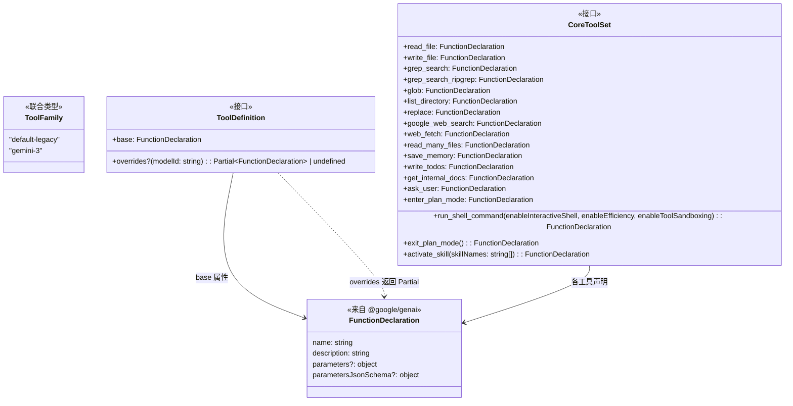
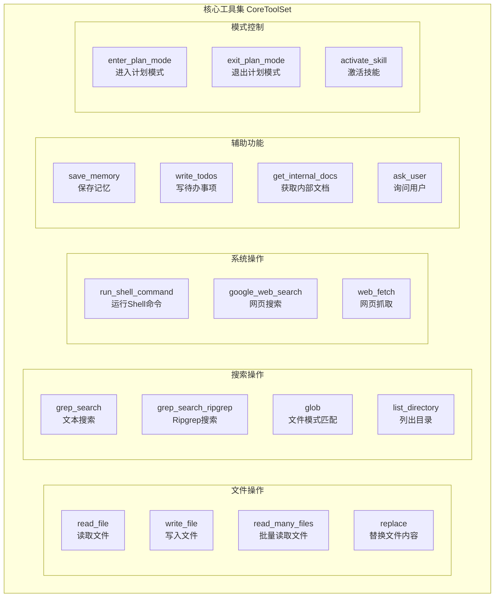

# types.ts

## 概述

`types.ts` 是工具定义系统的**类型基础模块**，定义了整个工具声明体系的核心类型接口。该文件导出三个关键类型：

- **`ToolFamily`**：工具适配的模型家族联合类型。
- **`ToolDefinition`**：单个工具的声明定义接口，支持基础声明和按模型覆盖。
- **`CoreToolSet`**：核心工具集的完整映射接口，列举了系统中所有内建核心工具的函数声明。

这些类型是整个工具系统的"契约层"，被 `resolver.ts`、各工具声明文件（如 `trackerTools.ts`）以及工具注册/调度逻辑广泛引用。

## 架构图（Mermaid）





## 核心组件

### 1. `ToolFamily` 类型

```typescript
export type ToolFamily = 'default-legacy' | 'gemini-3';
```

一个字符串字面量联合类型，定义了工具系统支持的模型家族：

| 值 | 说明 |
|----|------|
| `'default-legacy'` | 默认/传统模型家族，用于旧版或通用模型 |
| `'gemini-3'` | Gemini 3 模型家族，可能需要不同的工具声明参数格式 |

此类型用于在工具解析过程中区分不同模型家族，以便应用不同的声明覆盖。

### 2. `ToolDefinition` 接口

```typescript
export interface ToolDefinition {
  base: FunctionDeclaration;
  overrides?: (modelId: string) => Partial<FunctionDeclaration> | undefined;
}
```

单个工具的声明定义接口，是整个工具声明系统的核心抽象。

| 属性 | 类型 | 必填 | 说明 |
|------|------|------|------|
| `base` | `FunctionDeclaration` | 是 | 基础函数声明，包含工具名称、描述和参数定义 |
| `overrides` | `(modelId: string) => Partial<FunctionDeclaration> \| undefined` | 否 | 覆盖函数，接收模型 ID，返回需要覆盖基础声明的部分属性，或 `undefined` 表示无需覆盖 |

**设计模式**：采用"基础 + 覆盖"模式（Base + Override），类似于 CSS 的级联机制。每个工具有一个通用的基础声明，然后可以针对特定模型提供差异化的覆盖。

### 3. `CoreToolSet` 接口

```typescript
export interface CoreToolSet { ... }
```

核心工具集的显式映射接口，列举了系统中全部 17 个核心内建工具。

| 工具名称 | 类型 | 说明 |
|----------|------|------|
| `read_file` | `FunctionDeclaration` | 读取单个文件内容 |
| `write_file` | `FunctionDeclaration` | 写入文件内容 |
| `grep_search` | `FunctionDeclaration` | 基于 grep 的文本内容搜索 |
| `grep_search_ripgrep` | `FunctionDeclaration` | 基于 ripgrep 的高性能文本搜索 |
| `glob` | `FunctionDeclaration` | 文件名模式匹配搜索 |
| `list_directory` | `FunctionDeclaration` | 列出目录内容 |
| `run_shell_command` | `函数` | 运行 Shell 命令（动态生成，接受三个布尔配置参数） |
| `replace` | `FunctionDeclaration` | 替换文件中的文本内容 |
| `google_web_search` | `FunctionDeclaration` | Google 网页搜索 |
| `web_fetch` | `FunctionDeclaration` | 抓取指定 URL 的网页内容 |
| `read_many_files` | `FunctionDeclaration` | 批量读取多个文件 |
| `save_memory` | `FunctionDeclaration` | 将信息保存到 AI 记忆中 |
| `write_todos` | `FunctionDeclaration` | 写入待办事项列表 |
| `get_internal_docs` | `FunctionDeclaration` | 获取项目内部文档 |
| `ask_user` | `FunctionDeclaration` | 向用户提问获取信息 |
| `enter_plan_mode` | `FunctionDeclaration` | 进入计划模式 |
| `exit_plan_mode` | `函数` | 退出计划模式（动态生成，无参数工厂函数） |
| `activate_skill` | `函数` | 激活指定技能（动态生成，接受技能名称列表） |

## 依赖关系

### 内部依赖

无。本文件是类型基础模块，不依赖项目内其他模块。

### 外部依赖

| 包名 | 导入内容 | 用途 |
|------|----------|------|
| `@google/genai` | `FunctionDeclaration`（类型） | Google GenAI SDK 的函数声明类型，是所有工具声明的基础类型 |

## 关键实现细节

1. **纯类型文件**：本文件仅包含类型定义（`type` 和 `interface`），不包含任何运行时代码。编译为 JavaScript 后为空文件（所有类型声明会被擦除），因此不产生任何运行时开销。

2. **三种工具声明形式**：`CoreToolSet` 中的工具声明存在三种形式：
   - **静态声明**（如 `read_file: FunctionDeclaration`）：直接就是一个声明对象，工具行为固定不变。
   - **参数化工厂函数**（如 `run_shell_command: (enableInteractiveShell, enableEfficiency, enableToolSandboxing) => FunctionDeclaration`）：需要传入配置参数来生成声明，说明 Shell 命令工具的声明会根据是否启用交互式 Shell、效率模式和沙箱模式而变化。
   - **无参工厂函数**（如 `exit_plan_mode: () => FunctionDeclaration`）：不需要外部参数，但需要在运行时动态生成声明，可能依赖某些内部状态或闭包变量。
   - **列表参数工厂函数**（如 `activate_skill: (skillNames: string[]) => FunctionDeclaration`）：接受可用技能名称列表，用于在声明中动态设置枚举值。

3. **覆盖函数的延迟求值**：`ToolDefinition.overrides` 被定义为函数而非静态映射对象，这意味着：
   - 覆盖逻辑可以包含条件判断（如正则匹配模型 ID）。
   - 可以在运行时根据模型版本返回不同的覆盖内容。
   - 返回 `undefined` 表示某模型不需要覆盖，等价于不设置 `overrides`。

4. **`Partial<FunctionDeclaration>` 的使用**：覆盖函数返回 `Partial<FunctionDeclaration>`，意味着只需提供需要修改的属性，其余属性从 `base` 继承。这比要求提供完整声明更加便捷和安全。

5. **双搜索工具设计**：`CoreToolSet` 同时包含 `grep_search` 和 `grep_search_ripgrep` 两个搜索工具，暗示系统可能根据环境（是否安装了 ripgrep）或配置来选择使用哪个搜索后端，两者的函数声明可能在参数上有所不同。

6. **模型家族扩展性**：`ToolFamily` 当前仅支持 `'default-legacy'` 和 `'gemini-3'` 两个值，但作为联合类型，可以方便地通过添加新的字符串字面量来扩展支持新的模型家族。
